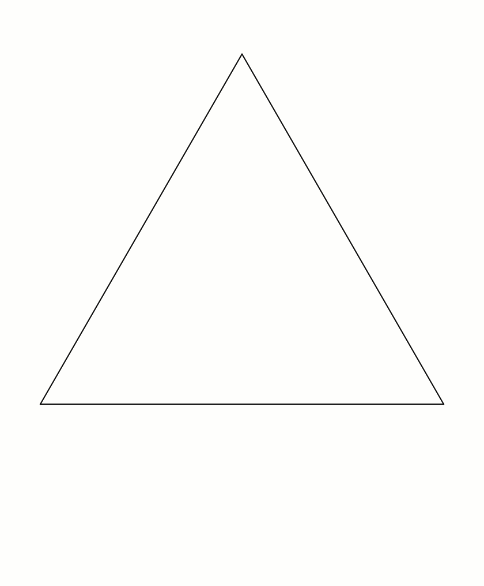
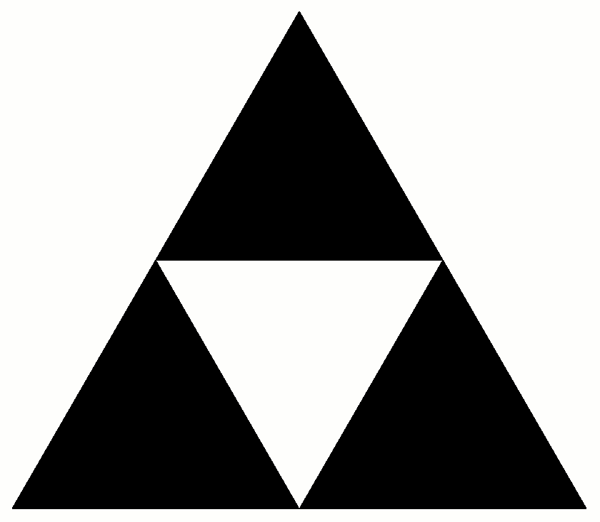
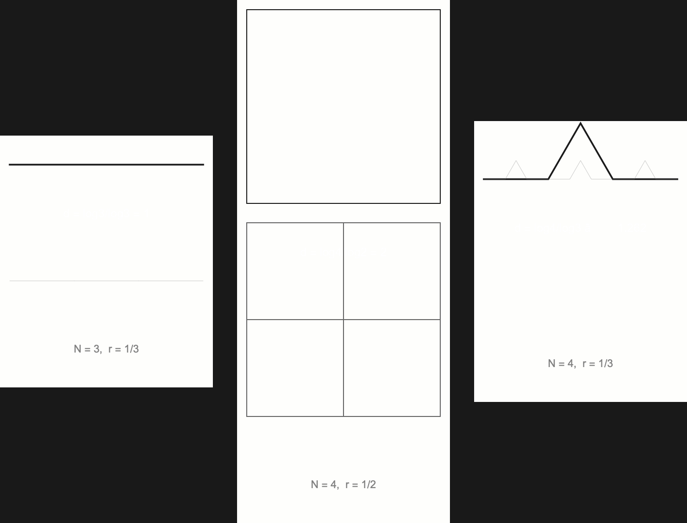

上一篇文章《递推与迭代》讲的是"反复作用一个规则"。今天的故事也一样——只是这个规则作用的对象不是数字,而是**图形**。

分形(fractal)的通俗定义:一个图形,把它放大之后,你看到的细节和原来长得一样。这种性质叫**自相似性**。下面两个图形是分形世界里最著名的两件展品,也是两个"越看越多"的怪物。

## 一、科赫雪花:周长无穷,面积有限

1904 年,瑞典数学家科赫(Helge von Koch)构造了一条曲线,构造规则简单得过分:

> 对一条线段,把中间三分之一换成等边三角形的两条边(去掉底边),得到 4 条线段,每条长度是原来的 $1/3$。对每条线段重复。

一个规则,反复作用——这正是上篇说的迭代,只不过作用对象是线段。把这条曲线首尾相接成三角形,得到**科赫雪花**:

现在做一道算术题。设初始正三角形边长为 $1$,周长是 $3$。每一步,每条边从 1 条变 4 条,每条长度变为原来的 $1/3$,所以**周长乘以 $4/3$**:

$$P_n = 3\left(\frac{4}{3}\right)^n \;\xrightarrow{n\to\infty}\; +\infty$$

周长是无穷大。可这么点空间,能装下无限长的曲线吗?

能,因为**面积是有限的**。算一下:初始三角形面积记为 $A_0$。第 1 步在 3 条边上各加一个小三角形,边长 $1/3$,面积各为 $A_0/9$,新增 $3A_0/9$。第 2 步在 $12$ 条边上加三角形,边长 $1/9$,新增 $12A_0/81 = \frac49 \cdot \frac{A_0}{3}$。每步新增面积都是上一步的 $4/9$:

$$A = A_0\left(1 + \frac13 + \frac13\cdot\frac49 + \frac13\cdot\left(\frac49\right)^2 + \cdots\right) = A_0\left(1 + \frac{1/3}{1-4/9}\right) = \frac85 A_0$$

几何级数,一步算完。**周长冲向无穷,面积却停在 $\frac85$ 倍初始值**——这是分形给你上的第一课:直觉在这里不管用,算数才行。

## 二、谢尔宾斯基三角形:面积归零,还剩什么

1915 年,波兰数学家谢尔宾斯基(Wacław Sierpiński)画了另一个怪物。构造规则同样朴素:

> 把一个等边三角形四等分,挖掉中间那个;对剩下的三个小三角形重复。

面积很容易算:每一步,剩下的面积都乘以 $3/4$:

$$A_n = A_0\left(\frac34\right)^n \;\xrightarrow{n\to\infty}\; 0$$

最终面积是**零**。一个面积为 0 的图形,由无数条线构成——挖到无限阶之后,它其实是一张由点组成的"尘埃",只不过这些点排成了一个三角形的形状。

和科赫雪花对照一下:一个是周长无限,一个是面积为零。两个方向上的"不可能",数学都坦然接受。

## 三、豪斯多夫维数:整数不够用了

前面两节可以用初等几何解释,但有个问题一直悬着:**科赫雪花和谢尔宾斯基三角形,到底算几维?**

说它是一维曲线——可它的周长是无穷大;说它是二维图形——可谢尔宾斯基三角形面积为零。整数维数在这里失灵了。答案是给它一个**分数维数**,这就是**豪斯多夫维数**(Hausdorff dimension),也是"分形"这个词(曼德博, 1975)要表达的东西。

维数怎么算?先看两个老熟人,找出规律:

- 一条线段,平均分成 $N=3$ 段,每段是整体的 $1/3$;把它放大 3 倍,还是原来那条线段。
- 一个正方形,分成 $N=4$ 块,每块是整体的 $1/2$;放大 2 倍,还是原正方形。

共同的规律:一个 $d$ 维的图形,分成 $N$ 个相似的小块,每块的缩放比例是 $r$,总有

$$N = \frac{1}{r^{d}} \quad\Longleftrightarrow\quad d = \frac{\log N}{\log (1/r)}$$

验证:线段 $N=3, r=\frac13$,得 $d = \frac{\log 3}{\log 3} = 1$ ✓;正方形 $N=4, r=\frac12$,得 $d = \frac{\log 4}{\log 2} = 2$ ✓。整数维数被这个公式自然包含。

现在把它用在两个怪物身上:

| 图形 | 分成几份 $N$ | 缩放比例 $r$ | 豪斯多夫维数 |
|------|-------------|-------------|-------------|
| 科赫曲线 | 4 | $1/3$ | $\dfrac{\log 4}{\log 3} \approx 1.262$ |
| 谢尔宾斯基三角形 | 3 | $1/2$ | $\dfrac{\log 3}{\log 2} \approx 1.585$ |

科赫雪花是 $1.26$ 维:比线多,比面少——它的周长是无穷大,正是"多于 1 维"的表现。谢尔宾斯基三角形是 $1.585$ 维:比科赫更"厚实",但仍然填不满二维平面,所以面积为零。维数不再必须是整数,它变成了一个**衡量"图形有多密"的标尺**。

## 尾声:为什么分形有用

分形在 20 世纪 70 年代还是个数学玩具,今天已经遍地都是:

- 计算机图形学用它生成山脉、云朵、海岸线(一个著名的估计:**英国海岸线长度是无穷大**——测量单位越小,你能数出的海湾越多;科赫曲线就是海岸线模型的雏形);
- 天文学用它描述星系分布,生物学用它描述血管和肺的结构(肺的表面积大约是一张网球场的面积,全靠"分形折叠");
- 还有我们上篇讲过的迭代:逻辑斯蒂映射在混沌区间的图像,本身就是分形。

不过作为数学爱好者,最让人着迷的还是那件事:**一个"反复作用简单规则"的过程,可以生成无限复杂的结构**。这和上篇的递推、迭代是同一个主题——只是这次,复杂性的产物不是数字,而是图形。

> 顺带一提:本文的图全部用 Mathematica 画成——科赫雪花是 `KochCurve[n]`,谢尔宾斯基三角形是 `SierpinskiMesh[n]`,各画 5~6 阶拼成动画。这两个函数内置,打开软件几秒钟就能复现;你甚至可以拉到 8 阶、10 阶,看细节如何无限繁殖。
