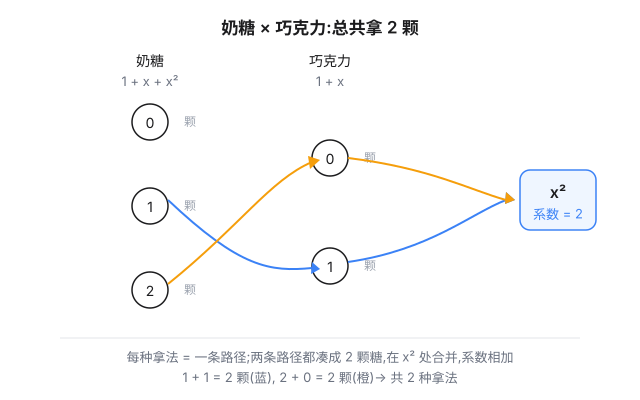
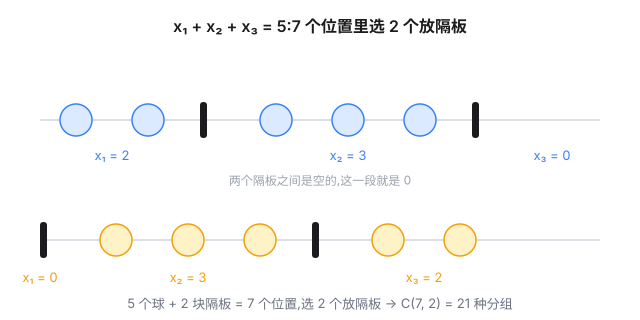

上一篇《[生成函数:把数列打包成代数](post.html?slug=generating-functions)》讲的是用生成函数解递推:数列打包成函数,递推变成方程。但生成函数还有另一副面孔,而且可能是它更古老的那副——**计数**。这篇从组合问题讲起,顺便把上篇结尾那句"EGF 是另一篇的故事"兑现掉。

## 一个问题:三罐糖

桌上三罐糖:

- 奶糖罐里最多拿 2 颗;
- 水果糖罐里最多拿 3 颗;
- 巧克力罐里最多拿 1 颗。

问:总共拿出 4 颗糖,有多少种拿法?(同种糖不区分,"奶奶水水"只算一种。)

先别急着数。我们把每罐糖的**选项清单**写成一个多项式:第 $k$ 项系数 = "从这罐拿 $k$ 颗"的拿法数。每罐糖每次只能拿一种数量,所以系数全是 1:

$$1 + x + x^2 \quad(\text{奶糖:拿 0、1、2 颗})$$

$$1 + x + x^2 + x^3 \quad(\text{水果糖})$$

$$1 + x \quad(\text{巧克力})$$

然后,把它们**乘起来**:

$$(1+x+x^2)(1+x+x^2+x^3)(1+x) = 1 + 3x + 5x^2 + 6x^3 + 5x^4 + 3x^5 + x^6$$

答案就藏在系数里:**$x^4$ 的系数是 5,拿 4 颗糖有 5 种拿法**。

为什么?展开时 $x^4$ 这一项是这样凑出来的:

$$x^4 = x^{a}\cdot x^{b}\cdot x^{c},\qquad a + b + c = 4$$

$a, b, c$ 分别是三罐糖各自拿的数量。展开时每个 $(a,b,c)$ 组合贡献一项,同指数的项**合并,系数相加**——而方案数本来就是这样相加的。多项式乘法把"逐项枚举"变成了"合并同类项"。



顺带验证一下合理性:把所有系数加起来, $1+3+5+6+5+3+1 = 24$,正好等于三罐糖自由选择的全部方案数 $3\times 4\times 2$(每罐分别有 3、4、2 种拿法)。系数和 = 方案总数,指数 = 拿糖总数,一一对上了。

## 乘法原理的多项式形态

上面这套做法,背后是小学就学过的**乘法原理**:分步计数,各步方案数相乘。生成函数把它翻译成了代数:

> 每个物品一个因子;因子中 $x^k$ 的系数 = "拿 $k$ 个"的方案数;总方案数 = 所有因子乘积的系数。

$1+x+x^2$ 这样的因子没有别的含义,它就是这份物品的选项清单。$x$ 依然只是记账本——我们只关心系数,不关心 $x$ 取什么值(形式幂级数,上篇讲过)。

选项清单有几种标准形状,背下来能省很多事:

| 限制 | 因子 | 封闭形式 |
|------|------|---------|
| 恰好 0 或 1 个 | $1 + x$ | — |
| 最多 $m$ 个 | $1 + x + \cdots + x^m$ | $\dfrac{1-x^{m+1}}{1-x}$ |
| 任意多个 | $1 + x + x^2 + \cdots$ | $\dfrac{1}{1-x}$ |
| 个数是 $d$ 的倍数 | $1 + x^d + x^{2d} + \cdots$ | $\dfrac{1}{1-x^d}$ |
| 至少 1 个 | $x + x^2 + \cdots$ | $\dfrac{x}{1-x}$ |

(第二行是有限等比求和;第三、四、五行是无穷等比级数,作为形式幂级数不需要收敛;第一行的 $1+x$ 本身就是封闭形式。)

## 水果摊:代数替我们分类讨论

来看 Matrix67 博客上的经典问题。苹果、香蕉、橘子、梨,四种水果各有脾气:

- 苹果只能拿**偶数个**;
- 香蕉的个数必须是 **5 的倍数**;
- 橘子**最多拿 4 个**;
- 梨要么不拿,要么只拿 1 个。

问拿 $n$ 个水果有多少种拿法。

直接数会很痛苦:苹果和香蕉的限制"无限但稀疏",没法穷举。用生成函数,每种水果写一个因子:

$$G(x) = \underbrace{\frac{1}{1-x^2}}_{\text{苹果}}\cdot \underbrace{\frac{1}{1-x^5}}_{\text{香蕉}}\cdot \underbrace{\frac{1-x^5}{1-x}}_{\text{橘子}}\cdot \underbrace{(1+x)}_{\text{梨}}$$

然后就是纯粹的代数:约分。

$$\frac{1}{1-x^2}\cdot\frac{1}{1-x^5}\cdot\frac{1-x^5}{1-x}\cdot(1+x) = \frac{1}{1-x^2}\cdot\frac{1+x}{1-x} = \frac{1}{(1-x)^2}$$

四个因子,刁钻的限制,约分后只剩一个干净的函数。而

$$\frac{1}{(1-x)^2} = 1 + 2x + 3x^2 + 4x^3 + 5x^4 + \cdots$$

所以答案是:**拿 $n$ 个水果有 $n+1$ 种拿法**。

代数替我们吞掉了所有分类讨论:香蕉的"5 的倍数"和橘子的"最多 4 个"正好互补,约分时一起消失;苹果的"偶数"和梨的"0 或 1"合成 $1/(1-x)$。换成人肉枚举,这就是好几页草稿纸。

想亲手验证?$n=2$ 时恰好三种拿法:苹果 2 个、橘子 2 个、橘子 1 个加梨 1 个——香蕉动不了,苹果 1 个是奇数也不行。

## 还原通项:隔板法

水果摊问题里冒出了 $\frac{1}{(1-x)^2}$,它太常出现了,值得单独写一节。一般地:

$$\frac{1}{(1-x)^k} = \sum_{n\ge 0}\binom{n+k-1}{n}x^n$$

这个公式是把生成函数还原成数列的核武器:任何能化成 $\frac{1}{(1-x)^k}$ 的问题,通项直接读。

它也有一个漂亮的组合解释——**隔板法**。$k$ 个因子 $\frac{1}{1-x}$ 相乘,$x^n$ 的系数是"$k$ 个非负整数相加等于 $n$"的解数:

$$x_1 + x_2 + \cdots + x_k = n,\qquad x_i \ge 0$$

把 $n$ 个球排成一排,插入 $k-1$ 块隔板分成 $k$ 段(允许空段),段长就是 $x_1,\dots,x_k$。于是问题变成:$n+k-1$ 个位置里选 $k-1$ 个放隔板:

$$\binom{n+k-1}{k-1} = \binom{n+k-1}{n}$$



牛顿二项式定理也能推出同一公式——把 $(1-x)^{-k}$ 按广义组合数展开。但隔板法更直观:它直接告诉你系数**是什么**。

## 组合讲完了,排列呢?

以上全是"**选**":选 4 颗糖,同类项合并。但有些问题问的是"**排**":选出来还要排成一列。这时普通生成函数不够用了,该上篇结尾预告的**指数生成函数**登场。

还是三罐糖,但这次问:拿 $a$ 颗奶糖、$b$ 颗水果糖、$c$ 颗巧克力($a+b+c=n$),把 $n$ 颗糖排成一排,有多少种排法?

先选后排:选法数乘以多重集排列数 $\frac{n!}{a!\,b!\,c!}$(总排列数除以同类内部的重复)。也就是说,每罐糖对排列的贡献不是"拿 $k$ 颗有 1 种选法",而是"拿 $k$ 颗,将来会贡献 $\frac{1}{k!}$ 个分母"。

那把分母直接写进因子——第 $k$ 项系数写成 $\frac{a_k}{k!}$。这就是**指数生成函数**:

$$\hat G(x) = \sum_{n\ge 0} a_n\frac{x^n}{n!}$$

为什么它恰好对付排列?看两个 EGF 相乘,$x^n$ 项的系数是 $\sum_{k+l=n}\frac{a_k b_l}{k!\,l!}$,乘上 $n!$ 后变成 $\sum_k \binom{n}{k} a_k b_{n-k}$——**带组合数的卷积**。这正是排列计数的样子:从红方的 $k$ 个里挑出 $n$ 个位置中的 $k$ 个,剩下的给蓝方,再交错排布。

> 组合问题用 OGF:因子乘积的系数就是答案。排列问题用 EGF:答案 = $n!$ × 因子乘积的系数。

三罐糖的排列数可以用 EGF 一口气算完:选 4 颗排成一排共有 38 种(见文末附录,枚举可验)。

### 染色问题

经典例子:用红、黄、蓝、绿四种颜色给 $n$ 个格子染色,要求红、黄两色各自出现**偶数次**,问有多少种方案。

红、黄各是一个"偶数个"因子;蓝、绿没限制。偶数个的 EGF 是

$$1 + \frac{x^2}{2!} + \frac{x^4}{4!} + \cdots = \frac{e^x + e^{-x}}{2}$$

(泰勒展开:$e^x$ 与 $e^{-x}$ 相加,奇数项抵消,只剩偶数项。)蓝、绿则是 $e^x$。四个因子相乘:

$$\left(\frac{e^x+e^{-x}}{2}\right)^2 e^{2x} = \frac{e^{4x} + 2e^{2x} + 1}{4}$$

$n!$ 乘以 $x^n$ 的系数,得答案:

$$a_n = \frac{4^n + 2\cdot 2^n}{4} = 4^{n-1} + 2^{n-1}\qquad(n\ge 1)$$

验证:$n=1$ 时只能染蓝或绿,2 种 ✓;$n=2$ 时红红、黄黄、蓝蓝、绿绿、蓝绿、绿蓝,6 种 ✓(红黄各一格的"红黄、黄红"不行——红出现了 1 次,奇数)。$n=3$ 时 $4^2+2^2 = 20$ 种,暴力枚举 64 种染法里恰好 20 种满足。"代数算出来、枚举验得对",这是生成函数最有说服力的一刻。

## 尾声:一张表

| | 普通生成函数 OGF | 指数生成函数 EGF |
|---|---|---|
| 定义 | $\sum a_n x^n$ | $\sum a_n \frac{x^n}{n!}$ |
| 管什么 | 组合(选) | 排列(排) |
| 典型因子 | $\frac{1}{1-x}$、$1+x$ | $e^x$、$\frac{e^x+e^{-x}}{2}$ |
| 答案 | 系数 $[x^n]G$ | $n!\,[x^n]\hat G$ |

回头看这一篇做了什么:每个物品一个多项式,每个限制一个因子,方案数就是乘积的系数。限制条件再刁钻,也只是把因子揉变形;剩下的约分、展开、读系数,全是代数在干活。

上篇我们说"递推 → 封闭形式 → 展开"三步走;这篇是另一条路:"选项 → 因子 → 乘积"。两条路在卡特兰数那儿会合:卡特兰数的递推是卷积,它的计数定义(括号序列、二叉树)长着同一张脸,背后是同一个生成函数 $\frac{1-\sqrt{1-4x}}{2x}$。生成函数就这点本事——但这点本事,足以把"数数"变成"算算"。

## 相关阅读

- [什么是生成函数?](https://matrix67.com/blog/archives/120)(Matrix67):本文"水果摊"例题的出处,经典启蒙文,值得一读。
- [【博客】小学生都能看懂的生成函数入门教程](https://ac.nowcoder.com/discuss/179728)(牛客网):从背包到 EGF 的算法竞赛视角,与本文互补。
- 上一篇:[生成函数:把数列打包成代数](post.html?slug=generating-functions)(本博客):定义、卷积与解递推,本文的姊妹篇。

> [!detail] 附:暴力验证(可展开)
> 四个问题的枚举验证:先列出所有满足条件的拿法/染法,再数个数,与公式对比。零依赖纯 Python,可复现:
>
> ```python
> from math import factorial
> from itertools import product
>
> def show(name, got, expect):
>     print(f"{name}: {got}")
>     assert got == expect, f"MISMATCH: {got} != {expect}"
>
> # 1) 三罐糖(组合):奶糖<=2, 水果糖<=3, 巧克力<=1, 拿 n 颗
> candy = [sum(1 for a in range(3) for b in range(4) for c in range(2)
>              if a + b + c == n) for n in range(7)]
> show("拿法数   ", candy, [1, 3, 5, 6, 5, 3, 1])
>
> # 2) 三罐糖(排列):同上,但 n 颗糖排成一排
> candy_p = [sum(factorial(n) // (factorial(a) * factorial(b) * factorial(c))
>                for a in range(3) for b in range(4) for c in range(2)
>                if a + b + c == n) for n in range(7)]
> show("排列数   ", candy_p, [1, 3, 8, 19, 38, 60, 60])
>
> # 3) 水果摊:苹果偶数, 香蕉 5 的倍数, 橘子<=4, 梨 0/1
> fruit = [sum(1 for a in range(0, n + 1, 2)          # 苹果:偶数
>              for b in range(0, n + 1, 5)            # 香蕉:5 的倍数
>              for c in range(min(n, 4) + 1)          # 橘子:0..4
>              if n - a - b - c in (0, 1))            # 梨:0 或 1
>          for n in range(11)]
> show("水果方案 ", fruit, list(range(1, 12)))        # n+1
>
> # 4) 染色:红黄各偶数次, 蓝绿任意, 公式 4^(n-1) + 2^(n-1)
> color = [sum(1 for s in product('RYBG', repeat=n)
>              if s.count('R') % 2 == 0 and s.count('Y') % 2 == 0)
>          for n in range(1, 6)]
> show("染色方案 ", color, [4**(n - 1) + 2**(n - 1) for n in range(1, 6)])
> ```
>
> 输出:
>
> ```
> 拿法数   : [1, 3, 5, 6, 5, 3, 1]
> 排列数   : [1, 3, 8, 19, 38, 60, 60]
> 水果方案 : [1, 2, 3, 4, 5, 6, 7, 8, 9, 10, 11]
> 染色方案 : [2, 6, 20, 72, 272]
> ```
