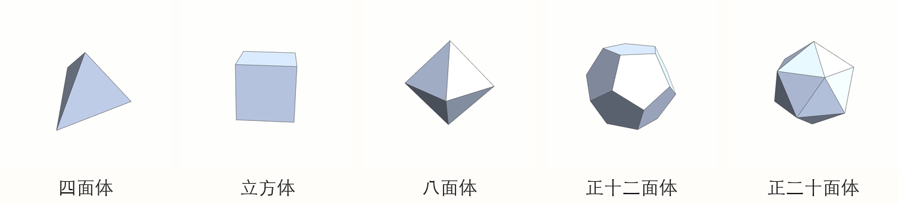
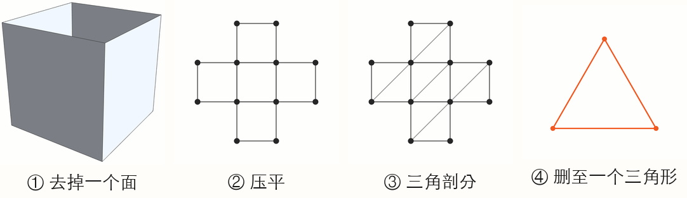

正多面体是几何学里最古老的一族明星:每个面都是全等的正多边形,每个顶点处都汇合同样多的棱。数一数,是五种——正四面体、立方体、正八面体、正十二面体、正二十面体。为什么恰好五种,不多不少?



答案藏在一个优雅到不真实的公式里:

$$V - E + F = 2$$

顶点数减棱数加面数,恒等于 2。今天的故事分两半:先讲这个公式的来历(它有一段可以拍成电影的学术史),再讲它如何在一页纸内消灭所有"第六种正多面体"。

## 一、一个公式的三百年

### 希腊人猜到了答案,但没猜出公式

正多面体的故事始于雅典。公元前四世纪,数学家泰阿泰德(Theaetetus)已经系统研究过五种正多面体(《几何原本》卷十三的古注说八面体和二十面体出自他手)。他的老师柏拉图在《蒂迈欧篇》里给了它们一份"哲学工作":火对应四面体、土对应立方体、气对应八面体、水对应二十面体,而正十二面体"神用它来装饰宇宙"。后来开普勒在 1596 年的《宇宙的奥秘》里更进一步,把当时已知的六颗行星的轨道球面与五个正多面体嵌套起来——自内向外是八面体、二十面体、十二面体、四面体、立方体,正好隔开水星、金星、地球、火星、木星、土星。这个模型美得惊人,也错得彻底,但它是开普勒走向行星运动三定律的起点。

欧几里得在《几何原本》压轴的第十三卷里,以最后一个命题(XIII.18)证明:**正多面体只有这五种**。全书以它收尾,可见分量。但欧几里得的证明依赖具体构造的讨论,相当笨重——他始终没有找到那个"一句话就够"的原理。

### 笛卡尔:手稿里的先行者

那个原理其实躺在笛卡尔的抽屉里。约 1630 年,笛卡尔写了一份手稿《立体元素练习》(Progymnasmata de solidorum elementis),其中证明了:任何凸多面体的**总角亏**等于 $4\pi$。"角亏"是每个顶点处"差一点凑满 360°"的量;把所有顶点的角亏加起来,居然恒等于 $4\pi$。这个结论等价于欧拉公式(后面我们会看到为什么),但笛卡尔没有把它写成 $V-E+F=2$ 的形式,手稿也没有发表。他去世后,莱布尼茨在巴黎抄录了副本;原件散佚,抄本在汉诺威皇家图书馆沉睡,直到 1860 年才被 Foucher de Careil 发现并刊印。**第一个触及欧拉公式的人,比欧拉早了一百二十年,却沉默了三个世纪。**

### 欧拉:1750 年的信

1750 年 11 月 14 日,欧拉在给哥德巴赫的信中首次写下这个关系。同年他在柏林科学院宣读《立体学说基础》(E230),1758 年正式发表。欧拉的证明思路是:反复"挖掉"一个顶点,用新的面替换它周围的面,验证 $V-E+F$ 在这个过程中不变。思路是对的,但每一步的严格性在今天的标准下站不住脚——欧拉证明的漏洞直到 2007 年还有论文在讨论。

第一个公认严格的证明来自勒让德(《几何学原理》,1794),用的是球面几何。

### 柯西:压平法

最著名的证明属于柯西。1811 年 2 月,22 岁的柯西向法国科学院宣读《多面体研究》(1813 年刊于《巴黎综合理工学院学报》),给出了流传至今的"压平"证明:把多面体去掉一个面,剩下的部分**压平**到平面上,再逐个删除三角形,验证 $V-E+F$ 恒不变。这个证明漂亮、直观、几乎不需要任何预备知识——下面是它。

## 二、欧拉公式的证明(柯西压平法)

**定理**:任一凸多面体,设顶点数 $V$、棱数 $E$、面数 $F$,则 $V - E + F = 2$。

**第一步:去掉一个面,压平。** 把多面体的一个面掀掉,把剩下的部分想象成橡皮做的,拉伸并压平到平面上。顶点、棱、面之间的连接关系不变,所以 $V-E+F$ 的值不变。于是只需证明:**任何一个平面连通的网络**(由 $F$ 个多边形区域拼成,不含洞),都有 $V - E + F = 1$。



**第二步:三角剖分。** 如果网络里有边数多于 3 的面,把它用对角线切成三角形。每加一条对角线:$E$ 增 1,$F$ 增 1,$V$ 不变——所以 $V-E+F$ 不变。反复切割,直到所有面都是三角形。

**第三步:逐个删除三角形。** 从外边界开始删。边界上的三角形只有两种:

- 它露出**一条边**:删掉这个三角形——$E$ 减 1,$F$ 减 1,$V-E+F$ 不变;
- 它露出**两条边**:删掉这个三角形——$F$ 减 1,$E$ 减 2,$V$ 减 1,$V-E+F$ 仍然不变。

(三角形不可能露出三条边,否则整个网络就只剩它自己,那正是终点。)每删一次,网络保持连通、不变号地变小。

**第四步:终点。** 最后只剩下一个三角形:$V-E+F = 3 - 3 + 1 = 1$。一路往回推,压平前的网络也是 1;再把掀掉的那个面补回去,得到

$$V - E + F = 2 \quad\blacksquare$$

只用了"压平、切对角线、删三角形"三个动作,每个动作都肉眼可见地不改变 $V-E+F$。这就是柯西证明的魅力:它把一个三维的定理,变成了一个可以在纸上手玩的一年级操作游戏。

### 笛卡尔与欧拉:殊途同归

顺带把笛卡尔欠下的账还上。多面体的**总角亏** = 每个顶点处的角亏之和。第 $i$ 个顶点处的角亏是 $2\pi$ 减去汇于该点的所有面角之和。全部加总:

$$\text{总角亏} = 2\pi V - (\text{所有面的内角和})$$

每个 $k$ 边形面的内角和是 $(k-2)\pi$,对所有面求和得到 $\sum(k_f - 2)\pi = \pi\sum k_f - 2\pi F$。而 $\sum k_f$ 是"每个面贡献的边数",每条棱被两个面共用,恰好等于 $2E$。所以

$$\text{总角亏} = 2\pi V - \pi(2E) + 2\pi F = 2\pi\,(V - E + F) = 4\pi$$

**"总角亏恒等于 $4\pi$"与"$V-E+F=2$"是一回事。** 笛卡尔 1630 年手里握着的东西,和欧拉 1750 年信里写下的东西,隔着一百二十年,说的是同一个真理。

## 三、正多面体只有五种

现在进入正题。设一个正多面体的每个面是正 $n$ 边形,每个顶点处汇合 $m$ 条棱。两个简单的计数:

- 每条棱被两个面共享:数"面-棱"配对数,得 $nF = 2E$;
- 每条棱连接两个顶点:数"顶点-棱"配对数,得 $mV = 2E$。

于是 $V = \dfrac{2E}{m}$,$F = \dfrac{2E}{n}$,代入欧拉公式:

$$\frac{2E}{m} - E + \frac{2E}{n} = 2 \quad\Longrightarrow\quad \frac{1}{m} + \frac{1}{n} = \frac12 + \frac{1}{E} > \frac12$$

正多边形至少是三边形($n \ge 3$),每个顶点至少汇合三条棱($m \ge 3$)。枚举:

| $n$(每面边数) | $m$ 的可能值(需 $\frac1m > \frac12 - \frac1n$) | 正多面体 |
|----|----|----|
| 3 | $m = 3,\ 4,\ 5$ | 四面体、八面体、二十面体 |
| 4 | $m = 3$ | 立方体 |
| 5 | $m = 3$ | 正十二面体 |
| $\ge 6$ | 无:$\frac1m + \frac1n \le \frac13 + \frac16 = \frac12$ | — |

只有五种组合 $(n,m)$ 可能。每种组合反过来唯一确定 $E$:

$$\frac{1}{E} = \frac{1}{m} + \frac{1}{n} - \frac12$$

| $(n,m)$ | $E$ | $V=\frac{2E}{m}$ | $F=\frac{2E}{n}$ | 名字 |
|----|----|----|----|----|
| $(3,3)$ | 6 | 4 | 4 | 正四面体 |
| $(3,4)$ | 12 | 6 | 8 | 正八面体 |
| $(4,3)$ | 12 | 8 | 6 | 立方体 |
| $(3,5)$ | 30 | 12 | 20 | 正二十面体 |
| $(5,3)$ | 30 | 20 | 12 | 正十二面体 |

**只有五种,第五种不存在。** 而且注意表格里的对称性:$(n,m)$ 与 $(m,n)$ 交换,正是"面与顶点对调"——八面体与立方体互为对偶,二十面体与十二面体互为对偶,四面体与自己对偶。五种正多面体的家族关系,也一并被这张小表格说尽了。

## 尾声:从"形状"到"结构"

欧拉公式真正的革命性在于:它只关心 $V$、$E$、$F$ 这些**连接关系**,完全不在乎多面体长什么样子、面是三角形还是五边形、整体是胖是扁。它属于一个新学科——拓扑学,研究"形状"之下更本质的"结构"。

这一脉后来长成了参天大树:施莱夫利(Schläfli,1852)把正多面体推广到高维,庞加莱(1895)把欧拉公式推广成欧拉-庞加莱公式 $\chi = \sum (-1)^k b_k$,奠基了代数拓扑。而这一切的种子,是一封 1750 年的信、一份 1630 年的手稿,和一个希腊人在公元前四世纪画下的五种图形。

> [!detail]- 附:Mathematica 绘制细节(可展开)
> 文中两幅插图均由 Mathematica 生成,以下是可复现的代码。
>
> **五种多面体的渲染**:`PolyhedronData` 自带全部五种柏拉图立体。为了让五个立体并排时大小一致,统一做"外接半径归一化 + 固定旋转 + 固定视角":
>
> ```mathematica
> names = {"Tetrahedron","Cube","Octahedron","Dodecahedron","Icosahedron"};
> gc = PolyhedronData[names[[i]]][[1]];   (* GraphicsComplex *)
> pts = N[gc[[1]]];                        (* 顶点坐标 *)
> rad = Max[Norm /@ pts];                  (* 外接半径归一化到 1 *)
> rot = N[RotationMatrix[0.45,{0,0,1}] . RotationMatrix[-0.3,{1,0,0}]];
> Graphics3D[{EdgeForm[GrayLevel[0.25]], FaceForm[RGBColor[0.82,0.88,1]],
>   GraphicsComplex[rot . # & /@ pts / rad, gc[[2]]]},
>   Boxed -> False, Lighting -> "Neutral",
>   ViewPoint -> {1.35, -2.4, 2}, ViewAngle -> 0.55]
> ```
>
> **用 Mathematica 直接数 V、E、F**:一行验证欧拉公式:
>
> ```mathematica
> Table[PolyhedronData[n, #] & /@ {"VertexCount","EdgeCount","FaceCount"},
>   {n, {"Tetrahedron","Cube","Octahedron","Dodecahedron","Icosahedron"}}]
> ```
>
> 输出 `{{4,6,4},{8,12,6},{6,12,8},{20,30,12},{12,30,20}}`——每一行的 $V-E+F$ 都等于 2,与第三节表格一致。
>
> **压平示意图**是纯平面图形:十字形网络与三角剖分图用 `Line`/`Point` 手绘,顶点坐标手工核对过(压平后 $V=8, E=12, F=5$;每条对角线让 $E,F$ 同时加 1,所以 $V-E+F$ 保持为 1)。
