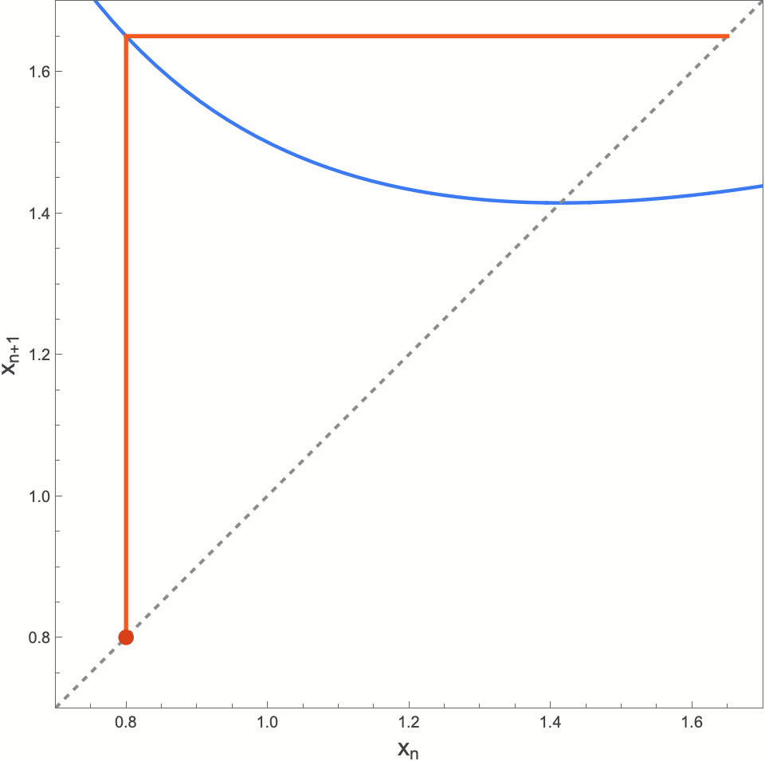
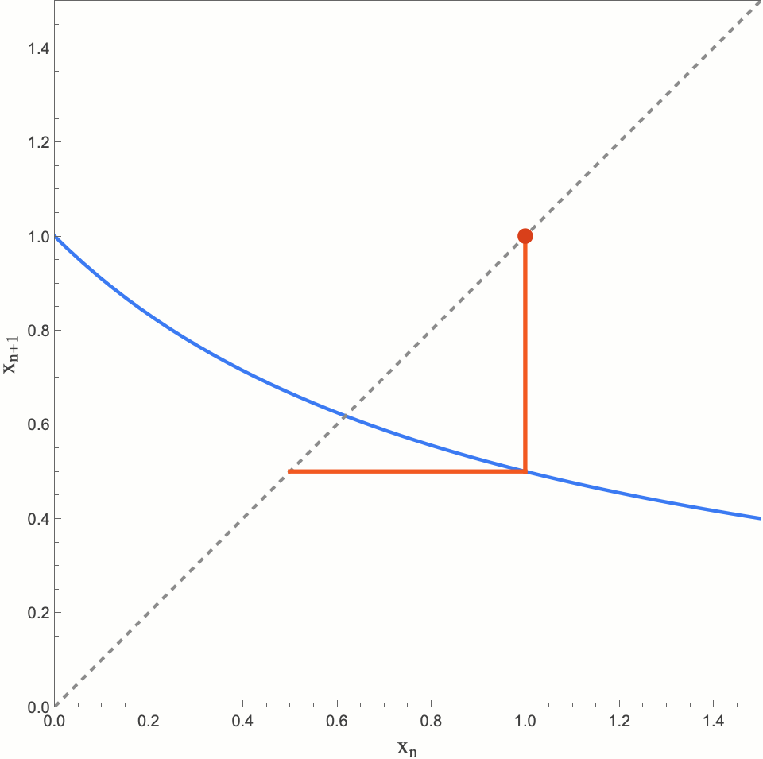

前两篇我们讲了斐波那契的通项公式和生成函数,算的是**"第 n 项是什么"**。今天换一个问题:如果我只把递推丢给计算机,让它**一步一步算下去**,会发生什么?数列会走向哪里?

这个问题把"递推"变成了"迭代",而迭代有自己的主角:不动点。

## 一、递推:规则 + 初值

先定个调子。一个数列的**递推定义**由两部分组成:

- **初值**:比如 $a_0 = 1$;
- **规则**:比如 $a_{n+1} = f(a_n)$,或更复杂的 $a_{n+2} = g(a_n, a_{n+1})$。

规则的"阶"由它需要回溯到多远决定:一阶递推 $a_{n+1} = f(a_n)$ 需要 1 个初值,二阶递推 $a_{n+2} = g(a_n, a_{n+1})$ 需要 2 个初值。**阶数和初值个数必须相等**,一个都不能少。

最简单的递推是一阶的:

$$a_{n+1} = f(a_n)$$

比如等比数列 $a_{n+1} = q\,a_n$,和算术数列 $a_{n+1} = a_n + d$。它们都能解出通项,所以我们太熟悉了,熟悉到忘了它们还有另一副面孔。

## 二、迭代:递推的另一张脸

把一阶递推 $a_{n+1} = f(a_n)$ 从 $a_0$ 出发一路算下去:

$$a_0 \;\xrightarrow{\;f\;}\; a_1 \;\xrightarrow{\;f\;}\; a_2 \;\xrightarrow{\;f\;}\; a_3 \;\xrightarrow{\;f\;}\; \cdots$$

这串点 $a_0, f(a_0), f(f(a_0)), \dots$ 叫做 $a_0$ 在 $f$ 作用下的**轨道**(orbit)。数列,就是轨道;递推,就是"反复作用同一个函数"。

把"反复作用"本身当作一种运算,记 $f^{\,n}$ 为"连续作用 $n$ 次"(这是迭代次数,不是乘方):

$$a_n = f^{\,n}(a_0), \qquad f^{\,n} = \underbrace{f \circ f \circ \cdots \circ f}_{n\ \text{次}}$$

这个视角的转变很有用:等比数列的轨道是"越来越大的台阶",但很多函数的轨道不会跑掉,而是**奔一个点去**。

## 三、不动点:轨道的归宿

**定义**:若 $x^{*}$ 满足 $f(x^{*}) = x^{*}$,称 $x^{*}$ 是 $f$ 的不动点。

不动点为什么重要?因为一旦 $a_n = x^{*}$,整个数列就永远停在那里。问题是:轨道会奔不动点去吗?

### 先回答:极限一定是不动点

如果轨道收敛到某个 $x^{*}$,在递推 $x_{n+1} = f(x_n)$ 两边取极限($f$ 连续):左边 $\to x^{*}$,右边 $\to f(x^{*})$,于是

$$x^{*} = f(x^{*})$$

**收敛轨道的极限必然是不动点**。剩下的问题是:它真的会去吗?

### 什么时候会去:看 $f'$ 的脸色

设 $x_n$ 在 $x^{*}$ 附近,由**均值定理**,存在 $\xi$ 介于 $x_n$ 与 $x^{*}$ 之间,使得

$$|x_{n+1} - x^{*}| = |f(x_n) - f(x^{*})| = |f'(\xi)| \cdot |x_n - x^{*}|$$

> 如果 $f$ 在 $x^{*}$ 附近满足 $|f'(x)| \le L < 1$,那么每一步误差都**至多乘以 $L$**,轨道指数级地收缩进不动点。

这就是吸引不动点的试金石。反过来,若 $|f'(x^{*})| > 1$,误差被越放越大,轨道只会逃离;这叫排斥不动点。

而 $|f'|$ 还决定收敛快慢:$|f'|$ 越小,收得越快;若 $f'(x^{*}) = 0$,线性收缩都不用了,误差平方级地塌缩。下面这个例子就是后者的典型。

### 例子:牛顿法求 $\sqrt{2}$

求 $\sqrt{2}$ 就是解 $h(x) = x^2 - 2 = 0$。牛顿法的想法很几何:**用切线代替曲线**。在 $x_n$ 处作 $h$ 的切线,取它与 $x$ 轴的交点作为 $x_{n+1}$:切线斜率为 $h'(x_n)$,于是

$$0 - h(x_n) = h'(x_n)\,(x_{n+1} - x_n)$$

解出

$$x_{n+1} = x_n - \frac{h(x_n)}{h'(x_n)}$$

即迭代函数 $f(x) = x - \dfrac{h(x)}{h'(x)}$。对 $h(x) = x^2 - 2$ 整理一下: $f(x) = \dfrac{1}{2}\left(x + \dfrac{2}{x}\right)$。从 $x_0 = 1$ 出发:

| n | $x_n$ | 与 $\sqrt2$ 的误差 |
|---|-------|-------------------|
| 0 | 1.000000000000 | 4.14×10⁻¹ |
| 1 | 1.500000000000 | 8.58×10⁻² |
| 2 | 1.416666666667 | 2.45×10⁻³ |
| 3 | 1.414215686275 | 2.12×10⁻⁶ |
| 4 | 1.414213562375 | 1.59×10⁻¹² |

看误差的位数:两位、三位、六位、十二位——**有效数字每步翻倍**,这就是二次收敛。原因正是 $f'(\sqrt2) = 0$:一阶项消失,误差由平方项主导。

还有个细节:牛顿法的不动点方程 $f(x^{*}) = x^{*}$ 化简就是 $h(x^{*}) = 0$——**迭代的归宿恰好是方程 $h(x) = 0$ 的根**。这不是巧合,是设计:我们故意构造了一个"根恰好是目标"的迭代。

## 四、一个迷人的例子:黄金分割自己走过来

刚才的迭代都是"设计过的"。下面这个纯粹是意外之喜。取最简单的非线性迭代

$$x_{n+1} = \frac{1}{1 + x_n}, \qquad x_0 = 1$$

算几项:$\;1,\ \tfrac12,\ \tfrac23,\ \tfrac35,\ \tfrac58,\ \tfrac{8}{13},\ \tfrac{13}{21},\ \dots$

认出这些分数了吗?全是**斐波那契相邻两项之比** $F_{n+1}/F_{n+2}$——上一篇用比奈公式证明的事,现在它自己走出来了。

为什么?归纳即可。设 $x_n = F_{n+1}/F_{n+2}$(初值 $x_0 = F_1/F_2 = 1$ 符合),则

$$x_{n+1} = \frac{1}{1 + x_n} = \frac{1}{1 + F_{n+1}/F_{n+2}} = \frac{F_{n+2}}{F_{n+1} + F_{n+2}} = \frac{F_{n+2}}{F_{n+3}}$$

一步不差。所以"相邻两项之比趋于黄金分割"和"这个迭代收敛"是同一个定理。

它奔向哪个不动点?解 $x = \frac{1}{1+x}$,即 $x^2 + x - 1 = 0$,得

$$x^{*} = \frac{\sqrt5 - 1}{2} \approx 0.618034$$

黄金分割 $\varphi - 1$。而 $f'(x) = -\frac{1}{(1+x)^2}$,在 $x^{*}$ 处 $|f'| \approx 0.382 < 1$,轨道乖乖收敛。

更妙的是,$|f'(x)| = \frac{1}{(1+x)^2} < 1$ 对**一切 $x > 0$** 成立——不管初值 $x_0 > 0$ 取多少,轨道都收敛到同一个 $0.618$。这正对应 Matrix67 在[《为什么Fibonacci数列相邻两项之比会趋于0.618?》](https://matrix67.com/blog/archives/5221)里用黄金矩形动画讲的那件事:**"不管最初矩形的长宽比是什么,涟漪都会消失"**——迭代视角和几何视角,看到的是同一个 $0.618$。

## 五、二阶递推:矩阵迭代

一阶递推是函数迭代,二阶递推呢?$a_{n+1}$ 依赖两个数,没法直接套 $f(a_n)$。但可以**向量化**。对斐波那契 $F_{n+1} = F_n + F_{n-1}$,把相邻两项装进一个列向量:

$$\begin{pmatrix} F_{n+1} \\ F_n \end{pmatrix} = \underbrace{\begin{pmatrix} 1 & 1 \\ 1 & 0 \end{pmatrix}}_{M} \begin{pmatrix} F_n \\ F_{n-1} \end{pmatrix}$$

递推变成"反复乘同一个矩阵"。乘 $n$ 次之后,一个惊人的事实出现:

$$M^{\,n} = \begin{pmatrix} F_{n+1} & F_n \\ F_n & F_{n-1} \end{pmatrix}$$

(验证:$M^2 = \begin{pmatrix} 2&1\\1&1\end{pmatrix} = \begin{pmatrix} F_3&F_2\\F_2&F_1\end{pmatrix}$ ✓)

矩阵一出现,便宜就占不完了:

- **行列式**:$\det(M^n) = \det(M)^n = (-1)^n$,直接读出 **Cassini 恒等式**:
$$F_{n+1}F_{n-1} - F_n^2 = (-1)^n$$
斐波那契平方项与相邻项乘积之间永远差 $\pm 1$——顺带一提,这个数列里的平方数少得可怜,整个数列只有 $0$、$1$、$144$ 三个($144 = 12^2$)。
- **特征多项式**:$\det(M - \lambda I) = \lambda^2 - \lambda - 1 = 0$,特征值 $\lambda = \varphi, \psi$。又是那个方程!上一篇的特征方程、这一篇的特征值,是同一枚硬币的两面。

### 特征根:求 $M^n$ 的正道

"又是那个方程"不是巧合——它叫**特征方程**,根 $\varphi, \psi$ 叫**特征根**,它们是求 $M^n$ 的钥匙。

通用的做法是**对角化**:若 $M = P D P^{-1}$($D$ 是对角阵),则 $M^n = P D^n P^{-1}$——幂运算退化成了对对角元素取幂。而 $D$ 的对角元素正是特征值。

先找**特征向量**。对 $\lambda = \varphi$,解 $(M - \varphi I)v = 0$,可取 $u_1 = (\varphi,\ 1)^{\mathsf T}$(验证:$M u_1 = (\varphi{+}1,\ \varphi) = (\varphi^2,\ \varphi) = \varphi u_1$ ✓);对称地,$\lambda = \psi$ 对应 $u_2 = (\psi,\ 1)^{\mathsf T}$。把两个特征向量排成矩阵

$$P = \begin{pmatrix} \varphi & \psi \\ 1 & 1 \end{pmatrix}, \qquad D = \begin{pmatrix} \varphi & 0 \\ 0 & \psi \end{pmatrix}$$

则 $M = P D P^{-1}$,$M^n = P D^n P^{-1}$。最后一步:把它作用到初值上。

初始向量 $v_0 = (F_1,\ F_0)^{\mathsf T} = (1,\ 0)^{\mathsf T}$。把 $v_0$ 写成特征向量的线性组合 $v_0 = c_1 u_1 + c_2 u_2$,比较两个分量:

$$c_1 + c_2 = 0, \qquad c_1\varphi + c_2\psi = 1$$

解得 $c_1 = \frac{1}{\sqrt5},\ c_2 = -\frac{1}{\sqrt5}$。于是

$$v_n = M^n v_0 = c_1\varphi^n u_1 + c_2\psi^n u_2 = \frac{1}{\sqrt5}\left(\varphi^n u_1 - \psi^n u_2\right)$$

取第二个分量($u_1, u_2$ 的第二个分量都是 $1$):

$$\boxed{\,F_n = \frac{\varphi^{\,n} - \psi^{\,n}}{\sqrt5}\,}$$

比奈公式,第三遍,从矩阵里走出来。这次它不需要"记忆":特征值 $\varphi, \psi$、系数 $1/\sqrt5$、负号,全都长在推导里。

### 一般化:任何二阶线性递推

特征根法对**所有**二阶线性递推 $a_{n+2} = p\,a_{n+1} + q\,a_n$ 适用,流程一样:

1. 写特征方程 $\lambda^2 - p\lambda - q = 0$;
2. 求两根 $\lambda_1, \lambda_2$;
3. 若 $\lambda_1 \ne \lambda_2$,通项是 $a_n = A\lambda_1^{\,n} + B\lambda_2^{\,n}$,$A, B$ 由两个初值定出。

(注意 $p = \lambda_1 + \lambda_2$、$-q = \lambda_1\lambda_2$,这正是本站《韦达定理》里的事——根与系数,处处相逢。)

一个边角:若两根**相等** $\lambda_1 = \lambda_2 = \lambda$,$A\lambda^n + B\lambda^n$ 只有一根自由度,装不下两个初值。补救是通项里乘进一个 $n$:

$$a_n = (A + Bn)\,\lambda^{\,n}$$

为什么是 $n$?直观地说,重根意味着矩阵 $M$ 无法完全对角化,只能化简到"若尔当块" $\begin{pmatrix} \lambda & 1 \\ 0 & \lambda \end{pmatrix}$,它的 $n$ 次幂里冒出一个 $n\lambda^{\,n-1}$ 形状的项——正是 $Bn\lambda^n$ 的来源。**初值有几个,通项的自由度就有几个**。

## 尾声:三种透镜

同样一个数列,现在有三副透镜:

1. **函数迭代**(本文前半):$F_{n+1}/F_{n+2}$ 的轨道,奔不动点 $\varphi - 1$;
2. **矩阵迭代 / 特征根**(本文后半):$M^n$ 的特征值 $\varphi, \psi$,通项是 $\lambda_1^{\,n}, \lambda_2^{\,n}$ 的线性组合;
3. **生成函数**(上一篇):把整个数列打包成一个代数对象,系数自己走出来。

递推、迭代、特征根、不动点——名字五花八门,追到根上都是同一件事:**"反复作用一个规则,然后问它奔向哪里。"**

> 小练习:试试 $x_{n+1} = \dfrac{1}{2}\left(x_n + \dfrac{a}{x_n}\right)$ 从任意 $x_0 > 0$ 出发——这是求 $\sqrt{a}$ 的牛顿法,也叫巴比伦算法。用上面"误差乘以 $|f'|$"的框架,证明它对任意正初值都收敛。不难,但值得自己走一遍。
