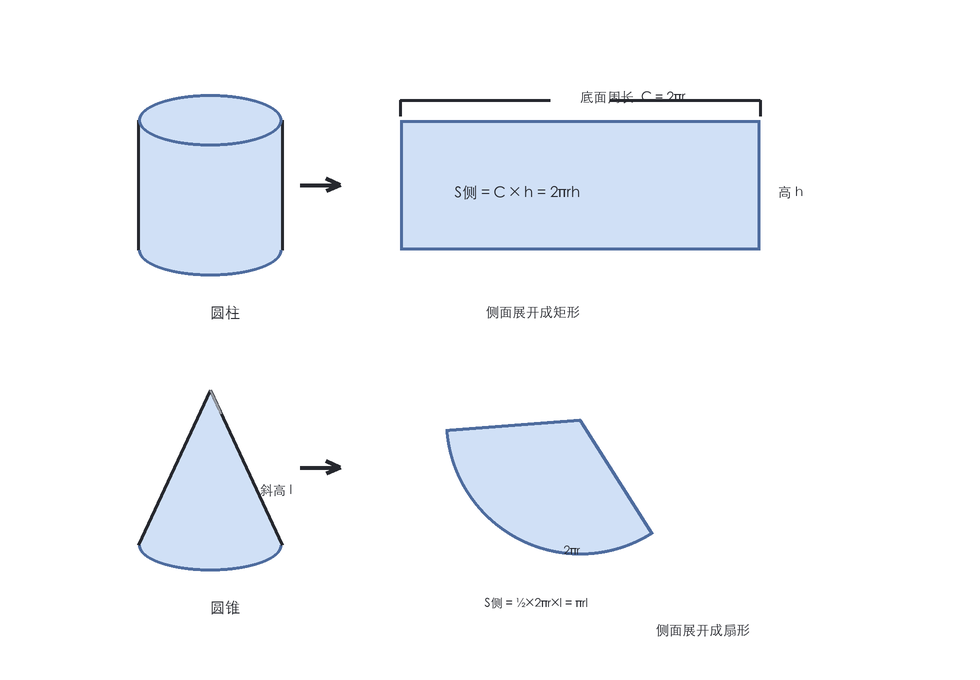
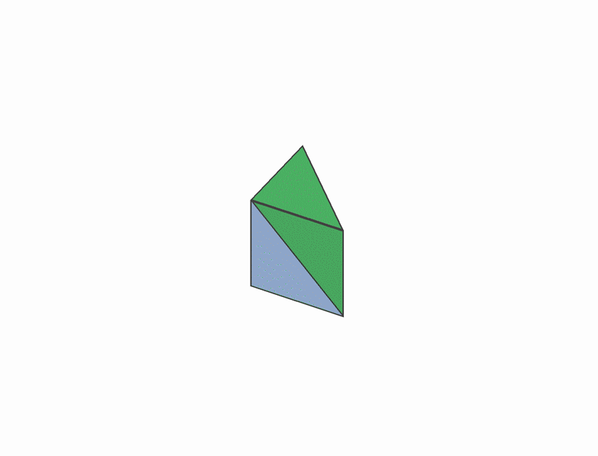
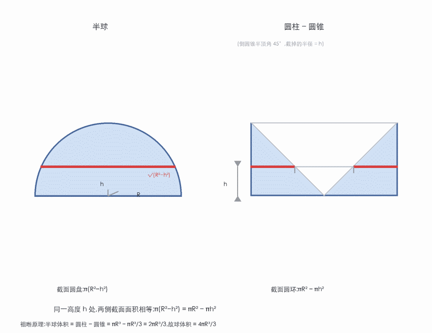
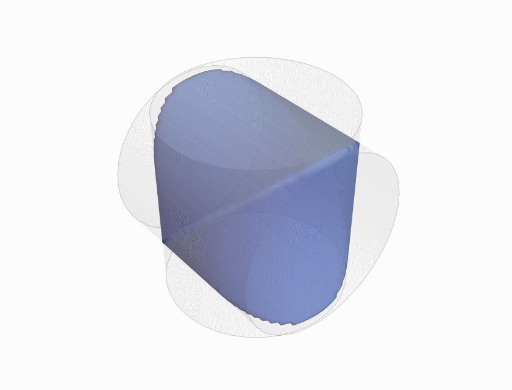
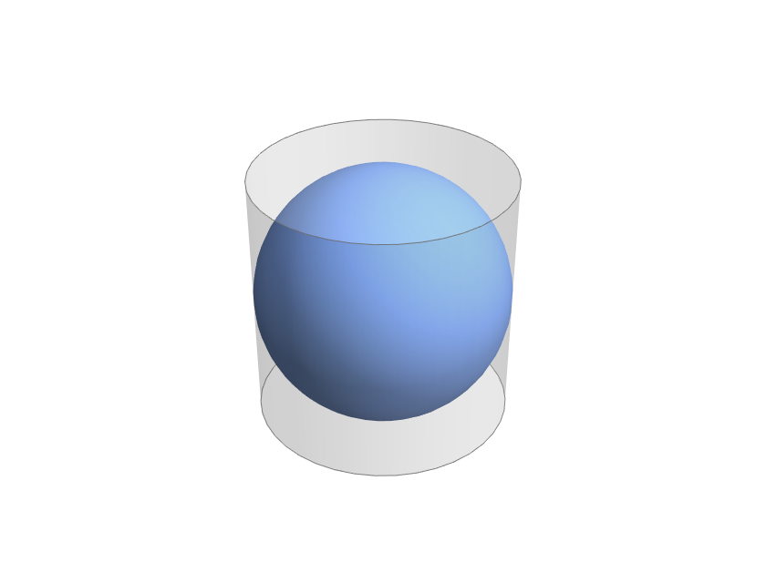
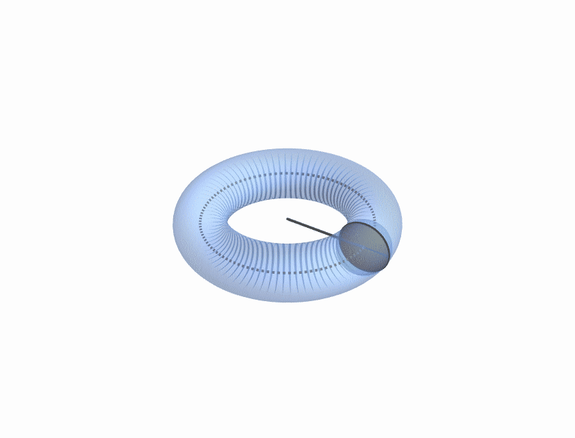

柱体 $V = Sh$，锥体 $V = \frac13 Sh$，球体 $V = \frac43 \pi R^3$，球表面积 $S = 4\pi R^2$。这些公式我们在小学到高中逐一背过，但有多少人认真问过：**那个 $\frac13$ 是哪来的？$\frac43$ 又是哪来的？**

这篇文章从最朴素的构造出发，把常见几何体的体积与表面积重新推一遍。主线只有四个动词：**切、拼、展开、取极限**。微积分只负责收尾——因为所有好东西，在积分发明之前就已经有人想出来了。

## 一、柱体：一个平面图形沿高扫过

柱体的定义可以统一成一句话：**拿一个平面图形，沿垂直于它的方向平移一段距离**。底面是三角形就得到三棱柱，底面是圆就得到圆柱。

于是体积公式几乎不需要证明：

$$V = Sh$$

一摞完全相同的薄片堆成高 $h$，总体积自然是底面积乘高。这个"薄片"的想法看似废话，后面会不断回来找我们——它是整个积分思想的最初形态。

侧面积同样一句话：**把侧面剪开、展开，它就是一个长方形**。长是底面周长 $C$，宽是高 $h$：

$$S_{\text{侧}} = Ch$$



对于圆柱，$C = 2\pi r$，于是 $S_{\text{侧}} = 2\pi rh$。

一个看似跑题的问题先留在这里：**斜棱柱**——底面斜着平移得到的柱体——体积还是 $Sh$ 吗？直觉会说"压扁了所以变小了"，但直觉会错。答案藏在第三节。

## 二、锥体：为什么偏偏是 1/3

锥体的体积公式里藏着一个最令人费解的常数：

$$V = \frac13 Sh$$

为什么是三分之一？最漂亮的解释是**把三棱柱切成三个体积相等的三棱锥**。



取三棱柱 $ABC\text{-}A'B'C'$，沿两个对角面各切一刀：先沿平面 $A'BC$ 切下四面体 $T_1 = A'ABC$；剩下一个四棱锥，再沿平面 $A'BC'$ 切成 $T_2 = A'BC'B'$ 与 $T_3 = A'BC'C$。现在证明这三个四面体两两等积：

- **$T_2 = T_3$**：它们有公共顶点 $A'$，底面 $\triangle BC'B'$ 与 $\triangle BC'C$ 全等（三条边两两相等），且位于同一平面。同底等高，体积相等。
- **$T_1 = T_2$**：它们共底面 $\triangle A'BC$，顶点分别是 $A$ 与 $B'$。$A$ 和 $B'$ 到这个面的距离相等吗？看平行四边形 $ABB'A'$：两条对角线 $AB'$ 与 $BA'$ 互相平分，交点 $M$ 在 $BA'$ 上——而 $BA'$ 整个躺在平面 $A'BC$ 里。所以 $A$ 与 $B'$ 关于这个平面"对称地一上一下"，距离相等。

两刀下去，三个四面体两两等积，而它们拼起来恰好是整个三棱柱，所以每个都是 $\frac13 Sh$。

这个构造还有一处妙用：**任意**三棱锥 $P\text{-}ABC$，把底面 $\triangle ABC$ 沿 $AP$ 方向平移，恰好补成一个三棱柱——而 $P\text{-}ABC$ 正是上面三个四面体中的第一个。所以任意三棱锥的体积都是 $\frac13 Sh$，无需直角、无需正体。

任意 $n$ 棱锥，从顶点出发把底面三角剖分成 $n-2$ 个三角形，就切成 $n-2$ 个三棱锥，体积相加仍是 $\frac13 Sh$。圆锥呢？用内接正 $n$ 棱锥逼近，取极限；或者直接用下一节的祖暅原理。总之：

$$\text{锥体}:\quad V = \tfrac13 Sh$$

侧面积也交给"展开"：锥体侧面剪开后是一个**扇形**，半径是斜高 $l = \sqrt{r^2 + h^2}$，弧长是底面周长 $2\pi r$。扇形面积等于 $\frac12 \times \text{弧长} \times \text{半径}$：

$$S_{\text{侧}} = \tfrac12 \cdot 2\pi r \cdot l = \pi r l$$

顺带埋一个伏笔：学过微积分的人会认出 $\int_0^h x^2\,dx = \frac{h^3}{3}$——锥体的 $\frac13$ 和这个 $\frac13$ 是同一个，第七节见分晓。

## 三、祖暅原理：截面相等，体积就相等

公元 5 世纪，祖暅（祖冲之之子）留下一句八个字的话：

> 幂势既同，则积不容异。

翻译成现代语言：**两个立体夹在同一对平行平面之间，若任意高度处的截面面积都相等，则体积相等**。这个原理在西方要到 17 世纪才由卡瓦列里（Cavalieri）独立提出，所以它也叫卡瓦列里原理。

它的证明思路朴素得可爱：把两个立体沿同一组高度切成很薄的片，每一层薄片面积相等、厚度相同，体积自然一层对一层地相等。切得越薄越精确，取极限即可。

第二节留下的斜棱柱问题现在可以回收了：斜棱柱与同底等高的直棱柱，任意平行于底面的截面都与底面全等，面积处处相等——**所以斜棱柱的体积也是 $Sh$**。"压扁了变小"的直觉是错的。



祖暅原理最漂亮的现代应用，是一步算出球体积。取半球，再取一个"圆柱挖去倒圆锥"：

- 半球半径 $R$，在高 $h$ 处截面是半径 $\sqrt{R^2 - h^2}$ 的圆盘，面积 $\pi(R^2 - h^2)$；
- 圆柱底面半径 $R$、高 $R$，挖去一个倒圆锥（顶点在圆柱下底圆心、底面为上底圆面——半顶角恰为 $45^\circ$）。在高 $h$ 处，圆锥截掉的部分是半径 $h$ 的圆盘，剩下的截面是圆环，面积 $\pi R^2 - \pi h^2 = \pi(R^2 - h^2)$。

两个截面面积**处处相等**。于是

$$V_{\text{半球}} = V_{\text{圆柱}} - V_{\text{圆锥}} = \pi R^3 - \frac{\pi R^3}{3} = \frac{2\pi R^3}{3}$$

所以

$$V_{\text{球}} = \frac43 \pi R^3$$

只用"锥体是柱体的三分之一"（第二节刚证过），再加一个原理，球体积就到手了。这就是"由简入深"的最好例子：**真正干活的是构造，不是计算**。

## 四、牟合方盖：一场跨越两百年的接力

球体积的 $\frac43$ 还有一个更早的版本，来自中国古代数学最动人的一次接力。

三国时期的刘徽注《九章算术》时发现：球体积等于 $\frac{\pi}{4}$ 乘一个奇形怪状的立体——**牟合方盖**（两个等半径的圆柱垂直相贯的公共部分）。理由是：用平行于圆柱轴的平面切这两个立体，球被切成圆、牟合方盖被切成正方形，而同一个外切正方形内，圆与方的面积比恒为 $\pi : 4$，所以体积比也是 $\pi : 4$。



但牟合方盖的体积，刘徽算不出来。他在注里写下八个字：

> 敢不阙疑，以俟能言者。

——"我姑且存疑，等能解决的人。"两百年后，祖冲之、祖暅父子用祖暅原理给出了答案。在高 $h$ 处，外切立方体的截面是面积 $4R^2$ 的正方形，牟合方盖的截面是面积 $4(R^2 - h^2)$ 的正方形，差 $4h^2$ 恰好是正四棱锥的截面面积。于是

$$V_{\text{方盖}} = 8R^3 - 2 \times \frac{(2R)^2 \cdot R}{3} = \frac{16}{3}R^3$$

乘以 $\frac{\pi}{4}$，球体积 $\frac43 \pi R^3$，和祖暅原理现代版殊途同归。刘徽的"阙疑"没有被辜负。

## 五、球表面积：4πr² 的三个面孔

阿基米德在《论球与圆柱》里证明了：**球表面积等于外切圆柱的侧面积**，也等于大圆面积的 4 倍：

$$S_{\text{球}} = 2\pi R \cdot 2R = 4\pi R^2$$



更妙的是，球与外切圆柱的**体积比也是 $2:3$**——他对这个结果如此自豪，以至于要求把"球内切于圆柱"刻在自己的墓碑上。（顺带一提：球面到圆柱面的"等积"映射正是地图学里兰伯特等积圆柱投影的原理，阿基米德的墓碑上站着一个地图投影。）

第二个面孔是微积分的一个经典彩蛋。把球想象成无穷多层洋葱壳：半径增加 $dr$，体积增加 $dV = S\,dr$。于是

$$\frac{d}{dr}\left(\frac43 \pi r^3\right) = 4\pi r^2$$

**表面积就是体积对半径的导数**。球是最典型的"洋葱"：每层壳厚 $dr$，体积增量 $\approx$ 表面积 $\times\,dr$。立方体也成立，但参数要取**半边长** $a$：$V = (2a)^3$，$\frac{dV}{da} = 24a^2 = 6\cdot(2a)^2$，正是六个面。柱体则只成立一半：$V = \pi r^2 h$ 对 $r$ 求导得 $2\pi rh$，只是侧面积——因为上下底面在半径增长时是沿自身平面"滑动"，不扫出体积。这个导数关系只对"每一点都沿法线向外长"的立体成立，球和立方体是，柱体不是。

## 六、旋转体与帕普斯定理

平面曲线绕轴旋转一周得到旋转体，体积的积分式很好写：截面是圆盘，

$$V = \int \pi y^2\,dx$$

但古希腊人帕普斯（Pappus）留下了一个更省事的定理，公元 4 世纪就被猜出来了：

> **旋转体体积 = 旋转图形的面积 × 重心走过的路程。**

把一个圆盘绕轴旋转一周：面积 $\pi r^2$，重心到轴的距离是 $R$，重心走一圈 $2\pi R$，于是圆环体体积

$$V = \pi r^2 \cdot 2\pi R = 2\pi^2 R r^2$$



表面积同理：**旋转曲面的面积 = 生成曲线的弧长 × 重心路程**，$S = 2\pi r \cdot 2\pi R = 4\pi^2 Rr$。

帕普斯定理还有一个"展开"式的妙证：把圆环体沿大圆剪开、拉直——小圆截面完全不变，长度变成 $2\pi R$——它就成了一个**圆柱**，高 $2\pi R$、底半径 $r$。体积 $\pi r^2 \cdot 2\pi R$，一步到位。这和第一节"柱体侧面展开成长方形"是同一个手艺。

## 七、积分：把"切"做到极限

现在把整篇文章收进积分的语言里，篇幅不超过一节。

**截面法**。第一节的"薄片"想法写成积分：

$$V = \int_a^b A(x)\,dx$$

其中 $A(x)$ 是高度 $x$ 处的截面面积。祖暅原理，就是这个公式的古代说法。锥体的 $A(x) = S\left(1 - \frac{x}{h}\right)^2$（$x$ 从底面量起），积出来正好是 $\frac13 Sh$——第二节的伏笔在此回收。

**多重积分**。一般几何体写 $\displaystyle V = \iiint_\Omega dV$，而"曲顶柱体的体积"是 $\displaystyle\iint_D f(x,y)\,dA$。

**换元与雅可比行列式**。坐标系换了，体积微元要乘变换的雅可比行列式 $|\det J|$。球坐标下 $x = r\sin\varphi\cos\theta,\ y = r\sin\varphi\sin\theta,\ z = r\cos\varphi$，$|\det J| = r^2\sin\varphi$，于是

$$\iiint_\Omega dV = \int_0^{2\pi}\!\int_0^{\pi}\!\int_0^R r^2\sin\varphi\,dr\,d\varphi\,d\theta = \frac43 \pi R^3$$

同一个 $\frac43$，用重积分两行就能再走一遍。但请别忘了：切、拼、展开这些构造，比积分早了一千年以上。**先有构造，后有积分**——积分的威力在于把这些构造一口气做到极限。

## 尾声：一条四步的路

回看全篇，所有公式都可以归入四个动词：

- **切**：三棱柱两刀切成三个三棱锥，得到 $\frac13$；
- **拼**：三棱锥补成三棱柱、立方体挖去两个四棱锥留下牟合方盖；
- **展开**：侧面展开成长方形和扇形、圆环体拉直成圆柱；
- **取极限**：圆锥逼近、薄片求和、最后交给积分。

两千年来，从阿基米德的墓碑到祖暅的"幂势既同，则积不容异"，人类求体积的手艺始终没变：**把一个三维问题，想办法变成一堆二维问题的和。**

## 相关阅读

- [为什么正多面体只有五种：从欧拉公式说起](post.html?slug=polyhedra)（本站）：体积算完，数数面数——欧拉公式 $V - E + F = 2$ 的故事。
- [微积分的本质（Essence of Calculus）](https://www.youtube.com/playlist?list=PLZHQObOWTQDMsr9K-rj53DwVRMYO3t5Yr)（3Blue1Brown）：积分的几何直觉——"切薄片求和"，与本文第七节互为表里。

> [!detail] 附：绘图细节（可展开）
> 文中 3D 插图由 Mathematica 生成；2D 示意图（展开图、半球对比）由 PIL 绘制并合成中文标注（STHeiti），GIF 组装与量化在 Mathematica 内完成。关键代码摘录如下。
>
> **三棱柱切三锥**：`Prism[{A,B,C}]` 给三棱柱，`Tetrahedron[pts]` 给四面体，`GeometricTransformation` 只包图元（指令留在外面），三个四面体沿不同方向平移：
>
> ```mathematica
> A={0,0,0}; B={1,0,0}; C={0,1,0}; Ap={0,0,1}; Bp={1,0,1}; Cp={0,1,1};
> t1=Tetrahedron[{A,B,C,Ap}]; t2=Tetrahedron[{Ap,B,Cp,Bp}]; t3=Tetrahedron[{Ap,B,Cp,C}];
> (* 切面 A'BC 与 A'BC' 把三棱柱分成这三个四面体 *)
> ```
>
> **牟合方盖**：两个圆柱的公共部分是 `RegionPlot3D[x^2+y^2<=1 && x^2+z^2<=1, ...]`，从中提取 `GraphicsComplex` 嵌入场景；高度 $h$ 处的截面正方形是 `Polygon[{{-a,h,-a},{a,h,-a},{a,h,a},{-a,h,a}}]`，`a=Sqrt[1-h^2]`。
>
> **球与外切圆柱**：`Sphere[{0,0,0},1]` 与 `Cylinder[{{0,0,-1},{0,0,1}},1]` 叠加，圆柱 `Opacity[0.22]`。
>
> **圆环体**：`Tube[Table[{R Cos[u],R Sin[u],0},{u,0,2Pi,2Pi/72}],r]`；旋转的生成圆盘用扇形 `Polygon` 近似，重心轨迹是虚线大圆。
>
> 所有 3D 图统一 `ViewPoint`/`ViewAngle`、`SphericalRegion -> True` 防抖，`Rasterize` 时 `ImageResolution -> 72` 出 1x，GIF 用 `ColorQuantize[#, 32]` 量化压体积。
