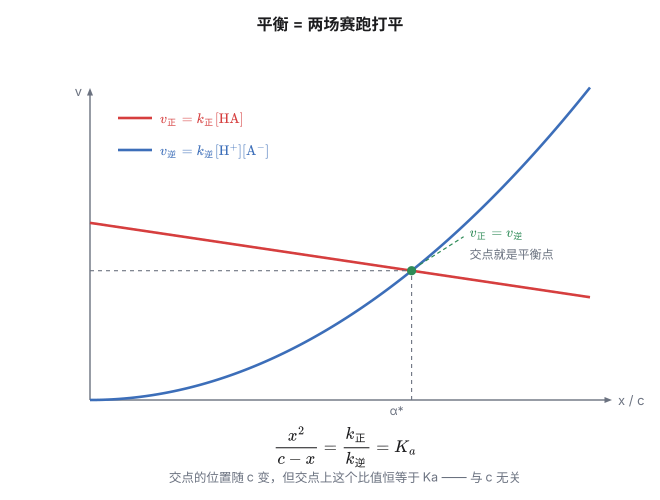
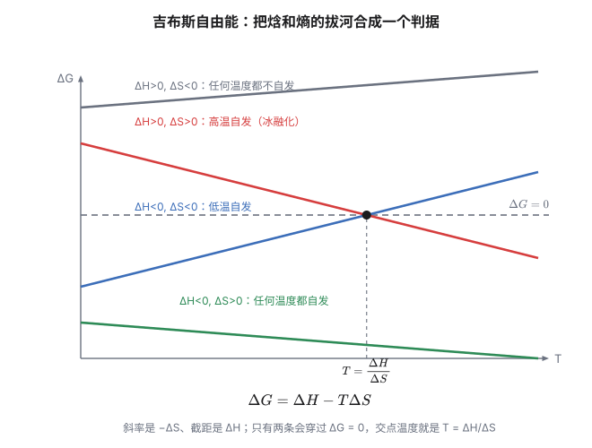

你在笔记里做过这样一道题：0.1 mol/L 的醋酸，$K_a = 1.8\times10^{-5}$，算出 $[\mathrm{H^+}] \approx 1.34\times10^{-3}$、电离度 1.34%、pH = 2.87。然后把它稀释到 0.001 mol/L。

把结果排在一起看：

| | 0.1 mol/L | 0.001 mol/L | 变化 |
|---|---|---|---|
| 浓度 $c$ | 0.1 | 0.001 | **÷100** |
| $[\mathrm{H^+}]$ | $1.34\times10^{-3}$ | $1.34\times10^{-4}$ | **÷10** |
| 电离度 $\alpha$ | 1.34% | 13.4% | **×10** |
| pH | 2.87 | 3.87 | **+1** |
| $K_a$ | $1.8\times10^{-5}$ | $1.8\times10^{-5}$ | **不动** |

四个量全变了，而且变得"不整齐"：浓度降了 100 倍，$[\mathrm{H^+}]$ 却只降了 10 倍。

**少降的那一部分，正是电离度补上来的。** 如果醋酸是完全电离的（比如换成盐酸），稀释 100 倍 pH 就该涨 2；实测只涨了 1——差的这 1，就是"电离度涨了 10 倍"的贡献。

所以这些"变"之间是有勾连的。而勾住它们的，是那个一直没动的 $K_a$。

问题就来了：**浓度、pH、电离度都是"溶液的状态"，它们全变了；凭什么有一个量不变？**

更让人不放心的是——课本把"$K_a$ 只随温度变化"直接写成结论，还列进易错点。可是**凭什么？**

这一篇只干一件事：把这个"不变"推出来。推完之后，你会发现整章"水溶液中的离子平衡"，其实只有一句话。

> [!note] 先埋一个伏笔
> 上面表格里 0.001 mol/L 那一行，用的是课本的近似公式。**其实这一行已经越界了。**
>
> 近似公式的适用条件是 $c/K_a \ge 400$。0.1 mol/L 时是 5556，合格；0.001 mol/L 时只有 **56**，不合格。精确解是 $[\mathrm{H^+}] = 1.25\times10^{-4}$、$\alpha = 12.6\%$、pH = 3.90。
>
> 差别不大，但那个漂亮的"÷10、×10"会变成"÷10.7、×9.3"。为了讲故事，下面先按课本的数走——**第五节末尾会回来算这笔账**（文末自检第 3 条有完整过程）。

## 一、先把"变"的清点一遍

上面那张表其实已经说完了。但要看清"谁在变、谁不变"，值得再拆一层：

- **$c$ 是你自己定的**——你往里加多少水，它说了算；
- **$[\mathrm{H^+}]$、$\alpha$、pH 是"结果"**——它们被 $c$ 和 $K_a$ 一起决定；
- **$K_a$ 是"规则"**——它不参与被决定，它决定别人。

换句话说：$c$ 是自变量，$K_a$ 是参数，$[\mathrm{H^+}]$、$\alpha$、pH 是因变量。**参数不动，自变量一动，因变量就得跟着动。**

但"参数为什么可以不动"，还得从分子层面看。

## 二、从分子视角推导：平衡是两场赛跑打平

先把电离写成一个来回：

$$\mathrm{HA + H_2O \rightleftharpoons H_3O^+ + A^-}$$

（写 $\mathrm{H_3O^+}$ 而不是 $\mathrm{H^+}$ 更诚实——质子在水里不会裸奔，它总挂在一个水分子上。下面一律简写成 $\mathrm{H^+}$。）

### 正向：一个分子的"决定"

正向这一步，本质是一个 $\mathrm{HA}$ 分子把一个质子**交给**旁边的水分子。这件事只需要"一个 HA 和一个水分子碰面"。

那么单位体积、单位时间里，有多少 HA 分子会这么做？**正比于 HA 的浓度**：

$$v_{正} = k_{正}\,[\mathrm{HA}][\mathrm{H_2O}]$$

**为什么是"相乘"？** 因为要让两个粒子反应，它们得先**撞上**。而"撞上的机会"正比于两边各有多少人——HA 越多、水越多，撞上的机会就越多。两边各出一个，所以是两个浓度相乘。

（水在这里是溶剂，浓度高达 55.5 mol/L，而且在稀溶液里几乎不变。所以它会被打包进常数里——**这件事后面还会回来找我们**，见第六节。）

### 逆向：两个粒子要相遇

逆向是 $\mathrm{H_3O^+}$ 和 $\mathrm{A^-}$ 撞上、把质子还回去。同理：

$$v_{逆} = k_{逆}\,[\mathrm{H^+}][\mathrm{A^-}]$$

### 平衡：两场赛跑打平

平衡的定义就是两个速率相等：

$$k_{正}\,[\mathrm{HA}][\mathrm{H_2O}] = k_{逆}\,[\mathrm{H^+}][\mathrm{A^-}]$$

把浓度搬到一边、常数搬到另一边：

$$\frac{[\mathrm{H^+}][\mathrm{A^-}]}{[\mathrm{HA}]} = \frac{k_{正}}{k_{逆}}\,[\mathrm{H_2O}]$$

左边是浓度的组合，右边**只剩常数**。既然右边是常数，左边也必须是个常数——把它命名为 $K_a$。

**推导到这里就结束了。** 但真正关键的一步还在后面。

### 关键：$k$ 到底是什么？

$k_{正}$、$k_{逆}$ 叫**速率常数**。这个名字有点误导——它们确实是常数，但不是"随便定下来的数"。它们的物理意义是：

> **单位浓度下、单位时间里，有多少比例的粒子真的完成了这一步反应。**

换句话说，$k$ 就是**每个粒子的"反应概率"**（严格说是单位时间内的概率）。

那这个概率由什么决定？**温度和能垒。**

- 温度高 → 分子动能大 → 更容易翻过能垒 → $k$ 大；
- 能垒低（活化能小）→ 同样的温度下更容易翻过去 → $k$ 大。

**它跟浓度没有任何关系。**

这就是全部答案：

> **浓度决定的是"有多少人参与"，$k$ 决定的是"每个人多愿意反应"。人数变了，意愿不变——所以它们的比值不变。**

一个类比：班里 100 个人，每人每天有 1% 的概率请假，那么每天大约 1 人请假。把人加到 1000 个，每天大约 10 人请假——**请假的人数变了 10 倍，请假率还是 1%。**

浓度就像班级人数，$k$ 就是那个"请假率"。稀释只是把人减少，改不了每个人的意愿。

（类比有个不贴的地方：请假是单向的，而这里正向逆向各有一场赛跑。不过"比例不变"的直觉是对的。）

## 三、为什么形式是"浓度的幂之积"

推导里有个地方值得单独拎出来：**为什么正向是一次、逆向是二次？**

- 正向是"一个分子自己的决定"（外加一个水分子）→ 一次；
- 逆向是"两个粒子相遇"→ 二次。

如果一步反应需要 A、B、C 三个粒子同时撞上，速率就正比于 $[\mathrm{A}][\mathrm{B}][\mathrm{C}]$。这就是**质量作用定律**：

> 基元反应的速率，正比于各反应物浓度的幂之积，指数等于化学计量数。

**所以"平衡常数表达式里的指数就是化学计量数"这件事，根子在分子层面的"相遇"**——不是谁规定的，是概率算出来的。

这也顺带解释了另一条你早就用过的规则：**固体和纯液体不写进 $K$ 的表达式。** 因为它们的"浓度"（单位体积里有多少）基本是定值，会被吸收进常数里——和上面那个 $[\mathrm{H_2O}]$ 是一回事。

> [!note] 一个要交代清楚的边界
> 上面的推导假设"正、逆都是一步到位"（**基元反应**）。真实反应常常分好几步。
>
> 但结论仍然成立——因为有**细致平衡原理**兜底：平衡时，**每一步**的正逆速率都各自相等（不只是总和相等）。既然每一步都打平，每一步的"速率常数之比"就都是常数，把它们连乘起来（中间体的浓度会正好约掉），得到的还是总反应的那个常数。
>
> 要分清的是：**不能照化学计量数写的是速率方程**（它的指数由机理决定）；而平衡常数的表达式永远由总反应式的化学计量数决定——这正是上面"连乘"保证的。弱酸电离、水解这些高中例子本来就接近一步质子转移，直接用一步近似没问题。

## 四、换一条路：从"自发"到平衡常数

第二节我们从分子层面把 $K$ 推了出来。那是一条**微观**的路：盯着分子怎么撞、怎么裂。

还有一条**宏观**的路：不问分子怎么动，只问**能量上划不划算**。

这条路走出来的结论更本质——它不但能给出 $K$ 的表达式，还能解释 $K$ 为什么**一定存在**。而且走完之后你会发现，第二节那个"两场赛跑打平"，和这一节的"能量拔河"，说的是同一件事。

### 4.1 先问一个更朴素的问题：反应为什么会"自己发生"

化学里最常问的问题是：这个反应会不会自己发生？

高中给过一个粗略的答案：**放热就自发**（$\Delta H < 0$）。

这个答案对了一大半，但有它解释不了的现象：

> **冰在 0 °C 以上会自己融化，而融化是吸热的。**

你把一块冰放在 25 °C 的房间里，它会自己变成水。这个过程要吸热（$\Delta H > 0$），按"放热才自发"的说法，它不该发生。

硝酸铵溶于水也一样——捏破那种化学冰袋的内胆，它会变冷，说明在吸热，可它确实自己溶了。

所以除了"放热"，一定还有**另一个东西**在推动反应。

### 4.2 另一个东西：熵

那个东西叫**熵**（$S$），粗略地说，它是"混乱程度"的度量。

（更准确的定义是 $S = k_B\ln\Omega$，$\Omega$ 是系统可能处于的微观状态数。这个式子不用记，只要抓住一点：**微观上"更可能"的状态，宏观上就对应更大的熵。**）

自然界有一个基本倾向：**往混乱度更大的方向走。** 这就是热力学第二定律。

现在回头看冰融化：

- 冰里水分子被氢键锁在规整的晶格里，位置几乎定死——**有序**；
- 水里分子能到处跑、各种朝向——**混乱**。

所以融化是熵增大的（$\Delta S > 0$）。**吸热这个"不利因素"，被熵增这个"有利因素"顶回来了。**

硝酸铵溶解同理：原本规整的晶体被拆散成自由游动的离子，熵增大。

于是自发性变成了**一场拔河**：

| 因素 | 有利方向 |
|---|---|
| 焓 $\Delta H$ | 放热（$\Delta H < 0$） |
| 熵 $\Delta S$ | 混乱度增大（$\Delta S > 0$） |

### 4.3 吉布斯把拔河变成了一个数

两个因素方向一致时好办。冲突时谁赢？

吉布斯的答案是：**别争，把两者合成一个数。**

$$\boxed{\ \Delta G = \Delta H - T\Delta S\ }$$

$G$ 叫**吉布斯自由能**。判据简单到粗暴：

| $\Delta G$ | 含义 |
|---|---|
| $< 0$ | 正方向自发 |
| $= 0$ | **平衡** |
| $> 0$ | 正方向不自发（逆方向自发） |

**注意那个 $T$**：温度是拔河的"裁判权重"。$T$ 越大，熵那一项的话语权越大。这一个 $T$ 就把四种情况全解释了：

| $\Delta H$ | $\Delta S$ | $\Delta G = \Delta H - T\Delta S$ | 行为 |
|---|---|---|---|
| $<0$ | $>0$ | 两项都负 → 恒 $<0$ | 任何温度都自发 |
| $>0$ | $<0$ | 两项都正 → 恒 $>0$ | 任何温度都不自发 |
| $<0$ | $<0$ | 低温负、高温正 | **低温**自发 |
| $>0$ | $>0$ | 低温正、高温负 | **高温**自发 |

**冰融化正好落在最后一格**：吸热（不利），但熵增（有利）。低温时不行（冰箱里冰不会化），高温时行（室温下自己化）。那个分界温度，就是让 $T\Delta S$ 刚好抵消 $\Delta H$ 的温度——对冰来说就是 0 °C。

顺便，这个表也解释了为什么"低温自发"和"高温自发"两种反应看起来"反常"：它们不是反常，只是**拔河的两边力量悬殊**，必须靠温度来调裁判权重。

> [!note] $\Delta G$ 不是"一种新的能量"
> 它只是一个把焓和熵打包起来的**判据**。
>
> 严格地说，$\Delta G$ 的物理意义是"恒温恒压下，系统还能对外做多少非体积功"。但对现在的我们来说，只要记住它是一个判据就够了——**算出来是负的，正方向就走得动；是零，就停在平衡。**

### 4.4 为什么 $\Delta G$ 里会冒出一个 $\ln Q$

到这里说的还是"反应本身"的事。现在把**浓度**接进来。

关键一步：**$\Delta G$ 描述的是"从当前状态出发，往哪边走"，所以它必然依赖当前浓度。**

一锅反应，如果产物还很少，正方向肯定更有利；如果产物已经堆了很多，逆方向就变得有利。$\Delta G$ 必须能反映这件事。

于是把 $\Delta G$ 拆成两部分：

$$\Delta G = \underbrace{\Delta G^\circ}_{\text{只跟反应本身有关}} + \underbrace{RT\ln Q}_{\text{跟当前浓度有关}}$$

- $\Delta G^\circ$：**标准态**下的自由能变化。标准态是人为规定的（溶质 1 mol/L、气体 1 bar），所以 $\Delta G^\circ$ 是一个**只由物质本性和温度决定的常数**；
- $Q$：**浓度商**——照着 $K$ 的式子写，只是把"此刻"的浓度代进去；
- $RT\ln Q$：修正项，衡量"当前浓度离标准态有多远"。

**为什么偏偏是"对数"？** 这是最容易被跳过、但其实最好理解的一步。

想一个最简单的可逆过程 $\mathrm{A \rightleftharpoons B}$。往哪边走，显然取决于比值 $[\mathrm{B}]/[\mathrm{A}]$：

- 比值很小 → 正方向有利；
- 比值很大 → 逆方向有利；
- 中间必有一个"不多不少"的比值，那就是平衡常数 $K$。

驱动力应该随"当前比值离 $K$ 有多远"而变化。但**"多远"是乘性的**：

> 从比值 1 到 10，和从 10 到 100，感觉上"一样远"——都是翻了 10 倍。

而 $\Delta G$ 是一个可以相加减的量（能量）。**要把"乘性的距离"变成"可以加减的量"，唯一的办法就是取对数。**

$$\ln\frac{[\mathrm{B}]}{[\mathrm{A}]}:\quad 0 \to 2.303 \to 4.605 \to \cdots\quad(\text{比值 } 1\to10\to100\to\cdots)$$

（同样的道理，pH 也是浓度的对数——因为浓度的跨度动辄十几个数量级，线性刻度根本画不下。）

**所以那个 $\ln Q$ 不是谁硬塞进来的，是"浓度的影响天生是乘性的"这件事逼出来的。**

### 4.5 平衡时 $\Delta G = 0$，于是……

现在只差最后一步。

**平衡的定义就是"没有净推动力"**——正逆速率相等，宏观上什么都不再变。而"没有推动力"用 $\Delta G$ 说，就是 $\Delta G = 0$。

代入上面的式子，并且注意**平衡时 $Q$ 就是 $K$**：

$$0 = \Delta G^\circ + RT\ln K$$

移项：

$$\boxed{\ \Delta G^\circ = -RT\ln K \quad\Longleftrightarrow\quad K = e^{-\Delta G^\circ/RT}\ }$$

**看清楚右边有什么：只有 $\Delta G^\circ$ 和 $T$。没有浓度，没有压强，没有催化剂。**

$\Delta G^\circ$ 只由物质本性和温度决定，所以 $K$ 也只由温度决定。

**这就是"平衡常数为什么不变"的热力学答案。** 它比第二节那个动力学答案更强的地方在于：**它不关心反应是怎么走的**——一步还是十步、什么机理，都无所谓。只要 $\Delta G^\circ$ 存在，就一定有唯一的 $K$。

### 4.6 算个数：醋酸的 $\Delta G^\circ$ 是正的，它为什么还电离？

把醋酸的 $K_a = 1.8\times10^{-5}$ 代进去：

$$\Delta G^\circ = -RT\ln K_a = -8.314 \times 298 \times \ln(1.8\times10^{-5})$$

$\ln(1.8\times10^{-5}) = \ln 1.8 + \ln 10^{-5} = 0.588 - 11.513 = -10.925$，所以

$$\Delta G^\circ = -8.314 \times 298 \times (-10.925) \approx +2.71\times10^{4}\ \mathrm{J/mol} = +27.1\ \mathrm{kJ/mol}$$

**是正的。** 正的意思是：**在标准态下，醋酸电离这个方向是不利的。**

可是我们明明算过，0.1 mol/L 的醋酸有 1.34% 电离了啊？

> [!tip] $\Delta G^\circ$ 和 $\Delta G$ 是两回事
> 这正是最容易搞混的地方。
>
> - $\Delta G^\circ$ 说的是**标准态**（所有浓度都恰好 1 mol/L）下往哪边走；
> - $\Delta G$ 才是**实际情况下**的判据，它等于 $\Delta G^\circ + RT\ln Q$。
>
> 醋酸刚开始电离时，$Q = \dfrac{[\mathrm{H^+}][\mathrm{A^-}]}{[\mathrm{HA}]}$ 几乎是 0，$\ln Q$ 是个很大的负数，所以 $RT\ln Q$ 是一个很大的负项，把正的 $\Delta G^\circ$ 完全压过去了——**实际驱动力是负的，电离自发。**
>
> 随着电离进行，$Q$ 增大，$RT\ln Q$ 往上爬，直到 $\Delta G$ 从负爬到 0。**那一刻就是平衡。** 此时 $Q = K_a$，代回 $\Delta G = \Delta G^\circ + RT\ln Q = 0$，正好得到 $\Delta G^\circ = -RT\ln K_a$。

所以"$\Delta G^\circ > 0$ 的反应不能发生"这个说法是错的。正确的说法是：

> **$\Delta G^\circ > 0$ 只说明"标准态下不划算"，也就是 $K < 1$。** 只要把产物的浓度压得足够低，反应照样能往正方向走。

（反过来也成立：$K < 1$ 不等于"几乎不反应"。醋酸的 $K_a = 1.8\times10^{-5}$，可 0.1 mol/L 时也有 1.3% 电离——1.3% 听着少，但那是每 100 个分子里有 1 个多，不是"可以忽略"。）

### 4.7 温度怎么改 $K$：van't Hoff

既然 $K$ 只依赖温度，那"怎么依赖"就成了唯一的问题。

把 $\Delta G^\circ = \Delta H^\circ - T\Delta S^\circ$ 代进 $\Delta G^\circ = -RT\ln K$：

$$-RT\ln K = \Delta H^\circ - T\Delta S^\circ \quad\Longrightarrow\quad \ln K = -\frac{\Delta H^\circ}{RT} + \frac{\Delta S^\circ}{R}$$

两边对 $T$ 求导（把 $\Delta H^\circ$、$\Delta S^\circ$ 当常数）：

$$\frac{d\ln K}{dT} = \frac{\Delta H^\circ}{RT^2}$$

**这个式子的符号信息全在 $\Delta H^\circ$ 上**：

- 吸热反应（$\Delta H^\circ > 0$）→ 升温 $K$ 增大；
- 放热反应（$\Delta H^\circ < 0$）→ 升温 $K$ 减小。

**这和勒夏特列原理完全一致**——只不过勒夏特列只给了定性的"往抵消方向移动"，van't Hoff 把它变成了定量关系。

再看两个具体的数，就能明白"升温促进电离"为什么对不同的酸效果差那么多：

| 过程 | $\Delta H^\circ$ | 升温时 $K$ 变得快不快 |
|---|---|---|
| 醋酸电离 | 零点几 $\mathrm{kJ/mol}$ | 很慢（常温范围内 $K_a$ 几乎看不出变化） |
| 水的电离 | $+55.8\ \mathrm{kJ/mol}$ | **很快**（$K_w$ 从 $10^{-14}$ 涨到 $5.5\times10^{-13}$） |

原因说到底是能量账：**两个过程都是把质子转给水、都要断一根 O—H 键**，差别在找零——水电离断键的代价扣掉水合收益后还剩 55.8 kJ/mol；而醋酸这边，断键的代价被水合和羧酸根的共振稳定基本找平，净吸热几乎为零。

（顺带一个诚实的提醒：用 25 °C 的 $\Delta H^\circ = 55.8$ kJ/mol 外推到 100 °C，会算出 $K_w \approx 9\times10^{-13}$，而实测是 $5.5\times10^{-13}$——偏高了近七成。原因是 $\Delta H^\circ$ 本身随温度升高而减小（到 100 °C 附近只剩约 46 kJ/mol），拿 55.8 一路算下去，自然把增幅高估了。所以 van't Hoff 在小区间内很好用，跨 75 °C 就得小心。）

### 4.8 两条路合起来看

现在可以把第二节和这一节拼起来了：

| | 动力学（第二节） | 热力学（这一节） |
|---|---|---|
| 出发点 | 分子怎么撞、怎么裂 | 能量上划不划算 |
| 得到 | $K = k_正/k_逆$ | $K = e^{-\Delta G^\circ/RT}$ |
| 告诉你 | $K$ **长什么样**（浓度幂之积的比值） | $K$ **为什么一定存在** |
| 依赖什么 | 速率常数只依赖 $T$ | $\Delta G^\circ$ 只依赖 $T$ |

两条路都得出了"$K$ 只依赖温度"，但它们各自多给了一点东西：动力学解释了**形式**，热力学解释了**必然性**。

最后还有一个必须说清的边界：

> **热力学只管"能不能"，动力学管"快不快"。**

一个 $\Delta G^\circ$ 很负的反应（非常"愿意"发生），如果活化能高得离谱，你可能等一万年也看不到它发生。**最著名的例子是金刚石变成石墨**：$\Delta G^\circ < 0$，热力学上金刚石"应该"变成石墨——但室温下这个转化慢到可以忽略，所以你手上的钻戒不会自己变成铅笔芯。

反过来，一个 $\Delta G^\circ > 0$ 的反应，只要条件合适（比如不断把产物移走），也照样能跑起来。

**所以"$\Delta G$"和"速率"是两把不同的尺子，别拿一把去量另一把。**

## 五、用这一个"不变"，解释一串问题

前面所有力气，都花在证明"$K_a$ 只依赖温度"上。现在开始收利息。

### 5.1 稀释定律：为什么越稀越电离

设弱酸 HA 起始浓度 $c$、电离度 $\alpha$。平衡时：

$$[\mathrm{H^+}] = [\mathrm{A^-}] = c\alpha,\qquad [\mathrm{HA}] = c(1-\alpha)$$

代进 $K_a$：

$$K_a = \frac{(c\alpha)(c\alpha)}{c(1-\alpha)} = \frac{c\alpha^2}{1-\alpha}$$

**看这个式子：$K_a$ 是常数，$c$ 是你自己定的，所以 $\alpha$ 只能被逼着变。** $\alpha$ 小的时候 $1-\alpha\approx1$：

$$K_a \approx c\alpha^2 \quad\Longrightarrow\quad \alpha \approx \sqrt{\frac{K_a}{c}}$$

$c$ 降 100 倍 → $\alpha$ 涨 $\sqrt{100} = 10$ 倍 ✓ 和引子里的数对上了。

**从速率角度再看一遍，会更明白"为什么必须涨"。**

稀释之后，$\mathrm{H^+}$ 和 $\mathrm{A^-}$ 都变稀了。逆向速率 $v_{逆} = k_{逆}[\mathrm{H^+}][\mathrm{A^-}]$ 里是**两个浓度相乘**，所以掉得特别快——稀释 100 倍，它就掉到 $1/10^4$；而正向速率 $v_{正} = k_{正}[\mathrm{HA}]$ 只含一个浓度，只掉到 $1/100$。

于是 $v_{逆} < v_{正}$ ——平衡被推向右边。**电离度必须增大，才能把 $v_{逆}$ 追回来，重新打平。**

这才是"越稀越电离"的真机制：**不是水"更想电离"，而是逆向那场赛跑被稀释削弱得更狠。**

**但注意 $[\mathrm{H^+}]$ 仍然是减小的：**

$$[\mathrm{H^+}] = c\alpha = \sqrt{K_a c}$$

$c$ 降 100 倍 → $[\mathrm{H^+}]$ 降 10 倍 → pH 涨 1 ✓ 也对上了。

> [!tip] 一句话记住
> **稀释让"比例"上升，让"绝对量"下降。** 电离度是比例（涨），$[\mathrm{H^+}]$ 是绝对量（跌）。两者不矛盾。

![稀释定律：双对数坐标下，α 越稀越大（斜率 −½）、[H⁺] 越稀越小（斜率 +½）、Ka 是一条水平线](../../assets/img/chem-dilution-law.svg)

现在回来算引子里那笔账。0.001 mol/L 时 $c/K_a = 56$，近似公式已经偏了约 7%。用一元二次方程 $x^2 + K_ax - K_ac = 0$ 精确解：

$$x = \frac{-K_a + \sqrt{K_a^2 + 4K_ac}}{2} = \frac{-1.8\times10^{-5} + 2.689\times10^{-4}}{2} = 1.25\times10^{-4}$$

所以精确值是 $[\mathrm{H^+}] = 1.25\times10^{-4}$、$\alpha = 12.6\%$、pH = 3.90。**"÷10、×10"变成了"÷10.7、×9.3"**——故事没那么漂亮了，但这才是真的。

（这件事本身也值得记：**近似公式有适用条件，用它之前先算一下 $c/K_a$。**）

### 5.2 同离子效应：为什么加 NaA 会抑制电离

往醋酸里加一点 $\mathrm{CH_3COONa}$，溶液里突然多出一大堆 $\mathrm{A^-}$。$K_a$ 不变：

$$\frac{[\mathrm{H^+}][\mathrm{A^-}]}{[\mathrm{HA}]} = K_a$$

分母还没怎么动（HA 的浓度基本没变），分子里的 $[\mathrm{A^-}]$ 变大了——**为了让整个分式维持原来的值，$[\mathrm{H^+}]/[\mathrm{HA}]$ 必须下降。** 于是电离度减小，平衡左移。

从速率看更直接：加 $\mathrm{A^-}$ → $v_{逆} = k_{逆}[\mathrm{H^+}][\mathrm{A^-}]$ 变大 → 平衡左移 ✓。

> [!warning] 一个极易记反的地方
> 加 NaA 之后：**pH 升高**（H⁺ 被压下去了），但**电离度减小**。两者方向相反。
>
> 原因：pH 看的是 $[\mathrm{H^+}]$，电离度看的是"已电离比例"。同离子效应让分子（H⁺）减少得比"总量里被电离的那部分"更多。
>
> 顺便，加盐酸（$\mathrm{H^+}$）也是同离子效应，但方向相反：pH 降、电离度也降。

### 5.3 缓冲溶液：为什么能"抗"

把 $K_a$ 的式子取对数、变个形：

$$[\mathrm{H^+}] = K_a\cdot\frac{[\mathrm{HA}]}{[\mathrm{A^-}]} \quad\Longrightarrow\quad pH = pK_a + \lg\frac{[\mathrm{A^-}]}{[\mathrm{HA}]}$$

（这就是亨德森–哈塞尔巴赫方程。$p$ 就是取负对数：$pK_a = -\lg K_a$。）

**看这个式子**：pH 只由 $pK_a$ 和**两个浓度的比值**决定，而 $pK_a$ 是常数。

于是"抗酸碱"的原理就清楚了。往缓冲溶液里加一点强酸，$\mathrm{H^+}$ 会被 $\mathrm{A^-}$ 立刻吃掉：

$$\mathrm{A^- + H^+ \to HA}$$

结果是 $[\mathrm{A^-}]$ 稍微降一点、$[\mathrm{HA}]$ 稍微升一点——**比值只变了很小一点点**，所以 pH 几乎不动。

关键在于：**缓冲对（HA 和 A⁻）的存在，让"比值"这个真正决定 pH 的量，在加酸加碱时都变化不大。** 如果没有 A⁻ 做"储备"，加进来的 $\mathrm{H^+}$ 就会直接变成自由 $\mathrm{H^+}$，pH 立刻塌下去。

**为什么最佳缓冲范围是 $pH \approx pK_a \pm 1$？** 因为这时候比值在 0.1 到 10 之间。超出这个范围，说明其中一个"存货"太少，加一点酸碱就能把比值改变好几倍——抗不住了。

**那为什么缓冲溶液要配得浓一点？** 因为比值相同的情况下，"存货"越多，加同样的酸造成的**相对**变化越小。缓冲容量正比于总浓度。

### 5.4 水的离子积 $K_w$：同一套逻辑，换一个平衡

水自己也在电离：

$$\mathrm{H_2O \rightleftharpoons H^+ + OH^-}$$

用完全一样的推导：

$$K_w = [\mathrm{H^+}][\mathrm{OH^-}] = 1.0\times10^{-14}\quad(25\ \mathrm{^\circ C})$$

**为什么加酸、加碱、加盐，$K_w$ 都不变？** 因为它就是这一个平衡的平衡常数，和 $K_a$ 是同一类东西。

但这里有一个必须说清的读法：**$K_w$ 不变，不等于 $[\mathrm{H^+}]$ 和 $[\mathrm{OH^-}]$ 各自不变。** 加酸之后 $[\mathrm{H^+}]$ 大幅上升，$[\mathrm{OH^-}]$ 必须大幅下降，**乘积**才维持不变。这正是"同离子效应"在水上的版本。

**为什么 $K_w$ 随温度升高而增大？** 水的电离是吸热的（要拆开水分子里的键），升温有利于吸热方向 → $K_w$ 增大。

100 °C 时 $K_w$ 大约是 $5.5\times10^{-13}$（课本常简化成 $10^{-12}$）。于是纯水里

$$[\mathrm{H^+}] = \sqrt{K_w} \approx 7.4\times10^{-7},\qquad pH \approx 6.1$$

> [!warning] 一个几乎人人踩过的坑
> **"pH = 7 就是中性"只在 25 °C 成立。**
>
> 中性的定义是 $[\mathrm{H^+}] = [\mathrm{OH^-}]$，不是 pH = 7。温度一变，中性点的 pH 就跟着变（100 °C 时是 6.1 左右），但那个溶液**依然是中性的**。
>
> 判断酸碱性永远看 $[\mathrm{H^+}]$ 和 $[\mathrm{OH^-}]$ 谁大，而不是跟 7 比。

### 5.5 盐类水解：$K_h = K_w/K_a$ 是怎么来的

$\mathrm{CH_3COONa}$ 的水溶液为什么显碱性？因为 $\mathrm{A^-}$ 会把质子从水里"抢"回来一点：

$$\mathrm{A^- + H_2O \rightleftharpoons HA + OH^-}$$

它的平衡常数叫**水解常数**：

$$K_h = \frac{[\mathrm{HA}][\mathrm{OH^-}]}{[\mathrm{A^-}]}$$

现在做一个小魔术：**分子分母同乘 $[\mathrm{H^+}]$**：

$$K_h = \frac{[\mathrm{HA}][\mathrm{OH^-}][\mathrm{H^+}]}{[\mathrm{A^-}][\mathrm{H^+}]} = \frac{K_w}{K_a}$$

（分子上 $[\mathrm{OH^-}][\mathrm{H^+}] = K_w$；分母上 $[\mathrm{A^-}][\mathrm{H^+}]/[\mathrm{HA}] = K_a$。）

**这个式子一出来，"越弱越水解"就有了定量版本**：$K_a$ 越小（酸越弱），$K_h$ 越大（水解越强）。所以同浓度的钠盐溶液，对应的酸越弱，pH 越高。

（同理，弱碱阳离子 $\mathrm{B^+}$ 的水解常数 $K_h = K_w/K_b$。）

注意 $K_h$ 也是"只随温度变化"的——因为它只是 $K_w$ 和 $K_a$ 的商，而这两个都只依赖温度。**到这儿为止，电离、水的电离、水解这三组平衡的常数，本质上都只是 $K_a$、$K_b$、$K_w$ 三个数的组合。**（下一节的 $K_{sp}$ 是另一个独立的常数，不由它们组合出来。）

### 5.6 一个极限检查：稀释弱酸，pH 会趋近 7 吗？

会，但**永远小于 7**。

原因：水自己也在电离。当酸稀到 $[\mathrm{H^+}]$ 的贡献接近 $10^{-7}$ 时，水的贡献就不能再忽略了。

精确处理要用电荷守恒。溶液必须电中性：

$$[\mathrm{H^+}] = [\mathrm{A^-}] + [\mathrm{OH^-}]$$

右边两项分别是"酸贡献的 H⁺"和"水贡献的 H⁺"。把 $[\mathrm{A^-}] = K_a[\mathrm{HA}]/[\mathrm{H^+}]$ 和 $[\mathrm{OH^-}] = K_w/[\mathrm{H^+}]$ 代进去，就能解出精确的 $[\mathrm{H^+}]$。

极限行为：$c \to 0$ 时 $[\mathrm{H^+}] \to 10^{-7}$（25 °C），pH → 7，但始终略小于 7。

**这也回答了"近似公式什么时候失效"**：当 $\sqrt{K_ac}$ 已经和 $10^{-7}$ 一个量级的时候，就不能再用它了。你笔记里那条"忽视水的电离"的易错点，说的就是这个。

### 5.7 一个常考的对比：为什么"中和能力"和"pH"是两回事

同浓度、同体积的盐酸和醋酸：

- **pH 差很多**——因为 pH 只看"已经电离出来的 $\mathrm{H^+}$"，而醋酸的 $K_a$ 很小，电离出来的少；
- **中和所需 NaOH 一样多**——因为中和看的是"一共有多少酸分子"，也就是**总酸量**，与强弱无关。

一句话：**pH 管的是"现在有多少"，中和管的是"一共有多少"。**

"等 pH"的两份酸更反直觉：**弱酸的浓度必须更大**（要凑出同样的 $[\mathrm{H^+}]$，得多放很多分子），所以**等 pH 的弱酸中和碱的能力更强**，稀释后 pH 回升也更慢（稀释促进电离，会补一部分 $\mathrm{H^+}$ 回来）。

### 5.8 顺带一提：$K_{sp}$ 也是同一回事

难溶盐 AgCl 的沉淀溶解平衡：

$$\mathrm{AgCl(s) \rightleftharpoons Ag^+ + Cl^-},\qquad K_{sp} = [\mathrm{Ag^+}][\mathrm{Cl^-}]$$

$K_{sp}$ 也只依赖温度。往里面加 NaCl，$[\mathrm{Cl^-}]$ 变大，$[\mathrm{Ag^+}]$ 必须变小——**同离子效应降低溶解度**，但 $K_{sp}$ 一点没变。

到这里可以看清整章的结构了：**电离、水的电离、水解、沉淀溶解，四种平衡长得一模一样，都是一个"只依赖温度的常数"在管着一群"随浓度而变的量"。**

## 六、一个必须交代的边界：$K_a$ 其实是"活度"之比

上面写得干净，但有一个地方我们偷偷做了简化。

严格地说，$K_a$ 里的不是浓度，是**活度**（有效浓度）：

$$K_a = \frac{a(\mathrm{H^+})\,a(\mathrm{A^-})}{a(\mathrm{HA})},\qquad a = \gamma\cdot\frac{c}{c^\circ}$$

$\gamma$ 叫**活度系数**，它反映"离子之间互相干扰"的程度。

- **稀溶液里** $\gamma\approx1$，活度 ≈ 浓度，用浓度算没问题；
- **浓度一高**，离子之间互相牵制（形成"离子氛"），$\gamma$ 明显偏离 1。

**所以如果你用浓度去算一个较浓溶液的 $K_a$，会算出和表上不一样的值。** 这不是 $K_a$ 变了——是我们的代理量（浓度）不再忠实于真正的量（活度）了。

类比：用"班级人数"估计"请假率"，人少时很准；人挤到互相踩脚的时候，就不准了。

**还有第二个依赖：溶剂。** 同一个醋酸，在水里和在乙醇里 $K_a$ 完全不同。为什么？回想第二节那个被我们打包进常数的 $[\mathrm{H_2O}]$——**水其实是反应物**。换了溶剂，这个"反应物"的浓度和它对质子的亲和力都变了，$K_a$ 当然跟着变。

所以"$K_a$ 只依赖温度"这句要补全：

> **在指定溶剂、稀溶液的前提下，$K_a$ 只依赖温度。**

课本那句"只随温度变化"是这句话的简写——因为默认了"水溶液、稀溶液"。

## 七、收束

回看一下，这一篇其实只做了一件事：

**把"平衡"翻译成"两场赛跑打平"，然后发现打平的条件里，只有速率常数，没有浓度。**

于是后面所有的"变"，都是被这一个"不变"逼出来的：

| 你做了什么 | 常数 | 谁被迫改变 |
|---|---|---|
| 加水稀释 | $K_a$ 不变 | $\alpha$ 必须增大（$\sqrt{K_a/c}$） |
| 加同离子 | $K_a$ 不变 | $\alpha$ 必须减小 |
| 加酸或碱 | $K_w$ 不变 | $[\mathrm{H^+}]$ 与 $[\mathrm{OH^-}]$ 反向变化 |
| 加盐 | $K_h$ 不变 | 水解程度被迫调整 |
| 升温 | **变了** | 因为 $k$ 变了（动力学），也因为 $\Delta G^\circ = \Delta H^\circ - T\Delta S^\circ$ 变了（热力学） |

一句话总结：

> **平衡常数度量的是"倾向"，浓度只是"机会"。倾向不因机会改变。**

下次再看到"$K_a$ 只随温度变化"这句话，你大概会想起那个请假率的类比——以及它背后那句更朴素的话：**人数变了，意愿不变。**

## 相关阅读

- [Chemical equilibrium](https://en.wikipedia.org/wiki/Chemical_equilibrium)（Wikipedia）：平衡常数的热力学来源。
- [Gibbs free energy](https://en.wikipedia.org/wiki/Gibbs_free_energy)（Wikipedia）：$\Delta G$ 的定义、四种符号组合的完整讨论，以及它作为"最大非体积功"的含义。
- [Acid dissociation constant](https://en.wikipedia.org/wiki/Acid_dissociation_constant)（Wikipedia）：包括活度、溶剂效应与不同温度下的 $K_a$ 数据表。
- [Henderson–Hasselbalch equation](https://en.wikipedia.org/wiki/Henderson%E2%80%93Hasselbalch_equation)（Wikipedia）：缓冲溶液公式的推导与适用条件。

> [!detail] 技术细节：数值自检
> **1. 醋酸的 $\Delta G^\circ$（第四节那个数）。** 取 $T = 298.15\ \mathrm{K}$、$R = 8.314\ \mathrm{J\,mol^{-1}K^{-1}}$、$K_a = 1.8\times10^{-5}$：
> $$\ln K_a = \ln 1.8 + \ln 10^{-5} = 0.5878 - 11.5129 = -10.9251$$
> $$\Delta G^\circ = -RT\ln K_a = -8.314\times298.15\times(-10.9251) = +2.708\times10^{4}\ \mathrm{J/mol} = +27.1\ \mathrm{kJ/mol}$$
> 正号 ✓ 与 $K_a < 1$ 自洽（$\Delta G^\circ>0 \Leftrightarrow K<1$）。
>
> **2. 反推一遍验算。** $K = e^{-\Delta G^\circ/RT} = e^{-27080/(8.314\times298.15)} = e^{-10.925} = 1.80\times10^{-5}$ ✓ 回到出发点。
>
> **3. van't Hoff 的数值自检（水的电离）。** 取 $\Delta H^\circ = 55.8\ \mathrm{kJ/mol}$、把 $\Delta S^\circ$ 当常数：
> $$\ln\frac{K_w(373)}{K_w(298)} = -\frac{\Delta H^\circ}{R}\left(\frac{1}{373.15}-\frac{1}{298.15}\right) = -\frac{55800}{8.314}\times(-6.741\times10^{-4}) = +4.524$$
> 于是 $K_w(100\ ^\circ\mathrm{C}) = 1.0\times10^{-14}\times e^{4.524} = 9.2\times10^{-13}$，而实测是 $5.5\times10^{-13}$——**外推值约是实测的 1.7 倍（偏高近七成）**。原因是 $\Delta H^\circ$ 本身随温度升高而**减小**（25 °C 时约 55.8，到 100 °C 附近只剩约 46 kJ/mol），用常数 55.8 外推自然把增幅高估了——偏差方向正好对上 ✓。**所以 van't Hoff 用常数 $\Delta H^\circ$ 只在小区间内可靠，跨 75 °C 会明显偏。**
>
> **4. 稀释定律的数值自检（引子那笔账）。** $K_a = 1.8\times10^{-5}$：
> - $c = 0.1$：$c/K_a = 5556 \ge 400$，近似合格。$[\mathrm{H^+}] = \sqrt{1.8\times10^{-6}} = 1.342\times10^{-3}$，$\alpha = 1.342\%$，pH $= 3 - \lg 1.342 = 2.872$ ✓
> - $c = 0.001$：$c/K_a = 55.6 < 400$，**近似失效**。近似值 $\sqrt{1.8\times10^{-8}} = 1.342\times10^{-4}$（偏大 6.9%）；精确解 $x = \dfrac{-1.8\times10^{-5} + \sqrt{(1.8\times10^{-5})^2 + 4\times1.8\times10^{-8}}}{2} = \dfrac{-1.8\times10^{-5}+2.6893\times10^{-4}}{2} = 1.2547\times10^{-4}$，$\alpha = 12.55\%$，pH $= 3.901$。
> - 误差与判据的关系：$c/K_a = 400$ 时近似误差约 2.5%，$c/K_a = 55.6$ 时约 6.9%。
> - 顺带一算 $c = 0.1$ 那行的精确值：$1.3327\times10^{-3}$，与近似值只差 0.7%——所以那一行用近似完全没问题。
>
> **5. $K_w$ 的温度依赖。** p$K_w$：25 °C 为 13.996（$K_w = 1.01\times10^{-14}$）；50 °C 为 13.26；100 °C 为 12.26。故 100 °C 时 $K_w = 5.5\times10^{-13}$（课本常简化成 $10^{-12}$），$[\mathrm{H^+}] = \sqrt{K_w} = 7.4\times10^{-7}$，pH $= 6.13$。
>
> **6. 活度系数的量级（Debye–Hückel 极限公式）。** $\lg\gamma_\pm = -A\,|z_+z_-|\sqrt{I}$，水在 25 °C 时 $A\approx0.509$，$I$ 为离子强度。对 0.1 mol/L 的 1:1 强电解质，$I = 0.1$，$\lg\gamma_\pm \approx -0.509\times0.316 = -0.161$，$\gamma_\pm \approx 0.69$——**偏离 1 已经相当可观**。这就是"浓溶液里用浓度代替活度会引入显著偏差"的来源。不过对 0.1 mol/L 的**醋酸**本身，偏差要小得多：它只电离了 1.34%，离子强度只有 $I \approx 1.3\times10^{-3}$，$\gamma_\pm \approx 0.96$，用浓度算 $K_a$ 只差约 9%（浓度商 $\approx K_a/\gamma_\pm^2$）。
>
> **7. 水的浓度为什么是 55.5 mol/L。** 1 L 水约 1000 g，$\dfrac{1000}{18.015} = 55.5$ mol。稀溶液里这个数几乎不变，所以 $[\mathrm{H_2O}]$ 被并进速率常数——这同时解释了两件事：**为什么水不写进平衡常数表达式**，以及**为什么换溶剂 $K_a$ 会变**。
>
> **8. 缓冲容量的定量形式。** 缓冲容量 $\beta = \dfrac{dn_{\text{碱}}}{d\,pH}$，对弱酸缓冲对可推出 $\beta = 2.303\,c_{\text{总}}\dfrac{K_a[\mathrm{H^+}]}{(K_a+[\mathrm{H^+}])^2}$。它在 $[\mathrm{H^+}] = K_a$（即 pH = p$K_a$）处取极大值，且正比于总浓度——这就是"最佳范围 p$K_a\pm1$、配得越浓越能抗"的定量版本。
