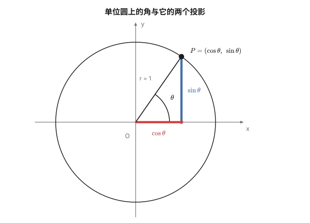
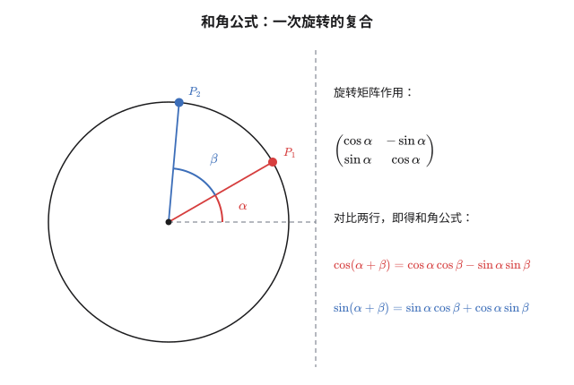
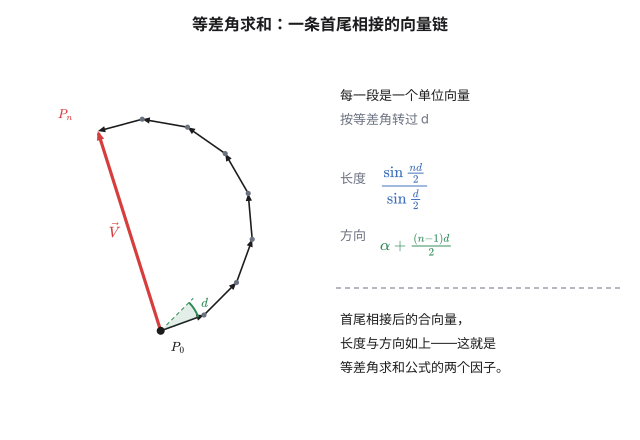
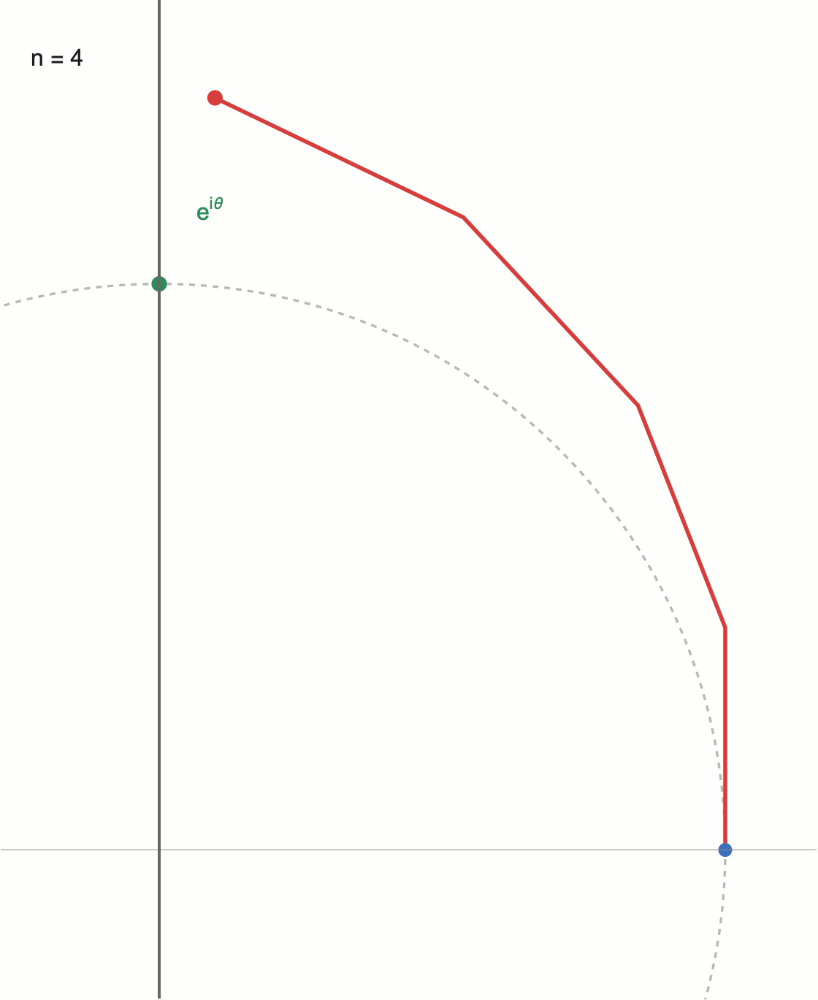
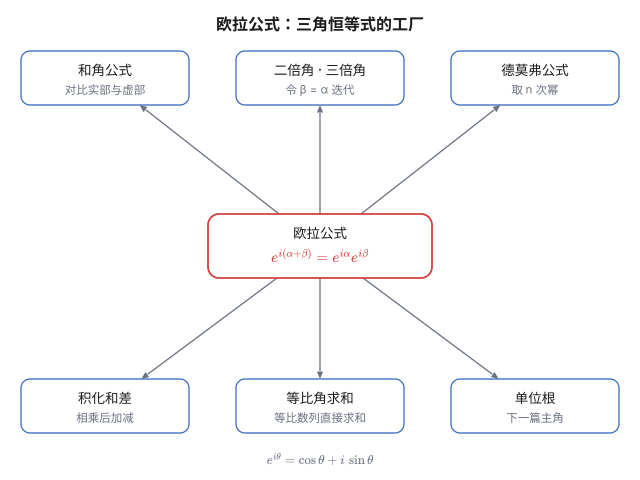

直角三角形里的 $\sin$ 和 $\cos$ 有个先天缺陷：它只认识锐角。

碰到 $720^\circ$（转了两圈的角）、$-30^\circ$、或者 $\frac{3\pi}{2}$，"对边比斜边"这套说法立刻失效——直角三角形里根本没有这样的角。可现实里的角从不满足于 $0^\circ$ 到 $90^\circ$：圆周运动、波动、交流电、量子力学里的相位，这些场景中的"角"是连续转动的量，可以无限大，也可以为负。

要容纳它们，只需要一个动作：**把三角形扔掉，改用单位圆重新定义**。定义换完之后，三角函数就不再是"三角形边长之比"，而是"圆周运动在两条坐标轴上的投影"。视角一换，接下来要讲的四件事——和角公式、等差角求和、切比雪夫多项式、欧拉公式——会全部变成同一个圆的不同侧脸。

## 一、单位圆：把角度还给圆周运动

在平面上画一个半径 $1$、圆心在原点的圆（**单位圆**）。从点 $(1,0)$ 出发，逆时针沿圆周走 $\theta$ 弧度，到达点 $P$。定义

$$P = (\cos\theta,\ \sin\theta)$$

$\cos\theta$ 是 $P$ 的横坐标，$\sin\theta$ 是纵坐标。就这样，没有三角形，没有"对边""邻边"，只有一个动点在圆上的两条影子。



这个定义把三件事一次性说清楚了：

**其一，$\sin^2\theta+\cos^2\theta=1$ 根本不是"三角恒等式"。** 它就是圆的方程 $x^2+y^2=1$，把 $P$ 的坐标代进去而已。以后每次用到它，你都可以想起这一点。

**其二，正负号是象限的产物。** $P$ 落在第二象限，横坐标自然为负；落在第三象限，两个投影都为负：

| 象限 | $\theta$ 范围 | $\sin\theta$ | $\cos\theta$ |
|---|---|---|---|
| 第一 | $(0,\ \frac\pi2)$ | $+$ | $+$ |
| 第二 | $(\frac\pi2,\ \pi)$ | $+$ | $-$ |
| 第三 | $(\pi,\ \frac{3\pi}2)$ | $-$ | $-$ |
| 第四 | $(\frac{3\pi}2,\ 2\pi)$ | $-$ | $+$ |

**其三，周期性是"绕圈"的直接后果。** 走完 $2\pi$ 回到起点，所以 $\sin(\theta+2\pi)=\sin\theta$。$720^\circ$ 不再是问题，它就是"转两圈"，和 $0^\circ$ 落在同一个点上。

顺带说一句**弧度制**为什么是"对"的度量：单位圆的半径是 $1$，所以弧长在数值上直接等于圆心角。弧度不是人为规定的单位，它是"角在单位圆上量出的弧长"。角由此变成实数，三角函数才真正成为实变量的函数。

## 二、和角公式，以及它的整个家族

单位圆视角下，$\cos(\alpha+\beta)$ 的推导短得不像话。

设 $P_1=(\cos\alpha,\sin\alpha)$，$P_2=(\cos\beta,\sin\beta)$。把 $P_2$ 逆时针旋转 $\alpha$，终点应当是角度 $\alpha+\beta$ 对应的点，即 $(\cos(\alpha+\beta),\sin(\alpha+\beta))$。用旋转矩阵作用一下：

$$\begin{pmatrix}\cos\alpha & -\sin\alpha\\ \sin\alpha & \cos\alpha\end{pmatrix}\begin{pmatrix}\cos\beta\\ \sin\beta\end{pmatrix}=\begin{pmatrix}\cos\alpha\cos\beta-\sin\alpha\sin\beta\\ \sin\alpha\cos\beta+\cos\alpha\sin\beta\end{pmatrix}$$

对比两行，得到**和角公式**：

$$\cos(\alpha+\beta)=\cos\alpha\cos\beta-\sin\alpha\sin\beta$$
$$\sin(\alpha+\beta)=\sin\alpha\cos\beta+\cos\alpha\sin\beta$$



**这两行是整门三角学的发动机。** 三角恒等式多如牛毛，但绝大多数不是各自独立的定理，而是从这里批量生产出来的零件：

| 想得到 | 怎么做 |
|---|---|
| 差角公式 | 把 $\beta$ 换成 $-\beta$ |
| 二倍角 | 令 $\beta=\alpha$ |
| 三倍角 | 用 $\alpha+2\alpha$ 迭代 |
| 半角公式 | 由 $\cos 2\theta=2\cos^2\theta-1$ 反解 |
| 和差化积 | 和角式与差角式相加/相减 |
| 积化和差 | 同上，反解 |
| 辅助角公式 | $a\sin\theta+b\cos\theta=\sqrt{a^2+b^2}\sin(\theta+\varphi)$ |

逐个验证一遍是很好的练习，但这里我想留意的是一件更隐蔽的事。

**万能代换。** 令 $t=\tan\frac\theta2$，由二倍角公式可以推出

$$\sin\theta=\frac{2t}{1+t^2},\qquad \cos\theta=\frac{1-t^2}{1+t^2},\qquad \tan\theta=\frac{2t}{1-t^2}$$

任何一个关于 $\sin\theta,\cos\theta$ 的有理式，代进去就变成关于 $t$ 的**有理函数**——积分里那个"万能"的名字就是这么来的。

但真正的意思在几何上：单位圆上的点可以写成

$$(\cos\theta,\ \sin\theta)=\left(\frac{1-t^2}{1+t^2},\ \frac{2t}{1+t^2}\right)$$

$t$ 取遍全体有理数时，得到的正是单位圆上的全部**有理点**。取 $t=1$ 得 $(0,1)$，取 $t=2$ 得 $(-\frac35,\frac45)$，取 $t=\frac12$ 得 $(\frac35,\frac45)$。这条参数化是数论里"勾股数"问题的入口：它说明为什么 $3^2+4^2=5^2$、$5^2+12^2=13^2$ 这样的整数直角三角形有无穷多组。一个三角学的代换技巧，背后站着一整个数论分支——这种感觉后面还会出现。

## 三、等差角求和：一条向量链的闭合

现在来看一个具体的求和问题。角度排成等差数列 $\alpha,\ \alpha+d,\ \alpha+2d,\ \dots,\ \alpha+(n-1)d$，求

$$S=\sum_{k=0}^{n-1}\sin(\alpha+kd)$$

直接算是没有出路的。但有一个极简的入口：**两边乘以 $\sin\frac d2$**。

用积化和差 $\sin A\sin B=\frac12\big[\cos(A-B)-\cos(A+B)\big]$：

$$\sin\frac d2\cdot\sin(\alpha+kd)=\frac12\left[\cos\left(\alpha+\left(k-\tfrac12\right)d\right)-\cos\left(\alpha+\left(k+\tfrac12\right)d\right)\right]$$

右边是"两个余弦之差"，而且每一项的**后一个余弦，正好是下一项的前一个余弦**。求和时它们首尾相消，只剩最外层的两个：

$$\sin\frac d2\cdot S=\frac12\left[\cos\left(\alpha-\tfrac d2\right)-\cos\left(\alpha+\left(n-\tfrac12\right)d\right)\right]$$

再用和差化积 $\cos A-\cos B=-2\sin\frac{A+B}2\sin\frac{A-B}2$，右边变成

$$\sin\frac{nd}2\cdot\sin\left(\alpha+\frac{(n-1)d}2\right)$$

两边除以 $\sin\frac d2$：

$$\boxed{\ \sum_{k=0}^{n-1}\sin(\alpha+kd)=\frac{\sin\frac{nd}2\ \sin\left(\alpha+\frac{(n-1)d}2\right)}{\sin\frac d2}\ }$$

**这就是等差角求和公式。** 同样的操作对余弦做一遍，结果只差一个函数名：

$$\sum_{k=0}^{n-1}\cos(\alpha+kd)=\frac{\sin\frac{nd}2\ \cos\left(\alpha+\frac{(n-1)d}2\right)}{\sin\frac d2}$$

现在换个思路，再看一遍这个公式。把每一项 $\sin(\alpha+kd)$ 理解为**一个单位向量在 $y$ 轴上的投影**。那么 $S$ 就是这 $n$ 个单位向量的合向量的纵坐标。而这 $n$ 个向量首尾相接，每个都相对前一个转过 $d$——它们拼成一条折线。



于是公式里的两个因子各有了名字：

- $\dfrac{\sin\frac{nd}2}{\sin\frac d2}$ ——**合向量的长度**。转角 $d$ 固定时，它随 $n$ 振荡，上界是 $\frac1{|\sin(d/2)|}$。
- $\alpha+\dfrac{(n-1)d}2$ ——**合向量的方向**，正好是所有角的平均值。

**合向量就是"弦"。** 这也解释了公式为什么会失效于 $d=2k\pi$：那时候所有向量同向，折线退化成一条直线，长度应当是 $n$，而分母 $\sin\frac d2=0$。公式在这一点需要取极限，极限值恰好是 $n$——用 $\sin x\approx x$ 一看就明白。

一个特例值得单独记下来。在余弦版里取 $\alpha=0,\ d=\theta$（项数 $n+1$），两边乘 $2$ 再减 $1$，就得到：

$$1+2\cos\theta+2\cos 2\theta+\cdots+2\cos n\theta=\frac{\sin\left(n+\frac12\right)\theta}{\sin\frac\theta2}$$

右边这个函数在分析学里叫 **Dirichlet 核**，是傅里叶级数收敛性讨论的核心工具。它还能更省力地推出来——把 $2\cos k\theta$ 写成 $e^{ik\theta}+e^{-ik\theta}$，然后对等比数列求和。这个"更省力"的方法，第五节会正式登场。

## 四、切比雪夫多项式：多倍角的代数化

和角公式还可以往另一个方向用：**把 $\cos n\theta$ 用 $\cos\theta$ 表示出来**。

$$\cos 2\theta=2\cos^2\theta-1$$
$$\cos 3\theta=4\cos^3\theta-3\cos\theta$$
$$\cos 4\theta=8\cos^4\theta-8\cos^2\theta+1$$

右边形如"$\cos\theta$ 的多项式"。既然规律如此整齐，就给它一个名字：令 $x=\cos\theta$，定义

$$T_n(x)=\cos(n\arccos x)\quad\text{或等价地}\quad T_n(\cos\theta)=\cos n\theta$$

这就是**切比雪夫多项式**（Chebyshev polynomial）。前几个是

$$T_0=1,\quad T_1=x,\quad T_2=2x^2-1,\quad T_3=4x^3-3x,\quad T_4=8x^4-8x^2+1$$

生成它们的规则短得出奇。把和角公式里的两式相加：

$$\cos(n+1)\theta+\cos(n-1)\theta=2\cos\theta\cos n\theta$$

翻译成 $T$ 的语言：

$$\boxed{\ T_{n+1}(x)=2x\,T_n(x)-T_{n-1}(x)\ }$$

这一行说明了三件事：$T_n$ 确实是多项式；系数全是整数（乘法和减法都不会引入分母）；$T_n$ 的次数是 $n$，首项系数是 $2^{n-1}$（$n\ge1$，每迭代一次最高次就多乘一个 $2x$）。

**极值性质。** 对任意 $x\in[-1,1]$，总存在 $\theta$ 使 $x=\cos\theta$，于是

$$|T_n(x)|=|\cos n\theta|\le 1$$

而且等号能取到：取 $\theta=\frac{k\pi}n$ 就有 $T_n(x)=(-1)^k$。所以在 $[-1,1]$ 上，$T_n$ 的图像被夹在 $y=\pm1$ 两条横线之间，在其中**来回摆动 $n$ 次**，两端 $\pm1$ 全部触到。

![切比雪夫多项式 T₁ 到 T₅ 在 [-1,1] 上的图像:每条曲线都被 ±1 两条横线夹住,且在区间内反复触碰上下边界](../../assets/img/chebyshev-graph.png)

**"切比雪夫不等式"——最小偏离。** 上面这个 $|T_n|\le1$ 还只是个上界，切比雪夫多项式真正值钱的是它在这个界上**最优**。

因为 $T_n$ 的首项系数是 $2^{n-1}$，所以

$$P(x)=2^{1-n}T_n(x)$$

是一个**首一**的 $n$ 次多项式，并且在 $[-1,1]$ 上有 $|P(x)|\le 2^{1-n}$。结论是：

> 在所有首一的 $n$ 次多项式中，$P$ 在 $[-1,1]$ 上的最大绝对值最小，且这个最小值就是 $2^{1-n}$。任何其他首一 $n$ 次多项式都不可能做得更好。

证明只有三行，但很漂亮。假设有另一个首一多项式 $Q$ 满足 $|Q(x)|<2^{1-n}$。考虑差

$$R(x)=2^{1-n}T_n(x)-Q(x)$$

两个首一多项式的差，次数不超过 $n-1$。而 $T_n$ 在 $x_k=\cos\frac{k\pi}n$（$k=0,1,\dots,n$）这 $n+1$ 个点上轮流取 $\pm1$，所以 $2^{1-n}T_n(x_k)=(-1)^k2^{1-n}$，符号交替。又因为 $|Q(x_k)|<2^{1-n}$，$R(x_k)$ 的符号必然跟着 $(-1)^k$ 走。**$n+1$ 个符号交替的点，意味着 $R$ 在这 $n$ 个相邻区间里各有一个零点**——即至少有 $n$ 个根。可 $\deg R\le n-1$，除非 $R\equiv0$，矛盾。

于是 $P$ 是最优的。这个性质在数值分析里是**切比雪夫逼近**和**切比雪夫节点**的起点：用多项式去逼近一个函数、或者用插值节点去压制误差时，最优的取点方案就藏在这里。

## 五、欧拉公式：把三角函数装进指数

到这里，三角函数一直被看成"圆周运动的投影"。但投影本身是可以写成指数的——这就是**欧拉公式**：

$$e^{i\theta}=\cos\theta+i\sin\theta$$

进入它的路至少有四条，每条通往的是同一件事。

**第一条：泰勒级数。** 把 $e^{i\theta}$ 按定义展开，$i$ 的幂每四次循环一次：

$$e^{i\theta}=\sum_{n\ge0}\frac{(i\theta)^n}{n!}=\underbrace{\sum_{k\ge0}\frac{(-1)^k\theta^{2k}}{(2k)!}}_{\cos\theta}+i\underbrace{\sum_{k\ge0}\frac{(-1)^k\theta^{2k+1}}{(2k+1)!}}_{\sin\theta}$$

实部虚部一分离，两个泰勒级数正好是 $\cos$ 和 $\sin$。

**第二条：极限。** 把 $e^{i\theta}$ 写成 $\lim_{n\to\infty}\left(1+\frac{i\theta}n\right)^n$。$1+\frac{i\theta}n$ 是一个很短的复数——长度略大于 $1$，辐角是 $\arctan\frac\theta n\approx\frac\theta n$。也就是"**把单位长度朝前转一点点**"。做 $n$ 步，每步转 $\frac\theta n$，总转角恰好是 $\theta$。



这条进路最直观：**$e^{i\theta}$ 是"无穷多步微旋转"的极限**。它顺手解释了指数函数为什么能描述旋转——因为乘法在这个语言里就是"转角相加"。

**第三条：微分方程。** 定义 $f(\theta)=\cos\theta+i\sin\theta$，求导得 $f'(\theta)=-\sin\theta+i\cos\theta=i(\cos\theta+i\sin\theta)=if(\theta)$，且 $f(0)=1$。满足 $f'=if$、$f(0)=1$ 的函数只有 $e^{i\theta}$ 一个。

**第四条：直接作为定义。** 干脆把 $e^{i\theta}:=\cos\theta+i\sin\theta$ 当作定义，反过来用指数函数的性质推三角函数。这是复分析里的标准做法。

### 恒等式工厂

欧拉公式最重要的用途不是"算数值"，而是它把整座三角恒等式工厂**压缩成了一行指数律**：

$$e^{i(\alpha+\beta)}=e^{i\alpha}e^{i\beta}$$

左边展开是 $\cos(\alpha+\beta)+i\sin(\alpha+\beta)$，右边展开后按实部虚部对比，出来的正是第二节那两条和角公式。**和角公式的本质是指数律**——那些让初学者头大的公式，在复数语言里只是"两个旋转复合等于两个角相加"。



这张图里每一条箭头都只需要一行推导：

| 恒等式 | 来源 |
|---|---|
| 和角公式 | $e^{i(\alpha+\beta)}=e^{i\alpha}e^{i\beta}$ 对比实虚部 |
| 二倍角 | 上式令 $\beta=\alpha$ |
| 德莫弗公式 | $(\cos\theta+i\sin\theta)^n=e^{in\theta}$ |
| 三倍角、四倍角 | 同上取 $n=3,4$ |
| 积化和差 | $e^{i\alpha}e^{i\beta}$ 与 $e^{i\alpha}e^{-i\beta}$ 相加相减 |
| 等比角求和 | $\sum e^{ikd}$ 是几何级数 |

反过来，三角函数也能从指数里解出来：

$$\cos\theta=\frac{e^{i\theta}+e^{-i\theta}}2,\qquad \sin\theta=\frac{e^{i\theta}-e^{-i\theta}}{2i}$$

### 用复指数重证等差角求和

拿第三节的公式来试刀。把每一项写成一个复数的虚部：

$$S=\operatorname{Im}\left[\sum_{k=0}^{n-1}e^{i(\alpha+kd)}\right]=\operatorname{Im}\left[e^{i\alpha}\sum_{k=0}^{n-1}\left(e^{id}\right)^k\right]$$

括号里是首项 $1$、公比 $e^{id}$ 的**等比数列**，用求和公式：

$$\sum_{k=0}^{n-1}\left(e^{id}\right)^k=\frac{e^{ind}-1}{e^{id}-1}$$

分子分母同时提半个角出来——$e^{ind}-1=e^{i\frac{nd}2}\left(e^{i\frac{nd}2}-e^{-i\frac{nd}2}\right)=2i\,e^{i\frac{nd}2}\sin\frac{nd}2$，分母同理：

$$\frac{e^{ind}-1}{e^{id}-1}=\frac{2i\,e^{i\frac{nd}2}\sin\frac{nd}2}{2i\,e^{i\frac d2}\sin\frac d2}=e^{i\frac{(n-1)d}2}\cdot\frac{\sin\frac{nd}2}{\sin\frac d2}$$

代回去取虚部：

$$S=\frac{\sin\frac{nd}2}{\sin\frac d2}\ \sin\left(\alpha+\frac{(n-1)d}2\right)$$

和第三节分毫不差。**望远镜法用了三重积化和差，复数法只用了等比求和**——这就是把三角函数装进指数之后拿到的利息。

用 Python 验算一下两个公式的吻合程度：

```python
import cmath, math

def by_formula(alpha, d, n):
    return math.sin(n*d/2) / math.sin(d/2) * math.sin(alpha + (n-1)*d/2)

def by_complex(alpha, d, n):
    return sum(cmath.exp(1j*(alpha + k*d)) for k in range(n)).imag

for alpha, d, n in [(0.3, 0.7, 20), (-1.2, 0.11, 77), (2.0, 1.9, 13)]:
    a, b = by_formula(alpha, d, n), by_complex(alpha, d, n)
    print(f"α={alpha:<5} d={d:<5} n={n:<3} 公式={a: .12f} 复数={b: .12f} 差={abs(a-b):.2e}")
```

```
α=0.3   d=0.7   n=20  公式= 1.185009320158 复数= 1.185009320158 差=1.55e-15
α=-1.2  d=0.11  n=77  公式=-2.599535739422 复数=-2.599535739422 差=7.11e-15
α=2.0   d=1.9   n=13  公式=-0.195408802326 复数=-0.195408802326 差=3.69e-15
```

两个截然不同的推导，数值上一致到机器精度。这正是数学里最舒服的那种确认。

## 尾声：同一个圆的三个面孔

回头看看这条路上经过的东西：

- **实数的面孔**：单位圆上动点的两个投影。三角函数、和角公式、等差角求和、切比雪夫多项式，都属于这一面。
- **复数的面孔**：单位圆上的旋转。$e^{i\theta}$ 让"转角的加法"变成"复数的乘法"，三角恒等式全部塌缩成指数律。
- **代数的面孔**：方程 $x^n=1$ 的根。它们均匀摊在单位圆上，把"圆"和"整数的因子分解"缝在了一起。

第三个面孔就是下一篇文章的主题。$e^{2\pi i/n}$ 这一个数，会带着我们走到分圆多项式、正十七边形，以及高斯 19 岁生日前一个月记下的那页日记。

## 相关阅读

- [欧拉公式与初等群论](https://www.bilibili.com/video/BV1fx41187tZ)（3Blue1Brown 官方双语）：从群论与"无穷多步微旋转"的视角讲 $e^{i\theta}$，与本文第五节第二条进路互补。
- 下一篇：《单位根与正十七边形》（[`post.html?id=roots-of-unity`](post.html?id=roots-of-unity)）

> [!detail] 技术细节
> **1. $T_n$ 首项系数的归纳证明。** $T_0=1$ 首项系数 $1$，$T_1=x$ 首项系数 $1=2^{1-1}$。设 $T_n$ 首项系数为 $2^{n-1}$、$T_{n-1}$ 为 $2^{n-2}$，则 $2xT_n$ 的首项系数为 $2\cdot2^{n-1}=2^n$；$T_{n-1}$ 的次数是 $n-1$，够不到第 $n$ 次，所以 $T_{n+1}$ 的首项系数就是 $2^n=2^{(n+1)-1}$，归纳成立。
>
> **2. 最小偏离性质中"至少 $n$ 个根"的细节。** $R(x_k)$ 与 $(-1)^k$ 同号，于是 $R(x_k)$ 与 $R(x_{k+1})$ 异号。在 $[x_{k+1},x_k]$ 上用介值定理，区间内必有零点。$k=0,\dots,n-1$ 给出 $n$ 个互不相交的区间，各含一个零点，共 $n$ 个。又 $\deg R\le n-1$ 而 $R\not\equiv0$ 时最多 $n-1$ 个根，矛盾。
>
> **3. 切比雪夫节点。** $P=2^{1-n}T_n$ 的极值点（$T_n'=0$ 处）为 $x=\cos\frac{k\pi}n$，$k=1,\dots,n-1$。把它们作为插值节点，可以使插值误差中的 $\prod(x-x_i)$ 因子在 $[-1,1]$ 上被最小化——这就是数值分析里"切比雪夫节点比等距节点好"的准确含义。等距节点会出现龙格现象，而切比雪夫节点不会。
>
> **4. 一个独立的验证：$\cos 5\theta$。** 由递推算出 $T_5=16x^5-20x^3+5x$。令 $x=\cos 36^\circ$，则 $\cos 180^\circ=-1$，于是 $16x^5-20x^3+5x+1=0$。分解得 $(x+1)(4x^2-2x-1)^2=0$，其中 $4x^2-2x-1=0$ 的正根为 $\frac{1+\sqrt5}4=\cos 36^\circ=\frac{\varphi}2$，而 $\varphi$ 正是黄金分割。一条从多倍角出发的路线，绕回了[《斐波那契数列与黄金分割》](post.html?id=fibonacci)里的那个常数。
>
> **5. 万能代换的几何来源。** $t=\tan\frac\theta2$ 之所以能参数化整个单位圆，是因为它等于"从点 $(-1,0)$ 向圆上点连线"的斜率。这条直线的斜率取遍全体实数（外加竖直的那条对应 $(-1,0)$ 本身），所以 $t\in\mathbb R\cup\{\infty\}$ 与圆周上的点一一对应。有理数 $t$ 给出有理点，这是"勾股数无限多"的几何解释。
