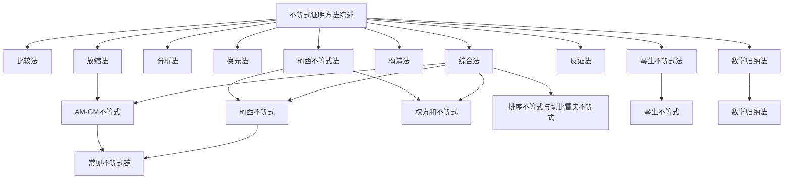

## 引言

不等式证明是初等数学与竞赛数学中的核心技能之一。面对形形色色的不等式题目，掌握系统的证明方法论远比死记硬背个别技巧更为重要。本文梳理了十大类不等式证明方法，与具体的不等式进行联动，形成完整的知识网络。

前置阅读：[[AM-GM不等式]] | [[柯西不等式]] | [[权方和不等式]] | [[排序不等式与切比雪夫不等式]] | [[琴生不等式]] | [[伯努利不等式]] | [[指数不等式]] | [[绝对值不等式]] | [[赫尔德不等式]] | [[明可夫斯基不等式]] | [[切线不等式]] | [[立方和不等式]] | [[舒尔不等式]] | [[反柯西不等式]] | [[卡尔松不等式]]

---

## 一、比较法（Comparison Method）

比较法是最基础、最直接的不等式证明方法，本质是将不等式证明转化为判定差的符号（作差法，Difference Method）或判定商与 $1$ 的大小关系（作商法，Quotient Method）。

### 1.1 作差法

**基本思路**：欲证 $A \geq B$，只需证 $A - B \geq 0$。

> [!要点]
> 作差后常用的变形技巧：因式分解、配方、通分、有理化等。

**例1** 已知 $a, b > 0$，求证：$a^3 + b^3 \geq a^2b + ab^2$。

**证明**：
$$
\begin{align}
a^3 + b^3 - (a^2b + ab^2) &= a^3 - a^2b + b^3 - ab^2 \\
&= a^2(a - b) - b^2(a - b) \\
&= (a - b)(a^2 - b^2) \\
&= (a - b)^2(a + b) \geq 0
\end{align}
$$
当且仅当 $a = b$ 时等号成立。$\square$

### 1.2 作商法

**基本思路**：当 $A, B > 0$ 时，欲证 $A \geq B$，只需证 $\dfrac{A}{B} \geq 1$。

**例2** 已知 $a, b > 0$，求证：$a^a b^b \geq a^b b^a$。

**证明**：不妨设 $a \geq b > 0$，则
$$
\frac{a^a b^b}{a^b b^a} = a^{a-b} \cdot b^{b-a} = \left(\frac{a}{b}\right)^{a-b}
$$
由 $a \geq b$ 知 $\dfrac{a}{b} \geq 1$ 且 $a - b \geq 0$，故 $\left(\dfrac{a}{b}\right)^{a-b} \geq 1$，即 $a^a b^b \geq a^b b^a$。$\square$

---

## 二、综合法（Synthetic Method）

**基本思路**：从已知成立的不等式（公理、定理、已证结论）出发，通过逻辑推导逐步推出待证不等式。即「由因导果」。

> [!核心思想]
> 综合法的关键在于选择合适的已知不等式作为「起点」，常见的有 [[AM-GM不等式]]、[[柯西不等式]]、[[排序不等式与切比雪夫不等式]] 等。

**例3** 已知 $a, b, c > 0$，求证：$\dfrac{a}{b+c} + \dfrac{b}{c+a} + \dfrac{c}{a+b} \geq \dfrac{3}{2}$。

**证明**（利用 [[柯西不等式]] 与 [[AM-GM不等式]]）：

由柯西不等式（或 [[权方和不等式]]）：
$$
\frac{a}{b+c} + \frac{b}{c+a} + \frac{c}{a+b} = \frac{a^2}{a(b+c)} + \frac{b^2}{b(c+a)} + \frac{c^2}{c(a+b)} \geq \frac{(a+b+c)^2}{2(ab+bc+ca)}
$$
又由熟知的不等式 $(a+b+c)^2 \geq 3(ab+bc+ca)$，代入得
$$
\frac{(a+b+c)^2}{2(ab+bc+ca)} \geq \frac{3(ab+bc+ca)}{2(ab+bc+ca)} = \frac{3}{2}
$$
从而原不等式得证。$\square$

---

## 三、分析法（Analytical Method）

**基本思路**：从待证结论出发，逐步寻找使其成立的充分条件，直至归结到一个已知成立的不等式。即「执果索因」。

> [!注意]
> 分析法的表述通常以「欲证……只需证……」的形式展开，逻辑方向是从结论追溯到条件。书写时注意每一步是 $\Leftarrow$ 而不是 $\Rightarrow$。

**例4** 已知 $a, b > 0$，求证：$\sqrt{\dfrac{a^2+b^2}{2}} \geq \dfrac{a+b}{2}$。

**证明**（分析法）：

欲证 $\sqrt{\dfrac{a^2+b^2}{2}} \geq \dfrac{a+b}{2}$，只需证
$$
\frac{a^2+b^2}{2} \geq \frac{(a+b)^2}{4}
$$
即 $2(a^2+b^2) \geq (a+b)^2$，展开得 $2a^2+2b^2 \geq a^2+2ab+b^2$，即 $a^2 - 2ab + b^2 \geq 0$，亦即 $(a-b)^2 \geq 0$，此为显然成立的事实。以上步步可逆，故原不等式成立。当且仅当 $a = b$ 时等号成立。$\square$

---

## 四、换元法（Substitution Method）

换元法通过引入新变量简化表达式结构，化陌生为熟悉，化复杂为简单。常见的有三角换元（Trigonometric Substitution）和代数换元（Algebraic Substitution）。

### 4.1 三角换元

当条件中出现 $a^2 + b^2 = 1$、$\sqrt{1 - x^2}$、$\sqrt{x^2 - 1}$ 等形式时，可考虑三角换元。

**例5** 已知 $x^2 + y^2 = 1$，求证：$|x+y| \leq \sqrt{2}$。

**证明**：令 $x = \cos\theta,\ y = \sin\theta$，则
$$
|x+y| = |\cos\theta + \sin\theta| = \sqrt{2}\left|\sin\left(\theta + \frac{\pi}{4}\right)\right| \leq \sqrt{2}
$$
当且仅当 $\sin(\theta+\frac{\pi}{4}) = \pm1$，即 $\theta = \frac{\pi}{4}$ 或 $\frac{5\pi}{4}$ 时等号成立。$\square$

### 4.2 代数换元

差分换元、倒数换元、均值换元等都是常见的代数换元技巧。

**例6** 已知 $a, b > 0$ 且 $a + b = 1$，求证：$\dfrac{1}{a} + \dfrac{1}{b} \geq 4$。

**证明**（均值换元）：令 $a = \dfrac{1}{2} + t,\ b = \dfrac{1}{2} - t$，其中 $|t| < \dfrac{1}{2}$，则
$$
\frac{1}{a} + \frac{1}{b} = \frac{1}{\frac{1}{2}+t} + \frac{1}{\frac{1}{2}-t} = \frac{1}{(\frac{1}{2})^2 - t^2} = \frac{4}{1 - 4t^2} \geq 4
$$
当且仅当 $t = 0$，即 $a = b = \dfrac{1}{2}$ 时等号成立。$\square$

---

## 五、放缩法（Scaling Method）

放缩法是通过适当地放大或缩小表达式的某些部分，使不等关系得以传递的证明方法。放缩要有方向性，过度放缩会导致无法取等。

### 5.1 裂项放缩（Telescoping）

**例7** 求证：$\dfrac{1}{1^2} + \dfrac{1}{2^2} + \dfrac{1}{3^2} + \cdots + \dfrac{1}{n^2} < 2$。

**证明**：当 $k \geq 2$ 时，
$$
\frac{1}{k^2} < \frac{1}{k(k-1)} = \frac{1}{k-1} - \frac{1}{k}
$$
于是
$$
\begin{align}
\sum_{k=1}^{n} \frac{1}{k^2} &= 1 + \sum_{k=2}^{n} \frac{1}{k^2} \\
&< 1 + \sum_{k=2}^{n}\left(\frac{1}{k-1} - \frac{1}{k}\right) \\
&= 1 + \left(1 - \frac{1}{n}\right) = 2 - \frac{1}{n} < 2
\end{align}
$$
$\square$

### 5.2 均值放缩

利用 [[AM-GM不等式]] 对各项进行适度放大或缩小。

**例8** 求证：$n! < \left(\dfrac{n+1}{2}\right)^n\ (n \geq 2)$。

**证明**：由 [[AM-GM不等式]]，
$$
\sqrt[n]{1 \cdot 2 \cdot 3 \cdots n} < \frac{1+2+3+\cdots+n}{n} = \frac{n(n+1)}{2n} = \frac{n+1}{2}
$$
（因各数不全相等，故不等号严格）。两边 $n$ 次方即得 $n! < \left(\dfrac{n+1}{2}\right)^n$。$\square$

---

## 六、构造法（Construction Method）

构造法是根据题目条件构造适当的辅助函数、几何图形或数列，将对不等式的证明转化为对所构造对象的性质分析。

### 6.1 构造函数（Constructing Functions）

**例9** 求证：$\ln(1+x) \leq x\ (x > -1)$。

**证明**：构造函数 $f(x) = \ln(1+x) - x\ (x > -1)$，则
$$
f'(x) = \frac{1}{1+x} - 1 = -\frac{x}{1+x}
$$
当 $-1 < x < 0$ 时，$f'(x) > 0$，$f(x)$ 单调递增；
当 $x > 0$ 时，$f'(x) < 0$，$f(x)$ 单调递减。
故 $f(x) \leq f(0) = 0$，即 $\ln(1+x) \leq x$，当且仅当 $x = 0$ 时等号成立。$\square$

### 6.2 构造几何图形

**例10** 已知 $a, b > 0$，求证：$\sqrt{a^2+b^2} \geq \dfrac{a+b}{\sqrt{2}}$。

**证明**（几何法）：考虑直角边长为 $a, b$ 的直角三角形，其斜边长为 $\sqrt{a^2+b^2}$。在同一平面内作以 $a, b$ 为直角边的等腰直角三角形，其斜边长也为 $\sqrt{a^2+b^2}$。由向量内积性质：$(a,b)\cdot(1,1) = a+b \leq \sqrt{a^2+b^2}\cdot\sqrt{2}$，
即 $\sqrt{a^2+b^2} \geq \dfrac{a+b}{\sqrt{2}}$。当且仅当 $a = b$ 时等号成立。$\square$

---

## 七、数学归纳法（Mathematical Induction）

对于与正整数 $n$ 有关的不等式，数学归纳法是强有力的工具。详见 [[数学笔记/高中数学/数列/数学归纳法]]。

**基本格式**：
1. **奠基**：验证 $n = n_0$ 时命题成立；
2. **递推**：假设 $n = k$ 时成立，推出 $n = k+1$ 时成立。

**例11** 求证：$2^n > n^2\ (n \geq 5,\ n \in \mathbb{N})$。

**证明**：
- 当 $n = 5$ 时，$2^5 = 32 > 25 = 5^2$，成立。
- 假设 $n = k\ (k \geq 5)$ 时成立，即 $2^k > k^2$，则
  $$
  2^{k+1} = 2 \cdot 2^k > 2k^2 = k^2 + k^2 \geq k^2 + 5k > k^2 + 2k + 1 = (k+1)^2
  $$
  （当 $k \geq 5$ 时，$k^2 \geq 5k$ 且 $5k > 2k+1$）

故 $n = k+1$ 时也成立。由数学归纳法，对一切 $n \geq 5$ 有 $2^n > n^2$。$\square$

---

## 八、反证法（Proof by Contradiction）

当直接证明困难，或结论以否定形式出现时，可考虑反证法。

**基本思路**：假设结论不成立，推出矛盾，从而原结论成立。

**例12** 已知 $a, b, c > 0$，求证：$a + \dfrac{1}{b},\ b + \dfrac{1}{c},\ c + \dfrac{1}{a}$ 中至少有一个不小于 $2$。

**证明**（反证法）：假设这三个数全都小于 $2$，即
$$
a + \frac{1}{b} < 2,\quad b + \frac{1}{c} < 2,\quad c + \frac{1}{a} < 2
$$
三式相加得
$$
(a+b+c) + \left(\frac{1}{a}+\frac{1}{b}+\frac{1}{c}\right) < 6
$$
但由 [[AM-GM不等式]]，
$$
a + \frac{1}{a} \geq 2,\quad b + \frac{1}{b} \geq 2,\quad c + \frac{1}{c} \geq 2
$$
三式相加得 $(a+b+c) + \left(\dfrac{1}{a}+\dfrac{1}{b}+\dfrac{1}{c}\right) \geq 6$，与假设矛盾。故原命题成立。$\square$

---

## 九、柯西不等式法（Cauchy-Schwarz Method）

[[柯西不等式]] 是处理「平方和」与「线性组合」关系的最强工具之一，在对称不等式中尤其高效。

**例13** 已知 $a, b, c > 0$，求证：$\dfrac{a^2}{b} + \dfrac{b^2}{c} + \dfrac{c^2}{a} \geq a + b + c$。

**证明**：由 [[柯西不等式]]（或 [[权方和不等式]]），
$$
\frac{a^2}{b} + \frac{b^2}{c} + \frac{c^2}{a} \geq \frac{(a+b+c)^2}{a+b+c} = a+b+c
$$
当且仅当 $a = b = c$ 时等号成立。$\square$

**例14** 已知 $x, y, z > 0$ 且 $x+y+z = 1$，求证：$\sqrt{2x+1} + \sqrt{2y+1} + \sqrt{2z+1} \leq \sqrt{15}$。

**证明**：由 [[柯西不等式]]，
$$
\begin{align}
(\sqrt{2x+1} + \sqrt{2y+1} + \sqrt{2z+1})^2 &\leq (1^2+1^2+1^2)\big((2x+1)+(2y+1)+(2z+1)\big) \\
&= 3 \cdot \big(2(x+y+z) + 3\big) \\
&= 3 \cdot (2 + 3) = 15
\end{align}
$$
两边开方即得证。当且仅当 $x = y = z = \dfrac{1}{3}$ 时等号成立。$\square$

---

## 十、琴生不等式法（Jensen's Inequality Method）

[[琴生不等式]] 是处理与凸函数（Convex Function）相关不等式的利器。只需确定函数的凸性，不等式便水到渠成。

**基本形式**：若 $f(x)$ 在区间 $I$ 上是下凸函数（即 $f''(x) \geq 0$），则
$$
\color{Red}{f\left(\frac{x_1+x_2+\cdots+x_n}{n}\right) \leq \frac{f(x_1)+f(x_2)+\cdots+f(x_n)}{n}}
$$

**例15** 在 $\triangle ABC$ 中，求证：$\sin A + \sin B + \sin C \leq \dfrac{3\sqrt{3}}{2}$。

**证明**：令 $f(x) = \sin x,\ x \in (0, \pi)$，则 $f''(x) = -\sin x < 0$，故 $f(x)$ 是 $(0, \pi)$ 上的上凸函数。由 [[琴生不等式]]，
$$
\frac{\sin A + \sin B + \sin C}{3} \leq \sin\left(\frac{A+B+C}{3}\right) = \sin\frac{\pi}{3} = \frac{\sqrt{3}}{2}
$$
故 $\sin A + \sin B + \sin C \leq \dfrac{3\sqrt{3}}{2}$，当且仅当 $A = B = C = \dfrac{\pi}{3}$ 时等号成立。$\square$

---

## 十一、常见不等式链（Inequality Chain）

对于 $n$ 个正实数 $a_1, a_2, \ldots, a_n$，有以下经典的不等式链 (均值不等式链)：

$$
\color{Red}{\underbrace{\frac{n}{\frac{1}{a_1} + \frac{1}{a_2} + \cdots + \frac{1}{a_n}}}_{\text{调和平均 }H_n} \leq \underbrace{\sqrt[n]{a_1 a_2 \cdots a_n}}_{\text{几何平均 }G_n} \leq \underbrace{\frac{a_1 + a_2 + \cdots + a_n}{n}}_{\text{算术平均 }A_n} \leq \underbrace{\sqrt{\frac{a_1^2 + a_2^2 + \cdots + a_n^2}{n}}}_{\text{平方平均 }Q_n}}
$$

即

$$
H_n \leq G_n \leq A_n \leq Q_n
$$

- **调和平均** (Harmonic Mean)：$H_n = \dfrac{n}{\sum_{i=1}^{n} \frac{1}{a_i}}$
- **几何平均** (Geometric Mean)：$G_n = \sqrt[n]{\prod_{i=1}^{n} a_i}$ — 参见 [[AM-GM不等式]]
- **算术平均** (Arithmetic Mean)：$A_n = \dfrac{1}{n}\sum_{i=1}^{n} a_i$
- **平方平均** (Quadratic Mean / RMS)：$Q_n = \sqrt{\dfrac{1}{n}\sum_{i=1}^{n} a_i^2}$

所有等号当且仅当 $a_1 = a_2 = \cdots = a_n$ 时同时成立。

> [!注记]
> $A_n \leq Q_n$ 可以由 [[柯西不等式]] 直接推出：$\sum a_i \leq \sqrt{n \sum a_i^2}$。

---

## 十二、策略选择指南（Strategy Guide）

以下根据不等式的结构特征推荐优先尝试的证明方法：

| 题目特征 | 推荐方法 | 优先级 |
|:---|:---|:---:|
| 可化为 $A - B$ 的结构清晰 | **比较法**（作差法） | ⭐⭐⭐ |
| 各项均为正数，乘积/指数形式 | **比较法**（作商法） | ⭐⭐⭐ |
| 条件中已有已知不等式可直接变形 | **综合法** | ⭐⭐⭐ |
| 结论较复杂，不知从何下手 | **分析法** (逆推) | ⭐⭐⭐ |
| 出现 $a^2+b^2=1$、$\sqrt{1-x^2}$ 等形式 | **换元法**（三角换元） | ⭐⭐ |
| 出现 $a+b=1$ 等线性约束 | **换元法**（均值/差分换元） | ⭐⭐ |
| 求和不等式，项数多，需「夹逼」 | **放缩法**（裂项放缩） | ⭐⭐ |
| 出现乘积或和的形式，整体放缩 | **放缩法**（均值放缩） | ⭐⭐ |
| 与单调性、极值、导数相关 | **构造法**（构造函数） | ⭐⭐ |
| 几何背景明显（距离、角度等） | **构造法**（几何构造） | ⭐⭐ |
| 含 $n$ 的命题，「对于一切正整数…」 | **数学归纳法** | ⭐⭐ |
| 结论以「至少」「至多」「存在」等形式表述 | **反证法** | ⭐⭐ |
| 含 $\sum a_i^2 \sum b_i^2$ 结构或分式和 | **柯西不等式法** | ⭐⭐⭐ |
| 函数有明显的凸性，变量在凸区间内 | **琴生不等式法** | ⭐⭐ |
| 对称轮换不等式（齐次且对称） | 综合法 / [[柯西不等式]] / [[AM-GM不等式]] | ⭐⭐⭐ |
| 非对称或有序列条件的不等式 | [[排序不等式与切比雪夫不等式]] | ⭐⭐ |

> [!策略小结]
> 一般来说，拿到一道不等式证明题，可按以下顺序尝试：
> 1. 先看能否 **作差/作商**（比较法）直接处理；
> 2. 观察结构是否匹配某个 **已知不等式**（柯西、AM-GM、排序等），若匹配则直接用综合法；
> 3. 如有变量约束条件，考虑 **换元** 消去约束；
> 4. 若与 $n$ 有关，优先考虑 **数学归纳法**；
> 5. 若函数特征明显（指数、对数、三角），考虑 **构造函数** 或 **琴生不等式**；
> 6. 走投无路时，**分析法** 逆推往往能打开思路。

---

## 知识图谱

**相关笔记**：
- [[柯西不等式]] — Cauchy-Schwarz Inequality
- [[AM-GM不等式]] — Arithmetic-Geometric Mean Inequality
- [[权方和不等式]] — Power Mean Inequality (权方和形式)
- [[排序不等式与切比雪夫不等式]] — Rearrangement & Chebyshev Inequalities
- [[琴生不等式]] — Jensen's Inequality
- [[数学笔记/高中数学/数列/数学归纳法]] — Mathematical Induction