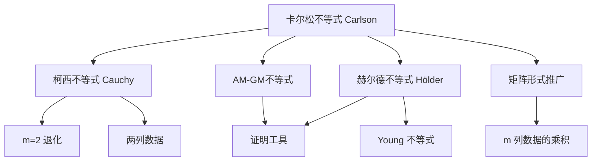

## 卡尔松不等式 (Carlson's Inequality)

卡尔松不等式是[[柯西不等式]]在矩阵形式下的推广——将两列数据的乘积推广到 $m$ 列数据的乘积。当 $m = 2$ 时，卡尔松不等式退化为经典的[[柯西不等式]]。

> [!关键]
> 柯西处理「两列」：$(\sum a_i^2)(\sum b_i^2) \geq (\sum a_i b_i)^2$
> 卡尔松处理「$m$ 列」：$\prod_{j=1}^m (\sum_{i=1}^n a_{ij}) \geq (\sum_{i=1}^n \sqrt[m]{\prod_{j=1}^m a_{ij}})^m$

---

## 一、基本形式

### 1.1 矩阵形式（一般形式）

设 $n \times m$ 矩阵 $a_{ij} \geq 0$（$i = 1, 2, \ldots, n$；$j = 1, 2, \ldots, m$），则：

$$
\color{Red}{\prod_{j=1}^{m} \left( \sum_{i=1}^{n} a_{ij} \right) \geq \left( \sum_{i=1}^{n} \sqrt[m]{\prod_{j=1}^{m} a_{ij}} \right)^m}
$$

即：

$$
\color{Red}{\left( \sum_{i=1}^{n} \sqrt[m]{a_{i1} a_{i2} \cdots a_{im}} \right)^m \leq \prod_{j=1}^{m} \left( \sum_{i=1}^{n} a_{ij} \right)}
$$

当且仅当每一列的元素成比例（即矩阵各行成比例）时等号成立。

> [!直观理解]
> 左边：先对每行取几何平均（$m$ 次根号），再求和，最后 $m$ 次方。
> 右边：先对每列求和，再把 $m$ 个列和相乘。
> 卡尔松不等式断言：**列和的乘积 ≥ 行几何平均和的 $m$ 次方**。

### 1.2 二维形式（$m = 2$）— 退化到柯西

当 $m = 2$ 时，记 $a_{i1} = a_i$，$a_{i2} = b_i$：

$$
\begin{align}
\left( \sum_{i=1}^{n} \sqrt{a_i b_i} \right)^2 &\leq \left( \sum_{i=1}^{n} a_i \right) \left( \sum_{i=1}^{n} b_i \right)
\end{align}
$$

这正是[[柯西不等式]]的等价形式（令 $a_i = x_i^2$，$b_i = y_i^2$ 即得标准形式）。换言之，卡尔松不等式是柯西不等式的「多列版本」。

---

## 二、与赫尔德不等式和 AM-GM 的联系

卡尔松不等式的证明强烈依赖于[[赫尔德不等式]]或 [[AM-GM不等式]]，体现了不等式体系的内在统一性。

### 2.1 利用 AM-GM 证明的直觉

对于 $m = 3$ 的情形，我们可以这样理解：

将 $\prod_{j=1}^{3} (\sum_{i=1}^{n} a_{ij})$ 展开为 $n^3$ 项的乘积和。对每个固定的 $i$，从三列中各取一项 $a_{i1}, a_{i2}, a_{i3}$，它们的几何平均 $\sqrt[3]{a_{i1} a_{i2} a_{i3}}$ 被 AM-GM 控制。通过系统地应用 AM-GM 不等式，可以得到卡尔松不等式。

### 2.2 利用赫尔德不等式证明

**证明思路**（以 $m=3$ 为例）：

我们需要证明：

$$
\left( \sum_{i=1}^{n} \sqrt[3]{a_i b_i c_i} \right)^3 \leq \left( \sum_{i=1}^{n} a_i \right) \left( \sum_{i=1}^{n} b_i \right) \left( \sum_{i=1}^{n} c_i \right)
$$

记 $S = \sum_{i=1}^{n} \sqrt[3]{a_i b_i c_i}$。将左边写成：

$$
S^3 = S \cdot S \cdot S
$$

利用[[赫尔德不等式]]（取 $p = 3, q = \frac{3}{2}$ 两次），或更直接地，对 $S$ 中的每一项进行拆分。将 $\sqrt[3]{a_i b_i c_i}$ 视为 $a_i^{1/3} \cdot b_i^{1/3} \cdot c_i^{1/3}$，则：

$$
\begin{align}
\sum_{i=1}^{n} a_i^{1/3} b_i^{1/3} c_i^{1/3}
&= \sum_{i=1}^{n} \left( a_i^{1/3} b_i^{1/3} \right) \cdot c_i^{1/3} \\
&\leq \left( \sum_{i=1}^{n} (a_i^{1/3} b_i^{1/3})^{3/2} \right)^{2/3} \left( \sum_{i=1}^{n} c_i \right)^{1/3} \quad \text{(Hölder, } p=3/2, q=3\text{)} \\
&= \left( \sum_{i=1}^{n} a_i^{1/2} b_i^{1/2} \right)^{2/3} \left( \sum_{i=1}^{n} c_i \right)^{1/3}
\end{align}
$$

再对 $\sum a_i^{1/2} b_i^{1/2}$ 应用柯西不等式（或赫尔德 $p=q=2$）：

$$
\sum_{i=1}^{n} a_i^{1/2} b_i^{1/2} \leq \left( \sum_{i=1}^{n} a_i \right)^{1/2} \left( \sum_{i=1}^{n} b_i \right)^{1/2}
$$

代入即得：

$$
\sum_{i=1}^{n} \sqrt[3]{a_i b_i c_i} \leq \left( \sum a_i \right)^{1/3} \left( \sum b_i \right)^{1/3} \left( \sum c_i \right)^{1/3}
$$

两边三次方即得 $m=3$ 的卡尔松不等式。对于一般的 $m$，可用归纳法推广。$\blacksquare$

---

## 三、证明（一般形式）

**证明**（利用 AM-GM 不等式归一化法）：

设 $S_j = \sum_{i=1}^{n} a_{ij}$（$j = 1, 2, \ldots, m$）。令 $x_{ij} = \dfrac{a_{ij}}{S_j}$，则 $\sum_{i=1}^{n} x_{ij} = 1$。

由 AM-GM 不等式（加权），对每个 $i$：

$$
\sqrt[m]{\prod_{j=1}^{m} x_{ij}} \leq \frac{1}{m} \sum_{j=1}^{m} x_{ij}
$$

对所有 $i$ 求和：

$$
\sum_{i=1}^{n} \sqrt[m]{\prod_{j=1}^{m} x_{ij}} \leq \frac{1}{m} \sum_{j=1}^{m} \sum_{i=1}^{n} x_{ij} = \frac{1}{m} \sum_{j=1}^{m} 1 = 1
$$

即：

$$
\sum_{i=1}^{n} \sqrt[m]{\prod_{j=1}^{m} \frac{a_{ij}}{S_j}} \leq 1
$$

提取分母：

$$
\frac{1}{\sqrt[m]{\prod_{j=1}^{m} S_j}} \sum_{i=1}^{n} \sqrt[m]{\prod_{j=1}^{m} a_{ij}} \leq 1
$$

两边 $m$ 次方，整理即得：

$$
\left( \sum_{i=1}^{n} \sqrt[m]{\prod_{j=1}^{m} a_{ij}} \right)^m \leq \prod_{j=1}^{m} S_j = \prod_{j=1}^{m} \left( \sum_{i=1}^{n} a_{ij} \right)
$$

证明完毕。$\blacksquare$

---

## 四、例题

**例题**（$m=3$ 情形）：已知 $a_i, b_i, c_i > 0$（$i = 1, 2, \ldots, n$），证明：

$$
\left( \sum_{i=1}^{n} \sqrt[3]{a_i b_i c_i} \right)^3 \leq \left( \sum_{i=1}^{n} a_i \right) \left( \sum_{i=1}^{n} b_i \right) \left( \sum_{i=1}^{n} c_i \right)
$$

**证明**：直接应用卡尔松不等式，取 $m = 3$，矩阵的三列分别为 $(a_1, a_2, \ldots, a_n)^T$，$(b_1, b_2, \ldots, b_n)^T$，$(c_1, c_2, \ldots, c_n)^T$。

代入卡尔松不等式的矩阵形式：

$$
\prod_{j=1}^{3} \left( \sum_{i=1}^{n} a_{ij} \right) \geq \left( \sum_{i=1}^{n} \sqrt[3]{\prod_{j=1}^{3} a_{ij}} \right)^3
$$

即：

$$
\left( \sum_{i=1}^{n} a_i \right) \left( \sum_{i=1}^{n} b_i \right) \left( \sum_{i=1}^{n} c_i \right) \geq \left( \sum_{i=1}^{n} \sqrt[3]{a_i b_i c_i} \right)^3
$$

当且仅当 $\dfrac{a_i}{a_j} = \dfrac{b_i}{b_j} = \dfrac{c_i}{c_j}$（即各行成比例）时等号成立。$\square$

---

## 五、知识图谱

**相关笔记**：
- [[柯西不等式]] — $m=2$ 时的退化情形
- [[AM-GM不等式]] — 证明卡尔松不等式的核心工具之一
- [[赫尔德不等式]] — 另一条证明路径，二者相互推导
- [[权方和不等式]] — 同属柯西系不等式家族
- [[排序不等式与切比雪夫不等式]] — 不等式体系的排序工具