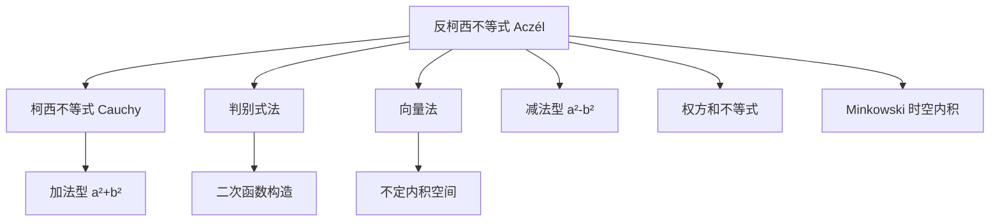

## 反柯西不等式 (Aczél Inequality / Reverse Cauchy Inequality)

反柯西不等式（也称 Aczél 不等式 / Popoviciu 不等式）是[[柯西不等式]]的「减法版本」。柯西处理的是 $a^2 + b^2$ 型结构，而反柯西处理的是 $a^2 - b^2$ 型结构，两者在形式上形成镜像对称。

> [!关键]
> 柯西：$(a_1^2+a_2^2)(b_1^2+b_2^2) \geq (a_1b_1+a_2b_2)^2$（加法型）
> 反柯西：$(a_1^2-a_2^2)(b_1^2-b_2^2) \leq (a_1b_1-a_2b_2)^2$（减法型）

---

## 一、基本形式

### 1.1 一般形式（$n$ 维）

设 $a_1, a_2, \ldots, a_n$ 与 $b_1, b_2, \ldots, b_n$ 为实数，且满足：

$$
a_1^2 > \sum_{i=2}^{n} a_i^2, \quad b_1^2 > \sum_{i=2}^{n} b_i^2
$$

则有：

$$
\color{Red}{\left( a_1^2 - \sum_{i=2}^{n} a_i^2 \right) \left( b_1^2 - \sum_{i=2}^{n} b_i^2 \right) \leq \left( a_1 b_1 - \sum_{i=2}^{n} a_i b_i \right)^2}
$$

当且仅当 $\dfrac{a_1}{b_1} = \dfrac{a_2}{b_2} = \cdots = \dfrac{a_n}{b_n}$ 时等号成立。

> [!直观理解]
> 柯西不等式中的「平方和」被替换为「首项平方减去其余平方和」，不等号方向恰好反转。

### 1.2 二维简化形式

最常见的二维形式为：

$$
\color{Red}{(a^2 - b^2)(c^2 - d^2) \leq (ac - bd)^2}
$$

其中 $|a| > |b|$ 且 $|c| > |d|$（保证左边每个括号为正）。

---

## 二、与柯西不等式的对比

| 特征 | 柯西不等式 (Cauchy) | 反柯西不等式 (Aczél) |
|:---|:---|:---|
| 结构类型 | $a^2 + b^2$ 型（加法） | $a^2 - b^2$ 型（减法） |
| 不等号方向 | $\geq$ | $\leq$ |
| 前提条件 | 无需额外条件 | 需 $a_1^2 > \sum_{i=2}^n a_i^2$ 等 |
| 二维形式 | $(a^2+b^2)(c^2+d^2) \geq (ac+bd)^2$ | $(a^2-b^2)(c^2-d^2) \leq (ac-bd)^2$ |
| 等号条件 | $ad = bc$ | $\dfrac{a}{c} = \dfrac{b}{d}$（比例相同） |

---

## 三、证明

### 3.1 判别式法（二次函数法）

**证明二维形式** $(a^2 - b^2)(c^2 - d^2) \leq (ac - bd)^2$（其中 $|a| > |b|, |c| > |d|$）：

构造二次函数：

$$
f(x) = (a^2 - b^2)x^2 - 2(ac - bd)x + (c^2 - d^2)
$$

将其重写为：

$$
f(x) = (ax - c)^2 - (bx - d)^2
$$

由于 $|a| > |b|$，当 $x \to \pm\infty$ 时 $f(x) \to +\infty$。我们考察 $f(x)$ 的判别式：

$$
\Delta = 4(ac - bd)^2 - 4(a^2 - b^2)(c^2 - d^2)
$$

另一方面，注意到 $f\left(\dfrac{c}{a}\right)$ 的值：

$$
\begin{align}
f\left(\frac{c}{a}\right) &= \left(a \cdot \frac{c}{a} - c\right)^2 - \left(b \cdot \frac{c}{a} - d\right)^2 \\
&= 0 - \left( \frac{bc - ad}{a} \right)^2 \leq 0
\end{align}
$$

由于 $a^2 - b^2 > 0$，二次函数 $f(x)$ 开口向上，且存在一个点 $x_0 = \dfrac{c}{a}$ 使得 $f(x_0) \leq 0$，因此 $f(x)$ 必有实根，即判别式 $\Delta \geq 0$：

$$
4(ac - bd)^2 - 4(a^2 - b^2)(c^2 - d^2) \geq 0
$$

整理即得：

$$
(a^2 - b^2)(c^2 - d^2) \leq (ac - bd)^2
$$

当且仅当 $f\left(\dfrac{c}{a}\right) = 0$，即 $\dfrac{b}{a} = \dfrac{d}{c}$（$ad = bc$）时等号成立。$\blacksquare$

### 3.2 向量法（几何直观）

将 $(a, b)$ 和 $(c, d)$ 视为二维向量。考虑双曲型内积。定义 Minkowski 时空中的内积：

$$
\langle \mathbf{u}, \mathbf{v} \rangle = u_1 v_1 - u_2 v_2
$$

则 $\langle (a,b), (a,b) \rangle = a^2 - b^2 > 0$，$\langle (c,d), (c,d) \rangle = c^2 - d^2 > 0$。

反柯西不等式即是在这种不定内积（indefinite inner product）下的 Cauchy-Schwarz 不等式的反向形式，其不等号反转源于度量张量的不定号性。$\blacksquare$

---

## 四、例题

**例题 1**：已知 $a^2 > b^2 + c^2$，$x^2 > y^2 + z^2$，证明：

$$
(a^2 - b^2 - c^2)(x^2 - y^2 - z^2) \leq (ax - by - cz)^2
$$

**证明**：这是 $n=3$ 时的反柯西不等式。直接应用一般形式：

令 $a_1 = a, a_2 = b, a_3 = c$，$b_1 = x, b_2 = y, b_3 = z$。前提条件 $a^2 > b^2 + c^2$ 和 $x^2 > y^2 + z^2$ 满足反柯西不等式的条件，代入即得：

$$
(a^2 - b^2 - c^2)(x^2 - y^2 - z^2) \leq (ax - by - cz)^2
$$

当且仅当 $\dfrac{a}{x} = \dfrac{b}{y} = \dfrac{c}{z}$ 时等号成立。$\square$

**例题 2**：已知 $|a| > \sqrt{2}$，$|b| > \sqrt{3}$，求证：$(a^2 - 2)(b^2 - 3) \leq (ab - \sqrt{6})^2$。

**证明**：在二维反柯西不等式中，令 $a_1 = a, a_2 = \sqrt{2}$，$b_1 = b, b_2 = \sqrt{3}$，则：

$$
(a^2 - 2)(b^2 - 3) \leq (ab - \sqrt{6})^2
$$

当且仅当 $\dfrac{a}{\sqrt{2}} = \dfrac{b}{\sqrt{3}}$ 时等号成立。$\square$

---

## 五、知识图谱

**相关笔记**：
- [[柯西不等式]] — 加法型对应，两者互为镜像
- [[权方和不等式]] — 同属柯西系不等式族
- [[排序不等式与切比雪夫不等式]] — 不等式工具链
- [[琴生不等式]] — 凸函数视角下的不等式