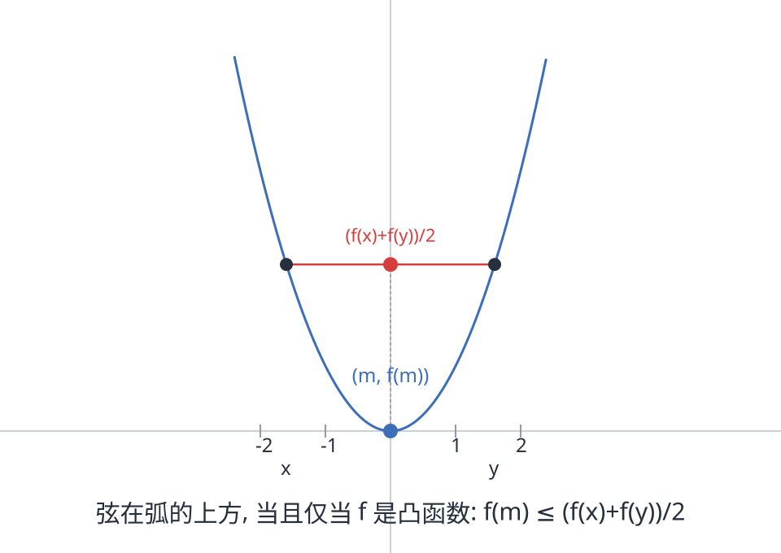
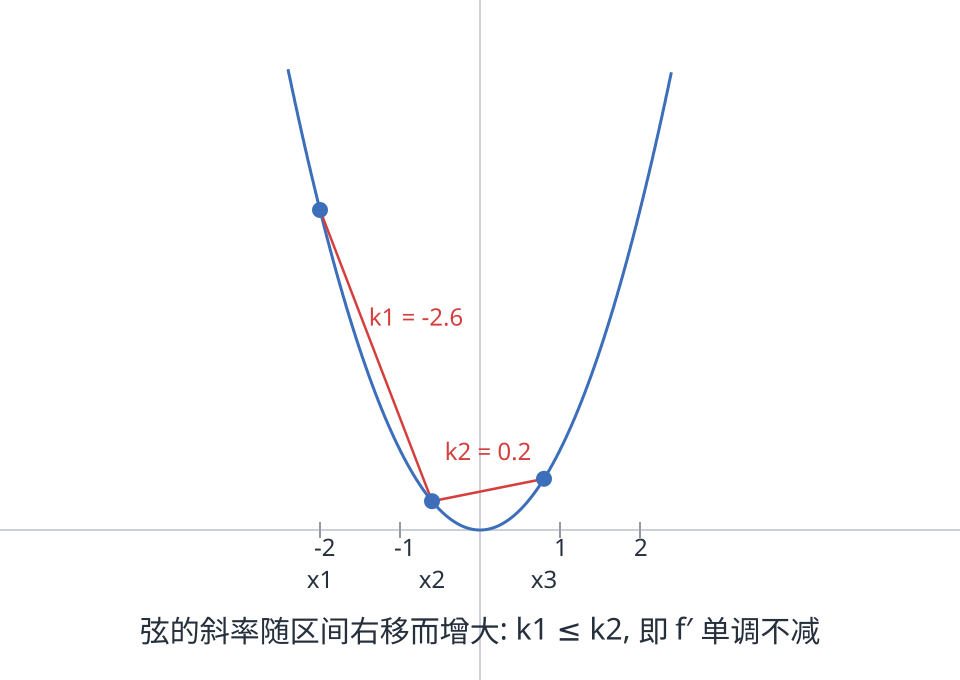
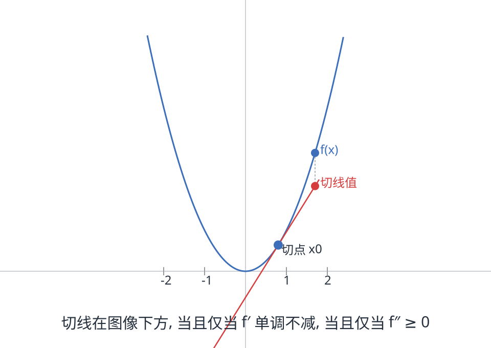

"平均的函数"和"函数的平均"，哪个更大？对一般的函数没有定论，但**凸函数**给出了一边倒的答案：

> 对凸函数 $f$：$f(\text{平均}) \le \text{平均}(f)$。

这就是**琴生不等式**（Jensen's inequality，1906）。它也许是"所有不等式之母"：AM-GM、幂平均、柯西、赫尔德……许多经典不等式都是它的特例或推论。这篇文章从几何直觉出发，给出两种证明与四道例题，最后落到二阶导判据——那是做题时最常用的入口。

## 一、凸函数：弦在弧的上方

从两个点说起。设 $x < y$，取中点 $m = \frac{x+y}{2}$，绝大多数"正常"函数满足

$$f(m) \le \frac{f(x) + f(y)}{2}$$

——中点处的函数值，不超过两端函数值的平均。几何上看：**连接图像上两点的弦，躺在弧的上方**。对任意两点都满足这个性质（或用更一般的分点 $\lambda$）的函数叫**凸函数**：

$$f\big(\lambda x + (1-\lambda)y\big) \le \lambda f(x) + (1-\lambda) f(y), \qquad 0 \le \lambda \le 1$$

中点是 $\lambda = \frac12$ 的特例；反过来，反复取中点（二分）可以逼近任意分点，取极限（$f$ 连续）即得一般形式，所以两种定义等价。不等号反向则叫**凹函数**。



常见凸函数：$x^2$、$e^x$、$|x|$、$x\ln x\ (x>0)$、$-\ln x\ (x>0)$、$\frac{1}{x}\ (x>0)$。常见凹函数：$\ln x$、$\sqrt{x}$、$\sin x\ (0<x<\pi)$。

## 二、琴生不等式：加权平均版

设权重 $w_1, \dots, w_n \ge 0$ 且 $\sum w_i = 1$（看成"概率"或"份额"），$f$ 凸，则

$$\boxed{\,f\left(\sum_{i=1}^n w_i x_i\right) \le \sum_{i=1}^n w_i\, f(x_i)\,}$$

等权重时就是最常见的形式：

$$f\left(\frac{x_1 + \cdots + x_n}{n}\right) \le \frac{f(x_1) + \cdots + f(x_n)}{n}$$

凹函数反向：$f(\sum w_i x_i) \ge \sum w_i f(x_i)$。等号当且仅当所有 $x_i$ 相等（$f$ 严格凸时）。

**证明一（数学归纳法）**。$n = 2$ 就是凸性的定义。设 $n-1$ 项成立，对 $n$ 项令 $W = w_1 + \cdots + w_{n-1}$（$W = 0$ 时平凡），把前 $n-1$ 项看成一个整体，先用 $n = 2$ 的凸性：

$$f\Big(\sum_{i=1}^n w_i x_i\Big) = f\Big(W \cdot \frac{\sum_{i<n} w_i x_i}{W} + w_n x_n\Big) \le W f\Big(\frac{\sum_{i<n} w_i x_i}{W}\Big) + w_n f(x_n)$$

再对括号内的 $n-1$ 项平均用归纳假设（权重 $\frac{w_i}{W}$ 之和为 $1$）：

$$\le W \cdot \sum_{i<n} \frac{w_i}{W} f(x_i) + w_n f(x_n) = \sum_{i=1}^n w_i f(x_i)$$

**证明二（切线法）**，假设 $f$ 可导。凸函数的图像在每一条切线的**上方**：

$$f(x) \ge f(x_0) + f'(x_0)(x - x_0)$$

取 $x_0 = \sum w_i x_i$（加权平均），对每个 $i$ 写切线不等式，乘 $w_i$ 求和：

$$\sum_i w_i f(x_i) \ge \sum_i w_i \big[f(x_0) + f'(x_0)(x_i - x_0)\big] = f(x_0) + f'(x_0)\Big(\sum_i w_i x_i - x_0\Big) = f(x_0)$$

交叉项被"加权平均"的定义精确消掉，一步到位。切线不等式本身来自 $f'$ 的单调性：$f(x) - f(x_0) = \int_{x_0}^{x} f'(t)\,dt$，当 $x > x_0$ 时被积函数 $\ge f'(x_0)$，$x < x_0$ 时同理反向。这就是第四节"凸 ⟺ $f'$ 单调"的雏形。

## 三、例题

**例 1（AM-GM 不等式）**。$f(x) = -\ln x$ 在 $x > 0$ 凸（$f'' = 1/x^2 > 0$）。琴生：

$$-\ln\frac{x_1 + \cdots + x_n}{n} \le \frac{-\ln x_1 - \cdots - \ln x_n}{n} \Longrightarrow \frac{x_1 + \cdots + x_n}{n} \ge \sqrt[n]{x_1 \cdots x_n}$$

算术平均 ≥ 几何平均，一行写完。（本站另有一篇[不使用凸性的初等证明](post.html?slug=AM-GM不等式)。）

**例 2（幂平均链）**。换不同的凸函数，把四条平均串成一条链：

- $f(x) = x^2$ 凸：$\left(\frac{\sum x_i}{n}\right)^2 \le \frac{\sum x_i^2}{n}$，即 **算术 ≤ 平方**；
- $f(x) = \frac{1}{x}$ 凸（$x>0$）：$\frac{n}{\sum \frac{1}{x_i}} \le \frac{\sum x_i}{n}$，即 **调和 ≤ 算术**；
- 例 1 给出 **几何 ≤ 算术**；再把例 1 用在 $\frac{1}{x_i}$ 上：$\frac{n}{\sum \frac{1}{x_i}} \le \sqrt[n]{x_1 \cdots x_n}$，即 **调和 ≤ 几何**。

合起来：

$$\frac{n}{\sum \frac{1}{x_i}} \ \le\ \sqrt[n]{\prod x_i} \ \le\ \frac{\sum x_i}{n} \ \le\ \sqrt{\frac{\sum x_i^2}{n}}$$

**例 3（指数版）**。$f(x) = e^x$ 凸，取 $x = a$、$y = b$：

$$e^{(a+b)/2} \le \frac{e^a + e^b}{2}$$

**例 4（熵的上界）**。把权重看成概率分布 $p_1, \dots, p_n$，$f(x) = x\ln x$ 凸（$f'' = 1/x > 0$），取 $w_i = \frac{1}{n}$、$x_i = np_i$：

$$0 = f\Big(\sum_i \frac{1}{n}\cdot n p_i\Big) \le \sum_i \frac{1}{n}\cdot np_i \ln(np_i) = \sum_i p_i \ln p_i + \ln n$$

即 $-\sum_i p_i \ln p_i \le \ln n$。左边是信息论里的**熵** $H(p)$：**均匀分布的熵最大**，这是信息论最基本的结论之一，而它只是琴生不等式的一个特例。

## 四、可导函数：凸 ⟺ f″ ≥ 0

对二次可导的函数，判断凸性变成一道求导题：

> $f$ 二次可导，则 $f$ 凸 ⟺ $f''(x) \ge 0$ 处处成立。严格凸 ⟺ $f'' > 0$。

拆成两步看。

**第一步：凸 ⟺ $f'$ 单调不减。** 设 $x_1 < x_2 < x_3$。凸函数的弦斜率随区间右移而增大（这本身也是凸性的等价刻画，配图如下）：

$$\frac{f(x_2) - f(x_1)}{x_2 - x_1} \le \frac{f(x_3) - f(x_2)}{x_3 - x_2}$$



令 $x_2 \to x_1$ 与 $x_2 \to x_3$，即得 $f'(x_1) \le f'(x_3)$。

**第二步：$f'$ 单调不减 ⟺ $f'' \ge 0$。** 这是微积分基本定理的直接结论。

于是判据落成：**$f'' \ge 0$ 凸，$f'' \le 0$ 凹**。第二节的三道例题全靠它：$x\ln x$ 的 $f'' = 1/x > 0$，$-\ln x$ 的 $f'' = 1/x^2 > 0$，$e^x$ 的 $f'' = e^x > 0$。



整个逻辑链闭合成一个圈：

$$f'' \ge 0 \Longleftrightarrow f' \text{ 单调不减} \Longleftrightarrow \text{切线在图像下方} \Longleftrightarrow f \text{ 凸} \Longleftrightarrow \text{琴生不等式成立}$$

任何一环成立，其余全成立——这就是为什么琴生不等式"免费"附带一个强大的判定工具。

## 尾声：概率版本

琴生不等式的现代形态是对随机变量说的：$f$ 凸，

$$f(\mathbb{E}[X]) \le \mathbb{E}[f(X)]$$

加权形式的权重 $\sum w_i = 1$ 本来就是离散概率分布，所以第三节的例题换个说法全是期望的不等式。它是期望最重要的性质之一：统计里的矩不等式、金融里的风险度量、优化里的"函数期望不小于期望的函数"，处处是它的影子。

## 相关阅读

- [AM-GM不等式](post.html?slug=AM-GM不等式)（本站）：琴生最著名的推论，那里给出了不依赖凸性的初等证明，两篇对照读更有味道。

> [!detail] 附：配图绘制细节（可展开）
> 三幅图均由 PIL 直接绘制（抛物线 $f(x)=x^2$ 采样画线 + STHeiti 中文标注），未经过 Mathematica，因此不存在字体与渲染兼容问题。要点：
>
> ```python
> # 曲线: 采样 500 点画折线, 视觉上与自适应采样无差别
> pts = [(cx + x*scale, cy - x*x*scale) for x in np.arange(-2.35, 2.35, 0.005)]
> d.line(pts, fill=CURVE, width=4)
> # 弦/切线: 两点或直线方程直接画; 中点用垂线标出 f(m) 与 (f(x)+f(y))/2 的差距
> # 图2 切线: f'(x0)(x-x0)+f(x0), x0=0.8; 图3 弦斜率: k=(f(x2)-f(x1))/(x2-x1)
> ```
>
> 数学符号 $\le,\ \ge,\ \prime$ 等在 STHeiti 中均有字形；长箭头 ⟺ 也支持，但为保险起见图内说明一律用中文"当且仅当"表达。
