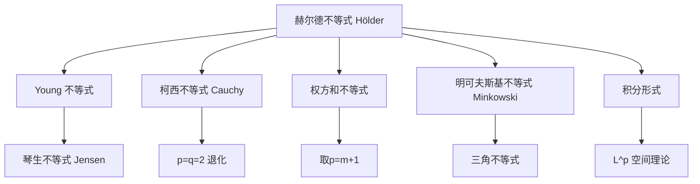

## 赫尔德不等式 (Hölder's Inequality)

赫尔德不等式是[[柯西不等式]]在 $L^p$ 空间中的自然推广，当 $p=q=2$ 时退化为经典的柯西不等式。它是不等式理论中承上启下的核心定理——上承 $\text{Young}$ 不等式（Young's Inequality），下启[[权方和不等式]]与[[明可夫斯基不等式]]（Minkowski's Inequality）。

> [!关键]
> 赫尔德不等式 = 柯西不等式的「幂指数推广」。柯西是 $p=q=2$ 的特殊情形。

---

## 一、基本形式

### 1.1 离散形式（级数形式）

设 $p, q > 1$ 且满足共轭条件 $\dfrac{1}{p} + \dfrac{1}{q} = 1$，则对任意非负实数序列 $a_i, b_i$（$i = 1, 2, \ldots, n$），有：

$$
\color{Red}{\sum_{i=1}^{n} a_i b_i \leq \left( \sum_{i=1}^{n} a_i^p \right)^{\frac{1}{p}} \left( \sum_{i=1}^{n} b_i^q \right)^{\frac{1}{q}}}
$$

当且仅当 $\dfrac{a_1^p}{b_1^q} = \dfrac{a_2^p}{b_2^q} = \cdots = \dfrac{a_n^p}{b_n^q}$ 时，等号成立。

> [!直观理解]
> 左边是「逐项乘积之和」，右边是「分别取 $p$ 次幂和、$q$ 次幂和，再开根相乘」。当 $p=q=2$ 时，右边变为 $\sqrt{\sum a_i^2} \cdot \sqrt{\sum b_i^2}$，正是[[柯西不等式]]。

### 1.2 特例：$p=q=2$ 退化

当 $p = q = 2$ 时，$\dfrac{1}{2} + \dfrac{1}{2} = 1$，赫尔德不等式退化为：

$$
\sum_{i=1}^{n} a_i b_i \leq \sqrt{\sum_{i=1}^{n} a_i^2} \cdot \sqrt{\sum_{i=1}^{n} b_i^2}
$$

两边平方即得 [[柯西不等式]] 的标准形式。

---

## 二、证明基础：Young 不等式 (Young's Inequality)

在证明赫尔德不等式之前，必须先建立 Young 不等式作为引理。

> [!abstract] 引理：Young 不等式
> 设 $a, b \geq 0$，且 $p, q > 1$ 满足 $\dfrac{1}{p} + \dfrac{1}{q} = 1$，则有：
> $$ab \leq \frac{a^p}{p} + \frac{b^q}{q}$$
> 当且仅当 $a^p = b^q$ 时等号成立。

**证明**（利用 $\ln x$ 的凹性）：

若 $a = 0$ 或 $b = 0$，不等式显然成立。现假设 $a, b > 0$。

由于 $f(x) = \ln x$ 满足 $f''(x) = -\dfrac{1}{x^2} < 0$，故 $\ln x$ 是 $(0, +\infty)$ 上的严格上凸函数（凹函数）。

由[[琴生不等式]]的加权形式，取权重 $\dfrac{1}{p}$ 与 $\dfrac{1}{q}$（$\dfrac{1}{p} + \dfrac{1}{q} = 1$），得：

$$
\ln\left(\frac{1}{p}a^p + \frac{1}{q}b^q\right) \geq \frac{1}{p}\ln(a^p) + \frac{1}{q}\ln(b^q) = \ln a + \ln b = \ln(ab)
$$

由于 $y = \ln x$ 单调递增，脱去对数即得：

$$
\frac{a^p}{p} + \frac{b^q}{q} \geq ab
$$

当且仅当 $a^p = b^q$ 时等号成立。$\blacksquare$

---

## 三、赫尔德不等式的证明

**证明**（归一化法 / Normalization Method）：

设 $A = \left( \sum_{i=1}^{n} a_i^p \right)^{\frac{1}{p}}$，$B = \left( \sum_{i=1}^{n} b_i^q \right)^{\frac{1}{q}}$。

若 $A = 0$ 或 $B = 0$，则所有 $a_i$ 或 $b_i$ 均为 $0$，不等式两边均为 $0$，平凡成立。

现假设 $A > 0$ 且 $B > 0$。构造归一化变量：

$$
x_i = \frac{a_i}{A}, \quad y_i = \frac{b_i}{B}
$$

对每一对 $(x_i, y_i)$ 应用 Young 不等式：

$$
x_i y_i \leq \frac{x_i^p}{p} + \frac{y_i^q}{q}
$$

即：

$$
\frac{a_i b_i}{AB} \leq \frac{1}{p} \cdot \frac{a_i^p}{A^p} + \frac{1}{q} \cdot \frac{b_i^q}{B^q}
$$

对 $i$ 从 $1$ 到 $n$ 求和：

$$
\frac{1}{AB} \sum_{i=1}^{n} a_i b_i \leq \frac{1}{p} \sum_{i=1}^{n} \frac{a_i^p}{A^p} + \frac{1}{q} \sum_{i=1}^{n} \frac{b_i^q}{B^q}
$$

注意到 $\sum_{i=1}^{n} a_i^p = A^p$ 且 $\sum_{i=1}^{n} b_i^q = B^q$，代入：

$$
\frac{1}{AB} \sum_{i=1}^{n} a_i b_i \leq \frac{1}{p} \cdot \frac{A^p}{A^p} + \frac{1}{q} \cdot \frac{B^q}{B^q} = \frac{1}{p} + \frac{1}{q} = 1
$$

两边同乘 $AB$，即得：

$$
\sum_{i=1}^{n} a_i b_i \leq AB = \left( \sum_{i=1}^{n} a_i^p \right)^{\frac{1}{p}} \left( \sum_{i=1}^{n} b_i^q \right)^{\frac{1}{q}}
$$

证明完毕。$\blacksquare$

---

## 四、积分形式

赫尔德不等式在积分形式下同样成立，是实分析与泛函分析中的基本工具：

$$
\color{Red}{\int_E f(x) g(x) \, dx \leq \left( \int_E f(x)^p \, dx \right)^{\frac{1}{p}} \left( \int_E g(x)^q \, dx \right)^{\frac{1}{q}}}
$$

其中 $f, g$ 为可测函数，$p, q > 1$ 且 $\dfrac{1}{p} + \dfrac{1}{q} = 1$。

> [!注记]
> 积分形式的证明思路与离散形式完全一致，只需将求和换为积分，并利用 Young 不等式的积分版本即可。

---

## 五、赫尔德不等式推导权方和不等式

赫尔德不等式是[[权方和不等式]]的理论基础。下面展示如何从赫尔德不等式推出权方和不等式。

回顾权方和不等式的基本形式（$m > 0$）：

$$
\frac{a_1^{m+1}}{b_1^m} + \frac{a_2^{m+1}}{b_2^m} + \cdots + \frac{a_n^{m+1}}{b_n^m} \geq \frac{(a_1 + a_2 + \cdots + a_n)^{m+1}}{(b_1 + b_2 + \cdots + b_n)^m}
$$

**推导思路**：取 $p = m+1$，$q = \dfrac{m+1}{m}$（满足 $\dfrac{1}{p} + \dfrac{1}{q} = 1$），则：

$$
\sum a_i = \sum \frac{a_i}{b_i^{m/(m+1)}} \cdot b_i^{m/(m+1)} \leq \left( \sum \frac{a_i^{m+1}}{b_i^m} \right)^{\frac{1}{m+1}} \left( \sum b_i \right)^{\frac{m}{m+1}}
$$

整理即得权方和不等式。此处利用了赫尔德不等式将乘积和分离为两个独立幂和的乘积。

---

## 六、例题

**例题**：已知 $a_i, b_i > 0$（$i = 1, 2, \ldots, n$），证明：

$$
\left( \sum_{i=1}^{n} a_i^3 \right)^{\frac{1}{3}} \left( \sum_{i=1}^{n} b_i^{\frac{3}{2}} \right)^{\frac{2}{3}} \geq \sum_{i=1}^{n} a_i b_i
$$

**证明**：在赫尔德不等式中取 $p = 3$，$q = \dfrac{3}{2}$。验证共轭条件：

$$
\frac{1}{p} + \frac{1}{q} = \frac{1}{3} + \frac{2}{3} = 1
$$

满足条件。直接代入赫尔德不等式（取 $q = \dfrac{3}{2}$，$b_i$ 在右边取 $q$ 次幂即 $b_i^{3/2}$）：

$$
\sum_{i=1}^{n} a_i b_i \leq \left( \sum_{i=1}^{n} a_i^3 \right)^{\frac{1}{3}} \left( \sum_{i=1}^{n} b_i^{\frac{3}{2}} \right)^{\frac{2}{3}}
$$

得证。当且仅当 $\dfrac{a_i^3}{b_i^{3/2}} = \text{常数}$（即 $a_i^2 = k b_i$）时等号成立。$\square$

---

## 七、知识图谱

**相关笔记**：
- [[柯西不等式]] — Cauchy-Schwarz Inequality（$p=q=2$ 特例）
- [[权方和不等式]] — 赫尔德不等式的直接推论
- [[明可夫斯基不等式]] — Minkowski's Inequality（赫尔德推导三角不等式）
- [[Young不等式]] — Young's Inequality（赫尔德不等式的证明基础）
- [[琴生不等式]] — Jensen's Inequality（Young 不等式的证明工具）
- [[AM-GM不等式]] — 另一条证明路径
- [[排序不等式与切比雪夫不等式]] — 不等式家族中的排序工具