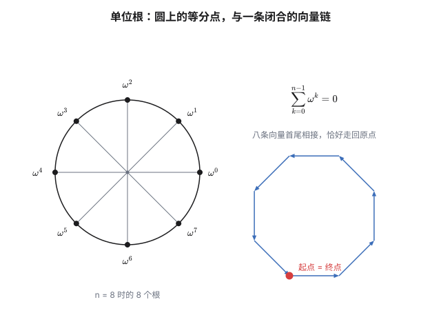
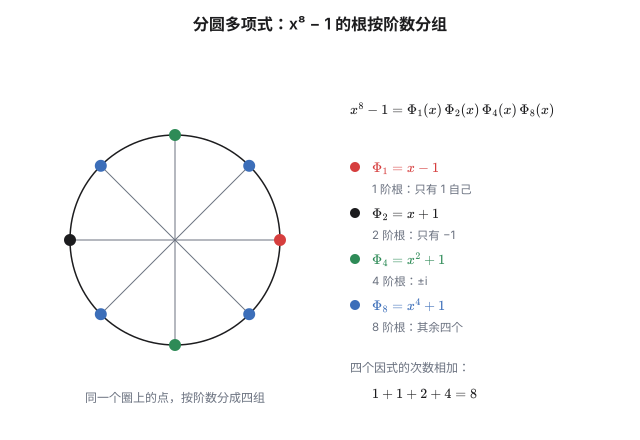
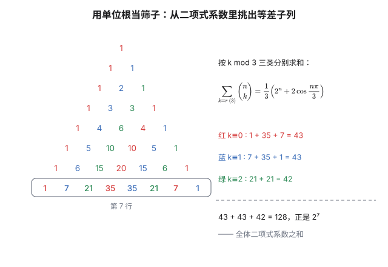
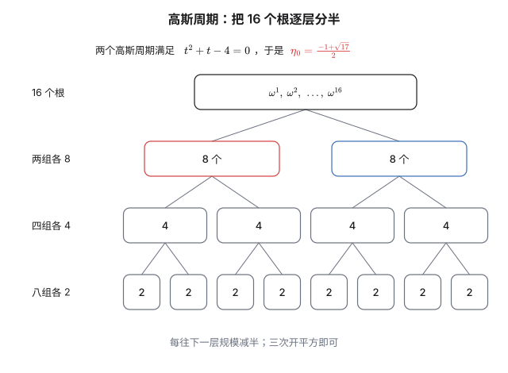
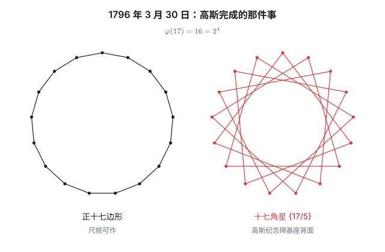

上一篇的结尾留下了一个数：$e^{2\pi i/n}$。

它在单位圆上，把圆周等分成 $n$ 份。这是它的**几何**身份——一个点，一个位置。但它同时是方程

$$x^n=1$$

的一个根。这是它的**代数**身份——一个解，一个数。

这一篇要讲的就是这两种身份如何互相翻译。翻译的桥很窄，只有一条引理；但走过去之后，你会发现一个困扰了数学家两千年的作图问题，答案居然藏在整数的因子分解里。

而这一切的起点，是 1796 年 3 月 30 日的一个早晨。

## 一、单位根：把圆切成 n 份

记

$$\omega=e^{2\pi i/n}=\cos\frac{2\pi}n+i\sin\frac{2\pi}n$$

由德莫弗公式（上一篇的推论），$\omega^k=e^{2\pi ik/n}$，于是

$$\omega^0,\ \omega^1,\ \omega^2,\ \dots,\ \omega^{n-1}$$

这 $n$ 个数全部满足 $x^n=1$，而且两两不同。$n$ 次方程最多 $n$ 个根，所以它们就是全部的解。这些数叫 **$n$ 次单位根**。

几何上看，它们是把单位圆**均匀切成 $n$ 份**的等分点——正是圆内接正 $n$ 边形的顶点。

代数上看，它们在乘法下构成一个**循环群**：$\omega^a\cdot\omega^b=\omega^{a+b}$，而 $a+b$ 模 $n$ 就够用了。这个群记作 $\mathbb Z_n$。群论里"循环"这个词，在这里是字面意思——反复乘 $\omega$，就会沿着圆一圈一圈地转下去。

其中有些根的"循环周期"正好是 $n$：$\omega^k$ 反复自乘能走遍全部 $n$ 个根，当且仅当 $\gcd(k,n)=1$。这样的根叫**本原根**，个数是 $\varphi(n)$（欧拉函数）。$\varphi(n)$ 会在第四节变成主角，先记住它。

### 一条引理：系数和为零

现在来看整个故事里最不起眼、也最有用的事实。对 $n>1$：

$$\sum_{k=0}^{n-1}\omega^k=1+\omega+\omega^2+\cdots+\omega^{n-1}=0$$

两个证明，分别对应两种身份。

**代数证法。** 这是首项为 $1$、公比为 $\omega\ne1$ 的等比数列：

$$\sum_{k=0}^{n-1}\omega^k=\frac{\omega^n-1}{\omega-1}=\frac{1-1}{\omega-1}=0$$

**几何证法。** 把每个 $\omega^k$ 看成从原点出发的单位向量。$n$ 个向量首尾相接会发生什么？每接一段就转过同样的角度 $2\pi/n$，所以它们拼成一条闭合的折线——**走完 $n$ 步，恰好回到起点**。合向量是零向量，而合向量正是这些向量的和。

**"和为 0" 是后面所有运算的引擎。** 它的意思可以读成：*除了 $k$ 是 $n$ 的倍数，$\sum_k\omega^{jk}$ 一律为零。* 这条"筛子"性质，第三节会拿它从二项式系数的求和里挑出想要的项。

## 二、$x^n-1$ 的因式分解与分圆多项式

既然 $\omega^0,\dots,\omega^{n-1}$ 是 $x^n-1$ 的全部根，立刻有因式分解

$$x^n-1=\prod_{k=0}^{n-1}\left(x-\omega^k\right)$$

但这个分解有一个缺点：**它没有按"根的阶数"分类**。$\omega^2$ 在 $n=8$ 时的周期其实只有 $4$，可它和 $\omega^1$ 混在同一个乘积里。

想按周期分类，就得把"阶数为 $d$"的根挑出来。定义

$$\Phi_n(x)=\prod_{\substack{1\le k\le n\\ \gcd(k,n)=1}}\left(x-\omega^k\right)$$

这就是**分圆多项式**（cyclotomic polynomial）：它的根恰好是全部本原 $n$ 次单位根，所以次数是 $\varphi(n)$。

代进去试几个：

| $n$ | $\Phi_n(x)$ | 次数 |
|---|---|---|
| 1 | $x-1$ | 1 |
| 2 | $x+1$ | 1 |
| 3 | $x^2+x+1$ | 2 |
| 4 | $x^2+1$ | 2 |
| 6 | $x^2-x+1$ | 2 |
| 12 | $x^4-x^2+1$ | 4 |

规律是：把 $x^n-1$ 按 $d\mid n$ 拆开，每个 $d$ 贡献一个 $\Phi_d$：

$$x^n-1=\prod_{d\mid n}\Phi_d(x)$$

$n=p$ 为素数时最干净：$\Phi_p(x)=x^{p-1}+x^{p-2}+\cdots+x+1$。特别地

$$\Phi_{17}(x)=x^{16}+x^{15}+\cdots+x+1$$

这个分解看着朴素，但有个不显然的性质：**$\Phi_n(x)$ 的系数永远都是整数**。$\omega$ 是无理数甚至复数，可它拼出来的多项式却老老实实待在 $\mathbb Z[x]$ 里。

不过"整数"不等于"只能是 $0$ 或 $\pm1$。$\Phi_{105}(x)$ 里第一次出现了系数 $-2$——$105=3\times5\times7$ 是最小的、含三个不同奇素数的 $n$。一个看似无关的因子组合，在这里留下了印记。

## 三、单位根的三件武器

单位根在初等数学里的用途可以概括成三件事。

### 第一件：从二项式系数里"筛"出想要的项

问：$\sum_{k\equiv r\pmod m}\binom nk$ 等于多少？也就是在 $\binom n0,\binom n1,\dots,\binom nn$ 里每隔 $m$ 个挑一个加起来。

直接算没有出路。但取 $m$ 次单位根 $\zeta=e^{2\pi i/m}$，考虑

$$S_r=\sum_{j=0}^{m-1}\zeta^{-jr}\left(1+\zeta^{\,j}\right)^n$$

把二项式展开，交换求和顺序：

$$S_r=\sum_{k=0}^{n}\binom nk\sum_{j=0}^{m-1}\zeta^{\,j(k-r)}$$

**内层那一个和，正是第一节的引理。** 它当 $k\equiv r\pmod m$ 时等于 $m$，否则等于 $0$。于是

$$\boxed{\ \sum_{k\equiv r\ (m)}\binom nk=\frac1m\sum_{j=0}^{m-1}\zeta^{-jr}\left(1+\zeta^{\,j}\right)^n\ }$$

$m=3$ 时，$\zeta=e^{2\pi i/3}$，而 $1+\zeta=e^{i\pi/3}$，模为 $1$、辐角 $\pi/3$。代入：

$$\sum_{k\equiv0\ (3)}\binom nk=\frac13\left[2^n+2\cos\frac{n\pi}3\right]$$

验算 $n=4$：右边 $=\frac13(16+2\cos\frac{4\pi}3)=\frac13(16-1)=5$，而 $\binom40+\binom43=1+4=5$ ✓

$m=4$ 时用 $\zeta=i$，$\left|1+i\right|=\sqrt2$：

$$\sum_{k\equiv0\ (4)}\binom nk=\frac14\left[2^n+2^{\frac n2+1}\cos\frac{n\pi}4\right]$$

验算 $n=4$：$\frac14(16+8\cos\pi)=2$，即 $\binom40+\binom44=2$ ✓

这个方法在信号处理里叫**离散傅里叶变换**，在这里它只是一个"按余数分类"的筛子。**把单位根当成检测器而不是数**，是这一节最值得带走的想法。

### 第二件：用方程算出三角函数的精确值

$\cos\frac{2\pi}5$ 是多少？单位根给你一条不用背公式的路。

$5$ 次单位根之和为零：

$$1+\omega+\omega^2+\omega^3+\omega^4=0$$

把共轭的配对：$\omega+\omega^4=2\cos\frac{2\pi}5$，$\omega^2+\omega^3=2\cos\frac{4\pi}5$。于是

$$2\cos\frac{2\pi}5+2\cos\frac{4\pi}5=-1$$

设 $x=2\cos\frac{2\pi}5$。由二倍角公式，$2\cos\frac{4\pi}5=x^2-2$。代进去：

$$x+(x^2-2)=-1\quad\Longrightarrow\quad x^2+x-1=0\quad\Longrightarrow\quad x=\frac{\sqrt5-1}2$$

所以

$$\cos\frac{2\pi}5=\frac{\sqrt5-1}4\approx0.3090,\qquad 2\cos\frac{2\pi}5=\frac{\sqrt5-1}2=\frac1\varphi\approx0.6180$$

**这里的 $\varphi$ 还是黄金分割。** 上一篇用切比雪夫多项式从 $\cos5\theta$ 推到了 $\cos36^\circ=\frac\varphi2$；这里用单位根推到了 $\cos72^\circ=\frac{\sqrt5-1}4$——$36^\circ$ 和 $72^\circ$ 互为余角，两条路在同一个常数上会合。

同样的手法换成 $n=7$，设 $x=2\cos\frac{2\pi}7$，会得到一个**三次**方程

$$x^3+x^2-2x-1=0$$

而 $\varphi(7)/2=3$——次数的来源在下一节会变得清楚。这一次它不再是二次的，也就意味着 $\cos\frac{2\pi}7$ **没法只用平方根写出来**。这不是技巧问题，是本质障碍。

### 第三件：进入代数数论

单位根是**代数整数**：它是首一整系数多项式的根（$x^n-1$ 本身就是首一的）。一切含 $\omega$ 的整系数表达式都还是代数整数。把它们收拢成一个环 $\mathbb Z[\omega]$，再允许除法就得到**分圆域** $\mathbb Q(\omega)$。

这个域是 $\mathbb Q$ 的伽罗瓦扩张，伽罗瓦群恰好是 $(\mathbb Z/n\mathbb Z)^\times$——**根之间的对称性，就是模 $n$ 的乘法群**。整篇文章里"几何—代数"的翻译，在这里达到了最精确的形式。这也解释了为什么 $\varphi(n)$ 会反复出现：它就是这群对称的个数。

## 四、正十七边形：高斯的那一天

现在回到开头。什么是尺规作图？

古希腊人留下的规矩是：只许用无刻度的直尺和圆规。翻译成代数语言，就是**只允许加、减、乘、除和开平方**这五种运算。从一条给定的单位长度出发，每画一步，能得到的新长度都落在某个数域里；而唯一能"越出"当前域的手段是开平方，它把域的次数**翻倍**。

于是一条必要条件浮出水面（它的严格证明要等到 1837 年，由旺策尔给出）：

> 一个长度能用尺规作出，则它所在数域在 $\mathbb Q$ 上的次数必须是 $2$ 的幂。

现在看正 $n$ 边形。画出它的顶点，等价于作出 $\cos\frac{2\pi}n$，而这个数所在的实域次数是 $\varphi(n)/2$。所以

**正 $n$ 边形可尺规作图 $\Longrightarrow$ $\varphi(n)$ 是 $2$ 的幂。**

$\varphi(n)=n\prod_{p\mid n}(1-\frac1p)$。要想让它是 $2$ 的幂，每个奇素因子只能出现一次，而且必须形如 $2^{2^m}+1$：

$$n=2^k\times\left(\text{互不相同的费马素数之积}\right)\qquad\text{其中}\quad F_m=2^{2^m}+1$$

先检查一下前面的疑问：

| $n$ | $\varphi(n)$ | $2$ 的幂？ | 结论 |
|---|---|---|---|
| 7 | 6 | 否 | 不可作 |
| 9 | 6 | 否 | 不可作 |
| 11 | 10 | 否 | 不可作 |
| 13 | 12 | 否 | 不可作 |
| 15 | 8 | 是 | **可作** |
| 17 | 16 | 是 | **可作** |

注意第 5 行：$n=15$ 可以，尽管 $15$ 不是 $2$ 的幂——它是 $3\times5$，两个不同的费马素数。判据的内容比"$2$ 的幂"丰富得多。

至于 $n=17$：$\varphi(17)=16=2^4$ ✓。可作。但"可作"还很远——**怎么作**？

### 十六个根，三次开方

高斯的办法是把 $16$ 个根**逐层分半**，每分一次消掉一层，每层对应一次开平方。

$$16\ \longrightarrow\ 2\times8\ \longrightarrow\ 4\times4\ \longrightarrow\ 8\times2$$

先看第一次分裂。它靠的是**模 $17$ 的二次剩余**：

$$\{1,2,4,8,9,13,15,16\}\quad\text{和}\quad\{3,5,6,7,10,11,12,14\}$$

（前者是 $1^2,2^2,\dots,8^2$ 模 $17$ 的余数。）把每组的 $\omega^k$ 加起来，得到两个**高斯周期**：

$$\eta_0=\sum_{k\in\mathrm{QR}}\omega^k,\qquad \eta_1=\sum_{k\in\mathrm{QNR}}\omega^k$$

它们的和是全部非平凡根之和，所以 $\eta_0+\eta_1=-1$。它们的积要算一下，结果是 $\eta_0\eta_1=-4$。于是

$$t^2+t-4=0\quad\Longrightarrow\quad \eta_0=\frac{-1+\sqrt{17}}2,\qquad \eta_1=\frac{-1-\sqrt{17}}2$$

**第一次开平方出现了，根号下的正是 $17$。**

同样的做法往下走：把每组再按"四次剩余"细分，得到一个二次方程；再细分一次，又是一个二次方程。三次开平方之后，$2\cos\frac{2\pi}{17}$ 被完整地写了出来：

$$16\cos\frac{2\pi}{17}=-1+\sqrt{17}+\sqrt{34-2\sqrt{17}}+2\sqrt{\,17+3\sqrt{17}-\sqrt{34-2\sqrt{17}}-2\sqrt{34+2\sqrt{17}}\,}$$

层层嵌套，三层根号。右边全是平方根运算——这就是"尺规可作"的代数证书。数值上

$$\cos\frac{2\pi}{17}=0.9324722294\ldots$$

拿计算器对一下左边，完全吻合。

### 为什么是 $17$

$17=2^{2^2}+1$，是**费马素数**。费马当年猜：形如 $2^{2^m}+1$ 的数全是素数。

| $m$ | $F_m=2^{2^m}+1$ | |
|---|---|---|
| 0 | 3 | 素数 |
| 1 | 5 | 素数 |
| 2 | 17 | 素数 |
| 3 | 257 | 素数 |
| 4 | 65537 | 素数 |
| 5 | 4294967297 | $=641\times6700417$ |

欧拉在 1732 年用 $641$ 打破了费马的猜想。到今天为止，**人们再也没有找到第六个费马素数**——$F_5$ 到 $F_{32}$ 全是合数。是否存在更多，至今未知。

这也让高斯的定理带上一点遗憾：它保证能作图的正多边形有无穷多族，可其中绝大多数对应的 $n$ 大到毫无意义。只看前三个费马素数 $3,5,17$，能拼出的边数不过 $3,5,15,17,51,85,255$ 这七种（再乘任意 $2$ 的幂）；下一档就直接跳到 $257$ 边形。而 $65537$ 边形的作图步骤要写满一整箱手稿——19 世纪末，一位德国教师 Hermes 为此花了十年。

顺带一提：$7=2^3-1$ 是梅森素数，$17=2^4+1$ 是费马素数——数字上只差了一个符号。不过真正起作用的是 $\varphi(n)$ 能不能写成 $2$ 的幂，这个巧合别当成原因。

### 那一天

1796 年 3 月 30 日，高斯在日记里写下第一条记录：

> Principia quibus innititur sectio circuli, ac divisibilitas eiusdem geometrica in septemdecim partes etc.
>
> （关于圆的分割原理，以及把圆几何地分成十七等份的可能性等等。）

那时他 18 岁 11 个月，再过一个月才满 19 岁。在此之前，数学界只知道 $3,4,5$ 边形和由它们边数翻倍得到的多边形可以尺规作图；高斯的贡献在于把判据的**充分性**连带构造一起给出了：只要 $\varphi(n)$ 是 $2$ 的幂，这个正 $n$ 边形就一定作得出来——$17$ 只是这条定理最小、也最漂亮的样品。

据说高斯生前希望墓碑上刻一个正十七边形。哥廷根的墓上没有；后来在不伦瑞克建纪念碑时，石匠给的理由很实在：**刻出来的正十七边形，所有人都会看成一个圆。** 于是那个图案最终变成了基座背面的十七角星。

对高斯本人来说，这件事的意义不止是一个定理。他年轻时在数学和文学之间犹豫过，正是这个发现让他决定献身数学。他的数学日记从这一天开始记，此后十八年写下 146 条，其中就有 4 月 8 日的二次互反律、5 月 13 日对素数定理的猜测，以及 7 月 10 日那条画成 "$num=\Delta+\Delta+\Delta$"（每个正整数都是三个三角形数之和）的 ΕΥΡΗΚΑ。

## 尾声：圆的代数指纹

回头看这条路的全貌：

- **几何**：单位根是圆周上的等分点，是正 $n$ 边形的顶点。
- **代数**：它们是 $x^n-1$ 的根，按阶数归入分圆多项式。
- **数论**：用它们作"筛子"可以挑出二项式系数的等差子列，可以造方程求三角函数值；而"能否尺规作图"被翻译成了 $\varphi(n)$ 是否是 $2$ 的幂。
- **历史**：1796 年 3 月 30 日，一个十九岁生日前的年轻人把这三者串在一起，顺手解决了一个两千年的老问题。

把它们连起来的只有一条引理——$\sum\omega^k=0$。它简单到几乎不像定理，可它是圆与整数之间最短的那条通道。

## 相关阅读

- 上一篇：《三角函数与欧拉公式：单位圆上的统一》（[`post.html?id=trig-euler`](post.html?id=trig-euler)）——$e^{i\theta}$ 从哪里来，以及和角公式为什么只是指数律的推论。
- [Heptadecagon](https://en.wikipedia.org/wiki/Heptadecagon)（Wikipedia）：正十七边形的作图步骤、历史考据，以及 65537 边形的来龙去脉。

> [!detail] 技术细节
> **1. $\varphi(n)$ 为什么必须是 2 的幂才能推出 $n$ 的形式。** 设 $n=2^a\prod p_i^{e_i}$（$p_i$ 为奇素数），则 $\varphi(n)=2^{\max(a-1,0)}\prod p_i^{e_i-1}(p_i-1)$。要求它是 $2$ 的幂，则每个 $p_i^{e_i-1}$ 必须是 $2$ 的幂，而奇数的 $2$ 的幂只有 $1$，故 $e_i=1$；同时每个 $p_i-1$ 都必须是 $2$ 的幂，即 $p_i=2^{2^m}+1$ 且为素数——正是费马素数。
>
> **2. $\eta_0\eta_1=-4$ 的算法。** 直接展开 $\eta_0\eta_1=\sum_{q\in\mathrm{QR}}\sum_{r\in\mathrm{QNR}}\omega^{q+r}$ 有 $64$ 项；但 $\eta_0\eta_1$ 在伽罗瓦群（模 $17$ 的乘法群）作用下不变，所以它必然是有理数。把它写成 $a\eta_0+b\eta_1+c$，再用 $\eta_0+\eta_1=-1$ 与 $\eta_0^2+\eta_1^2$ 的值（后者由 $\eta_0^2$ 展开成 $\eta$ 的线性组合得到）定出 $a=b=0$、$c=-4$。等价的说法：$\eta_0$ 与 $\eta_1$ 满足同一个二次方程 $t^2+t-4=0$，根之积就是常数项 $-4$。
>
> **3. 二次剩余与 $\eta_0+\eta_1$。** $\mathrm{QR}\cup\mathrm{QNR}=\{1,\dots,16\}$，故 $\eta_0+\eta_1=\sum_{k=1}^{16}\omega^k=-1$（用第一节的引理，注意 $\omega^0=1$ 被排除）。
>
> **4. $n=15$ 的作法。** $\varphi(15)=8$，$15=3\times5$。类似的周期分解把 $8$ 个根先分成 $4+4$（用模 $5$ 的二次剩余），再分成 $2+2+2+2$，两次开平方即可，所以 $15$ 边形可作——它常被拿来当"判据不止是 $2$ 的幂"的例证。
>
> **5. $\Phi_{105}$ 的系数。** 前 12 个系数（从 $x^{48}$ 降幂）为 $1,1,1,0,0,-1,-1,-2,-1,-1,0,0$。$105$ 是最小的、其分圆多项式系数不全部落在 $\{0,\pm1\}$ 内的整数；$105=3\cdot5\cdot7$，是最小的含三个不同奇素因子的 $n$。
>
> **6. 关于"配成 $\{k,17-k\}$"。** 分裂到最后一层时每组恰好是 $\{\omega^k,\omega^{17-k}\}$，而 $\omega^k+\omega^{17-k}=2\cos\frac{2\pi k}{17}$——是实数。这一步把复数的根收回到实轴上，也是最终根式里所有根号都是平方根（而非立方根）的原因。
