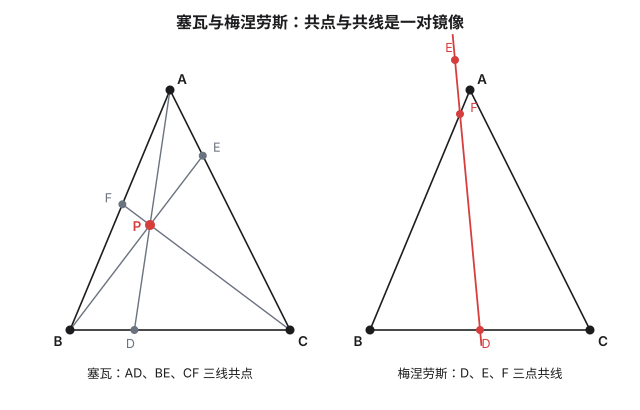
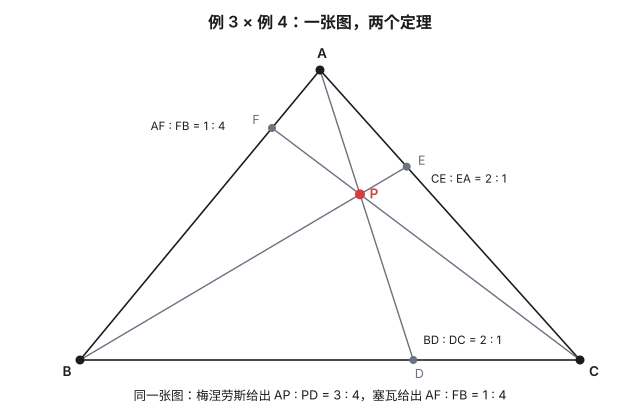
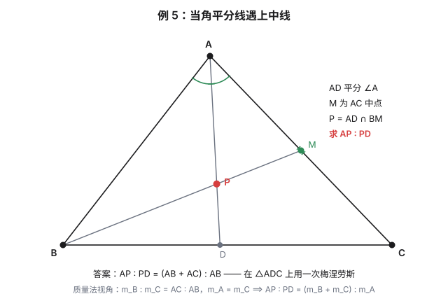

"竞赛定理巡礼"系列开篇。参照一份竞赛定理手册的目录，从几何出发，每篇的格式固定：**定理 + 短证明 + 几道例题**——定理负责"是什么"，例题负责"怎么用"，证明负责"凭什么"。第一篇选一对最古老的搭档：梅涅劳斯管**三点共线**，塞瓦管**三线共点**，两个定理互为镜像，合在一起是平面几何里"共线共点"问题的总开关。本文中的例题极为简单，仅供初学者理解。

## 一、两个定理

**梅涅劳斯定理（Menelaus）。** 一条直线与 $\triangle ABC$ 的三边 $BC$、$CA$、$AB$（或其延长线）分别交于 $D$、$E$、$F$，则

$$\frac{BD}{DC}\cdot\frac{CE}{EA}\cdot\frac{AF}{FB}=1$$

（线段取**有向**长度；若用不带方向的长度，则"恰有奇数个交点在边的延长线上"时成立。）

**塞瓦定理（Ceva，1678）。** 设 $P$ 是 $\triangle ABC$ 所在平面上一点，$AP$、$BP$、$CP$ 分别与对边交于 $D$、$E$、$F$，则

$$\frac{BD}{DC}\cdot\frac{CE}{EA}\cdot\frac{AF}{FB}=1$$

两个定理的逆定理都成立，而且**例题里真正天天在用的正是逆定理**：算出乘积等于 1，就能宣布共点或共线。此外各有一个**角元形式**（把线段比换成正弦比），处理角平分线时特别顺手，证明放在文末。

## 二、证明：一条平行线，两次相似

**先证梅涅劳斯。** 过 $C$ 作截线的平行线，交 $AB$ 所在直线于 $N$。于是：

- 由 $DF\parallel CN$，$\triangle BDF\sim\triangle BCN$，得 $\dfrac{BD}{DC}=\dfrac{BF}{FN}$；
- 由 $EF\parallel CN$，$\triangle AEF\sim\triangle ANC$，得 $\dfrac{CE}{EA}=\dfrac{NF}{FA}$（有向）。

两式相乘，$\dfrac{BD}{DC}\cdot\dfrac{CE}{EA}=\dfrac{BF}{FA}\cdot\dfrac{NF}{FN}$，而有向线段里 $NF=-FN$、$FA=-AF$，代回得

$$\frac{BD}{DC}\cdot\frac{CE}{EA}\cdot\frac{AF}{FB}=-1$$

——这正是有向形式的梅涅劳斯：**共线时乘积为 $-1$**。用不带方向的长度时，负号体现为"奇数个交点在延长线上"，就回到手册里那个不带符号的版本。

**塞瓦是梅涅劳斯的两次应用。** 设 $AD$、$BE$、$CF$ 共点于 $P$。对 $\triangle ABD$ 用梅涅劳斯（截线是 $F$、$P$、$C$），对 $\triangle ACD$ 用梅涅劳斯（截线是 $E$、$P$、$B$），两个等式一除，公共的 $\dfrac{DP}{PA}$ 消掉，剩下的正是

$$\frac{BD}{DC}\cdot\frac{CE}{EA}\cdot\frac{AF}{FB}=1$$

**共点时乘积为 $+1$**。一对定理，一个证明。

## 三、例题五道

以下例题的图形都不复杂，功夫全在"选哪个三角形、哪条截线"。

### 例 1　三中线共点

$\triangle ABC$ 中 $D$、$E$、$F$ 分别是 $BC$、$CA$、$AB$ 的中点。求证：$AD$、$BE$、$CF$ 共点。

**解**：塞瓦逆定理——$\dfrac{BD}{DC}\cdot\dfrac{CE}{EA}\cdot\dfrac{AF}{FB}=1\cdot1\cdot1=1$，三中线共点（重心 $G$）。顺手还能白拿一个经典结论：对 $\triangle ACD$ 用梅涅劳斯（截线 $B$、$G$、$E$），$\dfrac{AG}{GD}\cdot\dfrac{DB}{BC}\cdot\dfrac{CE}{EA}=1$，而 $DB=\tfrac12 BC$、$CE=EA$，于是 $AG:GD=2:1$——**重心分中线成 $2:1$**，梅涅劳斯一行送出。

### 例 2　内心是存在的

求证：三角形的三条内角平分线共点。

**解**：用角元塞瓦。$AD$ 平分 $\angle A$ 时 $\dfrac{\sin\angle BAD}{\sin\angle CAD}=1$，三条平分线的三个比值全是 1，乘积为 1，共点。这个共点就是**内心**——内切圆圆心的存在性，由塞瓦一句送出。顺带一提：一条内角平分线配两条外角平分线，同样的论证给出三个**旁心**的存在。

### 例 3　梅涅劳斯求交点比

$\triangle ABC$ 中，$D$ 在 $BC$ 上且 $BD=2DC$，$E$ 在 $CA$ 上且 $CE=2EA$，$AD$ 与 $BE$ 交于 $P$。求 $AP:PD$。

**解**：$B$、$P$、$E$ 三点共线，而它们恰好落在 $\triangle ACD$ 的三条边所在直线上（$B$ 在 $DC$ 延长线、$P$ 在 $AD$、$E$ 在 $CA$）。梅涅劳斯：

$$\frac{AP}{PD}\cdot\frac{DB}{BC}\cdot\frac{CE}{EA}=1\quad\Longrightarrow\quad \frac{AP}{PD}\cdot\frac{2}{3}\cdot 2=1\quad\Longrightarrow\quad AP:PD=3:4$$

功夫全在第一步：**认出 $B$、$P$、$E$ 是哪个三角形的截线**。认对了，就是一行乘法。

### 例 4　塞瓦求第三条线

还是例 3 的图。设直线 $CP$ 交 $AB$ 于 $F$，求 $AF:FB$。

**解**：这次三条线 $AD$、$BE$、$CF$ 共点于 $P$ 是已知的，塞瓦正用：

$$\frac{BD}{DC}\cdot\frac{CE}{EA}\cdot\frac{AF}{FB}=1\quad\Longrightarrow\quad 2\cdot2\cdot\frac{AF}{FB}=1\quad\Longrightarrow\quad AF:FB=1:4$$

例 3 与例 4 是**同一张图上的两个定理**：共点的三线给塞瓦，图里那条天然的截线给梅涅劳斯——两个定理各管一半，互不抢戏。

### 例 5　当角平分线遇上中线

$\triangle ABC$ 中，$AD$ 是角平分线（$D$ 在 $BC$ 上），$BM$ 是中线（$M$ 为 $AC$ 中点），$AD$ 与 $BM$ 交于 $P$。求 $AP:PD$。

**解**：$B$、$P$、$M$ 共线，而 $B$ 在 $DC$ 延长线上、$P$ 在 $AD$ 上、$M$ 在 $CA$ 上——又是 $\triangle ADC$ 的一条截线。梅涅劳斯：

$$\frac{AP}{PD}\cdot\frac{DB}{BC}\cdot\frac{CM}{MA}=1\quad\Longrightarrow\quad \frac{AP}{PD}=\frac{BC}{DB}$$

（$M$ 是中点，$\frac{CM}{MA}=1$。）再用角平分线定理 $\dfrac{DB}{DC}=\dfrac{AB}{AC}$，得 $\dfrac{BC}{DB}=1+\dfrac{DC}{DB}=1+\dfrac{AC}{AB}$，于是

$$AP:PD=(AB+AC):AB$$

比如 $3\text{-}4\text{-}5$ 三角形（$AB=3$，$AC=5$）里 $AP:PD=8:3$。**另解（质量法）**：在 $B$、$C$ 处放质量 $AC$、$AB$，平衡点恰是 $D$；$M$ 是 $AC$ 中点，故 $A$ 处质量等于 $C$ 处质量 $AB$；$P$ 是 $A$（质量 $AB$）与 $D$（质量 $AC+AB$）的平衡点，立刻 $AP:PD=(AC+AB):AB$。两种解法答案一致——质量法本质上是"打包好的塞瓦"。

## 四、对偶小结

把两个定理放在一起看：

| | 梅涅劳斯 | 塞瓦 |
|---|---|---|
| 结论 | 三点**共线** | 三线**共点** |
| 乘积（有向） | $-1$ | $+1$ |
| 几何含义 | 截线穿过三角形 | 三条塞瓦线交汇 |

$1$ 与 $-1$ 之差，就是"共点"与"共线"之差——往深处走一步，这正是一个射影几何故事的开头：平行即相交于无穷远，塞瓦的 $+1$ 同时覆盖"共点"与"三线平行"两种情形。这一层留给日后的射影篇。下一篇巡礼，我们去看这对定理在圆上的亲戚：托勒密。

## 相关阅读

- [椭圆（下）：斜率、变换与线性代数](post.html?slug=ellipse-advanced)(本站):帕斯卡定理的证明里，梅涅劳斯已经客串过一次（三次应用加割线定理）。
- [算两次：同一件事数两遍](post.html?slug=double-counting)(本站):本文的面积法与"认截线"功夫，和那里的行和列和是同一种手感。
- [Ceva's theorem](https://en.wikipedia.org/wiki/Ceva%27s_theorem)(Wikipedia):塞瓦定理的代数形式与各种推广。
- [Menelaus's theorem](https://en.wikipedia.org/wiki/Menelaus%27s_theorem)(Wikipedia):球面情形与高维推广。

> [!detail] 技术细节
> **1. 角元塞瓦的证明。** 由面积公式 $\dfrac{BD}{DC}=\dfrac{[ABD]}{[ADC]}=\dfrac{AB\sin\angle BAD}{AC\sin\angle CAD}$（两三角形以 $AD$ 为公共边，用两边夹角表面积）。三条塞瓦线各写一遍，相乘时 $AB$、$BC$、$CA$ 全部约掉，剩下的就是角元塞瓦。角平分线让正弦比等于 1，所以例 2 里三个比值全是 1。
>
> **2. 有向线段与"外点个数"。** 不带方向的梅涅劳斯版本要求恰有奇数个交点在边的延长线上——这是因为三点共线时截线与三角形或者交两边及一边延长线，或者三条边全是延长线（截线不过顶点时不可能只交两条边）。塞瓦的共点情形 $P$ 在形内时三点都在边上、在形外时恰有偶数个在延长线上，两种情况的带方向乘积都是 $+1$。动手算时最省心的约定：全程有向，符号自己长出来。
>
> **3. 质量法与塞瓦的关系。** 质量法（在顶点放质量、平衡点分线段成反比）对"两条塞瓦线交第三条边"的计算一步到位，但它要求交点确实存在；塞瓦逆定理负责证明存在性。顺序上永远是：先用塞瓦（或角元塞瓦）证共点，再用质量法或梅涅劳斯算比值——例 5 就是这个顺序。
>
> **4. 往下走一步：Routh 定理。** 若三双分点**不**满足塞瓦条件（三线两两相交成一个小三角形），这个小三角形的面积与原三角形面积之比由一个只含三个比的公式给出——这就是 Routh 定理，塞瓦的定量化推广，也是" $k$ 恰好等于 1 时小三角形退化为一点"的精确刻画。值得单独一篇，此处按下不表。
