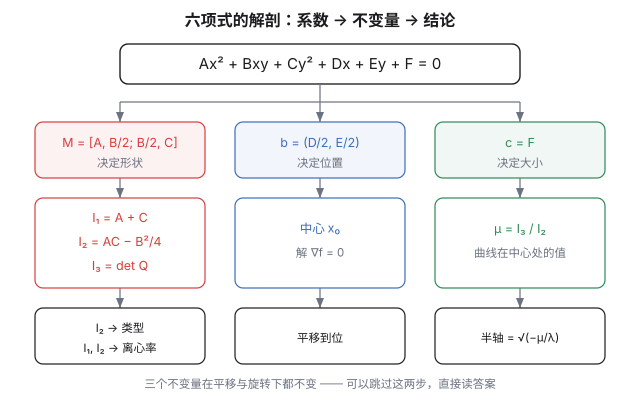
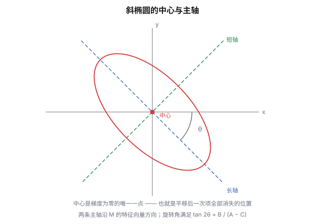
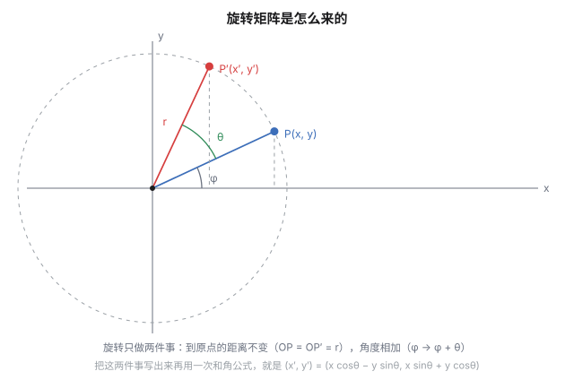
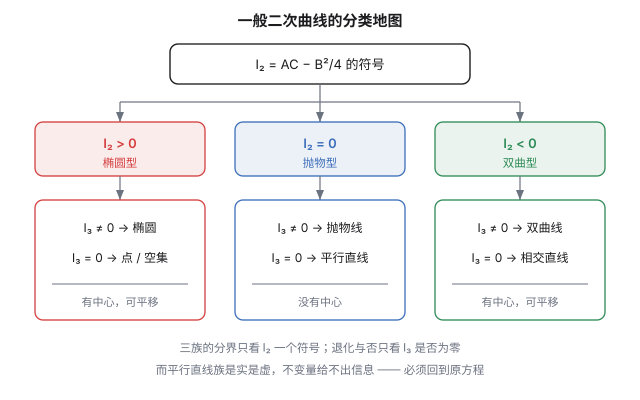
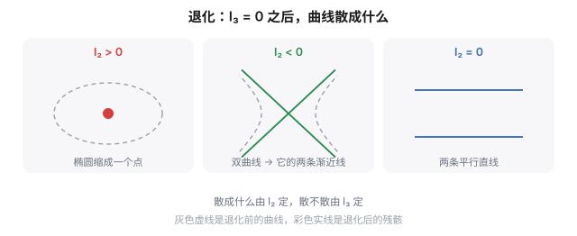
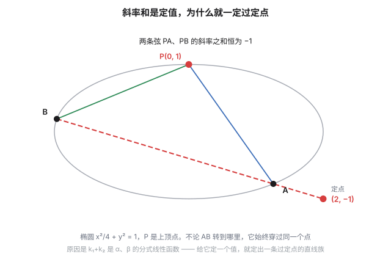
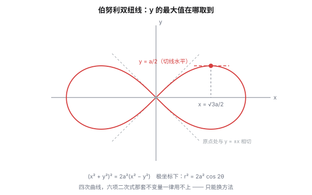

课本里的圆锥曲线都摆在标准位置上。

$$\frac{x^2}{a^2}+\frac{y^2}{b^2}=1$$

中心在原点，对称轴和坐标轴对齐，你只要认四个数：$a$、$b$、$c$、$e$。所有公式——焦半径、准线、焦点弦——都是为这个位置量身定做的。

但题目中我们也许会遇到这样的形式：

$$Ax^2+Bxy+Cy^2+Dx+Ey+F=0$$

六个项，谁也不认识谁，然后问你：这是什么曲线？离心率多少？对称轴在哪？

配方法能做，只是拿时间换答案——而考试最缺的就是时间。这篇文章要讲另一条路：**这六个系数里藏着三个不随坐标系变化的数**，它们一确定，类型、形状、位置、大小就全都定了。

顺带说一句：这条路通向线性代数。二次型、特征值、正交对角化、行列式——高中课本里那些"以后你会学到"的东西，其实是这道题的**标准语言**。换了这个语言以后，原来要算三页纸的东西，变成三行。

## 读这篇之前，你只需要这些

这篇文章会用到矩阵、行列式、特征值——高中都不教。但**你不需要先去学线性代数**：它们在这里的用法都很浅，而且每一个都在用到的当口就地解释过。

真正的前提只有这些，全是高中学过的：一元二次方程（求根公式、判别式、韦达定理），三角恒等变换（和角公式、二倍角公式），平面向量的坐标运算，二次函数的图像。

至于超出高中范围的那几个概念，先看这张地图：

| 概念 | 用到哪一节 | 一句话是什么 |
|---|---|---|
| 矩阵与矩阵乘法 | 全文 | 把一堆数排成方阵，按"行乘列"相乘 |
| 行列式 | 一、五、七 | 从一个方阵算出的一个数；二维时是面积的有向倍数 |
| 二次型 | 一 | 形如 $\mathbf x^{\mathsf T}M\mathbf x$ 的"二次式子" |
| 偏导数 | 二 | 把一个变量当常数，对另一个求导 |
| 特征值与特征向量 | 三 | 被矩阵乘过之后只变长度、不变方向的向量 |
| 正交对角化 | 三 | 换一组互相垂直的坐标轴，让交叉项自己消失 |

读到不认识的记号，**先往下看**——这篇是按"用到才讲"组织的，不是"讲完才用"。真卡住了，文末的**附录**把这六个概念从头讲了一遍。

路线图（免得中途迷路）：

- **第一节**：把六项装进一个矩阵；
- **第二、三节**：做两个动作——平移（消一次项）、旋转（消交叉项）；
- **第四、五节**：告诉你这两个动作**可以完全跳过**，三个不变量直接给出答案；
- **第六、七节**：分类表，以及表里最后几行（退化）的展开；
- **第八节**：这些量为什么不变；
- **第九、十节**：把高中那套"设线、联立、韦达"翻译成矩阵语言，并专攻斜率条件这类常考范式；
- 最后是拉格朗日、双纽线，和文末的工具附录。

## 一、六个系数装进一个矩阵

先把多项式写成矩阵：

$$f(x,y)=Ax^2+Bxy+Cy^2+Dx+Ey+F$$

紧凑一点：

$$f(\mathbf x)=\mathbf x^{\mathsf T}M\,\mathbf x+2\mathbf b^{\mathsf T}\mathbf x+c,\qquad \mathbf x=\binom xy$$

$$M=\begin{pmatrix}A&\frac B2\\[3pt]\frac B2&C\end{pmatrix},\qquad \mathbf b=\begin{pmatrix}D/2\\[3pt]E/2\end{pmatrix},\qquad c=F$$

$M$ 是个**对称矩阵**。交叉项 $Bxy$ 在矩阵里被拆成两个 $\frac B2$，一上一下——因为 $\mathbf x^{\mathsf T}M\mathbf x$ 里 $(1,2)$ 和 $(2,1)$ 两个位置各贡献一次，加起来正好是 $Bxy$。这个"对称化"不是审美偏好，它是后面所有结论的源头。

如果想连常数项一起管，用**齐次坐标**：

$$\begin{pmatrix}x&y&1\end{pmatrix}
\underbrace{\begin{pmatrix}A&\frac B2&\frac D2\\[3pt]\frac B2&C&\frac E2\\[3pt]\frac D2&\frac E2&F\end{pmatrix}}_{Q}
\begin{pmatrix}x\\y\\1\end{pmatrix}=0$$

这个 $Q$ 是 $3\times3$ 对称矩阵，整条曲线就是它定义的二次型取零的集合。

### 三个不变量

现在直接给结论——这三个数在平移和旋转下都不变：

$$I_1=A+C,\qquad I_2=AC-\frac{B^2}{4}=\det M,\qquad I_3=\det Q$$

分工也直接给出来：

| 量 | 管什么 | 怎么读 |
|---|---|---|
| $I_2$ | 曲线属于哪一类 | $>0$ 椭圆型，$=0$ 抛物型，$<0$ 双曲型 |
| $I_3$ | 曲线退不退化 | $=0$ 就退化（变成点、直线或空集） |
| $I_1$ | 退化时分实虚 | 只在 $I_3=0$ 时才用得上 |

先做最省事的一步——判别类型：把 $A,B,C$ 代进去算 $I_2$，符号一读就完了——不用配方，不用联立。

为什么它们不变、又为什么恰好是这三个，是第八节的事。先看它们怎么用。

### 一个必须说清的符号陷阱

高中说"$B^2-4AC<0$ 是椭圆"，这里说"$I_2>0$ 是椭圆"。两者一致吗？

$$I_2=AC-\frac{B^2}{4}=-\frac14\left(B^2-4AC\right)$$

**差着一个负号。** 但这不是文字游戏：$B^2-4AC$ 是**判别式**的记号，$I_2=\det M$ 是**矩阵**的记号，来源不同、用途不同，只是恰好差 $-1/4$。不少教材直接用 $\delta=B^2-4AC$，于是分类表要写成"$\delta<0$ 椭圆、$\delta=0$ 抛物线、$\delta>0$ 双曲线"。看见这类符号先确认它的定义，别默认。

## 二、平移：中心是梯度为零的点

曲线在坐标系里没对准，第一个动作是平移。

$f$ 的梯度是 $\nabla f=2M\mathbf x+2\mathbf b$，令它为零：

$$M\mathbf x_0=-\mathbf b$$

写开来就是

$$\begin{cases}2Ax_0+By_0+D=0\\[3pt]Bx_0+2Cy_0+E=0\end{cases}$$

左边那两行，正好是 $\dfrac{\partial f}{\partial x}$ 和 $\dfrac{\partial f}{\partial y}$。所以那句"求中心就是偏导数为零"——对，而且原因是泰勒展开，不在配方技巧里。

### 为什么梯度为零就是中心

把 $f$ 在 $\mathbf x_0$ 处展开：

$$f(\mathbf x_0+\mathbf h)=f(\mathbf x_0)+\underbrace{\nabla f(\mathbf x_0)^{\mathsf T}\mathbf h}_{=\,0}+\mathbf h^{\mathsf T}M\,\mathbf h$$

一次项没了，于是 $f(\mathbf x_0+\mathbf h)-f(\mathbf x_0)=\mathbf h^{\mathsf T}M\,\mathbf h$。右边是 $\mathbf h$ 的**偶函数**：把 $\mathbf h$ 换成 $-\mathbf h$，值不变。而"关于某点中心对称"的定义就是这个——以 $\mathbf x_0$ 为原点，方程长得一样。

> **"中心"这个词的全部内容，就是这一次泰勒展开。** 曲线关于 $\mathbf x_0$ 中心对称 $\iff$ $f$ 在 $\mathbf x_0$ 处的一次项消失 $\iff$ 梯度为零。

（这也顺便解释了标准椭圆的中心为什么在原点：$\frac{x^2}{a^2}+\frac{y^2}{b^2}-1$ 的梯度是 $\left(\frac{2x}{a^2},\frac{2y}{b^2}\right)$，只有 $(0,0)$ 处为零。）

### 抛物型没有中心

方程组 $M\mathbf x_0=-\mathbf b$ 有唯一解，当且仅当 $\det M\ne0$，也就是 $I_2\ne0$。

如果 $I_2=0$，$M$ 奇异，两种情况：

- **无解**：曲线没有中心。这就是**抛物线**——它关于哪个点中心对称？没有。$y=x^2$ 只有一条对称轴，没有对称中心。
- **无穷多解**：中心排成一条直线。这是**两条平行直线**那一类退化情形，比如 $x^2-1=0$，任意 $(0,t)$ 都是"中心"。

所以 $I_2$ 还额外替我们分了一件事：**有心曲线和无心曲线**。椭圆、双曲线有中心，抛物线没有。

### 中心坐标的现成公式

上面那个方程组随手就能解完，结果是

$$x_0=\frac{BE-2CD}{4AC-B^{2}},\qquad y_0=\frac{BD-2AE}{4AC-B^{2}}$$

分母是 $4AC-B^2=4I_2$——又一次见到它。这个公式的来历就是解二元一次方程组的**克拉默法则**（系数行列式当分母，常数列替换掉某一列当分子），不必背，但值得看一眼分母。

拿前面的例子验算，$A=C=3$、$B=2$、$D=E=-4$：

$$x_0=\frac{2\cdot(-4)-2\cdot3\cdot(-4)}{36-4}=\frac{16}{32}=\frac12,\qquad y_0=\frac12$$

（两个式子在这题里长得一样，是因为 $A=C$ 且 $D=E$。）

### 平移之后

设解出中心 $\mathbf x_0$，作换元 $\mathbf x=\mathbf x_0+\mathbf h$，方程变成

$$\mathbf h^{\mathsf T}M\,\mathbf h+\mu=0,\qquad \mu=f(\mathbf x_0)=\frac{I_3}{I_2}$$

一次项干净消失，只剩二次项和一个常数（$\mu=I_3/I_2$ 的推导只要一行分块行列式，见文末）。这条式子的意思是："曲线离中心有多远"这个信息，早就藏在 $I_3$ 和 $I_2$ 里了。

### 走一遍

$$3x^2+2xy+3y^2-4x-4y-2=0$$

$A=3$，$B=2$，$C=3$，$D=E=-4$，$F=-2$。

$$\begin{cases}6x_0+2y_0-4=0\\2x_0+6y_0-4=0\end{cases}\quad\Longrightarrow\quad x_0=y_0=\frac12$$

中心 $\left(\frac12,\frac12\right)$。代回去算 $\mu$：

$$\mu=f\left(\tfrac12,\tfrac12\right)=3\cdot\tfrac14+2\cdot\tfrac14+3\cdot\tfrac14-4\cdot\tfrac12-4\cdot\tfrac12-2=-4$$

于是平移后的方程是 $3h^2+2hk+3k^2-4=0$。一次项没了——**比原来好看多了。**

## 三、旋转：主轴就是特征向量

现在剩下交叉项 $2hk$。它就是"图形是斜的"这件事的代数残留。

### 先补一课：旋转矩阵是怎么来的

设平面上一点 $P(x,y)$ 到原点的距离是 $r$，射线 $OP$ 与 $x$ 轴正方向的夹角是 $\varphi$，那么

$$x=r\cos\varphi,\qquad y=r\sin\varphi$$

把它绕原点**逆时针转 $\theta$ 角**。旋转不改变到原点的距离，只是让角度从 $\varphi$ 变成 $\varphi+\theta$：

$$x'=r\cos(\varphi+\theta),\qquad y'=r\sin(\varphi+\theta)$$

用和角公式展开，再把 $r\cos\varphi$ 换回 $x$、$r\sin\varphi$ 换回 $y$：

$$x'=r\left(\cos\varphi\cos\theta-\sin\varphi\sin\theta\right)=x\cos\theta-y\sin\theta$$
$$y'=r\left(\sin\varphi\cos\theta+\cos\varphi\sin\theta\right)=x\sin\theta+y\cos\theta$$

写成矩阵：

$$\begin{pmatrix}x'\\y'\end{pmatrix}=\begin{pmatrix}\cos\theta&-\sin\theta\\\sin\theta&\cos\theta\end{pmatrix}\begin{pmatrix}x\\y\end{pmatrix}$$

这就是旋转矩阵。 推导里只用了两件事——旋转不改变距离、旋转让角度相加——外加一条和角公式。没有任何超出高中的东西。

有两个地方值得记住。

其一，矩阵的两列是基向量旋转后的落点。 $\binom10$ 转完是 $\binom{\cos\theta}{\sin\theta}$，正是第一列；$\binom01$ 转完是 $\binom{-\sin\theta}{\cos\theta}$，正是第二列。记住这个，矩阵不用背。

其二，"转点"和"转坐标轴"方向相反——这是大多数人第一次会绕进去的地方。上面推出来的 $R_\theta$ 转的是**点**：点逆时针走 $\theta$。而接下来我们要做的是**换一组坐标轴来看同一个图形**，图形不动，这两件事的效果正好相反。

好在下面这个写法会把这个区分消掉：

$$\mathbf h=R_\theta\,\mathbf u$$

意思是"新坐标 $\mathbf u$ 所描述的那个点，在旧坐标下是 $\mathbf h$"。这时 $R_\theta$ 的两列就是**新坐标轴在旧坐标下的方向**——第一列 $(\cos\theta,\sin\theta)$ 说明新的 $u$ 轴是从旧的 $x$ 轴逆时针转 $\theta$ 得到的。

### 回到交叉项

把 $\mathbf h=R_\theta\mathbf u$ 代入 $\mathbf h^{\mathsf T}M\mathbf h$，得到 $\mathbf u$ 的二次型，矩阵是 $R_\theta^{\mathsf T}MR_\theta$。把三个元素算出来（用倍角公式硬整）：

$$A'=A\cos^2\theta+B\cos\theta\sin\theta+C\sin^2\theta$$
$$C'=A\sin^2\theta-B\cos\theta\sin\theta+C\cos^2\theta$$
$$B'=B\cos2\theta-(A-C)\sin2\theta$$

我们要的是 $B'=0$：

$$\boxed{\ \tan2\theta=\frac{B}{A-C}\ }$$

（$A=C$ 时右边趋于无穷，对应 $2\theta=90^\circ$，即 $\theta=45^\circ$。这是最常见的情形，也好记。）

### 换一个说法：正交对角化

上面那套三角函数运算，在线性代数里是一句话：**对称矩阵可以正交对角化**。

$$M=Q\Lambda Q^{\mathsf T},\qquad \Lambda=\begin{pmatrix}\lambda_1&0\\0&\lambda_2\end{pmatrix}$$

$Q$ 是正交矩阵（$Q^{\mathsf T}Q=E$），它的两列就是 $M$ 的两个**单位特征向量**。取 $\mathbf u=Q^{\mathsf T}\mathbf h$（这正是旋转，因为 $Q$ 正交），二次型变成 $\mathbf u^{\mathsf T}\Lambda\,\mathbf u=\lambda_1u^2+\lambda_2v^2$。

**交叉项消失了。** 不是"消掉了"，是"本来就不该有"——它只是一开始坐标系选得不好而已。于是"主轴"是什么，答案也在这里：

> **椭圆（或双曲线）的两条对称轴，就是 $M$ 的两个特征向量方向。**

"标准方程"之所以长那样，是因为它恰好在特征向量方向上选了坐标轴。

### 特征值

特征值是特征方程 $\det(M-\lambda E)=0$ 的根，也就是

$$\lambda^2-(A+C)\lambda+\left(AC-\frac{B^2}4\right)=0\quad\Longleftrightarrow\quad\lambda^2-I_1\lambda+I_2=0$$

两根写成公式：

$$\lambda_{1,2}=\frac{(A+C)\pm\sqrt{(A-C)^2+B^2}}{2}=\frac{I_1\pm\sqrt{I_1^2-4I_2}}{2}$$

注意这里出现的两件事：

- **$\lambda_1+\lambda_2=I_1$，$\lambda_1\lambda_2=I_2$**。第一节那两个记号，原来就是特征值的和与积。
- 判别式 $I_1^2-4I_2=(A-C)^2+B^2\ge0$ 恒成立，所以特征值**一定是实数**——这不是巧合，是对称矩阵的定理。

### 主轴朝哪边：特征向量

特征值给的是数值，方向由**特征向量**给出——满足 $M\mathbf v=\lambda\mathbf v$ 的非零向量 $\mathbf v$。这个式子的意思很直白：$\mathbf v$ 被 $M$ 乘完之后只是拉长了 $\lambda$ 倍，**方向没动**。"主轴"三个字的全部含义就在这一行里。

二维的情形不用背公式：把 $\lambda$ 代回去得到一个方程（另一次是重复的），随便取一个非零解就是方向。拿前面的例子走一遍，$M=\begin{pmatrix}3&1\\1&3\end{pmatrix}$，$\lambda=4,2$：

- **$\lambda=4$**：$3u+v=4u$，即 $v=u$，取 $(1,1)$——$45^\circ$ 方向。对应半轴长 $\sqrt{-\mu/4}=1$，是**短轴**。
- **$\lambda=2$**：$3u+v=2u$，即 $u+v=0$，取 $(1,-1)$——$-45^\circ$ 方向。半轴长 $\sqrt{-\mu/2}=\sqrt2$，是**长轴**。

所以这个椭圆的两条对称轴就是 $y=x$ 和 $y=-x$，和图上一致。

这里有个容易反过来的地方：**特征值大的那条轴反而短**。原因在 $a^2=-\mu/\lambda$——$\lambda$ 站在分母上。几何意思也顺：$f$ 在 $\lambda$ 大的方向上增长得快，沿那个方向没走多远就碰到等值线了。

### 关键一步：不用真的求角度

大多数时候 $\theta$ 根本用不上。因为消掉交叉项之后，新系数 $A'$、$C'$ **就是 $M$ 的两个特征值**：

$$A'=\lambda_1=\frac{I_1+\sqrt{I_1^2-4I_2}}{2},\qquad C'=\lambda_2=\frac{I_1-\sqrt{I_1^2-4I_2}}{2}$$

整个计算只用 $A$、$B$、$C$ 三个数，跟 $\theta$ 一点关系都没有。填空题问离心率、问短轴长、问通径，走到这里就够了；$\theta$ 只在题目真要你写出"对称轴方程"时才补一下。

真要 $\theta$ 时用 $\tan2\theta=\frac{B}{A-C}$。注意它只给出 $2\theta$ 的值，而方向差 $180^\circ$ 是同一条轴，所以解出来的正好是两条互相垂直的主轴。

### 接上面的例子

$3h^2+2hk+3k^2-4=0$。$A=C=3$、$B=2$，所以 $\tan2\theta$ 分母为零，$\theta=45^\circ$。特征值：$I_1=6$、$I_2=9-1=8$，

$$\lambda=\frac{6\pm\sqrt{36-32}}2=\frac{6\pm2}2=4,\ 2$$

标准形是

$$4u^2+2v^2-4=0\quad\Longrightarrow\quad\frac{u^2}{1}+\frac{v^2}{2}=1$$

一个 $45^\circ$ 斜着的椭圆，被转成了标准椭圆。

（转 $45^\circ$ 这个结论可以顺手核对：把 $\theta=45^\circ$ 代进 $A'$、$C'$ 的式子得 $4$ 和 $2$，与两个特征值一致；而 $B'=2\cos90^\circ-0\cdot\sin90^\circ=0$，交叉项确实没了。）

## 四、离心率：一行公式

标准形里的两个半轴平方，就是 $-\mu/\lambda_i$。而 $-\mu/\lambda$ 是 $\lambda$ 的减函数，所以**小的特征值配长的半轴**（本例 $\mu=-4$：$-\mu/2=2$ 是长半轴平方，$-\mu/4=1$ 是短半轴平方 ✓）。代入 $e^2=1-\dfrac{b^2}{a^2}$ 得

$$\boxed{\ e^2=1-\frac{\lambda_{\min}}{\lambda_{\max}}\ }$$

代入 $\lambda=2,4$：$e^2=1-\frac24=\frac12$，$e=\frac{\sqrt2}2$。这就是填空压轴题要的那个数。

请留意这条式子里没有出现什么：没有 $\mu$，没有中心坐标，没有旋转角。离心率是"形状"，而形状**只由 $M$ 决定**；$D,E,F$ 把曲线搬来搬去、放大缩小，形状一动不动。

写成纯不变量：设 $I_1>0$（否则整体乘 $-1$，方程不变），则

$$e^2=\frac{2\sqrt{I_1^2-4I_2}}{I_1+\sqrt{I_1^2-4I_2}}$$

只要 $I_1$ 和 $I_2$，**连特征值都不用单独解出来**。验算上面这例：$\sqrt{36-32}=2$，$e^2=\frac{4}{6+2}=\frac12$ ✓。

最后提一句：抛物线的离心率恒为 $1$，那是它的定义。所以问"求离心率"的题不会是抛物线——先用 $I_2$ 判出是椭圆型还是双曲型，再套对应公式。

## 五、不变量：两步都不用做

前三节是一套"正规流程"：平移消一次项，旋转消交叉项，然后读答案。但既然 $I_1$、$I_2$、$I_3$ 在平移和旋转下都不变，那就可以**跳过这两步**——先在原始坐标系里把三个数算出来，再问"什么样的标准形会有这三个数"。

这就是不变量方法的全部逻辑。

### 半轴的对称式

设标准形 $\lambda_1u^2+\lambda_2v^2+\mu=0$（$\lambda$ 同号），两个半轴平方是 $a_i^2=-\mu/\lambda_i$。求它们的两件基本对称式：

$$a^2+b^2=-\mu\left(\frac1{\lambda_1}+\frac1{\lambda_2}\right)=-\mu\cdot\frac{\lambda_1+\lambda_2}{\lambda_1\lambda_2}=-\frac{I_3}{I_2}\cdot\frac{I_1}{I_2}=-\,\frac{I_1I_3}{I_2^{2}}$$

$$a^2b^2=\mu^2\cdot\frac1{\lambda_1\lambda_2}=\frac{I_3^2}{I_2^{2}}\cdot\frac1{I_2}=\frac{I_3^{2}}{I_2^{3}}$$

（用了 $\mu=I_3/I_2$、$\lambda_1+\lambda_2=I_1$、$\lambda_1\lambda_2=I_2$。）

这两条式子值得多看一眼：**右边全是三个不变量，左边是两个半轴。** 于是 $a^2$、$b^2$ 就是方程

$$t^2+\frac{I_1I_3}{I_2^{2}}\,t+\frac{I_3^{2}}{I_2^{3}}=0$$

的两根（注意中间项符号：两根之和是 $-\frac{I_1I_3}{I_2^2}$）。

### 一次算完

用刚才那例核一遍。$3x^2+2xy+3y^2-4x-4y-2=0$：

$$I_1=6,\qquad I_2=AC-\frac{B^2}4=9-1=8,\qquad I_3=\det\begin{pmatrix}3&1&-2\\1&3&-2\\-2&-2&-2\end{pmatrix}=-32$$

（$I_3$ 沿第一行展开：$3\big(3\cdot(-2)-(-2)(-2)\big)-1\big(1\cdot(-2)-(-2)(-2)\big)+(-2)\big(1\cdot(-2)-3\cdot(-2)\big)=-30+6-8=-32$。）

$$a^2+b^2=-\frac{6\cdot(-32)}{64}=3,\qquad a^2b^2=\frac{(-32)^2}{512}=2$$

所以 $a^2,b^2$ 是 $t^2-3t+2=0$ 的根，即 $a^2=2$、$b^2=1$，于是

$$e^2=1-\frac{b^2}{a^2}=1-\frac12=\frac12,\qquad e=\frac{\sqrt2}2$$

和前面走过来的一模一样，**但这一次没解方程组、没算特征值、没转轴**。三个行列式代完就结束了——这就是不变量方法的回报。

## 六、分类表：一共七种可能

把 $\lambda$、$\mu$ 的符号搭配穷举一遍，就是一般二次曲线的完整分类。标准形是 $\lambda_1u^2+\lambda_2v^2+\mu=0$，其中 $I_2=\lambda_1\lambda_2$：

| $I_2$ | 特征值 | $\mu$ | 结论 |
|---|---|---|---|
| $>0$ | 同号 | 与 $\lambda$ 异号 | **椭圆**（实） |
| $>0$ | 同号 | $=0$ | 一个**点** |
| $>0$ | 同号 | 与 $\lambda$ 同号 | **空集**（虚椭圆） |
| $<0$ | 异号 | $\ne0$ | **双曲线** |
| $<0$ | 异号 | $=0$ | 两条**相交直线** |
| $=0$ | 有一个为零 | $I_3\ne0$ | **抛物线** |
| $=0$ | 有一个为零 | $I_3=0$ | 两条**平行直线**（可重合、可虚） |

表里用的是 $\mu$，但 $\mu=I_3/I_2$，而 $I_2>0$ 时 $\mu$ 与 $I_3$ 同号、$I_2<0$ 时反号——所以前三行的实/虚判据也可以直接写成 $I_1I_3$ 的符号（$<0$ 实椭圆，$>0$ 无轨迹）。用哪个都行，看手头方便。

### 一个诚实的补充

最后一行有个坑：$I_1,I_2,I_3$ **区分不出**"两条实平行线"和"两条虚平行线（空集）"。

拿两个例子试试：$x^2-1=0$ 是两条竖直线，$x^2+1=0$ 无轨迹。它们的

$$I_1=1,\qquad I_2=0,\qquad I_3=0$$

**完全相同。** 原因是"实不实"取决于一个不带任何不变性的判别式（$x^2+F'=0$ 里 $-F'$ 的正负），而它跟坐标系原点的位置纠缠在一起。所以这一情形的正确做法是：不变量先告诉你是"平行直线族"，再回原方程配一次方，看是两条、一条还是零条。

**不变量不是万能的**——这句话在这一行里最清楚。

### 三个例子，三种类型

**双曲线** $x^2+4xy+y^2-3=0$：

$$I_1=2,\qquad I_2=1-4=-3<0\quad(\text{双曲型}),\qquad I_3=\det\begin{pmatrix}1&2&0\\2&1&0\\0&0&-3\end{pmatrix}=9\ne0$$

中心在原点（$D=E=0$），$\mu=f(0,0)=-3$。由 $\lambda^2-2\lambda-3=0$ 得 $\lambda=3,-1$，标准形就是 $3u^2-v^2-3=0$，即 $u^2-\frac{v^2}{3}=1$。于是 $a^2=1$、$b^2=3$。

双曲线的 $e$ 公式和椭圆差一个号（因为 $c^2=a^2+b^2$）：

$$e^2=1+\frac{b^2}{a^2}=1+3=4,\qquad e=2$$

（这里的半轴要取 $-\mu/\lambda$ 的**绝对值**：$\lambda$ 一正一负，两个值一正一负。）

**抛物线** $x^2-2xy+y^2-2x-2y+1=0$：

$$I_1=2,\qquad I_2=1-1=0\quad(\text{抛物型})$$

解中心方程：$2x-2y-2=0$ 与 $-2x+2y-2=0$，即 $x-y=1$ 与 $x-y=-1$——**矛盾，无解**。所以没有中心，这是抛物线（$I_3=-4\ne0$ 确认非退化）。抛物型的标准形不是 $\lambda_1u^2+\lambda_2v^2+\mu=0$，而是 $\lambda u^2+2pv=0$——消不掉的那一次项就是"开口方向"。

**椭圆**：前面那个例子，不再重复。

## 七、退化：曲线散架之后

分类表最后几行都在说"退化"。这件事值得单独拿出来讲——它不只是表格的边角料，高中题里"曲线表示两条直线，求参数"那一类，考的正是它。

### 退化之后剩什么

$I_3=0$ 时曲线不再是完整的圆锥曲线，而是散成更简单的东西。按 $I_2$ 的符号，只有三种可能：

| $I_2$ | 退化形态 | 例子 |
|---|---|---|
| $>0$ | 一个**点**，或者什么都不剩 | $x^2+y^2=0$（点）／$x^2+y^2+1=0$（空集） |
| $<0$ | 两条**相交直线** | $x^2-y^2=0$ |
| $=0$ | 两条**平行直线**（可重合、可虚） | $x^2-1=0$ |

没有第四种。理由现成：回到标准形 $\lambda_1u^2+\lambda_2v^2+\mu=0$，$\mu=0$ 时方程退化成 $\lambda_1u^2+\lambda_2v^2=0$。特征值同号就只剩原点（或什么都不剩），异号就分解成两条直线，有一个为零就是平行直线族。

### 一个几何读法：曲线碰到了自己的中心

对有心曲线（$I_2\ne0$），平移后的方程是 $\lambda_1u^2+\lambda_2v^2+\mu=0$，而 $\mu=f(\mathbf x_0)$ 正是**方程在中心处的值**。所以

$$\text{退化}\iff \mu=0\iff \text{中心自己就在曲线上}$$

椭圆最直观：半轴平方 $a_i^2=-\mu/\lambda_i$，$\mu\to0$ 时两个半轴一起缩到零——椭圆缩成一个点。

双曲线更有意思。把 $\mu$ 抹掉：

$$\lambda_1u^2+\lambda_2v^2=0\quad\Longrightarrow\quad v=\pm\sqrt{-\frac{\lambda_1}{\lambda_2}}\,u$$

两条过中心的直线。**这就是双曲线的渐近线。** 拿第六节那个例子验证：$x^2+4xy+y^2-3=0$（$\mu=-3$），抹掉常数项得 $x^2+4xy+y^2=0$，设 $y=tx$ 解 $t^2+4t+1=0$，得 $t=-2\pm\sqrt3$——正是它的两条渐近线。

所以"渐近线"这个名字名副其实：**它是双曲线退化后的残骸。** 这也让 $I_3=I_2\mu$ 有了句人话——$I_3$ 衡量"曲线离自己的中心有多远"，它归零，曲线就塌到自己身上了。

### 二次式什么时候能分解

"两条直线"意味着这个二次式能写成两个一次式之积。判据是现成的：

> $Ax^2+Bxy+Cy^2+Dx+Ey+F$ 能分解成两个实系数一次因式之积 $\Rightarrow I_3=0$ 且 $I_2\le0$。反过来并不完全成立：$I_2<0$ 且 $I_3=0$ 时必可分解（两条相交直线）；$I_2=0$ 且 $I_3=0$ 时还得回原方程配方判实虚——$x^2+1$ 就是现成的反例（$I_2=I_3=0$ 却分不出来）。

$I_3=0$ 管"退不退化"，$I_2$ 管"退化成的是直线，而不是点"——$I_2<0$ 一锤定音，$I_2=0$ 留个尾巴（就是第六节那个"诚实的补充"）。

一道典型题：

> 若 $x^2+kxy+y^2-1=0$ 表示两条直线，求 $k$。

算两个不变量：

$$I_2=1-\frac{k^2}4,\qquad I_3=\det\begin{pmatrix}1&\frac k2&0\\[2pt]\frac k2&1&0\\[2pt]0&0&-1\end{pmatrix}=-\left(1-\frac{k^2}4\right)=\frac{k^2}4-1$$

（$I_3$ 用了分块行列式：左上 $2\times2$ 块乘右下角那个 $-1$。）要求 $I_3=0$，解得 $k=\pm2$。

代回去看一眼：$k=2$ 时 $x^2+2xy+y^2-1=0$，即 $(x+y)^2=1$，两条直线 $x+y=\pm1$ ✓。

顺便把别的 $k$ 也扫一遍，这一眼很有信息量：

| $k$ | $I_2$ | $I_3$ | 曲线 |
|---|---|---|---|
| $0$ | $1$ | $-1$ | 圆 $x^2+y^2=1$ |
| $1$ | $3/4$ | $-3/4$ | 椭圆 |
| $2$ | $0$ | $0$ | **两条平行直线** |
| $3$ | $-5/4$ | $5/4$ | 双曲线 |

**只有 $k=\pm2$ 让曲线散架。** 注意 $k=2$ 时 $I_2$ 恰好等于零——落在临界点上，所以退化出来的是**平行**直线。

### 两个不变量在这里分工最清楚

| | 管什么 | 在这道题里 |
|---|---|---|
| $I_3$ | **退不退化** | $=0$ 是唯一的扳机 |
| $I_2$ | 退化**成什么形状** | $\le0$ 才可能是直线；$>0$ 只能是点或空集 |

$I_2$ 甚至不必为零，**非正就行**。这也顺带解释了第六节那个"诚实的补充"为什么成立：$I_2=0,I_3=0$ 时两条平行直线是实是虚，两个不变量都管不着，只能回去配方。

## 八、这三个数为什么不变

前面一直说"不变"，该解释一下了。

把平移写成矩阵：设 $\mathbf x\mapsto\mathbf x+\mathbf t$，用齐次坐标表示就是左乘

$$P=\begin{pmatrix}1&0&t_1\\0&1&t_2\\0&0&1\end{pmatrix}$$

这个 $P$ 是上三角、对角线全是 $1$，所以 $\det P=1$。新的矩阵是 $P^{\mathsf T}QP$，于是

$$\det\!\left(P^{\mathsf T}QP\right)=(\det P)^2\det Q=\det Q$$

**$\det$ 不变，纯粹是因为平移矩阵的行列式等于 1**——这是"平移不改变体积"的代数说法。

旋转同理。$\mathbf x\mapsto R\mathbf x$ 对应 $\tilde R=\begin{pmatrix}R&0\\0&1\end{pmatrix}$，而二维旋转矩阵 $\det R=\cos^2\theta+\sin^2\theta=1$，所以 $\det\tilde R=1$，$I_3$ 照旧不变。

$I_1,I_2$ 更好办：它们只由左上角 $2\times2$ 块 $M$ 决定，平移根本不动这一块；旋转下 $M\mapsto R^{\mathsf T}MR$，这是**相似变换**，而相似变换保持迹和行列式。

### 一句话概括

$$\lambda_1,\lambda_2\ \text{在相似变换下不变}\quad\Longrightarrow\quad\text{它们的任何对称函数都不变}$$

$I_1=\lambda_1+\lambda_2$、$I_2=\lambda_1\lambda_2$ 是特征值最基础的两个**初等对称函数**，$I_3$ 则是 $\det Q$。

> **不变量，就是特征值的有理函数。**

这句话解释了为什么恰好是"三个"：$3\times3$ 对称矩阵的相似不变量就是它的三个特征值，能写出来用的组合是 $I_1$（一次）、$I_2$（二次）、$I_3$（三次），再往上没有新的了。

### 这跟上一篇什么关系

在《椭圆（下）》里我们从另一个方向碰过这件事：椭圆写成 $\mathbf x^{\mathsf T}A\mathbf x=1$（那一篇把二次型矩阵记作 $A$，这一篇记作 $M$，别跟本文的系数 $A$ 混了），标准方程来自正交对角化，极线方程 $\mathbf x_0^{\mathsf T}A\mathbf x=1$ 来自双线性形式。不过那里只处理了**标准位置**——没有一次项，也没有交叉项。现在把同样的机器对准六项式，多出来的就是 $D$、$E$、$F$ 带来的麻烦：一次项管平移，常数项管大小。同一件事，只是多转了两个旋钮。

## 九、回头看看"联立方程"在干什么

高中解析几何的绝大部分计算，都是"设直线、联立、韦达、判别式"。用矩阵写一遍，这几步各是干什么立刻清楚。

把直线参数化：$\mathbf x=\mathbf x_0+t\mathbf v$，其中 $\mathbf v$ 是方向向量（比如 $(1,k)$，或竖直时 $(0,1)$）。代入 $f(\mathbf x)=0$：

$$\underbrace{\left(\mathbf v^{\mathsf T}M\mathbf v\right)}_{\text{二次项}}t^2+2\underbrace{\left(\mathbf v^{\mathsf T}(M\mathbf x_0+\mathbf b)\right)}_{\text{一次项}}t+\underbrace{f(\mathbf x_0)}_{\text{常数项}}=0$$

三个系数各有几何身份：

| 系数 | 含义 |
|---|---|
| $\mathbf v^{\mathsf T}M\mathbf v$ | 方向 $\mathbf v$ 的"类型"；椭圆型时恒正，双曲型时可正可负可零 |
| $\mathbf v^{\mathsf T}(M\mathbf x_0+\mathbf b)$ | 与梯度的关系，衡量 $\mathbf x_0$ 处曲线"朝哪边走" |
| $f(\mathbf x_0)$ | 点在曲线内（负）还是外（正）——**幂** |

于是韦达给出的两根之积 $t_1t_2=\dfrac{f(\mathbf x_0)}{\mathbf v^{\mathsf T}M\mathbf v}$ 就是**幂定理**：$f(\mathbf x_0)$ 的符号决定点在内还是在外，绝对值只差一个由方向决定的因子。而

- **弦长** $=|t_1-t_2|\cdot|\mathbf v|$，这就是 $\sqrt{1+k^2}\,|x_1-x_2|$ 的矩阵版本；
- **中点**取参数 $\frac{t_1+t_2}2$；
- **判别式** $\Delta\propto\left[\mathbf v^{\mathsf T}(M\mathbf x_0+\mathbf b)\right]^2-f(\mathbf x_0)\,\mathbf v^{\mathsf T}M\mathbf v$：$\Delta>0$ 割线，$=0$ 切线，$<0$ 相离。

最后这条最有意思，但要说准确：固定方向 $\mathbf v$、解 $\Delta=0$，得到的 $\mathbf x_0$ 轨迹是与 $\mathbf v$ 平行的**两条切线**（不是极线）。极线要这样进来：从曲线外一点 $\mathbf x_0$ 出发、把 $\mathbf v$ 当未知量解 $\Delta=0$，得到的两个根正是两条切线的方向；**连接两个切点的弦，就是 $\mathbf x_0$ 的极线**（《椭圆（下）》第四节那个 $\frac{x_0x}{a^2}+\frac{y_0y}{b^2}=1$）。还有一条更短的：$\mathbf x_0$ 就在曲线上时，$\Delta=0$ 给出切方向，而此时的极线恰好退化成切线本身——切线、极线、判别式为零，是同一件事的三种说法。

### 为什么"五个点定一条圆锥曲线"

顺带的好问题。六个系数 $A,B,C,D,E,F$ 可以看成 $\mathbb R^6$ 里的一个向量 $\mathbf c$。而方程乘任意非零常数不改变曲线——$\mathbf c$ 和 $2\mathbf c$ 说的是同一条曲线，所以

$$\text{曲线}\ \longleftrightarrow\ \mathbf c\ \text{所在的过原点直线}\ \subset\ \mathbb R^6$$

（这条直线是 $\mathbb R^6$ 的一个**一维子空间**：它过原点，且对加法、数乘封闭。）每给一个点 $(x_i,y_i)$，代入方程就得到关于 $\mathbf c$ 的**一个线性方程**：

$$x_i^2A+x_iy_iB+y_i^2C+x_iD+y_iE+F=0$$

五个点给五个齐次线性方程，在 $\mathbb R^6$ 里一般把解空间压到 $6-5=1$ 维——正好是一条过原点的直线，也就是一条曲线。 多一个点过约束（一般无解），少一个点欠约束（一族曲线）。这就是全部理由：**自由度 $6$ 减 $1$（整体缩放）等于 $5$。**

## 十、斜率条件：和、积与比例

第九节把"联立"翻译成了矩阵语言。这一节回到题目本身，专门收拾解析几何大题里出场率最高的那类条件：**斜率之和、斜率之积**。

### 原理一句话

设 $P(x_0,y_0)$ 在曲线上，过 $P$ 引两条弦 $PA$、$PB$。**把原点搬到 $P$**（令 $X=x-x_0$、$Y=y-y_0$），曲线方程会变成"二次项 + 一次项"的混合；而直线 $AB$ 不过 $P$，所以可以写成 $\alpha X+\beta Y=1$。

右边那个 $1$ 就是诀窍所在：拿它去替换方程里的一次项，次数每替换一次就升一次，方程变成关于 $X,Y$ 的**二次齐次式**。两边除以 $X^2$，令 $k=Y/X$——原点既然搬到了 $P$，这个 $k$ 就**恰好是弦的斜率**。于是 $k_{PA}$、$k_{PB}$ 成了一元二次方程的两根，韦达直接给出和与积。

（这套"齐次化联立"的完整推导在《椭圆（下）》第一节，这里不重复。下面要问的是另一件事：给定和或积，能反推出直线的什么性质。）

### 为什么"斜率和是定值"就一定是过定点

把韦达那两条式子记成

$$k_1+k_2=S(\alpha,\beta),\qquad k_1k_2=P(\alpha,\beta)$$

关键在：$S$ 和 $P$ 都是 $\alpha$、$\beta$ 的**分式线性函数**。于是"给 $k_1+k_2$（或 $k_1k_2$）指定一个值"这件事，翻译成 $\alpha,\beta$ 的语言就是**一条线性关系**；而带着一条线性关系的 $\alpha X+\beta Y=1$ 直线族，必定**过定点**。

> **"斜率和／积为定值 $\Longrightarrow$ 直线过定点"不是巧合，是分式线性性。**

这条理由把一大家子题型一次收编：

| 题目给的条件 | 怎么转 | 结论 |
|---|---|---|
| $k_1+k_2=$ 定值 | 直接韦达 | $AB$ 过定点 |
| $k_1k_2=$ 定值 | 直接韦达 | $AB$ 过定点 |
| $\dfrac1{k_1}+\dfrac1{k_2}=$ 定值 | 即 $\dfrac{k_1+k_2}{k_1k_2}$ | 同上 |
| $(k_1-k_2)^2=$ 定值 | 即 $(k_1+k_2)^2-4k_1k_2$ | 同上——**先平方成对称式** |
| $k_1=\lambda k_2$ | 不对称，见下 | 先翻转，再齐次化 |

前四行是**对称**条件，韦达直接读；第五行两条弦地位不对等，得另想办法。

### 非对称条件：先翻转

$k_1=\lambda k_2$ 里两条弦换不了位置，韦达用不上。这时用第三定义（上篇讲过，这里只取结论）：

> 椭圆上一点 $P$ 到一对**关于中心对称**的点 $A_1$、$A_2$ 的连线，斜率之积是定值 $k_{PA_1}k_{PA_2}=-\dfrac{b^2}{a^2}$。

它把一条弦的斜率**翻译**成另一条弦的斜率：

$$k_{PA_2}=-\frac{b^2/a^2}{k_{PA_1}}$$

于是"两点对两点"的不对称条件变成"同一个点引出的两条弦"——回到齐次化的射程里。

### 顺带：这个常数就是离心率

第三定义里那个 $-b^2/a^2$，用不变量看一眼：

$$-\frac{b^2}{a^2}=-\frac{1/a^2}{1/b^2}=-\frac{\lambda_{\min}}{\lambda_{\max}}$$

（标准椭圆的 $M=\operatorname{diag}(1/a^2,\,1/b^2)$，两个特征值正是这两个倒数。）代进第四节的离心率公式：

$$\boxed{\ e^2=1-\frac{\lambda_{\min}}{\lambda_{\max}}=1+k_{PA_1}k_{PA_2}\ }$$

**在顶点处看椭圆，两条连线斜率之积加一，就是离心率的平方。** 验算 $\frac{x^2}4+y^2=1$：$k_1k_2=-\frac14$，得 $e^2=\frac34$；而 $c^2=a^2-b^2=3$ 也给出 $e^2=\frac34$ ✓。

这条式子顺手解释了斜率积为什么恒为负：椭圆是有界的，从顶点望出去的两个方向必然一左一右。

### 走一道斜率积的题

> 椭圆 $\dfrac{x^2}4+\dfrac{y^2}3=1$ 上一点 $P\left(1,\dfrac32\right)$，过 $P$ 的两条弦 $PA$、$PB$ 满足 $k_{PA}k_{PB}=\dfrac14$，求直线 $AB$ 所过的定点。

（$P$ 确实在椭圆上：$\frac14+\frac{9/4}{3}=1$ ✓。）

用齐次化的一般结果。对 $\frac{x^2}{a^2}+\frac{y^2}{b^2}=1$ 和定点 $(x_0,y_0)$，两根之积是

$$k_1k_2=\frac{\dfrac{1+2x_0\alpha}{a^2}}{\dfrac{1+2y_0\beta}{b^2}}=\frac{b^2\left(1+2x_0\alpha\right)}{a^2\left(1+2y_0\beta\right)}$$

代入 $a^2=4$、$b^2=3$、$x_0=1$、$y_0=\frac32$：

$$\frac{3(1+2\alpha)}{4(1+3\beta)}=\frac14\quad\Longrightarrow\quad 3(1+2\alpha)=1+3\beta\quad\Longrightarrow\quad \alpha=\frac{3\beta-2}{6}$$

回到直线方程 $\alpha X+\beta Y=1$，把 $X=x-1$、$Y=y-\frac32$ 和 $\alpha$ 一起代进去：

$$\frac{3\beta-2}{6}(x-1)+\beta\left(y-\frac32\right)=1\quad\Longrightarrow\quad \beta\left(\frac{x+2y-4}{2}\right)-\frac{x+2}{3}=0$$

要让它对**任意** $\beta$ 都过同一个点，就得让 $\beta$ 那一项失效：

$$\frac{x+2y-4}{2}=0,\qquad \frac{x+2}{3}=0$$

第二式给 $x=-2$，代进第一式得 $y=3$。**定点是 $(-2,3)$。**

（顺手验一下：过 $(-2,3)$ 任取一条直线与椭圆相交，比如 $y=-x+1$，把两个交点算出来代回去，$k_{PA}k_{PB}=\frac14$ 确实成立。）

### 其他常见条件怎么翻译

同一套"搬到定点、把条件变成 $\alpha,\beta$ 的关系"的思路，处理别的条件也一样顺手。常用的翻译表：

| 题目条件 | 翻译成 |
|---|---|
| 弦的中点 $M$ | 韦达：$x_1+x_2=2x_M$（再加 $y_1+y_2=2y_M$） |
| $PA\perp PB$ | 斜率积 $=-1$，或向量点积为零 |
| 三点共线 | 两点式斜率相等，或行列式为零 |
| 三角形面积 | 底 × 高 ÷ 2，或 $|\mathbf u\times\mathbf v|/2$ |
| 弦长为定值 | 弦长公式套韦达，最后落回判别式 |

要点还是同一条：**把几何条件翻译成"关于韦达结果的等式"**，剩下的都是解方程。

### 什么时候不能用

三个前提，缺一个就退回常规联立：

- **$P$ 必须在曲线上**。不在曲线上时，平移后会冒出常数项，升次的手法要改写。
- **$AB$ 不能过 $P$**。否则没法把直线写成 $\alpha X+\beta Y=1$。
- **斜率必须存在**。齐次化用的是 $k=Y/X$，竖直弦对应 $k=\infty$，最后要单独验一下。

这三条不是"注意一下"的客套话——**它们是这个方法的定义域**。答题时交代一句，比算对更有用。

## 十一、同一个原理：从中心到拉格朗日

第二节里"求中心 = 梯度为零"是无约束的情形。约束情形下有一句几乎一样的话：

$$\nabla f=\lambda\,\nabla g$$

（求 $f$ 在约束 $g=0$ 下的极值。）两边梯度平行——这就是**拉格朗日乘数法**。

它不是新东西，是"驻点"这个概念从无约束推广到有约束。无约束时梯度为零是一次的、能直接解，所以二次曲线的中心有公式；有约束时，梯度平行的方程组里带着 $\lambda$，不好解——这正是它让人觉得"变成另一门技术"的原因。

举个最小的例子。已知 $x+y=10$，求 $xy$ 的最大值。取 $f=xy$、$g=x+y-10$，则

$$\nabla f=(y,x),\qquad \nabla g=(1,1)\quad\Longrightarrow\quad y=\lambda,\ x=\lambda$$

于是 $x=y$，代回约束得 $x=y=5$，$xy_{\max}=25$。基本不等式给出同样的答案，但拉格朗日的价值不在这里——**它对任何约束曲线都管用**。$x+y=10$ 能凑均值不等式，换成 $x^2+3xy+2y^2=7$ 就不行了，而那组方程照样写得出来。

再拿椭圆上的距离最值看一眼。求椭圆 $\frac{x^2}{a^2}+\frac{y^2}{b^2}=1$ 上的点到点 $P(p,q)$ 的最近距离。令 $f=(x-p)^2+(y-q)^2$、$g=\frac{x^2}{a^2}+\frac{y^2}{b^2}-1$，条件给出

$$x-p=\frac{\lambda x}{a^2},\qquad y-q=\frac{\lambda y}{b^2}$$

也就是说：**向量 $P\to Q$ 与该点处的法向量平行**——最近点的连线垂直于切线，正是我们本来就知道的几何事实。参数方程那套做法（把 $x=a\cos t$、$y=b\sin t$ 代进去求导）本质上是在解同一个方程，拉格朗日只是把它写成了不依赖具体曲线的形式。

约束极值一定是"切点"：两条曲线在这一点斜率相同，所以梯度平行。这也是为什么"相切"和"极值"在解析几何里总是同时出现。

## 十二、往外一步：当不变量法失效

最后看一个不在射程内的例子。

**伯努利双纽线**：平面内到两个定点 $F_1(-a,0)$、$F_2(a,0)$ 的距离之积等于 $a^2$ 的点的轨迹，算出来是

$$\left(x^2+y^2\right)^2=2a^2\left(x^2-y^2\right)$$

它长得像横放的"$\infty$"，左右两个瓣。**它不是圆锥曲线**——左边是四次的。前面那套机器（$I_1$、$I_2$、$I_3$、特征值）**一律用不上**：那些东西是为六项二次式设计的，这里根本不是二次式。

这类问题只能换方法。好在双纽线有一条极坐标捷径，代入 $x=r\cos\theta$、$y=r\sin\theta$：

$$r^4=2a^2r^2\cos2\theta\quad\Longrightarrow\quad r^2=2a^2\cos2\theta$$

于是"求 $y$ 的最大值"变成一道单变量问题。$y^2=r^2\sin^2\theta=2a^2\cos2\theta\,\sin^2\theta$，令 $u=\sin^2\theta$，则 $\cos2\theta=1-2u$：

$$y^2=2a^2(1-2u)u=2a^2\left(u-2u^2\right)$$

这是 $u$ 的二次函数，开口向下，顶点在 $u=\frac14$：

$$y_{\max}^2=2a^2\left(\frac14-\frac18\right)=\frac{a^2}4\quad\Longrightarrow\quad y_{\max}=\frac a2$$

此时 $\sin^2\theta=\frac14$、$\cos^2\theta=\frac34$，得 $\tan\theta=\frac1{\sqrt3}$，$\theta=30^\circ$；再由 $r^2=2a^2\cos60^\circ=a^2$ 得 $r=a$。所以取到最大值的位置是

$$x=r\cos30^\circ=\frac{\sqrt3}2a,\qquad y=\frac a2$$

### 另一条路：判别式

不用极坐标也能做，而且更"高中"。要求 $y$ 的最大值，就把 $y$ 当参数、把 $x^2$ 当未知量。令 $t=x^2$：

$$(t+y^2)^2=2a^2(t-y^2)\quad\Longrightarrow\quad t^2+2\left(y^2-a^2\right)t+\left(y^4+2a^2y^2\right)=0$$

曲线是存在的，所以这个方程至少有实根，判别式非负：

$$4\left(y^2-a^2\right)^2-4\left(y^4+2a^2y^2\right)\ge0\quad\Longrightarrow\quad a^4-4a^2y^2\ge0\quad\Longrightarrow\quad y^2\le\frac{a^2}4$$

同样得到 $|y|\le\frac a2$。而取等号时方程有两个相等实根：$t=a^2-y^2=\frac{3a^2}4$，即 $x=\frac{\sqrt3}2a$——和极坐标法给出同一个答案。

**这条路值得记一下**：它把极值问题翻译成"方程有实根"——目标量当参数塞进方程，要求判别式非负。这跟第一节那个判别式是同一个东西，只不过一个用来分类型，一个用来卡范围。

## 尾声：一张地图

回到最开始那个六项式：

$$Ax^2+Bxy+Cy^2+Dx+Ey+F=0$$

| 你想知道 | 看什么 | 代价 |
|---|---|---|
| 是什么曲线 | $I_2$ 的符号 | 一次乘减 |
| 退不退化 | $I_3$ 是否为零 | 一个 $3\times3$ 行列式 |
| 中心在哪 | 解 $\nabla f=0$ | 一个二元一次方程组 |
| 对称轴朝哪 | $\tan2\theta=\dfrac{B}{A-C}$，或求特征向量 | 一次反三角函数 |
| 多大 | $\mu=I_3/I_2$，半轴 $=\sqrt{-\mu/\lambda}$ | 一个除法 |
| 多扁 | $e^2=1-\dfrac{\lambda_{\min}}{\lambda_{\max}}$ | 只用到 $I_1,I_2$ |

这张表就是本文的骨架。怎么"读"它，只有一句话：

> **$M$ 决定形状，$\mathbf b$ 决定位置，$c$ 决定大小。**

$M=\begin{pmatrix}A&\frac B2\\\frac B2&C\end{pmatrix}$ 管的是曲线的"长相"——是椭圆还是双曲线、扁到什么程度、轴朝哪边，所以离心率只用得上 $I_1,I_2$，跟 $D,E,F$ 一点关系都没有。$\mathbf b=\binom{D/2}{E/2}$ 决定这条曲线被搬到了哪里，$c=F$ 和 $\mu$ 一起决定尺寸。

三块各管一摊，互不干涉。**这就是为什么会有不变量**：不是因为数学给面子，而是因为你问的那些问题（是什么、多扁），本来就只跟 $M$ 有关。配方法把它拆开重装一遍，所以慢；不变量方法**直接问 $M$**，所以快。

## 附录：高中没教的那点工具

正文为了不打断思路，这些概念都是"用到才讲"。这里集中排一遍当速查用——读完正文再回来对一遍，效果最好。

**1. 矩阵与矩阵乘法**

矩阵就是把数排成一个矩形，本文只用 $2\times2$ 和 $3\times3$ 两种。相乘的规则是：**左矩阵的第 $i$ 行，点乘右矩阵的第 $j$ 列**，结果放在第 $i$ 行第 $j$ 列：

$$\begin{pmatrix}a&b\\c&d\end{pmatrix}\begin{pmatrix}e&f\\g&h\end{pmatrix}=\begin{pmatrix}ae+bg&af+bh\\ce+dg&cf+dh\end{pmatrix}$$

矩阵乘向量是它的特例（把向量看成一列的矩阵）：

$$\begin{pmatrix}a&b\\c&d\end{pmatrix}\begin{pmatrix}x\\y\end{pmatrix}=\begin{pmatrix}ax+by\\cx+dy\end{pmatrix}$$

**矩阵乘法不满足交换律**：$PQ$ 和 $QP$ 一般是两回事。这不是缺陷，它正好对应"先平移再旋转"和"先旋转再平移"结果不同。

**2. 行列式**

行列式是从一个方阵算出来的**一个数**。二阶是 $\det\begin{pmatrix}a&b\\c&d\end{pmatrix}=ad-bc$；三阶沿第一行展开：

$$\det\begin{pmatrix}a&b&c\\d&e&f\\g&h&i\end{pmatrix}=a(ei-fh)-b(di-fg)+c(dh-eg)$$

（每一项的做法：取一个元素，划掉它所在的行和列，剩下一个二阶行列式；符号按 $+,-,+$ 交替。）

**几何意义**：二阶行列式的绝对值是两列向量张成的平行四边形面积，三阶则是平行六面体体积，符号表示定向。本文反复用到两条性质：$\det(PQ)=\det P\cdot\det Q$，以及平移、旋转矩阵的行列式都等于 $1$（它们不改变体积）。第八节里"$I_3$ 不变"的根据就是这两条。

**3. 二次型与对称矩阵**

形如 $\mathbf x^{\mathsf T}M\mathbf x$（$\mathbf x=\binom xy$）的式子叫**二次型**，其中 $M$ 是对称矩阵，展开就是 $Ax^2+Bxy+Cy^2$ 这种"每一项都是二次"的多项式。本文把圆锥曲线写成 $\mathbf x^{\mathsf T}M\mathbf x+2\mathbf b^{\mathsf T}\mathbf x+c=0$，于是三块各管一摊：**二次型管形状，一次项管位置，常数项管大小**。

**4. 特征值与特征向量**

对方阵 $M$，若存在非零向量 $\mathbf v$ 和数 $\lambda$ 使 $M\mathbf v=\lambda\mathbf v$，就称 $\lambda$ 是 $M$ 的**特征值**、$\mathbf v$ 是对应的**特征向量**。意思是：$M$ 作用在 $\mathbf v$ 上，只把它拉长 $\lambda$ 倍，不改变方向。

求法是解**特征方程** $\det(M-\lambda E)=0$（$E$ 是单位矩阵）。$2\times2$ 时它正好是一个一元二次方程，两根就是两个特征值。两条本文用到的性质：

- $\lambda_1+\lambda_2=\operatorname{tr}M$（迹，主对角线元素之和），$\lambda_1\lambda_2=\det M$；
- 实对称矩阵的特征值**全是实数**，特征向量**互相垂直**。

**5. 偏导数与梯度**

$\dfrac{\partial f}{\partial x}$ 的意思是：**把 $y$ 当常数**，只对 $x$ 求导。比如

$$f=x^2+xy+y^2\quad\Longrightarrow\quad\frac{\partial f}{\partial x}=2x+y,\qquad \frac{\partial f}{\partial y}=x+2y$$

把这两个偏导数摞成一个向量，叫**梯度** $\nabla f=\left(\dfrac{\partial f}{\partial x},\ \dfrac{\partial f}{\partial y}\right)$，它指向 $f$ 增长最快的方向。**梯度为零的点就是驻点**；对二次函数而言，那就是它的对称中心。

**6. 正交矩阵**

方阵 $Q$ 若满足 $Q^{\mathsf T}Q=E$，就叫**正交矩阵**，它的两列是互相垂直的单位向量。正交矩阵的作用是**旋转或镜像**：既不改长度，也不改角度，行列式只能是 $\pm1$（$+1$ 是旋转，$-1$ 是镜像）。本文的旋转矩阵 $\begin{pmatrix}\cos\theta&-\sin\theta\\\sin\theta&\cos\theta\end{pmatrix}$ 就是正交矩阵，$\det=1$。

**7. 正交对角化（主轴定理）**

**实对称矩阵一定能被正交矩阵对角化**：

$$M=Q\Lambda Q^{\mathsf T},\qquad \Lambda=\begin{pmatrix}\lambda_1&0\\0&\lambda_2\end{pmatrix}$$

$Q$ 的列是 $M$ 的单位特征向量（互相垂直），$\Lambda$ 的对角线上是特征值。这条定理就是"标准方程存在"的理由：令 $\mathbf h=Q\mathbf u$（换一组互相垂直的坐标轴），二次型变成

$$\mathbf h^{\mathsf T}M\mathbf h=\mathbf u^{\mathsf T}\Lambda\,\mathbf u=\lambda_1u^2+\lambda_2v^2$$

交叉项自动消失——它原本只是坐标轴选得不合适造成的假象。

**8. 二阶泰勒展开**

函数在一点附近的**二次近似**：

$$f(\mathbf x_0+\mathbf h)\approx f(\mathbf x_0)+\nabla f(\mathbf x_0)^{\mathsf T}\mathbf h+\mathbf h^{\mathsf T}M\mathbf h$$

三项依次是常数项、一次项、二次项。（对二次函数来说这不是近似，而是恒等式。）如果 $\nabla f(\mathbf x_0)=0$，一次项整个消失，右边变成 $\mathbf h$ 的**偶函数**——这就是"中心"一词的由来。

**9. 拉格朗日乘数**

求 $f$ 在约束 $g=0$ 下的极值：若 $\mathbf x^*$ 是极值点，则存在实数 $\lambda$ 使 $\nabla f(\mathbf x^*)=\lambda\,\nabla g(\mathbf x^*)$，也就是两个梯度**平行**。"两条曲线相切"与"两个梯度平行"，是同一种说法的两种语言。正文第十一节有例子。

---

这份速查里每一条，展开来都是一本教材的分量。但**为了读懂这篇文章，上面这些是够的**。

## 相关阅读

- 上一篇：[《椭圆（下）：斜率、变换与线性代数》](post.html?slug=ellipse-advanced)——齐次化联立、仿射变换、极点极线、帕斯卡定理，以及二次型与主轴定理的初探。
- 更早：[《椭圆（上）：从三个定义说起》](post.html?slug=ellipse-basics)——三个定义、准线、点差法、焦点弦与光学性质。
- [Conic section](https://en.wikipedia.org/wiki/Conic_section)（Wikipedia）：一般二次曲线的矩阵表示与完整分类。
- [Matrix representation of conic sections](https://en.wikipedia.org/wiki/Matrix_representation_of_conic_sections)（Wikipedia）：$Q$、$I_1$、$I_2$、$I_3$ 的标准记号与判别表。
- [Lemniscate of Bernoulli](https://en.wikipedia.org/wiki/Lemniscate_of_Bernoulli)（Wikipedia）：双纽线的极坐标形式与历史。
- [Lagrange multiplier](https://en.wikipedia.org/wiki/Lagrange_multiplier)（Wikipedia）：带约束的驻点条件。

> [!detail] 技术细节
> **1. 记号约定。** 本文用 $I_2=AC-\frac{B^2}4=\det M$。不少教材和参考书用 $D_2=B^2-4AC$ 或 $\delta=B^2-4AC$，与之相差 $-4$ 倍。用之前先看定义式，别按符号习惯猜。同理 $I_3$ 有时被记为 $\Delta$，$I_1$ 有时记为 $A+C$ 而不给名字。
>
> **2. $\mu=I_3/I_2$ 的推导。** 把 $Q$ 按 $\begin{pmatrix}M&\mathbf b\\\mathbf b^{\mathsf T}&c\end{pmatrix}$ 分块。$M$ 可逆时分块行列式公式给出
> $$\det Q=\det M\cdot\left(c-\mathbf b^{\mathsf T}M^{-1}\mathbf b\right)=I_2\cdot\left(c-\mathbf b^{\mathsf T}M^{-1}\mathbf b\right)$$
> 另一方面 $\mathbf x_0=-M^{-1}\mathbf b$，于是 $f(\mathbf x_0)=\mathbf b^{\mathsf T}M^{-1}\mathbf b-2\mathbf b^{\mathsf T}M^{-1}\mathbf b+c=c-\mathbf b^{\mathsf T}M^{-1}\mathbf b$。两式对照即得 $\mu=f(\mathbf x_0)=I_3/I_2$。
>
> **3. 旋转后系数的完整表达式。** 记 $c=\cos\theta$、$s=\sin\theta$，则 $R^{\mathsf T}MR$ 的三个独立元素为
> $$A'=Ac^2+Bcs+Cs^2,\qquad C'=As^2-Bcs+Cc^2,\qquad B'=B(c^2-s^2)-2(A-C)cs$$
> 令 $B'=0$ 得 $\tan2\theta=\frac{B}{A-C}$。注意 $2\theta$ 与 $2\theta+\pi$ 给出同一条主轴方向，所以得到的两条"轴"互相垂直，符合预期；$\theta$ 与 $\theta+\frac\pi2$ 会交换 $A'$、$C'$，这正是两个特征值。
>
> **4. 抛物型的标准形。** $I_2=0$ 时 $M$ 奇异，平移消不掉一次项，标准形应为 $\lambda u^2+2pv=0$。推导：先转轴消交叉项（此时 $\lambda$ 之一为零），再平移消去那个方向的一次项——剩下的一个一次项就是开口。而 $I_2=0$ 且 $I_3=0$ 时，$M\mathbf x=-\mathbf b$ 有无穷多解（中心构成一条直线），曲线退化为平行直线族（实虚另判，见细节 5）。
>
> **5. 平行直线族的实虚判别。** $I_2=I_3=0$ 时，转轴后方程形如 $I_1x^2+D'x+F'=0$，即 $x^2+\frac{D'}{I_1}x+\frac{F'}{I_1}=0$（$I_1\ne0$）。判别式 $D'^2-4I_1F'>0$ 两条实平行线，$=0$ 一条（两条重合），$<0$ 无轨迹。$D'$、$F'$ 不是不变量，必须回到原方程算——这是不变量法在这一情形下的边界。
>
> **6. 椭圆离心率的不变量公式。** 设 $I_1>0$（若 $I_1<0$ 则用 $-Q$ 代 $Q$，$I_1$、$I_3$ 同时变号，$I_2$ 不变，曲线不变）。则
> $$\lambda_{\max}=\frac{I_1+\sqrt{I_1^2-4I_2}}2,\qquad \lambda_{\min}=\frac{I_1-\sqrt{I_1^2-4I_2}}2,\qquad e^2=1-\frac{\lambda_{\min}}{\lambda_{\max}}=\frac{2\sqrt{I_1^2-4I_2}}{I_1+\sqrt{I_1^2-4I_2}}$$
> 反过来，$e$ 与 $I_3$ 完全无关——这是"离心率是形状参数"在代数上的证据。
>
> **7. 双曲线的同名公式。** 双曲型 $I_2<0$，$\lambda$ 异号，半轴来自 $-\mu/\lambda$ 的**绝对值**：$a^2=\left|\frac{I_3}{I_2\lambda_+}\right|$、$b^2=\left|\frac{I_3}{I_2\lambda_-}\right|$，其中 $\lambda_+$、$\lambda_-$ 是正、负特征值。于是 $e^2=1+\frac{b^2}{a^2}=1-\frac{\lambda_+}{\lambda_-}$（注意右边的减法，因为 $\lambda_-$ 是负的）。
>
> **8. 直线参数化与幂。** 第九节的三个系数里，$f(\mathbf x_0)$ 就是点 $\mathbf x_0$ 关于曲线的**幂**（相差一个由二次项系数决定的常数因子）。对圆的标准方程 $x^2+y^2-R^2$，$f(\mathbf x_0)$ 正是高中熟悉的"点到圆心的距离平方减去半径平方"。割线定理、根轴、极点极线都从这一个量长出来。
>
> **9. 五点确定一条二次曲线的前提。** $\mathbb R^6$ 中五个齐次线性方程的解空间是 1 维，要求这五个方程**线性无关**。如果五个点中有三个共线、或四点共线等退化配置，秩会下降，约束不足。实践中"五个一般位置的点"这个前提不能省。
>
> **10. 双纽线的另一种摆放。** 本文用的是左右横放的形式 $(x^2+y^2)^2=2a^2(x^2-y^2)$，极坐标下是 $r^2=2a^2\cos2\theta$（$\theta=\frac\pi4$ 处 $r=0$，两个瓣在原点相接）。把整条曲线绕原点转 $45^\circ$，就得到斜放的形式 $(x^2+y^2)^2=2b^2xy$，极坐标下是 $r^2=b^2\sin2\theta$（$\theta=0$ 处 $r=0$）。两者形状完全相同，只是摆放角度不同——**但参数会变**：代入 $x=\frac{X-Y}{\sqrt2}$、$y=\frac{X+Y}{\sqrt2}$ 可知 $x^2-y^2=-2XY$，于是 $2a^2(x^2-y^2)=-4a^2XY$，对照 $2b^2XY$ 得 $b^2=2a^2$，即 $b=\sqrt2a$。旋转下照搬参数是错的。
