上一篇留下了三种定义、几个常用公式，以及一个避不开的问题：**真到了要算的时候，怎么算得快？**

拿一道典型题来说：过椭圆上定点 $P$ 的两条弦 $PA$、$PB$，已知 $k_{PA}+k_{PB}$ 是定值，求证直线 $AB$ 过定点。按标准流程走——设 $AB$ 的方程、与椭圆联立、用韦达定理把 $k_{PA}$ 和 $k_{PB}$ 表示出来、再代进条件——计算量会大到让人怀疑人生。

这一篇要讲的四件事，都是为了让这类题目变短。

## 一、斜率问题的方法族

### 齐次化联立

先看那个"怀疑人生"的突破口在哪。

设椭圆 $\frac{x^2}{a^2}+\frac{y^2}{b^2}=1$，$P(x_0,y_0)$ 是椭圆上一点。过 $P$ 作两条弦 $PA$、$PB$，想要的是 $k_{PA}$ 与 $k_{PB}$ 的**和与积**。

关键在于：**把坐标系的原点搬到 $P$。** 令

$$X=x-x_0,\qquad Y=y-y_0$$

椭圆方程变成（注意用到了 $\frac{x_0^2}{a^2}+\frac{y_0^2}{b^2}=1$）：

$$\frac{X^2}{a^2}+\frac{Y^2}{b^2}+\frac{2x_0X}{a^2}+\frac{2y_0Y}{b^2}=0$$

左边前两项是**二次**的，后两项是**一次**的——次数不齐，这是麻烦的来源。

现在看直线 $AB$。因为 $AB$ 不过 $P$（$P$ 在椭圆上、$A,B$ 是另外两个点），它的方程总可以写成

$$\alpha X+\beta Y=1$$

**右边这个 1 就是全部的窍门。** 既然 $\alpha X+\beta Y$ 等于 $1$，就可以拿它去替换椭圆方程里的一次项——每替换一次，次数就**升一次**：

$$\frac{X^2}{a^2}+\frac{Y^2}{b^2}+\frac{2x_0X}{a^2}\left(\alpha X+\beta Y\right)+\frac{2y_0Y}{b^2}\left(\alpha X+\beta Y\right)=0$$

整理成关于 $X,Y$ 的**二次齐次式**：

$$\left(\frac1{a^2}+\frac{2x_0\alpha}{a^2}\right)X^2+\left(\frac{2x_0\beta}{a^2}+\frac{2y_0\alpha}{b^2}\right)XY+\left(\frac1{b^2}+\frac{2y_0\beta}{b^2}\right)Y^2=0$$

$A$、$B$ 既在椭圆上又在直线上，所以它们的坐标 $(X_A,Y_A)$、$(X_B,Y_B)$ 都满足这个式子。两边除以 $X^2$，令 $k=\dfrac YX$——因为原点已经搬到了 $P$，**这个 $k$ 恰好就是弦的斜率**：

$$\left(\frac1{b^2}+\frac{2y_0\beta}{b^2}\right)k^2+\left(\frac{2x_0\beta}{a^2}+\frac{2y_0\alpha}{b^2}\right)k+\left(\frac1{a^2}+\frac{2x_0\alpha}{a^2}\right)=0$$

于是 $k_{PA}$ 和 $k_{PB}$ 是它的两根，韦达定理直接给出

$$k_{PA}+k_{PB}=-\frac{\frac{2x_0\beta}{a^2}+\frac{2y_0\alpha}{b^2}}{\frac1{b^2}+\frac{2y_0\beta}{b^2}},\qquad k_{PA}\cdot k_{PB}=\frac{\frac1{a^2}+\frac{2x_0\alpha}{a^2}}{\frac1{b^2}+\frac{2y_0\beta}{b^2}}$$

**四次方程消失了。** 整个过程只做了一件事：把"平移到 $P$"和"用直线方程升次"两步串起来。

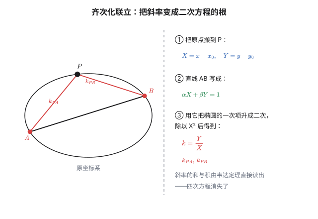

### 走一道真题

2017 年全国 I 卷理数第 20 题：椭圆 $C:\frac{x^2}4+y^2=1$，$P(0,1)$ 是上顶点。不经过 $P$ 的直线 $l$ 与 $C$ 交于 $A,B$ 两点，且 $k_{PA}+k_{PB}=-1$，求证 $l$ 过定点。

代入上面的一般式：$a^2=4$，$b^2=1$，$x_0=0$，$y_0=1$。

$$k_{PA}+k_{PB}=-\frac{2\alpha}{1+2\beta}$$

令它等于 $-1$：

$$2\alpha=1+2\beta\quad\Longrightarrow\quad \alpha=\frac{1+2\beta}2$$

回到直线方程 $\alpha X+\beta Y=1$，把 $X=x$、$Y=y-1$ 和 $\alpha$ 一起代进去：

$$\frac{1+2\beta}2x+\beta(y-1)=1\quad\Longrightarrow\quad \frac x2+\beta\left(x+y-1\right)=1$$

要让它对**任意** $\beta$ 都过同一个点，就得让 $\beta$ 那一项失效：

$$x+y-1=0,\qquad \frac x2=1$$

解得 $x=2$、$y=-1$。**定点是 $(2,-1)$。**

常规解法到这里要联立、算判别式、处理四次方程；齐次化只用了韦达定理一次。

### 斜率双用与翻转斜率

齐次化解决的是"同一个点引出的两条弦"。另外两种情形各有对应的技巧。

**斜率双用**说的是：同一条斜率，用两组点各写一次，两式相减，二次项自动消掉。上篇的点差法就是它的最简形式——$A$、$B$ 都在椭圆上，两个方程相减，$x^2$ 和 $y^2$ 同时消失，只剩一次关系。当题目里"在椭圆上"的点有三个、四个时，就反复用这个动作，把二次项逐层削光。

**翻转斜率**解决的是"非对称条件"。比如这道：

> 椭圆 $\frac{x^2}4+\frac{y^2}3=1$ 的左右顶点是 $A(-2,0)$、$B(2,0)$，$P,Q$ 在椭圆上且 $k_{AP}=2k_{BQ}$，求证 $PQ$ 过定点。

$k_{AP}$ 和 $k_{BQ}$ 是两条**不同点**引出的弦，条件不对称，齐次化直接用不上。但上篇的第三定义说：椭圆上任意点 $P$ 到一对关于中心对称的点 $A,B$ 的连线斜率之积是定值：

$$k_{AP}\cdot k_{BP}=-\frac{b^2}{a^2}=-\frac34$$

这就把 $k_{AP}$ "翻转"成一个关于 $B$ 的量：$k_{BP}=-\frac34\big/k_{AP}=-\frac3{8k_{BQ}}$，于是

$$k_{BP}\cdot k_{BQ}=-\frac38$$

**条件从"两点对两点"变成了"同一个点 $B$ 引出的两条弦"**——正好是齐次化的射程。接下来的步骤与上面那道真题完全一样。

三件工具的分工可以这样记：

| 情形 | 工具 |
|---|---|
| 同一个点引出两条弦，已知和或积 | 齐次化联立 |
| 多个点在同一条二次曲线上 | 斜率双用（反复相减） |
| 条件涉及两组不同的点，不对称 | 先用第三定义翻转，再齐次化 |

## 二、仿射变换：把椭圆变回圆

上篇第三定义里有句话："椭圆可以把圆压扁得到。"这一节把"压扁"变成一个**正经的工具**。

考虑变换

$$T:\ (x,y)\ \longmapsto\ \left(x,\ \frac ab\,y\right)$$

它把椭圆 $\frac{x^2}{a^2}+\frac{y^2}{b^2}=1$ 上的点送到哪里？代入验证：$x^2+\left(\frac ab y\right)^2=a^2\frac{x^2}{a^2}+a^2\frac{y^2}{b^2}=a^2$，落在圆 $x^2+y^2=a^2$ 上。

反过来（从圆到椭圆）就是**在 $y$ 方向压缩 $\frac ba$ 倍**。

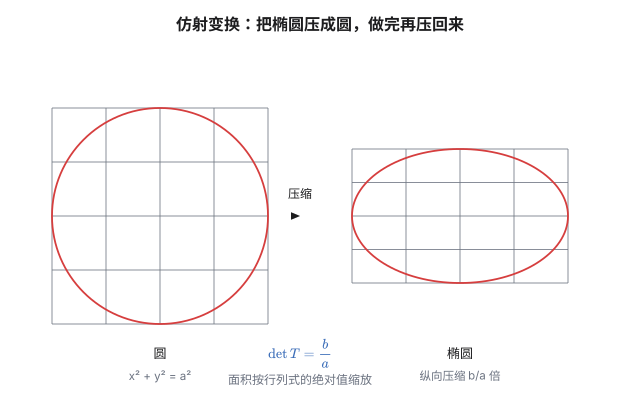

关键在于**什么被保留、什么被破坏**：

| 保留 | 破坏 |
|---|---|
| 共线、平行 | 长度 |
| 中点 | 角度 |
| 同一直线上的比例 | 垂直 |
| 相切、相交重数 | 圆（圆会变成椭圆） |
| **面积按固定比例 $b/a$ 缩放** | |

有了这张表，很多"椭圆里的最值问题"可以**搬到圆里做**——因为圆是我们最熟悉的图形。

**内接三角形的最大面积。** 圆内接三角形面积最大时是正三角形，面积 $\frac{3\sqrt3}4a^2$。压缩回椭圆，面积乘以 $\frac ba$：

$$S_{\max}=\frac{3\sqrt3}4a^2\cdot\frac ba=\frac{3\sqrt3}4ab$$

不用写一行解析几何。

**内接四边形**同理：圆里最大的是正方形，面积 $2a^2$，压回椭圆得 $2ab$。

**连点差法也能一眼看穿。** 垂径定理说：圆里弦与中点连线的斜率之积是 $-1$：

$$k'_{AB}\cdot k'_{OM}=-1$$

而斜率在纵向压缩下怎么变？$\frac{dy}{dx}\to\frac{b}{a}\frac{dy}{dx}$，即每条斜率都乘了 $\frac ba$。两条斜率相乘就乘了 $\left(\frac ba\right)^2$：

$$k_{AB}\cdot k_{OM}=\left(\frac ba\right)^2\cdot(-1)=-\frac{b^2}{a^2}$$

**上篇用两个方程相减辛苦推出来的结论，在这里是一行。** 这就是"找到对的变换"的回报。

## 三、极坐标与参数方程

### 以焦点为极点的极坐标

上篇求焦点弦时已经用过，这里正式写下来。以右焦点 $F_2$ 为极点、从 $F_2$ 指向 $x$ 轴正方向为极轴，椭圆上的点满足

$$r=\frac{a(1-e^2)}{1+e\cos\theta}=\frac{b^2/a}{1+e\cos\theta}$$

分子的 $l=\frac{b^2}a$ 是半通径。这个式子的好用之处前面已经展示过（弦长、倒数和），它的本质是：**第二定义的极坐标写法**——分子是"到准线的比例关系"，分母里的 $e\cos\theta$ 就是"到准线距离"的极坐标表达。

### 参数方程与"离心角"

椭圆的参数方程是

$$x=a\cos t,\qquad y=b\sin t$$

它来自第一节那个压缩变换：圆上的点 $(a\cos t,\ a\sin t)$ 纵向压扁 $b/a$ 倍就得到它。

**这里有个极常见的误解：$t$ 不是极角。**

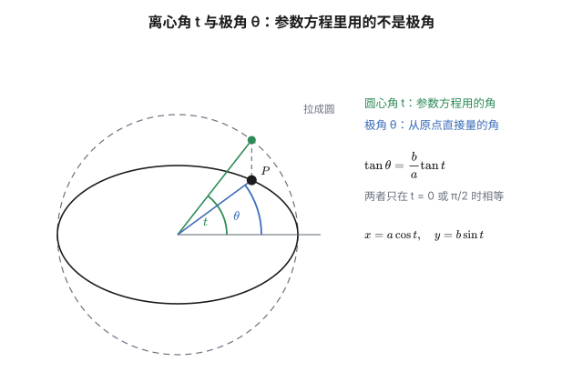

从原点到 $P$ 的实际极角 $\theta$ 满足 $\tan\theta=\dfrac{b\sin t}{a\cos t}=\dfrac ba\tan t$，**只有当 $t=0$ 或 $\frac\pi2$ 时两者相等**。所以用参数方程时，$t$ 是"先把椭圆拉成圆、在圆上量出来的角"，叫**离心角**。

这个区别在求最值时很要紧。举一个：

> 求椭圆 $\frac{x^2}{a^2}+\frac{y^2}{b^2}=1$ 上的点到直线 $Ax+By+C=0$ 距离的最大值。

用参数方程代入（而不是用极角）：

$$d=\frac{|Aa\cos t+Bb\sin t+C|}{\sqrt{A^2+B^2}}=\frac{\left|\sqrt{A^2a^2+B^2b^2}\,\sin(t+\varphi)+C\right|}{\sqrt{A^2+B^2}}$$

一行化成单个正弦，最值直接读出来。**如果误用极角，$t$ 和 $\theta$ 混起来，结果一定错。**

### 共轭直径：被压扁的“垂直”

过中心的弦叫**直径**，它有两个端点 $\pm P$。取 $P=(a\cos t,\,b\sin t)$，再取参数为 $t+\frac\pi2$ 的点 $Q=(-a\sin t,\,b\cos t)$，两条直径 $OP$、$OQ$ 称为一对**共轭直径**。名字的来历：$P$ 处的切线恰好平行于 $OQ$。

验证只要一行。上篇已经得到 $P$ 处的切线方程 $\frac{x\cos t}{a}+\frac{y\sin t}{b}=1$，斜率是 $-\frac{b\cos t}{a\sin t}$；而 $OQ$ 的斜率是 $\frac{b\cos t}{-a\sin t}$，相等。

对圆来说，“切线平行于另一条半径”说的就是两条半径互相垂直。压缩破坏垂直、却保住平行与相切，于是圆里每一对互相垂直的直径，压扁后都成了椭圆的一对共轭直径——**共轭是“垂直”在仿射变换下的幸存者**。这个概念是阿波罗尼奥斯（约公元前 200 年）在《圆锥曲线论》里立起来的，他还顺手留下两个“定值”：

$$|OP|^2+|OQ|^2=a^2+b^2,\qquad S_{OP\cdot OQ}=ab$$

第一个：$|OP|^2=a^2\cos^2t+b^2\sin^2t$ 与 $|OQ|^2=a^2\sin^2t+b^2\cos^2t$ 相加，$\sin^2t$ 与 $\cos^2t$ 各自归位。第二个：以 $OP$、$OQ$ 为邻边的平行四边形面积是 $|x_Py_Q-y_Px_Q|=ab\,|\cos^2t+\sin^2t|=ab$。两个都与 $t$ 无关——不管挑哪一对共轭直径，答案都一样。

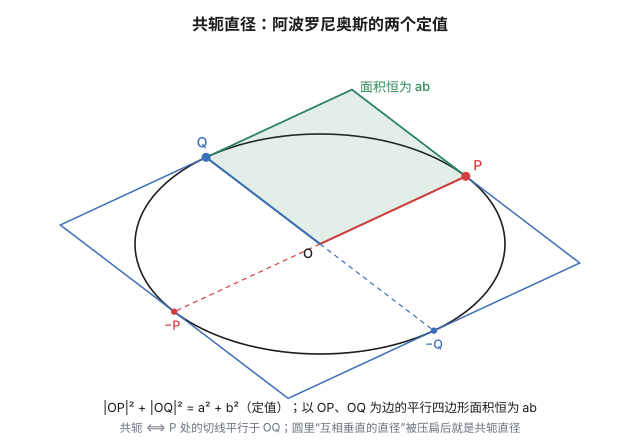

顺带一个漂亮的读法：上图中以 $\pm P$、$\pm Q$ 处切线围出的蓝色平行四边形，面积恰是 $4ab$——它正是圆的外切正方形被压扁后的样子（$a=b$ 时四条边的交点回到外切正方形的顶点，恰好落在蒙日圆上，呼应第六节）。

## 四、极点与极线

这一节把"切线"这个概念推到一个更一般的位置。

给定椭圆 $\frac{x^2}{a^2}+\frac{y^2}{b^2}=1$ 和一点 $P(x_0,y_0)$，称直线

$$\frac{x_0x}{a^2}+\frac{y_0y}{b^2}=1$$

为 $P$ 关于椭圆的**极线**，$P$ 是这条直线的**极点**。

看着眼熟——它就是"切线方程"把 $x^2$ 换成 $x_0x$、$y^2$ 换成 $y_0y$ 的产物。但它的意义远不止切线：

| $P$ 的位置 | 极线的身份 |
|---|---|
| 在椭圆上 | 过 $P$ 的**切线** |
| 在椭圆外 | 从 $P$ 引两条切线的**切点弦** |
| 在椭圆内 | 一条与椭圆无交点的直线 |

第二种情形最有实用价值：**不用求切点，直接写出切点弦。**

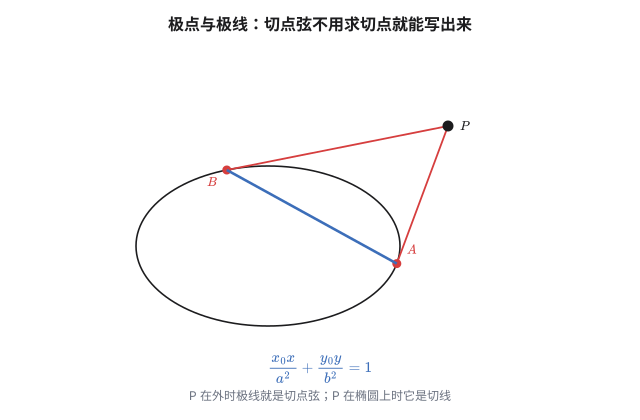

还有一条漂亮的对称性，叫**配极原则**：

$$P \text{ 在 } Q \text{ 的极线上}\iff Q \text{ 在 } P \text{ 的极线上}$$

它把"点在直线上"这种关系，变成了极点和极线之间的一次对称交换。很多"证明三点共线"的题目，用配极原则可以把直线关系翻译成极线关系，一步到位。

## 五、帕斯卡与布里昂雄：射影几何的两颗明珠

前面几节都在讲"怎么算"。这一节换个口味，讲一个**只靠位置关系、不靠长度和角度**的定理——它是整个圆锥曲线理论里最漂亮的结果之一。

### 帕斯卡的神秘六边形

1639 年，十六岁的帕斯卡写下一条定理：

> 圆锥曲线的内接六边形 $ABCDEF$ 中，三组对边的交点共线。

具体说，设

$$AB\cap DE=X,\qquad BC\cap EF=Y,\qquad CD\cap FA=Z$$

则 $X,Y,Z$ 三点共线。这条线叫**帕斯卡线**。

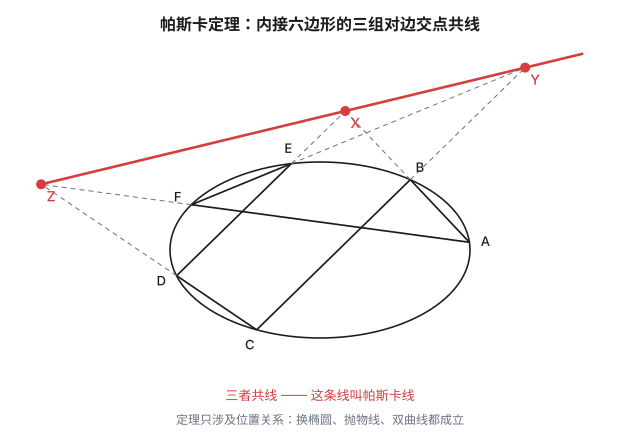

注意这里出现的全部概念——"点在曲线上""两线相交""三点共线"——**都不涉及长度、角度或平行**。这是它最惊人的地方：一条完全由位置关系表述的定理，对**所有**圆锥曲线都成立。帕斯卡自己给它起名叫"神秘六边形"（hexagramma mysticum）。

**换个曲线，结论照旧。** 把椭圆换成抛物线、双曲线，甚至换成**退化成两条直线**的圆锥曲线，帕斯卡定理依然成立。而最后这个退化情形，恰好是另一条古老定理：

> **巴普斯定理**（Pappus，公元 4 世纪）：$A,B,C$ 在直线 $l_1$ 上，$a,b,c$ 在直线 $l_2$ 上，则 $Ab\cap aB$、$Bc\cap bC$、$Ca\cap cA$ 三点共线。

也就是说，**公元 4 世纪的巴普斯定理，是 1639 年帕斯卡定理的一个退化情形**。数学史里这种"一千三百年后才发现：原以为的孤例其实是通例"的桥段，总是让人愉快。

### 在圆上把它证掉

帕斯卡定理的初等证明分两步走：**先在圆上证掉，再把结论"搬运"到任意圆锥曲线上。** 圆上的证明只需要两件高中就见过的工具——**梅涅劳斯定理**（三角形三边上各取一点，三点共线 $\iff$ 三个有向线段比之积为 $1$）和**割线定理**（从一点引两条割线：$UA\cdot UB=UC\cdot UD$）。线段一律带方向。

设 $A,B,C,D,E,F$ 在圆上，$X=AB\cap DE$，$Y=BC\cap EF$，$Z=CD\cap FA$。

**第一步，搭辅助三角形。** 取三双"隔开"的边所在直线，让它们围出一个三角形：

$$U=AB\cap CD,\qquad V=CD\cap EF,\qquad W=EF\cap AB$$

于是边 $AB$、$CD$、$EF$ 成了三角形的三条边所在直线：$A,B,X$ 落在 $WU$ 上，$C,D,Z$ 落在 $UV$ 上，$E,F,Y$ 落在 $VW$ 上。

**第二步，梅涅劳斯三次。** 六边形剩下的三条边 $DE$、$BC$、$FA$ 恰好都是三角形 $UVW$ 的截线（各穿过三条边所在直线）：

$$\begin{aligned}
\text{截线 }DE&:\quad \frac{UD}{DV}\cdot\frac{VE}{EW}\cdot\frac{WX}{XU}=1\\
\text{截线 }BC&:\quad \frac{UC}{CV}\cdot\frac{VY}{YW}\cdot\frac{WB}{BU}=1\\
\text{截线 }FA&:\quad \frac{UZ}{ZV}\cdot\frac{VF}{FW}\cdot\frac{WA}{AU}=1
\end{aligned}$$

**第三步，解出目标比值。** 要证 $X,Y,Z$ 共线，按梅涅劳斯的形状，即证

$$\frac{UX}{XW}\cdot\frac{WY}{YV}\cdot\frac{VZ}{ZU}=1$$

从上面三式分别把含 $X$、$Y$、$Z$ 的比值解出来，取倒数后代入，乘积恰好重组为

$$\frac{UD\cdot UC}{DV\cdot CV}\cdot\frac{VE\cdot VF}{EW\cdot FW}\cdot\frac{WA\cdot WB}{UA\cdot UB}$$

**第四步，割线定理收尾。** $U,V,W$ 三点各向圆引了两条割线：

$$UC\cdot UD=UA\cdot UB,\qquad VC\cdot VD=VE\cdot VF,\qquad WE\cdot WF=WA\cdot WB$$

代回去，三个因子依次等于 $\dfrac{\text{Pow}(U)}{\text{Pow}(V)}$、$\dfrac{\text{Pow}(V)}{\text{Pow}(W)}$、$\dfrac{\text{Pow}(W)}{\text{Pow}(U)}$（$\text{Pow}$ 表示该点对圆的幂）——**连乘为 $1$**。由梅涅劳斯逆定理，$X,Y,Z$ 共线。$\blacksquare$

三个"幂"像约分一样互相抵消，这是这条证明最漂亮的地方：帕斯卡定理藏得再深，也不过是梅涅劳斯与割线定理的三次握手。

**一般圆锥曲线呢？** 任意圆锥曲线都可以经射影变换变成圆，而射影变换保持"点在直线上"这类关联关系（第七节）——整个证明原样搬运。这也解释了帕斯卡定理的"怪"：它对长度、角度、形状一律不敏感，因为它从头到尾只活在关联关系的世界里。（对边平行时交点落在无穷远，按射影惯例处理即可，结论不变。）

### 让顶点重合会怎样

帕斯卡定理还有一整族漂亮的退化形式。让相邻两个顶点趋于重合，那条边就变成了**切线**：

> 内接五边形 $ABCDE$ 中，过 $A$ 的切线与 $CD$ 的交点、$AB\cap DE$、$BC\cap EA$ —— 三点共线。

四边形版本（两对顶点同时重合）：内接四边形 $ABCD$，则 $AB\cap CD$、$BC\cap DA$，与过 $B$、$D$ 的两条切线的交点——三点共线。事实上把过 $A$、$C$ 的切线交点也算进来，是**四点共线**：这条线恰好是对角线交点 $AC\cap BD$ 的极线，第四节的配极原则在这里如约而至。

三角形版本（三对全重合）：内接三角形 $ABC$ 的三条切线，各与**对边**相交——$t_A\cap BC$、$t_B\cap CA$、$t_C\cap AB$ —— 三点共线。

每一个长相都很不一样，但都是同一条定理穿了不同的衣服。这批退化形式在 18 世纪 30 年代由 Braikenridge 与 Maclaurin（就是那个麦克劳林展开的麦克劳林）独立研究透，离帕斯卡写下原定理已近百年。

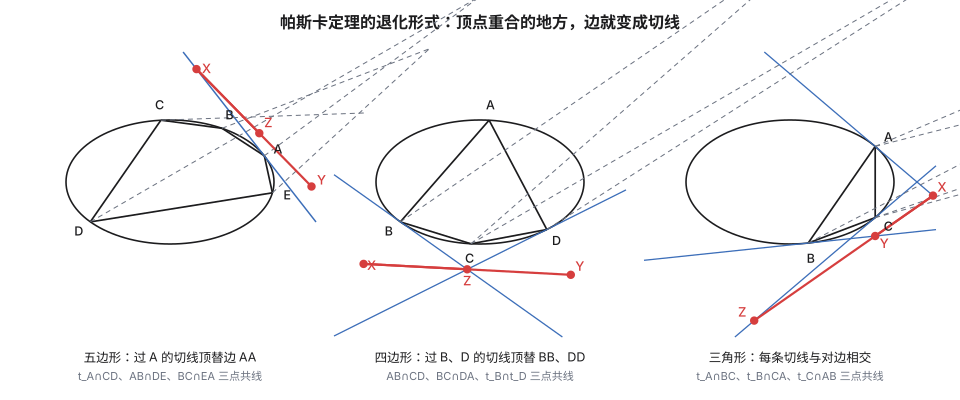

### 60 条帕斯卡线

六个定点能排出多少个六边形？$6!=720$ 种排列。但沿着同一个圈走，起点有 $6$ 种选法、方向有 $2$ 种，给的都是同一个六边形：$720\div12=60$。**每个六边形配一条帕斯卡线，一共 60 条。**

这 60 条线挤在同一张图里，却毫不混乱：它们三三共点，交出 20 个**施泰纳点**；换一种配对方式再交，又得到 15 个**柯克曼点**。施泰纳、柯克曼、凯莱……十九世纪一批最好的几何学家花了几十年才把这张网数清楚。帕斯卡给起的名字——**神秘六边形**（hexagramma mysticum）——一点也不夸张。

### 对偶的另一半：布里昂雄定理

167 年后的 1806 年，布里昂雄（Charles Julien Brianchon）证明了这样一条：

> 圆锥曲线的外切六边形中，连接对顶点的三条主对角线**共点**。

它和帕斯卡定理的关系，正是第四节那套**极点极线对偶**：

| 帕斯卡（内接） | 布里昂雄（外切） |
|---|---|
| 顶点在曲线上 | 边与曲线相切 |
| 两条边的交点 | 两个顶点的连线 |
| 三点共线 | 三线共点 |

把帕斯卡定理里的每个概念换成右列那一个，得到的就是布里昂雄定理——**它不是另一条定理，而是同一条定理的镜像**。对偶原理真正被说清楚要等到 19 世纪（Poncelet、Plücker 那一代人），但这两条定理早在它之前就把这件事演示了一遍。

### 布里昂雄不用单独证

镜像是真的可以"照"出来——那面镜子就是第四节的极点极线。

设外切六边形 $ABCDEF$ 的六条边各切椭圆于 $A',B',C',D',E',F'$（边 $AB$ 切于 $A'$，以此类推）。顶点 $B$ 是相邻两条切线的交点，而"过曲线外一点的两切线的切点弦"正是该点的极线（第四节）——所以顶点 $B$ 恰是**切点弦 $A'B'$ 的极点**；同样，$E$ 是 $D'E'$ 的极点。主对角线 $BE$ 联结着两个极点。

现在对切点六边形 $A'B'C'D'E'F'$ 用帕斯卡定理：三组对边的交点之一是 $X'=A'B'\cap D'E'$。$X'$ 既在 $A'B'$ 上、又在 $D'E'$ 上，由配极原则（$Q$ 在 $P$ 的极线上 $\iff$ $P$ 在 $Q$ 的极线上），$A'B'$ 的极点 $B$ 与 $D'E'$ 的极点 $E$ 都落在 $X'$ 的极线上——**主对角线 $BE$ 恰好就是 $X'$ 的极线**。

记切点六边形的帕斯卡线为 $l$（三条连线共线的那条），$P$ 为 $l$ 的极点。因为 $X'\in l$，配极原则给出 $P\in X'$ 的极线 $=BE$：**主对角线 $BE$ 过 $P$**。同理 $AD$、$CF$ 也过 $P$。三条主对角线共点得证——而且连**共点是谁**都指了出来：帕斯卡线的极点。$\blacksquare$

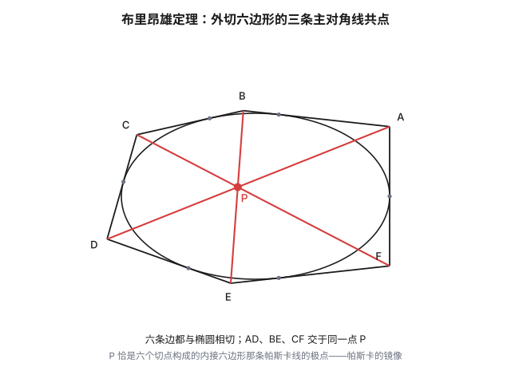

### 再往外一步：庞斯莱的闭合游走

帕斯卡与布里昂雄说的都是"一次驻留"：一个六边形，三条线。庞斯莱 1822 年的**闭链定理**（Poncelet porism）往前迈了一大步：若存在一个 $n$ 边形同时内接于一条圆锥曲线、外切于另一条，那么从外曲线上**任意一点**出发都能走出这样的闭合 $n$ 边形——这样的 $n$ 边形有无穷多个。

同时满足"内接"与"外切"两套约束还能闭合，绝不是巧合，而是一种深刻的结构（它的现代说法连着椭圆曲线理论）。帕斯卡定理处理的那点"关联关系"，正是这条宏大定理脚下最起初的地基。

## 六、两个拓展结论

### 蒙日圆

椭圆的两条**互相垂直**的切线，交点轨迹是什么？

设交点 $P(x_0,y_0)$，过 $P$ 的切线写 $y=kx+m$，则 $m=y_0-kx_0$。与椭圆相切的条件是 $m^2=a^2k^2+b^2$，代入：

$$(y_0-kx_0)^2=a^2k^2+b^2$$

整理成关于 $k$ 的二次方程：

$$\left(x_0^2-a^2\right)k^2-2x_0y_0\,k+\left(y_0^2-b^2\right)=0$$

它的两根就是过 $P$ 的两条切线的斜率。而"两条切线互相垂直"翻译成 $k_1k_2=-1$，用韦达：

$$\frac{y_0^2-b^2}{x_0^2-a^2}=-1\quad\Longrightarrow\quad x_0^2+y_0^2=a^2+b^2$$

**交点始终落在以中心为圆心、半径 $\sqrt{a^2+b^2}$ 的圆上**——这就是蒙日圆。

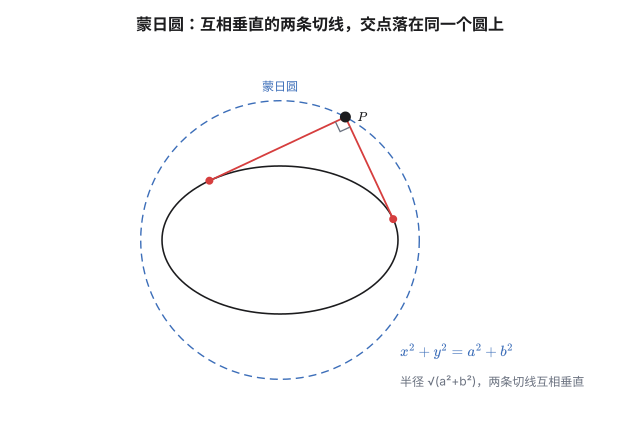

（顺带一提：$a=b$ 时椭圆退化成圆，蒙日圆半径变成 $\sqrt2a$，正是"外接正方形顶点"到中心的距离。）

### 圆与椭圆的交点

如果圆和椭圆**同心**，交点问题很简单：椭圆 $\frac{x^2}{a^2}+\frac{y^2}{b^2}=1$ 与圆 $x^2+y^2=r^2$ 若有四个交点，由对称性，它们必然构成一个**矩形**——两条对角线过中心，四条边分别平行于坐标轴。

但圆和椭圆**不同心**时，事情没有想象中那么美好。两圆相交时有个标准工具叫**根轴**：两个圆方程相减，二次项 $x^2+y^2$ 互相抵消，直接得到公共弦所在直线。很多人会顺手把这个办法搬到"圆与椭圆"上——**这是错的**。

原因很直接：圆的二次项系数是 $(1,1)$，椭圆（乘 $a^2$ 后）是 $\left(1,\frac{a^2}{b^2}\right)$，**只有当 $a=b$ 时才成比例**，否则怎么线性组合都消不掉二次项。所以圆与椭圆的交点问题没有"根轴"，只能联立硬算，或者用下面第六节的矩阵语言换个角度理解它。

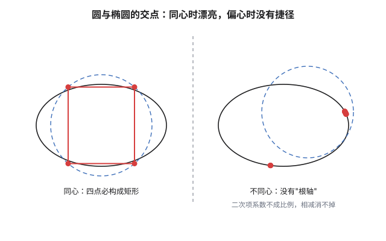

## 七、线性代数视角

前面五节讲了五套方法，各有各的适用范围。这一节给出一个把它们**装进同一个盒子**的语言。

### 椭圆就是二次型

椭圆 $\frac{x^2}{a^2}+\frac{y^2}{b^2}=1$ 可以写成

$$\mathbf x^{\mathsf T}A\,\mathbf x=1,\qquad \mathbf x=\binom xy,\qquad A=\begin{pmatrix}\frac1{a^2}&0\\0&\frac1{b^2}\end{pmatrix}$$

$A$ 是**对称正定矩阵**，椭圆就是"二次型取值为 1 的等值线"。

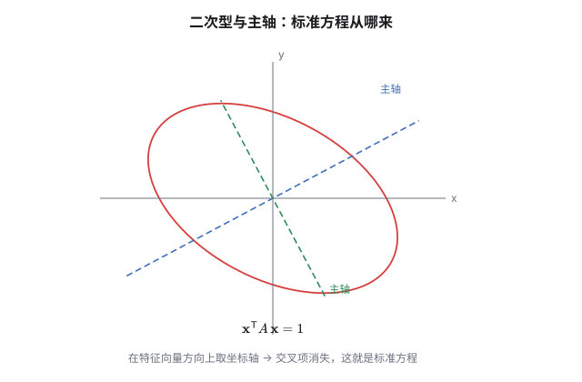

### 主轴定理：标准方程为什么能这么写

一般的二次曲线长这样：

$$ax^2+2bxy+cy^2+dx+ey+f=0$$

那个**交叉项 $2bxy$** 意味着图形是斜的。而"标准方程"里没有交叉项——凭什么？

因为对称矩阵可以**正交对角化**。设 $A=\begin{pmatrix}a&b\\b&c\end{pmatrix}$，则存在正交矩阵 $Q$ 使

$$A=Q\Lambda Q^{\mathsf T},\qquad \Lambda=\begin{pmatrix}\lambda_1&0\\0&\lambda_2\end{pmatrix}$$

令 $\mathbf y=Q^{\mathsf T}\mathbf x$（这是**旋转**，因为 $Q$ 正交），二次型就变成

$$\mathbf x^{\mathsf T}A\mathbf x=\mathbf y^{\mathsf T}\Lambda\mathbf y=\lambda_1y_1^2+\lambda_2y_2^2$$

**交叉项消失了。** 这就是"标准方程"的来源：它不过是在**特征向量方向**上选了一组坐标轴。椭圆的两条对称轴（主轴）正是 $A$ 的特征向量方向，两个特征值决定两个半轴的长度（$\lambda_i=\frac1{\text{半轴}^2}$）。

顺带一句：特征值**同号**是椭圆（都是正的，或者都是负的则为虚椭圆），**异号**是双曲线，**有一个为零**是抛物线——三种圆锥曲线在这里被三个符号情形统一了。这也是为什么当初把抛物线"夹在"椭圆和双曲线之间是有道理的。

### 极线就是双线性形式

第四节那条极线方程 $\frac{x_0x}{a^2}+\frac{y_0y}{b^2}=1$，用矩阵写就是

$$\mathbf x_0^{\mathsf T}A\,\mathbf x=1$$

**这是二次型对应的双线性形式。** 看它的对称性：把 $\mathbf x_0$ 和 $\mathbf x$ 换一下，式子不变——这就直接解释了配极原则，也解释了为什么极线方程长得像"把平方拆成两半"：$x^2$ 拆成 $x_0x$、$y^2$ 拆成 $y_0y$。那不是记忆口诀，那是双线性形式在 (1,1) 位置的取值。

### 仿射变换也是矩阵

第二节那个压缩 $T:(x,y)\mapsto\left(x,\frac b ay\right)$，写成矩阵是

$$T=\begin{pmatrix}1&0\\0&\frac ba\end{pmatrix},\qquad \det T=\frac ba$$

**行列式就是面积比。** 前面说"面积按 $b/a$ 缩放"，在线性代数里这个 $b/a$ 有名字，叫行列式。仿射变换保持共线、平行、中点、比例，是因为这些性质只依赖**线性结构**；它破坏长度和角度，是因为这些性质依赖**度量的结构**。

### 再往外一步：射影视角

如果连"平行"都不要求保留，就进入**射影几何**。在射影平面上，三种圆锥曲线其实是同一类东西，区别只在于它们与**无穷远直线**的关系：

| 曲线 | 与无穷远直线 |
|---|---|
| 椭圆 | 不相交 |
| 抛物线 | 相切 |
| 双曲线 | 相交于两点 |

所以"椭圆、抛物线、双曲线"这个分类，本质上是"相对于无穷远的位置关系"的分类。这套想法是 19 世纪的射影几何留下的，第四节那些极点极线的漂亮性质，都属于它。

## 尾声：同一件事的七种说法

回头看这篇的路：

- **齐次化联立**：把原点搬到定点，用直线方程升次，让斜率直接成为方程的根；
- **斜率双用与翻转斜率**：反复"相减"消去二次项；用第三定义把不对称的条件翻成对称；
- **仿射变换**：把椭圆压成圆，做完再压回来，面积差一个 $b/a$；
- **极坐标与参数方程**：换一套坐标语言，把几何关系翻译成三角；
- **极点与极线**：把切线推广成一个对偶结构；
- **帕斯卡与布里昂雄**：只靠位置关系成立的定理，是整个理论的皇冠——圆上的证明只是梅涅劳斯与割线定理的三次握手，布里昂雄则由配极原则白送；
- **线性代数**：二次型、主轴定理、双线性形式、行列式、射影分类。

第七节不是"更难的一节"，而是**前面六节的地图**。椭圆是二次型 $\mathbf x^{\mathsf T}A\mathbf x=1$，这句话里已经包含了标准方程为什么长那样（主轴定理）、极线为什么长那样（双线性形式）、仿射变换为什么保面积比（行列式）。前面那些看起来各显神通的技巧，在这个视角下都是同一件事的不同侧面。

## 相关阅读

- 上一篇：[《椭圆（上）：从三个定义说起》](post.html?slug=ellipse-basics)——三个定义、准线、点差法、弦长公式、焦点弦与切线的光学性质。
- 下一篇：[《圆锥曲线：六个系数里的三个数》](post.html?slug=conic-general)——跳出椭圆，正面处理一般的六项式：中心为什么是梯度零点、主轴为什么是特征向量，以及六个系数里的三个不变量怎样直接给出类型与离心率。
- [Pascal's theorem](https://en.wikipedia.org/wiki/Pascal%27s_theorem)（Wikipedia）：神秘六边形、60 条帕斯卡线与更多退化形式。
- [Poncelet's porism](https://en.wikipedia.org/wiki/Poncelet%27s_porism)（Wikipedia）：闭链定理的陈述与历史。
- [Ellipse](https://en.wikipedia.org/wiki/Ellipse)（Wikipedia）：极点极线、蒙日圆等专题的参考。
- [Conic section](https://en.wikipedia.org/wiki/Conic_section)（Wikipedia）：圆锥曲线的射影分类与历史。

> [!detail] 技术细节
> **1. 齐次化为什么要求直线不过 $P$。** 直线 $AB$ 写成 $\alpha X+\beta Y=1$ 的前提是它不过原点（即不过 $P$）。若 $AB$ 恰好过 $P$，那 $P$ 也是交点，$\alpha,\beta$ 归一化就失效了——这时应当单独讨论：过 $P$ 的弦只能有一条（除了切线），问题会退化。答题时这一步要交代清楚。
>
> **2. 一般位置的齐次化。** 若定点 $P$ 不在椭圆上（比如 $P$ 在外），平移后椭圆方程里会出现常数项，需先把常数项也吸收进"升次"里；做法是用直线方程的两个方向分解，或改用"以 $P$ 为中心的极坐标"。这里不展开，但要注意齐次化的前提是 $P$ 在曲线上。
>
> **3. 斜率不存在的情形。** 齐次化用的是 $k=Y/X$，隐含了 $X\ne0$。若某条弦竖直（$X=0$），它对应的 $k=\infty$，此时应当改用 $k'=X/Y$ 再走一遍，或者单独验证。这也是为什么用齐次化时最好最后代回检验。
>
> **4. 仿射变换下面积比的证明。** 变换 $T=\begin{pmatrix}1&0\\0&b/a\end{pmatrix}$ 的雅可比行列式为 $\frac ba$，所以任意区域的面积按 $|\det T|$ 缩放。这与"换元法里 $dxdy$ 要乘雅可比行列式"是同一件事。
>
> **5. 蒙日圆的两条切线的斜率之积。** 推导里用到"过 $P$ 的两条切线斜率 $k_1,k_2$ 满足 $k_1k_2=\frac{y_0^2-b^2}{x_0^2-a^2}$"。若 $x_0^2=a^2$（$P$ 在长轴端点的竖直线上），该式退化，此时一条切线竖直（斜率不存在）、另一条水平，$k_1k_2=-1$ 仍然成立，可直接验证。
>
> **6. 极线的代数定义与几何定义等价。** 代数定义即 $\mathbf x_0^{\mathsf T}A\mathbf x=1$；几何定义是"从 $P$ 引两条切线、切点连线"。两者等价性的证明要用到切线方程：设切点 $Q$，则切线为 $\mathbf{q}^{\mathsf T}A\mathbf{x}=1$，$P$ 在其上 $\iff\mathbf q^{\mathsf T}A\mathbf x_0=1\iff\mathbf x_0^{\mathsf T}A\mathbf q=1$，即 $Q$ 在 $P$ 的极线上——这一步同时证明了配极原则。
>
> **7. 梅涅劳斯与割线定理的方向约定。** 两处的线段都取有向长度：在每条直线上先指定一个正方向，反方向的线段取负值。帕斯卡定理的证明里，三条截线的六个"分点"有的在边的延长线上，不引入方向就没法统一叙述。对边平行时交点成为无穷远点，有向比的极限意义照常运转；初等场合若遇到平行，把那一组单独讨论即可（往往更短）。
>
> **8. 60 的计数。** $6!/12$ 中的 $12=6\times2$：沿同一个六边形走，起点 $6$ 种、绕向 $2$ 种。交换顶点次序会改变"对边"的配对方式，从而改变帕斯卡线——60 就是所有不同配对方式的总数。三三共点的 20 个施泰纳点（Steiner，1845）与 15 个柯克曼点（Kirkman，1849）之后，还有 20 条 Cayley–Salmon 线、15 条 Plücker 线，构成一张至今仍有人画图的巨型构形网。
>
> **9. 共轭直径的两个定值。** $\vec{OP}=(a\cos t,\,b\sin t)$，$\vec{OQ}=(-a\sin t,\,b\cos t)$。和式：$|OP|^2+|OQ|^2=a^2(\cos^2t+\sin^2t)+b^2(\sin^2t+\cos^2t)=a^2+b^2$。面积：$|x_Py_Q-y_Px_Q|=ab|\cos^2t+\sin^2t|=ab$。取 $a=b$ 退化成圆：和为 $2a^2$、面积为 $a^2$，正是"两条互相垂直的半径"的图景，与仿射压缩的出身相符。
