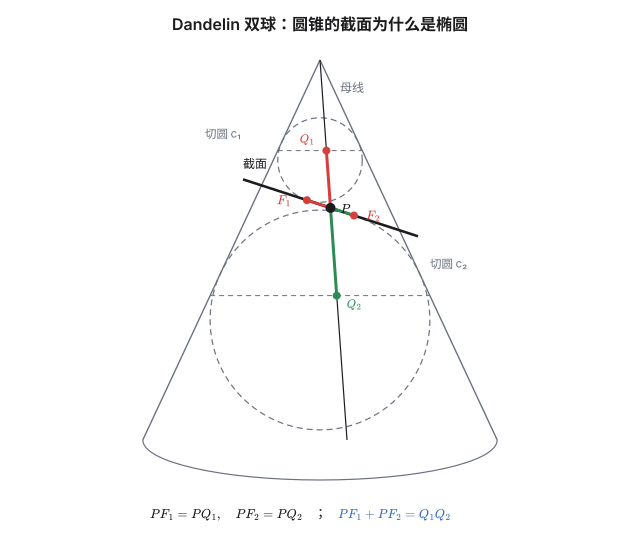
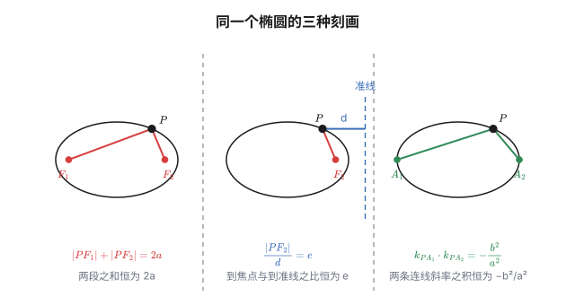
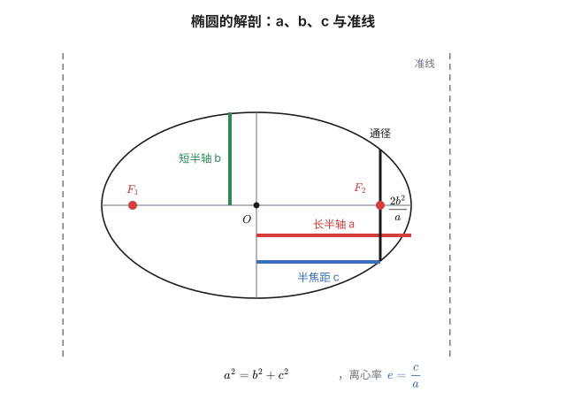
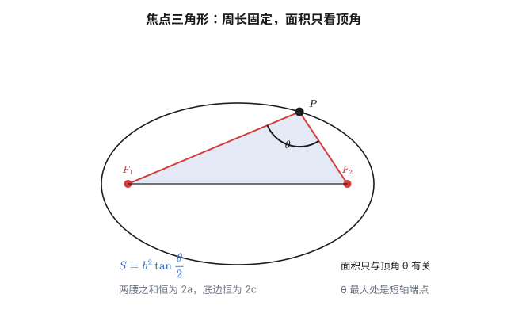
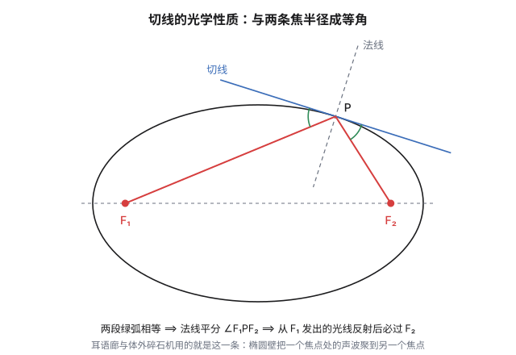
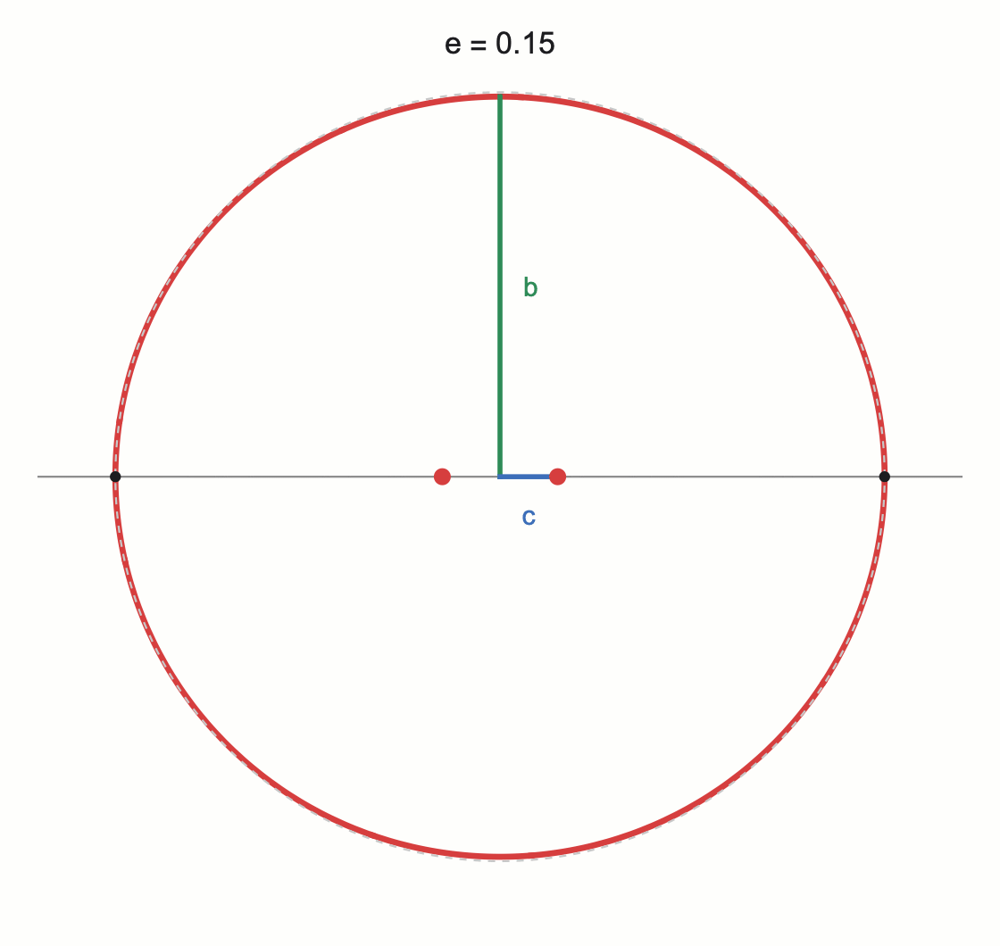
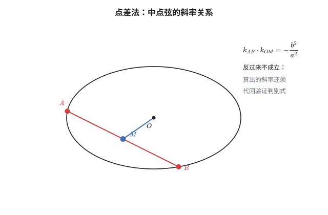
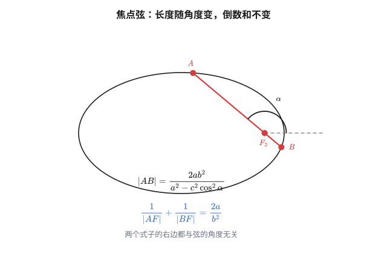

有一个说法流传很广：用平面去截圆锥，切口是一条椭圆。

这话对，但凭什么？圆锥是直边直底的，截面是平的，凭什么切出来的曲线弯曲得那么规整——以至于每个点到两个固定点的距离之和都恰好相等？

两千年前的古希腊人知道这是椭圆，但说不出为什么。答案要等到 1822 年，比利时人 Dandelin 往圆锥里塞了两个球。

## 引子：往圆锥里塞两个球

设平面与圆锥的轴成一个不太陡的角，切口是一个封闭的圈。现在在圆锥内部放两个球：一个从上往下塞，一个从下往上塞，让两个球都与圆锥面**内切**，同时**都与截面相切**。

设上球与截面的切点是 $F_1$，下球的切点是 $F_2$。设上球与圆锥面的切圆是 $c_1$，下球的是 $c_2$。

现在在截面上任取一点 $P$。过 $P$ 作圆锥的母线（就是那条从锥顶发出、经过 $P$ 再往下走的直线），它与两个切圆 $c_1$、$c_2$ 分别交于 $Q_1$、$Q_2$。

关键的一步来了：**$PF_1$ 和 $PQ_1$ 都是从同一点 $P$ 引向同一个球的两条切线段**（$F_1$ 是切点、$Q_1$ 也是切点），所以它们相等。同理 $PF_2=PQ_2$。于是

$$PF_1+PF_2=PQ_1+PQ_2=Q_1Q_2$$

而 $Q_1Q_2$ 是两个切圆之间那段母线的长度——它只跟圆锥和两个球有关，**与 $P$ 选在哪里完全无关**。

所以截面上每个点 $P$ 都满足 $PF_1+PF_2=$ 常数。这就是**椭圆的第一定义**——不是从定义出发去画图，而是从几何事实里把它挖了出来。

## 一、三个定义

### 第一定义：到两个定点的距离之和

> 平面内到两个定点 $F_1,F_2$ 的距离之和等于常数（大于 $|F_1F_2|$）的点的轨迹，叫**椭圆**。两个定点叫**焦点**。

记 $|PF_1|+|PF_2|=2a$，$|F_1F_2|=2c$，条件 $2a>2c$ 保证了轨迹是个封闭的圈而不是一条线段（当 $2a=2c$ 时，轨迹退化成线段 $F_1F_2$）。

把坐标系建在中点：$F_1(-c,0)$、$F_2(c,0)$，设 $P(x,y)$。则

$$\sqrt{(x+c)^2+y^2}+\sqrt{(x-c)^2+y^2}=2a$$

移项、平方两次（中间那次要小心，得先把一根根号孤立出来），整理到最后会得到一个干净的结果：

$$\frac{x^2}{a^2}+\frac{y^2}{b^2}=1,\qquad b^2=a^2-c^2$$

这就是**标准方程**。因为 $a>c$，所以 $b^2>0$，$b$ 是实数——它是怎么冒出来的，值得留意：**它本来只是"$a^2-c^2$"为了方便而被命名的一个量**，但在后文里会反复以几何面目出现（短半轴、准线位置、焦半径公式）。

### 第二定义：到焦点与到准线的距离之比

> 平面内到定点 $F$ 的距离与到定直线 $l$ 的距离之比等于常数 $e$（$0<e<1$）的点的轨迹，也是椭圆。

这条定义的好处是它**不偏心**：把 $e$ 改成 $1$ 就得到抛物线，改成大于 $1$ 就得到双曲线。三类圆锥曲线在这一条定义里统一了，$e$ 就是**离心率**。这一定义的细节留到第三节讲——因为它需要先知道"准线"在哪。

### 第三定义：到两顶点连线斜率之积

> 平面内到两个定点 $A_1(-a,0)$、$A_2(a,0)$ 的连线斜率之积等于常数 $-b^2/a^2$ 的点的轨迹，还是椭圆。

这条最容易被当成"巧合"，其实它是三兄弟里最有几何画面感的一个。验算一下：设 $P(x,y)$，则

$$k_{PA_1}\cdot k_{PA_2}=\frac{y}{x+a}\cdot\frac{y}{x-a}=\frac{y^2}{x^2-a^2}$$

把椭圆方程里的 $y^2=b^2\left(1-\frac{x^2}{a^2}\right)=\frac{b^2(a^2-x^2)}{a^2}$ 代进去：

$$k_{PA_1}\cdot k_{PA_2}=\frac{b^2(a^2-x^2)/a^2}{x^2-a^2}=-\frac{b^2}{a^2}$$

成了一个与 $P$ 无关的常数。

**它的意思是：椭圆可以把圆"压扁"得到。** 把单位圆 $x^2+y^2=a^2$ 在 $y$ 方向压缩到原来的 $b/a$ 倍，圆上每一点 $(a\cos t,\ a\sin t)$ 变成 $(a\cos t,\ b\sin t)$，斜率之积的关系正好变成 $-b^2/a^2$。圆的一切性质，只要在压缩下"活得下来"，就自动翻译成椭圆的性质——这个想法在下一篇会变成一件正经武器（仿射变换）。

## 二、椭圆的特征

标准方程 $\frac{x^2}{a^2}+\frac{y^2}{b^2}=1$（$a>b>0$）里一共有四个数，它们的关系是

$$c^2=a^2-b^2,\qquad e=\frac ca\in(0,1)$$

| 名称 | 记号 | 含义 |
|---|---|---|
| 长半轴 | $a$ | 顶点到中心的距离（横向） |
| 短半轴 | $b$ | 顶点到中心的距离（纵向） |
| 半焦距 | $c$ | 中心到焦点的距离 |
| 离心率 | $e=c/a$ | 形状参数，越接近 $1$ 越"扁" |

**离心率是"形状"而"大小"是"$a$"。** $e$ 只决定椭圆扁到什么程度：$e\to0$ 时椭圆趋向于圆（$b\to a$），$e\to1$ 时趋向于一条线段（$b\to0$）。而 $a$ 决定它有多大。这两个参数是独立的。

**焦半径公式。** 设 $P(x_0,y_0)$ 在椭圆上，则

$$|PF_1|=a+ex_0,\qquad |PF_2|=a-ex_0$$

（$F_1$ 是左焦点、$F_2$ 是右焦点。）验算：$P$ 在左顶点 $(-a,0)$ 时，到左焦点的距离应当是 $a-c=a(1-e)$，而公式给出 $a+e(-a)=a(1-e)$ ✓。

这两条式子把"两点间距离"变成了"一次式"，后面算焦点弦几乎全靠它。

**焦点三角形。** 设 $P$ 在椭圆上，$\theta=\angle F_1PF_2$，则三角形 $PF_1F_2$ 的

- 周长 $=2a+2c$（因为两腰之和恒为 $2a$，底边是 $2c$）；
- 面积 $S=b^2\tan\dfrac\theta2$。

面积公式推一下：由余弦定理

$$4c^2=|PF_1|^2+|PF_2|^2-2|PF_1||PF_2|\cos\theta=(2a)^2-2|PF_1||PF_2|(1+\cos\theta)$$

解出 $|PF_1|\cdot|PF_2|=\dfrac{2b^2}{1+\cos\theta}$，于是

$$S=\frac12|PF_1||PF_2|\sin\theta=b^2\cdot\frac{\sin\theta}{1+\cos\theta}=b^2\tan\frac\theta2$$

顺着这个式子还能白捡一个结论：$|PF_1|\cdot|PF_2|$ 最大时 $\theta$ 最大，而两腰之和固定为 $2a$、乘积最大当两腰相等——**所以对两个焦点张角最大的位置是短轴端点**。那时 $\cos\theta=1-2e^2$。

**通径。** 过焦点且垂直于长轴的弦叫**通径**，长 $\dfrac{2b^2}{a}$。它是最短的焦点弦（第六节会说明为什么）。

**切线与光学性质。** 过椭圆上一点 $P(x_0,y_0)$ 的切线方程是

$$\frac{x_0x}{a^2}+\frac{y_0y}{b^2}=1$$

（把过 $P$ 的直线与椭圆联立、令判别式为零即可解出，推导见文末技术细节。）设它与长轴交于 $T$。当 $x_0\neq0$ 时 $T=\left(\dfrac{a^2}{x_0},\,0\right)$，在椭圆外侧（因为 $\left|\frac{a^2}{x_0}\right|\ge a>c$）。不妨设 $x_0>0$，此时 $T$ 在 $F_2$ 的右边，算两个焦点分线段 $TF_1$、$TF_2$ 之比：

$$\frac{TF_1}{TF_2}=\frac{\frac{a^2}{x_0}+c}{\frac{a^2}{x_0}-c}=\frac{a^2+cx_0}{a^2-cx_0}=\frac{a+ex_0}{a-ex_0}=\frac{|PF_1|}{|PF_2|}$$

最后一步用的正是焦半径公式。而三角形角平分线定理的逆定理说：**在 $F_1F_2$ 延长线上取一点 $T$，若它到两端的距离之比等于 $P$ 到两端的距离之比，则 $PT$ 是顶点 $P$ 处的外角平分线。** 于是：

> 椭圆的切线与两条焦半径成**等角**（等价的说法：法线平分 $\angle F_1PF_2$）。

这就是**光学性质**：从一个焦点发出的光线，经椭圆壁反射一次后必过另一个焦点——反射的对称轴恰是那条法线。耳语廊（在一个焦点处耳语、另一个焦点听得一清二楚）和体外碎石机（椭圆反射缸把冲击波聚焦到结石上）用的都是它。$x_0=0$（$P$ 在短轴端点）时 $T$ 跑到无穷远，切线平行于长轴，由对称性结论照旧。

## 三、准线的意义

第一节的第二定义里留了个悬念：准线在哪？

答案在椭圆的右侧和左侧各一条：

$$x=\pm\frac{a^2}c$$

注意 $a^2/c>a$（因为 $c<a$），所以准线落在椭圆**外面**，这跟它的角色相符——它是"参照物"，不是图形的一部分。

为什么是这个值？验证一下第一定义与第二定义的一致性。取右焦点 $F_2(c,0)$ 和右准线 $x=a^2/c$，设 $P(x_0,y_0)$ 在椭圆上，它到准线的距离是 $d=\dfrac{a^2}c-x_0$。用焦半径公式：

$$|PF_2|=a-ex_0=e\left(\frac ae-x_0\right)=e\left(\frac{a^2}c-x_0\right)=e\cdot d$$

所以 $\dfrac{|PF_2|}d=e$ ——**第二定义里的那个常数，恰好就是离心率 $c/a$**。两条定义严丝合缝地对上了。

**准线真正的意义是"统一"。** 只看第一定义，椭圆、抛物线、双曲线是三种各说各话的曲线；换成第二定义，它们的差别只剩一个数：

| $e$ | 曲线 | 焦点弦为直径的圆与准线 |
|---|---|---|
| $e<1$ | 椭圆 | **相离** |
| $e=1$ | 抛物线 | **相切** |
| $e>1$ | 双曲线 | **相交** |

右边那一列不是凑数，它和 $e$ 直接相关。设焦点弦的两端是 $A,B$，中点是 $M$，则（用 $|AF|=e\cdot d(A)$ 这类关系）

$$d(M)=\frac{d(A)+d(B)}2=\frac{|AF|+|BF|}{2e}=\frac{|AB|}{2e}=\frac r e$$

其中 $r$ 是以 $AB$ 为直径的圆的半径。于是 $\dfrac{d(M)}r=\dfrac1e$：$e<1$ 时圆心到准线的距离大于半径（相离），$e=1$ 时相等（相切），$e>1$ 时小于半径（相交）。**一条代数事实，在几何上同时解释了三种位置关系。**

## 四、点差法：中点弦的斜率关系

从这节开始进入"方法"。

问题：椭圆 $\frac{x^2}{a^2}+\frac{y^2}{b^2}=1$ 的一条弦 $AB$ 的中点是 $M(x_0,y_0)$，问直线 $AB$ 的斜率是多少？

设 $A(x_1,y_1)$、$B(x_2,y_2)$ 都在椭圆上，分别代入并把两式**相减**：

$$\frac{x_1^2-x_2^2}{a^2}+\frac{y_1^2-y_2^2}{b^2}=0$$

用平方差公式拆开：

$$\frac{(x_1+x_2)(x_1-x_2)}{a^2}=-\frac{(y_1+y_2)(y_1-y_2)}{b^2}$$

因为 $M$ 是中点，$x_1+x_2=2x_0$、$y_1+y_2=2y_0$，代进去约掉 2：

$$\frac{2x_0(x_1-x_2)}{a^2}=-\frac{2y_0(y_1-y_2)}{b^2}\quad\Longrightarrow\quad k_{AB}=\frac{y_1-y_2}{x_1-x_2}=-\frac{b^2x_0}{a^2y_0}$$

而 $k_{OM}=\dfrac{y_0}{x_0}$，所以

$$\boxed{\ k_{AB}\cdot k_{OM}=-\frac{b^2}{a^2}\ }$$

这个式子把"弦的方向"和"弦中点的方向"绑在了一起。它就是**第三定义**的另一种长相——把 $A_1,A_2$ 换成"椭圆上任意一对关于中心对称的点"，结论一模一样。

### 一个必须知道的坑

点差法的推导方向是：**已知 $M$ 是中点 ⟹ 斜率等于 $-\frac{b^2x_0}{a^2y_0}$**。

反过来成立吗？"斜率等于这个值的弦，中点一定是 $M$"？

不成立。**点差法给出的是必要条件，不是充分条件。** 一道解答题里如果只写点差法就下结论，会漏掉两类反例：

- $M$ 落在椭圆外时，斜率虽然算得出来，但**满足这个斜率、且以 $M$ 为中点的弦根本不存在**；
- 有时 $M$ 在椭圆内，但对应斜率的直线与椭圆只有一个交点（相切），也构不成弦。

所以规范做法是：用点差法求出斜率后，**把这条直线写出来、联立椭圆、验证判别式 $\Delta>0$**。这一步不是形式主义，它是在补上推导里缺掉的那一半。

## 五、弦长公式与"设线联立"的标准流程

求椭圆里一条弦的长度，几乎所有题目走的都是同一条流水线。

**弦长公式。** 设直线斜率为 $k$，与曲线交于 $A(x_1,y_1)$、$B(x_2,y_2)$，则

$$|AB|=\sqrt{1+k^2}\,|x_1-x_2|=\sqrt{1+k^2}\cdot\frac{\sqrt\Delta}{|A|}$$

前半段好懂：两点距离拆开提一个 $(1+k^2)$。后半段用的是韦达定理——联立后得到的二次方程 $Ax^2+Bx+C=0$ 里，$|x_1-x_2|=\sqrt{(x_1+x_2)^2-4x_1x_2}=\dfrac{\sqrt{B^2-4AC}}{|A|}=\dfrac{\sqrt\Delta}{|A|}$。

**标准流程。**

1. 先判断直线的斜率**是否存在**。竖直的线没有斜率——漏掉这种情况是丢分的常见原因。
2. 设直线方程。这里有个省事的选择：与其设 $y=kx+m$，不如设 $x=ty+n$，它能自动覆盖竖直直线（$t=0$ 时就是 $x=n$），不需要分类讨论。
3. 与椭圆方程联立，消去一个变量，整理成关于另一个变量的一元二次方程。
4. 韦达定理写出两根之和与两根之积。
5. 把题目条件（垂直、共线、面积为定值、斜率关系……）翻译成关于参数的等式，解出来。
6. 别忘了 $\Delta>0$：它决定了这条直线与椭圆**真的有**两个交点。

流水线本身没什么技巧，值得记住的是第 1、2 步和第 6 步——**三个最容易漏掉的地方都在这里**。

## 六、焦点弦

把弦的一个端点条件收紧成"弦过焦点"，结论会变得非常漂亮。

### 极坐标下的推导

以**右焦点 $F_2$ 为极点**，从 $F_2$ 指向 $x$ 轴正方向为极轴，则椭圆上一点 $P$ 满足

$$r=\frac{a(1-e^2)}{1+e\cos\theta}$$

其中 $r=|F_2P|$，$\theta$ 是从极轴转到 $F_2P$ 的角度。验算两个极端：$\theta=0$（指向右顶点）时 $r=\frac{a(1-e^2)}{1+e}=a(1-e)=a-c$ ✓；$\theta=\pi$（指向左顶点）时 $r=a(1+e)=a+c$ ✓。

这个式子的分子 $l=a(1-e^2)=\frac{b^2}a$ 叫**半通径**，是个有名字的量。

现在取一条过 $F_2$、倾斜角为 $\alpha$ 的直线，它与椭圆交于 $A,B$ 两点。这两个点在极坐标里恰好对应 $\theta=\alpha$ 和 $\theta=\alpha+\pi$，所以

$$|AB|=r(\alpha)+r(\alpha+\pi)=\frac{a(1-e^2)}{1+e\cos\alpha}+\frac{a(1-e^2)}{1-e\cos\alpha}=\frac{2a(1-e^2)}{1-e^2\cos^2\alpha}$$

换成 $a,b,c$ 的语言（分子分母同乘 $a^2$）：

$$\boxed{\ |AB|=\frac{2ab^2}{a^2-c^2\cos^2\alpha}\ }$$

### 三个立即可得的结论

**其一，倒数和是定值。** 把上面第一步的两个分式取倒数相加：

$$\frac1{|AF|}+\frac1{|BF|}=\frac{1+e\cos\alpha}{a(1-e^2)}+\frac{1-e\cos\alpha}{a(1-e^2)}=\frac{2}{a(1-e^2)}=\frac{2a}{b^2}$$

不管弦转到什么角度，这个和都不变。

**其二，通径最短。** $\alpha=\frac\pi2$ 时 $\cos\alpha=0$，$|AB|=\frac{2ab^2}{a^2}=\frac{2b^2}a$，这是分母最大、弦长最小的时刻。所以**过焦点的所有弦里，垂直于长轴的那条最短**。

**其三，"相离相切相交"三分。** 第三节预留的那条结论在这里得到验证：以焦点弦为直径的圆与对应准线相离，而相离的程度由 $1/e$ 决定。

## 相关阅读

- 下一篇：《椭圆（下）：斜率、变换与线性代数》（[`post.html?id=ellipse-advanced`](post.html?id=ellipse-advanced)）——齐次化联立、"斜率双用"与"翻转斜率"，仿射变换与极坐标，极点极线，以及用二次型和主轴定理重看整个椭圆。
- [Ellipse](https://en.wikipedia.org/wiki/Ellipse)（Wikipedia）：三个定义的等价性证明与更多历史资料。

> [!detail] 技术细节
> **1. 标准方程的化简细节。** 由 $\sqrt{(x+c)^2+y^2}=2a-\sqrt{(x-c)^2+y^2}$ 两边平方，得 $4cx=4a^2-4a\sqrt{(x-c)^2+y^2}$，即 $a\sqrt{(x-c)^2+y^2}=a^2-cx$。再平方：$a^2(x^2-2cx+c^2+y^2)=a^4-2a^2cx+c^2x^2$，两边消去 $-2a^2cx$ 并移项得 $(a^2-c^2)x^2+a^2y^2=a^2(a^2-c^2)$，即 $b^2x^2+a^2y^2=a^2b^2$。注意第二次平方要求 $a^2-cx\ge0$，在 $|x|\le a<c$ 的范围内自动满足，所以没有增根。
>
> **2. 第二定义与第一定义的等价条件。** 反过来说：若 $P$ 满足 $\frac{|PF_2|}d=e$（$d$ 是到 $x=a^2/c$ 的距离），则 $|PF_2|=e\left(\frac{a^2}c-x\right)=a-ex$。用这个式子可以直接反解出 $|PF_1|=2a-|PF_2|=a+ex$，而用两点距离公式能验证 $|PF_1|^2=(x+c)^2+y^2=(a+ex)^2$ 确实成立（把 $y^2$ 用椭圆方程代入即可）。所以第二定义 ⟹ 第一定义，两个方向都通。
>
> **3. 焦半径公式的独立验证。** $|PF_2|^2=(x_0-c)^2+y_0^2$。代入 $y_0^2=b^2-\frac{b^2x_0^2}{a^2}$ 并整理得 $\left(a-\frac{c x_0}a\right)^2=(a-ex_0)^2$，开方时因 $|x_0|\le a$ 保证 $a-ex_0>0$，故 $|PF_2|=a-ex_0$。这条推导不依赖第二定义，可以用来确认两套说法一致。
>
> **4. 焦点弦为直径的圆。** 设 $A,B$ 在以 $F_2$ 为极点的极坐标下角度为 $\alpha,\alpha+\pi$，圆心 $M$ 是 $AB$ 中点，半径 $r=\frac{|AB|}2$。$M$ 到准线的距离 $d(M)=\frac{d(A)+d(B)}2=\frac{|AF_2|+|BF_2|}{2e}=\frac{|AB|}{2e}=\frac re$。因为 $e<1$，$\frac{d(M)}r=\frac1e>1$，圆与准线相离。$e=1$ 得相切、$e>1$ 得相交，同样的三行推导一次覆盖。
>
> **5. 为什么设 $x=ty+n$ 更好。** 设 $y=kx+m$ 时，竖直直线（$x=x_0$）不在其中，必须单独讨论；设 $x=ty+n$ 时 $t=0$ 恰好给出竖直直线，无需分类。代价是斜率 $k=1/t$ 的表达在 $t=0$ 处退化——但只要题目要求的结论不显式依赖 $k$，这个代价比"漏一种情况"划算得多。
>
> **6. 点差法的反例构造。** 取 $\frac{x^2}4+y^2=1$，$M(1.5,0)$：点差法给出 $k_{AB}=-\frac{1\times1.5}{4\times0}$，分母为 0，公式已失效（此时 $OM$ 是水平方向）。改用 $M(1.2,0.3)$：算得 $k_{AB}=-\frac{1\times1.2}{4\times0.3}=-1$。写出直线 $y-0.3=-(x-1.2)$ 即 $y=-x+1.5$，与椭圆联立：$x^2/4+(1.5-x)^2=1$，整理得 $5x^2-12x+5=0$，$\Delta=144-100=44>0$，两个交点存在，且中点横坐标 $=\frac{12}{10}=1.2$ ✓。把 $M$ 换成 $(2.5,0.1)$ 再算一遍，$k=-\frac{2.5}{0.4}=-6.25$，直线 $y=-6.25x+15.725$，联立后 $\Delta<0$——弦不存在。这就是"点差法只是必要条件"的具体样子。
>
> **7. 切线方程的推导。** 设过 $P(x_0,y_0)$ 的直线为 $y=kx+m$（$m=y_0-kx_0$），与椭圆联立后相切 $\iff$ 判别式为零 $\iff m^2=a^2k^2+b^2$。代入 $m$ 整理成 $k$ 的二次方程：$(x_0^2-a^2)k^2-2x_0y_0\,k+(y_0^2-b^2)=0$。$P$ 在椭圆上时它有两个相等的实根（从 $P$ 只能引出一条切线），解得 $k=-\dfrac{b^2x_0}{a^2y_0}$，回代 $m=y_0-kx_0=\dfrac{b^2}{y_0}$，整理即 $\dfrac{x_0x}{a^2}+\dfrac{y_0y}{b^2}=1$。$y_0=0$（$P$ 在长轴端点）时切线竖直，方程自动给出 $x=\pm a$；$x_0=0$ 的情形正文已说明。顺带一提，$\dfrac{x_0x}{a^2}+\dfrac{y_0y}{b^2}=1$ 正是下一篇"极线"的特例：$P$ 在椭圆上时，极线就是切线。
