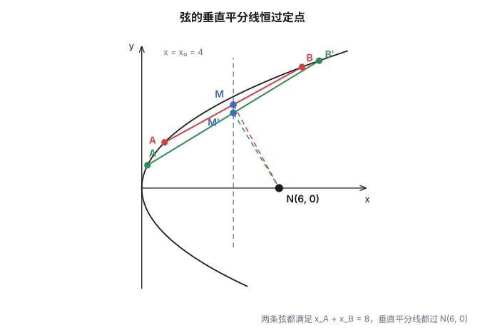
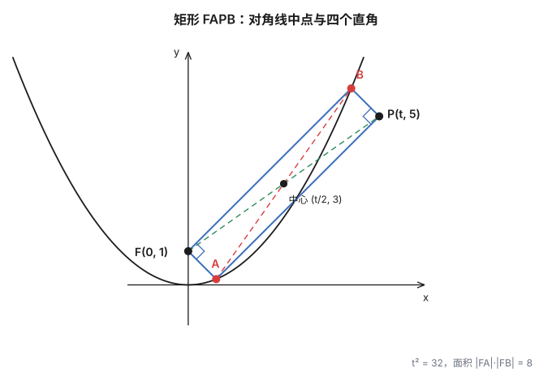
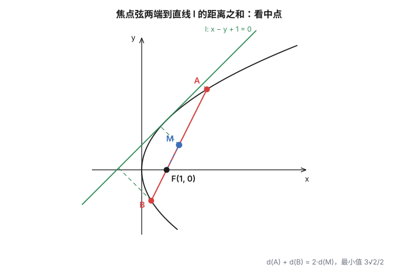
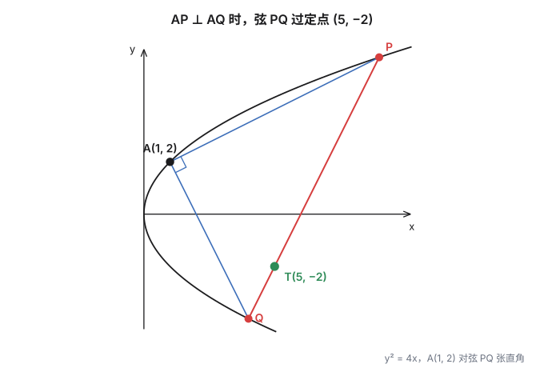

椭圆有两根对称轴、一个中心，抛物线只有一个焦点、一条轴。按理说对称性更差的曲线，性质应该更零碎；但抛物线的弦偏偏有一个整齐到反常的结论：

> 只要弦中点的横坐标是定值，弦的垂直平分线就过定点。

这篇先把这条引理说清楚，再用它和它的两个"兄弟"处理四道题。四道题分别关于矩形、等腰三角形、距离和最小、以及一条恒过定点的弦。**每一道都给出标答之外的另一种走法**——不是炫技，而是因为这几种走法各自对应一类结构，认出来就能省掉大半计算。

## 一、一条引理：垂直平分线去哪儿

### 引理

设 $A(x_1,y_1)$、$B(x_2,y_2)$ 是抛物线 $y^2=2px\ (p>0)$ 上的两点，$M(x_0,y_0)$ 是弦 $AB$ 的中点。则 **$AB$ 的垂直平分线与对称轴交于点 $(x_0+p,\ 0)$**——只由 $x_0$ 决定，与 $y_0$ 无关。

特别地，若 $x_1+x_2$ 为定值（即 $x_0$ 固定），这个交点就是真正的**定点**：无论弦怎么倾斜，垂直平分线都过 $(x_0+p,0)$。

**证明一（点差法）。** 把两个点在曲线上的方程相减：

$$y_1^2=2px_1,\qquad y_2^2=2px_2\quad\Longrightarrow\quad (y_1+y_2)(y_1-y_2)=2p\,(x_1-x_2)$$

于是弦的斜率

$$k_{AB}=\frac{y_1-y_2}{x_1-x_2}=\frac{2p}{y_1+y_2}=\frac{p}{y_0}$$

（注意 $y_1=y_2$ 会推出 $x_1=x_2$，即两点重合，所以 $y_1\ne y_2$ 自动成立）。垂直平分线的斜率是它的负倒数 $-\dfrac{y_0}{p}$，方程为

$$y-y_0=-\frac{y_0}{p}\,(x-x_0)$$

令 $y=0$：$-y_0=-\dfrac{y_0}{p}(x-x_0)$，解得 $x=x_0+p$。**这个值与 $y_0$ 无关**，所以无论弦怎么倾斜，垂直平分线都过 $(x_0+p,0)$。$\blacksquare$

**证明二（参数法）。** 把两点写成参数形式 $A\big(\tfrac p2 s^2,\,ps\big)$、$B\big(\tfrac p2 t^2,\,pt\big)$（代入即知在抛物线上）。则

$$M=\left(\frac p4\left(s^2+t^2\right),\ \frac p2(s+t)\right),\qquad k_{AB}=\frac{2}{s+t}$$

垂直平分线过 $M$、斜率 $-\dfrac{s+t}{2}$，令 $y=0$：

$$-\frac p2(s+t)=-\frac{s+t}{2}\left(x-\frac p4\left(s^2+t^2\right)\right)\ \Longrightarrow\ x=p+\frac p4\left(s^2+t^2\right)=x_0+p$$

**参数法把"为什么"也说清楚了**：定点只依赖中点横坐标 $x_0$，与弦的倾斜程度（也就是 $s+t$）无关。$\blacksquare$

### 为什么是"横坐标和"，不是"纵坐标和"

引理里固定的是 $x_1+x_2$。如果改固定 $y_1+y_2$（即 $y_0$ 定值）会怎样？由 $k_{AB}=\dfrac{p}{y_0}$，**所有这样的弦互相平行**，它们的垂直平分线也互相平行——一族平行线是不过定点的。

所以两种"和"各有各的用法，要配合开口方向：

| 抛物线 | 固定的和 | 垂直平分线过的定点 |
|---|---|---|
| $y^2=2px$（开口向右） | $x_1+x_2$ | $(x_0+p,\ 0)$ |
| $x^2=2py$（开口向上） | $y_1+y_2$ | $(0,\ y_0+p)$ |

第二行由第一行交换 $x,y$ 直接得到（抛物线关于对称轴的翻折，把"横坐标"与"纵坐标"的角色对调）。

> [!note] 一个可以顺手记住的等价说法
> 固定"横坐标和"等价于固定"中点的横坐标"。对 $y^2=2px$，弦的中点若始终落在竖线 $x=x_0$ 上，则弦的垂直平分线是一束过 $(x_0+p,0)$ 的直线——**中点动、定点不动**，这是它好用的原因。

### 换成椭圆或双曲线呢

同样的推导可以搬到有心圆锥曲线 $x^2/\alpha+y^2/\beta=1$（椭圆 $\beta>0$，双曲线 $\beta<0$）上：点差法给出

$$k_{AB}=-\frac{\beta x_0}{\alpha y_0}$$

垂直平分线过 $M(x_0,y_0)$、斜率 $\dfrac{\alpha y_0}{\beta x_0}$，令 $y=0$ 得

$$x=x_0\left(1-\frac{\beta}{\alpha}\right)=\frac{(\alpha-\beta)\,x_0}{\alpha}$$

所以**只要中点横坐标 $x_0$ 固定，垂直平分线就过定点 $\left(\frac{(\alpha-\beta)x_0}{\alpha},0\right)$**。椭圆取 $\alpha=a^2,\beta=b^2$，定点是 $\left(\frac{c^2x_0}{a^2},0\right)$；双曲线取 $\beta=-b^2$，定点是 $\left(\frac{(a^2+b^2)x_0}{a^2},0\right)$——两种曲线共用一个公式。这个推导的中间步（垂径定理 $k_{AB}\cdot k_{OM}=-\beta/\alpha$）和它的定点公式，到第三节解椭圆题时马上就能用上。

## 二、矩形 $FAPB$：先用引理定弦，再算面积

**题目.** 已知点 $P(t,5)\ (t>0)$，抛物线 $x^2=2py\ (p>0)$ 的焦点是 $F(0,1)$，$A,B$ 是抛物线上两点，四边形 $FAPB$ 是矩形。

(1) 求抛物线的方程；(2) 求矩形 $FAPB$ 的面积。

**(1)** 焦点是 $F(0,1)$，故 $\dfrac p2=1$，得 $p=2$，抛物线为

$$x^2=4y$$

**(2) 方法一（标答：参数 + 对角线中点 + 直角）**

设 $A(2t_1,t_1^2)$、$B(2t_2,t_2^2)$（$x^2=4y$ 上的点写成 $(2s,s^2)$）。

矩形对角线互相平分，所以 $AB$ 的中点就是 $FP$ 的中点 $\left(\dfrac t2,3\right)$：

$$\frac{2t_1+2t_2}{2}=\frac t2\ \Longrightarrow\ t_1+t_2=\frac t2,\qquad \frac{t_1^2+t_2^2}{2}=3\ \Longrightarrow\ t_1^2+t_2^2=6$$

从而 $t_1t_2=\dfrac{(t_1+t_2)^2-(t_1^2+t_2^2)}{2}=\dfrac{t^2}{8}-3$。

矩形在 $F$ 处是直角，即 $\overrightarrow{FA}\cdot\overrightarrow{FB}=0$。由 $\overrightarrow{FA}=(2t_1,t_1^2-1)$、$\overrightarrow{FB}=(2t_2,t_2^2-1)$：

$$4t_1t_2+(t_1^2-1)(t_2^2-1)=0\ \Longrightarrow\ 4t_1t_2+t_1^2t_2^2-(t_1^2+t_2^2)+1=0$$

代入上面的值：

$$4\left(\frac{t^2}{8}-3\right)+\left(\frac{t^2}{8}-3\right)^2-6+1=0\ \Longrightarrow\ t^4-16t^2-512=0\ \Longrightarrow\ (t^2-32)(t^2+16)=0$$

由 $t>0$ 得 $t^2=32$，于是 $t_1t_2=4-3=1$。

最后由抛物线的定义（到焦点距离 = 到准线 $y=-1$ 距离）：$|FA|=t_1^2+1$，$|FB|=t_2^2+1$。矩形以 $F$ 为顶点的两边正是 $FA$ 与 $FB$，所以

$$S=|FA|\cdot|FB|=(t_1^2+1)(t_2^2+1)=t_1^2t_2^2+(t_1^2+t_2^2)+1=1+6+1=8$$

**方法二（引理法：先定出弦 $AB$ 的斜率）**

标答里解 $t_1,t_2$ 的那一步有点绕。既然中点已经知道，直接用第一节的引理试试。

对角线互相平分给出 $AB$ 的中点 $M\left(\dfrac t2,3\right)$，所以 $y_0=3$。对 $x^2=4y$（即 $p=2$），引理说 $AB$ 的**垂直平分线过 $(0,y_0+p)=(0,5)$**。

而垂直平分线又必须过中点 $M$，两点一确定，它就被钉死了：

$$k_{\perp}=\frac{5-3}{0-\frac t2}=-\frac4t\ \Longrightarrow\ k_{AB}=\frac t4$$

于是 $AB:y-3=\dfrac t4\left(x-\dfrac t2\right)$。与 $x^2=4y$ 联立，得

$$x^2-tx+\left(\frac{t^2}{2}-12\right)=0\ \Longrightarrow\ x_A+x_B=t\ (\text{与中点自洽}),\qquad x_Ax_B=\frac{t^2}{2}-12$$

记 $u=x_Ax_B$。由中点纵坐标为 $3$ 有 $y_A+y_B=6$，于是 $x_A^2+x_B^2=4(y_A+y_B)=24$（这也就是 $t^2-2u=24$）。再由 $\angle AFB=90^\circ$：

$$x_Ax_B+\left(\frac{x_A^2}{4}-1\right)\left(\frac{x_B^2}{4}-1\right)=0\ \Longrightarrow\ u+\frac{u^2}{16}-6+1=0\ \Longrightarrow\ u^2+16u-80=0$$

解得 $u=4$ 或 $u=-20$。$u=\dfrac{t^2}{2}-12=4$ 给出 $t^2=32$（$u=-20$ 给出 $t^2=-16$，舍）。面积

$$S=(y_A+1)(y_B+1)=\left(\frac{x_A^2}{4}+1\right)\left(\frac{x_B^2}{4}+1\right)=\frac{u^2}{16}+6+1=1+6+1=8$$

**方法三（设弦的斜率，设而不求）**

设 $AB:y=kx+b$，与 $x^2=4y$ 联立得 $x^2-4kx-4b=0$，于是

$$x_A+x_B=4k,\qquad x_Ax_B=-4b,\qquad x_A^2+x_B^2=16k^2+8b$$

中点条件是 $(2k,\,2k^2+b)=\left(\dfrac t2,3\right)$，即 $k=\dfrac t4$、$b=3-\dfrac{t^2}{8}$。

直角条件 $\overrightarrow{FA}\cdot\overrightarrow{FB}=0$ 展开后是 $x_Ax_B+\dfrac{x_A^2x_B^2}{16}-\dfrac{x_A^2+x_B^2}{4}+1=0$，代入：

$$-4b+b^2-6+1=0\ \Longrightarrow\ b^2-4b-5=0\ \Longrightarrow\ b=5\ \text{或}\ -1$$

$b=5$ 给出 $t^2=-16$（舍），$b=-1$ 给出 $t^2=32$。再由 $y_Ay_B=\dfrac{x_A^2x_B^2}{16}=b^2=1$、$y_A+y_B=6$：

$$S=(y_A+1)(y_B+1)=y_Ay_B+(y_A+y_B)+1=1+6+1=8$$

**三种方法殊途同归**：主元分别是 $t^2$、$u$、$b$，得到的方程 $t^4-16t^2-512=0$、$u^2+16u-80=0$、$b^2-4b-5=0$ 互相只差一个换元（$u=-4b$、$t^2=24-8b$）。

> [!tip] 换个直角，方程不变
> 矩形的四个顶点都是直角。上面用的是 $\angle AFB=90^\circ$；改用 $P$ 处的 $\angle APB=90^\circ$，即 $(A-P)\cdot(B-P)=0$，展开后会得到**完全相同**的方程 $t^4-16t^2-512=0$。这说明四个直角彼此等价，用哪个都行——顺手挑计算量小的那个。另外由 $\angle AFB=\angle APB=90^\circ$ 可知 $F$ 与 $P$ 都在以 $AB$ 为直径的圆上，圆心恰是那个中点 $\left(\frac t2,3\right)$，半径 $\frac{|FP|}{2}=\frac{\sqrt{t^2+16}}{2}$。

## 三、椭圆里的等腰：$|AM|=|AN|$

**题目.** 已知椭圆的一个顶点 $A(0,-1)$，焦点在 $x$ 轴上，离心率为 $\dfrac{\sqrt3}{2}$。

(1) 求椭圆的标准方程；(2) 设直线 $y=kx+m\ (k\ne0)$ 与椭圆交于不同的两点 $M,N$。当 $|AM|=|AN|$ 时，求实数 $m$ 的取值范围。

**(1)** 顶点 $A(0,-1)$ 在短轴端点，故 $b=1$；$\dfrac ca=\dfrac{\sqrt3}{2}$ 且 $a^2=b^2+c^2$，解得 $a=2,\ c=\sqrt3$：

$$\frac{x^2}{4}+y^2=1$$

**(2) 方法一（标答：联立 + 韦达 + 判别式）**

设 $P(x_0,y_0)$ 为 $MN$ 的中点。联立 $y=kx+m$ 与 $\dfrac{x^2}{4}+y^2=1$：

$$(4k^2+1)x^2+8kmx+4(m^2-1)=0\ \Longrightarrow\ x_1+x_2=\frac{-8km}{4k^2+1},\quad x_1x_2=\frac{4(m^2-1)}{4k^2+1}$$

有两个不同交点要求 $\Delta>0$，即

$$m^2<1+4k^2 \tag{①}$$

于是

$$x_0=\frac{x_1+x_2}{2}=-\frac{4km}{4k^2+1},\qquad y_0=kx_0+m=\frac{m}{4k^2+1}$$

$|AM|=|AN|$ 意味着 $A$ 在 $MN$ 的垂直平分线上，即 $AP\perp MN$：

$$k_{AP}\cdot k=-1,\qquad k_{AP}=\frac{y_0+1}{x_0}=-\frac{m+1+4k^2}{4km}$$

代入化简得

$$3m=4k^2+1 \tag{②}$$

把 ② 代入 ①：$m^2<3m$，得 $0<m<3$。再由 ② 解出 $k^2=\dfrac{3m-1}{4}>0$，得 $m>\dfrac13$。综上

$$m\in\left(\frac13,\ 3\right)$$

> [!warning] 标答里标了"易错"的那一步
> ① 式来自 $\Delta>0$，是"直线与椭圆有两个交点"的**硬约束**。如果只顾着解垂直条件、忘了它，$m$ 的范围会算错。这类题里"有两个交点"从来不是废话。

**(2) 方法二（点差法 / 垂径定理，最短）**

$M,N$ 都在椭圆上，中点为 $P(x_0,y_0)$。两点方程相减：

$$\frac{x_1^2-x_2^2}{4}+(y_1^2-y_2^2)=0\ \Longrightarrow\ \frac{x_0(x_1-x_2)}{2}+2y_0(y_1-y_2)=0\ \Longrightarrow\ k=-\frac{x_0}{4y_0}$$

（这就是椭圆的垂径定理：$k_{MN}\cdot k_{OP}=-\dfrac{b^2}{a^2}=-\dfrac14$。）再把 $AP\perp MN$ 写出来：

$$\frac{y_0+1}{x_0}\cdot\left(-\frac{x_0}{4y_0}\right)=-1\ \Longrightarrow\ \frac{y_0+1}{4y_0}=1\ \Longrightarrow\ y_0=\frac13$$

**一次代入，$x_0$ 直接消失**——原来所有这样的弦，中点都躺在同一条水平线 $y=\dfrac13$ 上。

接下来由 $k=-\dfrac{x_0}{4y_0}=-\dfrac{3x_0}{4}$ 和 $m=y_0-kx_0$：

$$m=\frac13+\frac{3x_0^2}{4}$$

中点必须落在椭圆内部：$\dfrac{x_0^2}{4}+y_0^2<1$，即 $\dfrac{x_0^2}{4}+\dfrac19<1$，得 $x_0^2<\dfrac{32}{9}$。于是

$$m=\frac13+\frac34x_0^2\in\left(\frac13,\ \frac13+\frac83\right)=\left(\frac13,\ 3\right)$$

两端点为什么取不到？$x_0=0$ 对应 $k=0$，与 $k\ne0$ 矛盾；$x_0^2=\dfrac{32}{9}$ 时直线与椭圆相切（只有一个交点），恰好被 ① 排除。**方法二完全绕开了韦达定理和判别式**。

**(2) 方法三（圆的视角）**

$|AM|=|AN|=r$ 说的是：$M,N$ 在以 $A(0,-1)$ 为圆心、$r$ 为半径的圆上，同时又在椭圆上。把两式消去 $x^2$：

$$\underbrace{x^2+(y+1)^2=r^2}_{\text{圆}},\qquad \underbrace{x^2=4(1-y^2)}_{\text{椭圆}}\ \Longrightarrow\ 3y^2-2y+(r^2-5)=0$$

$M,N$ 的纵坐标是它的两根（当 $k\ne0$ 时 $y_M\ne y_N$；$k=0$ 那种关于 $y$ 轴对称的情形已被条件排除），所以

$$y_M+y_N=\frac23\ \Longrightarrow\ y_0=\frac13$$

比点差法还快一步。后面接方法二的后半段即可，同样得到 $m\in\left(\dfrac13,3\right)$。

## 四、切线与焦点弦：距离和的最小值

**题目.** 已知直线 $l:x-y+1=0$ 与焦点为 $F$ 的抛物线 $C:y^2=2px\ (p>0)$ 相切。

(1) 求抛物线 $C$ 的方程；(2) 过焦点 $F$ 的直线 $m$ 与抛物线 $C$ 分别相交于 $A,B$ 两点，求 $A,B$ 两点到直线 $l$ 的距离之和的最小值。

**(1)** 相切即联立后判别式为 $0$。把 $x=y-1$ 代入 $y^2=2px$：

$$y^2-2py+2p=0\ \Longrightarrow\ \Delta=4p^2-8p=0\ \Longrightarrow\ p=2\ (p=0\ \text{舍})$$

$$C:\ y^2=4x$$

> [!note] 顺带一眼
> 把切点算出来：$y^2-4y+4=0$ 有二重根 $y=2$，对应 $x=1$。所以 $l$ 恰在 $(1,2)$ 处与抛物线相切——**而 $(1,2)$ 正是下一题里的那个点 $A$**。两题共用同一条抛物线 $y^2=4x$，$l$ 就是过 $A$ 的切线。

**(2) 方法一（标答：焦点弦参数 + 中点）**

焦点 $F(1,0)$。过焦点的直线若水平，与抛物线只有一个交点，故 $m$ 的斜率不为 $0$，可设

$$m:\ x=ty+1,\qquad A(x_1,y_1),\ B(x_2,y_2)$$

代入 $y^2=4x$：

$$y^2-4ty-4=0\ \Longrightarrow\ y_1+y_2=4t,\qquad x_1+x_2=t(y_1+y_2)+2=4t^2+2$$

中点 $M(2t^2+1,\ 2t)$。

**关键一步**：$l$ 是抛物线的切线，整条抛物线都在 $l$ 的同一侧，所以 $A,B$ 同侧，到 $l$ 的距离满足

$$d_A+d_B=2\,d_M$$

而

$$d_A+d_B=2\cdot\frac{|2t^2+1-2t+1|}{\sqrt2}=\sqrt2\cdot 2\left|t^2-t+1\right|=2\sqrt2\left|\left(t-\frac12\right)^2+\frac34\right|$$

当 $t=\dfrac12$ 时取最小值

$$(d_A+d_B)_{\min}=2\sqrt2\cdot\frac34=\frac{3\sqrt2}{2}$$

**(2) 方法二（参数法：$t_1t_2=-1$）**

把 $A,B$ 写成 $A(t_1^2,2t_1)$、$B(t_2^2,2t_2)$。$AB$ 过焦点 $F(1,0)$ 的充要条件是

$$t_1t_2=-1$$

先算单点距离。由 $y^2=4x$ 得 $x=t^2$，于是

$$d_A=\frac{\left|t_1^2-2t_1+1\right|}{\sqrt2}=\frac{(t_1-1)^2}{\sqrt2},\qquad d_B=\frac{(t_2-1)^2}{\sqrt2}$$

（分子是完全平方，所以绝对值可以直接脱掉。）相加：

$$d_A+d_B=\frac{(t_1-1)^2+(t_2-1)^2}{\sqrt2}=\frac{t_1^2+t_2^2-2(t_1+t_2)+2}{\sqrt2}$$

由 $t_1t_2=-1$ 有 $t_1^2+t_2^2=(t_1+t_2)^2+2$。令 $s=t_1+t_2$：

$$d_A+d_B=\frac{(s-1)^2+3}{\sqrt2}\ge\frac{3}{\sqrt2}=\frac{3\sqrt2}{2}$$

等号在 $s=1$ 时取得，此时 $t_1+t_2=1$、$t_1t_2=-1$，对应 $t=\dfrac12$，与方法一的结果一致。**这个方法把"距离和"变成了一个二次函数的最值**，连中点都不用求。

**(2) 第三视角：焦点弦中点的轨迹**

方法一里已经算出中点 $M(2t^2+1,2t)$。消去参数 $t=\dfrac y2$：

$$x=2\left(\frac y2\right)^2+1\ \Longrightarrow\ y^2=2(x-1)$$

**焦点弦中点的轨迹是以焦点 $F(1,0)$ 为顶点、开口向右的抛物线。** 有了它，$d_A+d_B=2d_M$ 就变成"这条轨迹上的点到直线 $l$ 的距离最小是多少"：

$$d=\frac{|x-y+1|}{\sqrt2}\ \xrightarrow{\ x=\frac{y^2}{2}+1\ }\ \frac{\left|\frac{y^2}{2}-y+2\right|}{\sqrt2}=\frac{(y-1)^2+3}{2\sqrt2}\ge\frac{3}{2\sqrt2}=\frac{3\sqrt2}{4}$$

乘 $2$ 得 $\dfrac{3\sqrt2}{2}$。这个视角多给了一条信息：**取到最小值的那个中点，纵坐标是 $y=1$**。

## 五、张直角的弦与等腰三角形

**题目.** 已知抛物线 $C:y^2=4x$，过点 $A(1,2)$ 作抛物线 $C$ 的弦 $AP$、$AQ$。

(I) 若 $AP\perp AQ$，证明直线 $PQ$ 过定点，并求出定点的坐标；

(II) 假设直线 $PQ$ 过点 $T(5,-2)$，问是否存在以 $PQ$ 为底边的等腰三角形 $APQ$？若存在，求出 $\triangle APQ$ 的个数；若不存在，请说明理由。

### (I) 张直角的弦过定点

**方法一（标答：以纵坐标为参数 + 韦达）**

设 $P(x_1,y_1)$、$Q(x_2,y_2)$，由 $y^2=4x$ 得 $x=\dfrac{y^2}{4}$，所以

$$k_{AP}=\frac{y_1-2}{x_1-1}=\frac{y_1-2}{\frac{y_1^2-4}{4}}=\frac{4}{y_1+2},\qquad k_{AQ}=\frac{4}{y_2+2}$$

$AP\perp AQ$ 即 $k_{AP}k_{AQ}=-1$：

$$\frac{16}{(y_1+2)(y_2+2)}=-1\ \Longrightarrow\ (y_1+2)(y_2+2)=-16\ \Longrightarrow\ y_1y_2+2(y_1+y_2)+20=0 \tag{③}$$

再写出弦 $PQ$ 的方程。$y^2=4x$ 上过 $(y_1,y_2)$ 两点的弦是

$$y(y_1+y_2)=4x+y_1y_2$$

由 ③ 得 $y_1y_2=-2(y_1+y_2)-20$，代入：

$$y(y_1+y_2)=4x-2(y_1+y_2)-20\ \Longrightarrow\ (y_1+y_2)(y+2)=4(x-5)$$

把 $x=5,\ y=-2$ 代进去，两边同为 $0$——**对任意 $y_1+y_2$ 都成立**，所以 $PQ$ 恒过定点

$$(5,\,-2)$$

**方法二（斜率参数：两条弦的斜率互为负倒数）**

设 $AP$ 的斜率为 $m\ (m\ne0)$，则 $AQ$ 的斜率为 $-\dfrac1m$。先处理 $AP$：

$$AP:\ y-2=m(x-1)\ \Longrightarrow\ y=m(x-1)+2$$

代入 $x=\dfrac{y^2}{4}$：

$$my^2-4y+4(2-m)=0$$

它的两根是 $AP$ 与抛物线两个交点的纵坐标，其中一根是 $y_A=2$，另一根是 $y_P$。由韦达定理

$$2y_P=\frac{4(2-m)}{m}\ \Longrightarrow\ y_P=\frac4m-2$$

把 $m$ 换成 $-\dfrac1m$，得到 $Q$ 的纵坐标 $y_Q=-4m-2$。于是

$$P\left(\left(\frac2m-1\right)^2,\ \frac4m-2\right),\qquad Q\left((2m+1)^2,\ -(4m+2)\right)$$

现在只需验证 $P,Q,T(5,-2)$ 共线，算叉积：

$$\begin{aligned}
&(x_P-5)(y_Q+2)-(y_P+2)(x_Q-5)\\
=\ &\left(\frac4{m^2}-\frac4m-4\right)(-4m)-\frac4m\left(4m^2+4m-4\right)\\
=\ &\left(-\frac{16}m+16+16m\right)-\left(16m+16-\frac{16}m\right)=0
\end{aligned}$$

**恰好消干净**，所以 $PQ$ 恒过 $(5,-2)$。$\blacksquare$

**方法二还顺手说明了一件更强的事**：设 $PQ$ 的斜率是 $k$，则 $AP$、$AQ$ 的斜率分别是 $m$、$-\dfrac1m$，而 $m$ 与 $k$ 的关系由上面的计算已经固定——**$k$ 随 $m$ 走，但 $PQ$ 始终穿过同一点**。这不是巧合，看下面的旁注。

> [!note] 旁注：$A$ 处的直角与定点是一回事
> 仔细看 ③ 式：$(y_1+2)(y_2+2)=-16$。把 $(5,-2)$ 代入弦方程 $y(y_1+y_2)=4x+y_1y_2$，得到的恰好也是 $(y_1+2)(y_2+2)=-16$。也就是说
>
> $$AP\perp AQ\iff PQ\ \text{过}\ (5,-2)$$
>
> **这是一个充要条件。** 结论比题目要求的"过定点"更强：过 $(5,-2)$ 的**每一条**弦都在 $A$ 处张直角。等价地说，对每一条过 $(5,-2)$ 的弦 $PQ$，以 $PQ$ 为直径的圆都过 $A(1,2)$——$A$ 落在这一族圆的公共点上。
>
> 一般地，对 $y^2=4ax$ 上的定点 $A(x_A,y_A)$，在 $A$ 处张直角的弦过定点 $(x_A+4a,\,-y_A)$：把 $A$ 关于对称轴翻折，再沿对称轴正方向平移 $4a$。本题 $a=1,\ A(1,2)$，正是 $(5,-2)$。

### (II) 以 $PQ$ 为底边的等腰三角形有几个

"以 $PQ$ 为底边的等腰三角形 $APQ$"翻译成条件就是

$$|AP|=|AQ|$$

即 **$A$ 落在 $PQ$ 的垂直平分线上**。而 $PQ$ 还要过 $T(5,-2)$。

**方法一（标答：联立 + 韦达 + 三次方程）**

设 $PQ:y=m(x-5)-2$（竖直情形 $x=5$ 单独验证不成立，见文末细节）。与 $y^2=4x$ 联立：

$$m^2x^2-\left[2m(5m+2)+4\right]x+(5m+2)^2=0$$

$$x_M=\frac{2m(5m+2)+4}{2m^2}=5+\frac2m+\frac2{m^2},\qquad y_M=mx_M-5m-2=\frac2m$$

由 $AM\perp PQ$：

$$k_{AM}=\frac{y_M-2}{x_M-1}=\frac{\frac2m-2}{4+\frac2m+\frac2{m^2}}=\frac{m(1-m)}{2m^2+m+1},\qquad k_{AM}\cdot m=-1$$

化简得三次方程

$$m^3-3m^2-m-1=0$$

设 $f(m)=m^3-3m^2-m-1$。$f'(m)=3m^2-6m-1$，临界点为 $m=1\pm\dfrac{2\sqrt3}{3}$，而两个极值都是负的：

$$f\left(1-\frac{2\sqrt3}{3}\right)\approx-0.92<0,\qquad f\left(1+\frac{2\sqrt3}{3}\right)\approx-7.08<0$$

三次函数首项系数为正，两个极值又都小于 $0$，所以它**只穿过 $x$ 轴一次**（在 $(3,4)$ 内，$m\approx3.38$）。故存在且仅存在 **$1$ 个**这样的等腰三角形。

**方法二（点差法：换成关于 $y_0$ 的方程，单调性一目了然）**

标答的三次方程要做极值估计，稍嫌笨重。换个主元试试——设中点 $M(x_0,y_0)$。

**第一步，点差。** $P,Q$ 在 $y^2=4x$ 上，相减得 $(y_1+y_2)(y_1-y_2)=4(x_1-x_2)$，于是

$$k_{PQ}=\frac{4}{y_1+y_2}=\frac{2}{y_0}$$

**第二步，用 $M$ 在直线 $PQ$ 上（且 $PQ$ 过 $T(5,-2)$）。** $k_{MT}=k_{PQ}$：

$$\frac{y_0+2}{x_0-5}=\frac{2}{y_0}\ \Longrightarrow\ x_0=\frac{y_0^2}{2}+y_0+5$$

**第三步，用 $A$ 在垂直平分线上。** $AM\perp PQ$：

$$\frac{y_0-2}{x_0-1}=-\frac{y_0}{2}\ \Longrightarrow\ 2(y_0-2)=-y_0(x_0-1)\ \Longrightarrow\ x_0=\frac4{y_0}-1$$

**第二步与第三步联立**，消去 $x_0$：

$$\frac{y_0^2}{2}+y_0+5=\frac4{y_0}-1\ \Longrightarrow\ y_0^3+2y_0^2+12y_0-8=0$$

设 $g(y_0)=y_0^3+2y_0^2+12y_0-8$，则

$$g'(y_0)=3y_0^2+4y_0+12,\qquad \Delta_g=4^2-4\cdot3\cdot12<0$$

**导数恒正**，所以 $g$ 在 $\mathbb R$ 上严格递增，方程恰有一个实根（落在 $(0,1)$ 内，$y_0\approx0.591$，对应 $k=\dfrac{2}{y_0}\approx3.38$、$x_0\approx5.77$）。

> [!tip] 为什么方法二更省事
> 标答把弦的斜率 $m$ 当主元，得到 $m^3-3m^2-m-1=0$，还得分析两个极值的正负；方法二把中点的**纵坐标** $y_0$ 当主元，三次方程变成 $y_0^3+2y_0^2+12y_0-8=0$，二次项、一次项、常数项同号，导数恒正——**根的唯一性一眼可见**。同一个几何事实，换一个主元，难度完全不同。
>
> 两个方程其实是同一件事：把 $m=\dfrac{2}{y_0}$ 代入 $m^3-3m^2-m-1=0$ 并乘以 $y_0^3$，就得到 $8-12y_0-2y_0^2-y_0^3=0$，即方法二的那个方程（差一个符号）。

### 两小问其实是一个问题的两面

把 (I) 的旁注和 (II) 的条件放在一起看：

| | 条件 | 几何含义 | 答案 |
|---|---|---|---|
| (I) | $AP\perp AQ$ | $PQ$ 过 $T(5,-2)$ | 定点 $(5,-2)$ |
| (II) | $PQ$ 过 $T(5,-2)$ | $AP\perp AQ$，且再要求 $\vert AP\vert=\vert AQ\vert$ | 恰 $1$ 个 |

因为过 $T$ 的每条弦都在 $A$ 处张直角，(II) 问的其实是：**这一族直角三角形里，有几个是等腰直角三角形？** 答案是恰好一个。它对应 $PQ$ 的斜率 $k\approx3.38$，是一个"不好看"但唯一确定的值——这也解释了为什么这道题的答案是个数，而不是一个漂亮的坐标。

## 六、小结

回头看这几道题，其实只用了三件工具，而且它们是一家的：

| 工具 | 内容 | 用在哪 |
|---|---|---|
| **点差法**（中点弦） | 两点方程相减，把 $k$ 与中点坐标挂钩 | 第二节方法三、第三节方法二、第五节 (II) 方法二 |
| **垂径定理** | 弦与中点连线的斜率之积 $=-\dfrac{b^2}{a^2}$ | 第三节（椭圆的点差法就是它） |
| **垂直平分线过定点** | 中点横（纵）坐标定值 $\Rightarrow$ 定点 $(x_0+p,0)$ | 第一节、第二节方法二 |

三者的共同点是：**都只关心弦的中点**。抛物线和椭圆的中点弦各有一条"斜率—中点"关系式，把它写出来，很多看起来要联立四次方程的题目就退化成一次代入。

抛物线还多一条椭圆没有的性质：**张直角的弦过定点**。它的定点是 $(x_A+4a,-y_A)$，只与那个张直角的顶点有关——这是抛物线"没有中心、只有一条轴"带来的副产品。

## 相关阅读

- [《椭圆（上）：从三个定义说起》](post.html?slug=ellipse-basics)——点差法、垂径定理、弦长公式的出处。
- [《椭圆（下）：斜率、变换与线性代数》](post.html?slug=ellipse-advanced)——齐次化联立、极点极线、仿射变换；其中"垂径定理是仿射变换下的幸存者"一节，正是第三节方法二的解释。
- [《圆锥曲线：六个系数里的三个数》](post.html?slug=conic-general)——一般二次曲线的不变量、类型与离心率。

> [!detail] 技术细节
> **1. 引理中 $y_0=0$ 的情形。** 此时 $k_{AB}=\dfrac{p}{y_0}$ 失效（弦竖直）。但垂直平分线是水平线 $y=0$（即对称轴），而 $(x_0+p,0)$ 恰好落在 $y=0$ 上，结论仍然成立——所以推导里不需要单独讨论。
>
> **2. 弦方程 $y(y_1+y_2)=4x+y_1y_2$ 的来历。** 对 $y^2=4x$ 上参数为 $y_1,y_2$ 的两点，把它们代入该式即知成立；两个点确定一条直线，所以它就是弦的方程。一般地，$y^2=2px$ 上的弦是 $y(y_1+y_2)=2px+y_1y_2$，$x^2=2py$ 上是 $x(x_1+x_2)=2py+x_1x_2$。
>
> **3. 第二节方法二里的"自洽性检验"。** 由中点条件得到 $x_A+x_B=t$，而联立后韦达定理给出的也是 $x_A+x_B=t$——这一步不是多余的：如果两个值不一致，说明前面某一步算错了。
>
> **4. 第三节两个端点的身份。** $x_0=0\Rightarrow k=0$，被 $k\ne0$ 排除；$x_0^2=\dfrac{32}{9}\Rightarrow m=3$，此时 $m^2=1+4k^2$，即 $\Delta=0$，直线与椭圆相切，被"两个不同交点"排除。所以 $(1/3,3)$ 是开区间。
>
> **5. 第四节为什么 $d_A+d_B=2d_M$。** 点到直线的距离是坐标的仿射函数（在直线同侧时无绝对值），所以中点处的值等于两端点值的平均。$l$ 与抛物线相切保证了整条抛物线在 $l$ 同侧，这一步才成立。若换成一条与抛物线相交的直线，$A,B$ 可能分居两侧，就必须保留绝对值讨论。
>
> **6. 第四节"焦点弦中点轨迹"的推导。** 由 $M(2t^2+1,2t)$ 消参得 $y^2=2(x-1)$：这是一条以 $F(1,0)$ 为顶点、与原抛物线共轴同向的抛物线，焦准距恰为原来的一半（$1/2$ vs $1$）——"取焦点弦中点"这个操作，把原抛物线的**焦点**变成了新抛物线的**顶点**。（它自身的焦点在 $(3/2,0)$，并不是原来的顶点，所以是"焦点变顶点"，不是"焦点与顶点对调"。）
>
> **7. 第五节 (II) 的竖直弦。** 若 $PQ$ 竖直，则 $PQ:x=5$，与 $y^2=4x$ 交于 $P(5,2\sqrt5)$、$Q(5,-2\sqrt5)$，中点 $M(5,0)$。此时 $|AP|^2=16+(2\sqrt5-2)^2$，而 $|AQ|^2=16+(2\sqrt5+2)^2$，两者不等，故竖直弦不给出等腰三角形——设 $PQ:y=m(x-5)-2$ 时不必担心漏解。
>
> **8. 第五节 (II) 的验证。** 由 $y_0\approx0.591$ 得 $k\approx3.38$，直线 $y=3.38(x-5)-2$ 与 $y^2=4x$ 联立得 $y^2-1.18y-22.4\approx0$，$\Delta\approx1.4+89.5>0$，确实交出两个不同的实点；又因 $A$ 在垂直平分线（而非 $PQ$）上，$A\notin PQ$，三角形不退化。
>
> **9. 有心圆锥曲线的统一形式。** 对 $x^2/\alpha+y^2/\beta=1$，点差法给出 $k_{AB}=-\dfrac{\beta x_0}{\alpha y_0}$，代入垂直平分线并令 $y=0$，得 $x=\dfrac{(\alpha-\beta)x_0}{\alpha}$。椭圆 $\alpha=a^2,\beta=b^2$ 给出 $\dfrac{c^2x_0}{a^2}$；双曲线 $\beta=-b^2$ 给出 $\dfrac{(a^2+b^2)x_0}{a^2}$。注意 $y_0=0$ 时该式失效，但此时弦竖直、垂直平分线是 $x$ 轴，定点 $(x,0)$ 仍在轴上，结论不破。
