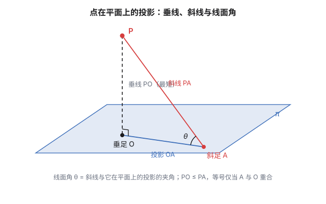
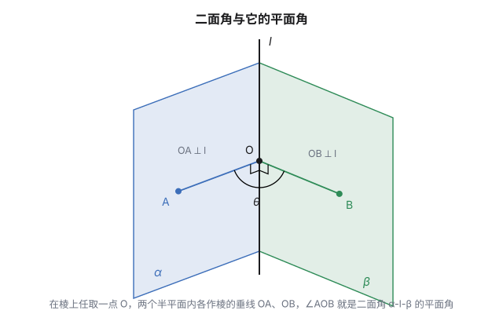

先问一个生活问题：**为什么三脚架的凳子从来不晃，四条腿的反而常常晃？**

三条腿，三个着地点，无论地面怎么不平，三个点总能找到一个共同的平面贴上去——凳子自己也许会歪，但不会晃。四条腿呢？四个着地点未必共面，总有一条腿悬空。

这背后是立体几何的第一条公理：

> **不共线的三点，确定一个平面。**

这一篇就从这条公理出发，由简入深把立体几何的主线走一遍：位置关系、投影、距离、二面角——最后会发现，整章内容可以被一个叫"法向量"的工具统一成一个公式。

## 一、三点确定一个平面：为什么恰好是"三"

先把"确定"两个字拆开。它包含两件事：

1. **存在**：存在一个平面，同时经过这三个点；
2. **唯一**：这样的平面只有一个。

"不共线"这个条件砍掉的正是唯一性的反例：如果三点共线，把它们串成一根轴，**绕轴可以转出无数个平面**——门就是靠这个原理工作的。两扇合页装在门轴上，门轴是一条直线，直线定不了平面，所以门能转。

从这条公理能立刻推出三个常用的等价形式，它们都是"三点"的变形：

| 推论 | 为什么归结为三点 |
|---|---|
| 一条直线 + 线外一点确定一个平面 | 线上取两点，加线外一点，共三点 |
| 两条**相交**直线确定一个平面 | 交点 + 两线上各取一点，共三点 |
| 两条**平行**直线确定一个平面 | 一线上取两点，另一线上取一点，共三点 |

所以公理其实只有一条："三点定面"，其余全是换装。

### 更深一层：为什么偏偏是"三"？

把平面写成方程 $ax+by+cz+d=0$。系数有四个，但**成比例的系数给出同一个平面**（两边同乘 2，平面不变）——所以真正的自由度是 $4-1=3$ 个。

每规定"平面过某个点"，就代入得到一个关于 $a,b,c,d$ 的线性方程，消耗一个自由度。**三个独立的点，恰好把三个自由度全部钉死**。这就是"三"的来历：它不是几何的巧合，是线性方程组秩的账单。

同样的账在平面里也算过：直线 $ax+by+c=0$ 有 2 个自由度，所以**两点定一线**。往高维推：$n$ 维空间里的超平面有 $n$ 个自由度，$n$ 个点确定。

> [!note] 记住这 3 个自由度的样子
> 现在先记住"平面有 3 个自由度"。到第六节它还会回来——那时它会拆成"法向量的方向（2 个）+ 平面离原点的偏移（1 个）"。

## 二、位置关系清单：空间里多出来的新物种

平面几何里，两条直线只有平行和相交两种关系。到了空间，多出一个新品种：

**异面直线**——不平行、不相交、不在同一个平面内的两条直线。立交桥和下面的马路就是一对：方向不同，永不相见，也永远不在同一层。

"不在同一平面内"不是描述，是定义的一部分——**只要两条直线共面，它们就退化成平面几何里的平行或相交**。所以证明两条直线异面，标准套路是反证：假设共面，推出矛盾。

三类对象的完整清单：

| 关系 | 分类 | 公共点个数 |
|---|---|---|
| 线 — 线 | 平行 / 相交 / **异面** | 0 / 1 / 0 |
| 线 — 面 | 在面内 / 平行 / 相交 | 无数 / 0 / 1 |
| 面 — 面 | 平行 / 相交 | 0 / **一条直线** |

最后一格值得单独说：**两个平面只要有一个公共点，就必然交出整条直线**（这也是一条基本性质，常叫"公理三"）。两个平面不可能只"碰一下"——要么不见，要么交出一条完整的交线。配合另一条："直线上有两点在某平面内，则整条直线都在该平面内"，这两条是后面一切推理的地基。

### 垂直的判定链：关键的数字是"二"

垂直关系有一条逐级递升的判定链：

$$\underbrace{\text{线线垂直}}_{\text{平面里就会}} \ \xrightarrow{\text{垂直于面内}\textbf{两条相交}\text{直线}}\ \underbrace{\text{线面垂直}}_{\text{空间的}}\ \xrightarrow{\text{一面过另一面的垂线}}\ \underbrace{\text{面面垂直}}_{\text{空间的}}$$

注意链上反复出现的"**两条相交**"。为什么非得两条、还得相交？因为平面的方向由**两个独立方向**张成——垂直于面内两个不共线的方向，才等于垂直于整个平面。一条不够（可以斜着），两条平行也不够（只管住一个方向）。这和第一节"平面有两个方向自由度"是同一回事。

## 三、投影：把空间问题压回平面

处理空间问题最通用的策略是**降维**。投影就是降维的标准动作。

**点在平面上的投影**：过点 $P$ 作平面 $\pi$ 的垂线，垂足 $O$ 就叫 $P$ 在 $\pi$ 上的投影。斜着连到面上另一点 $A$，就凑齐了三位一体：

- $PO$：**垂线**——$P$ 到 $\pi$ 上所有点的连线里**最短**的那条（勾股定理：$PA^2 = PO^2 + OA^2 \ge PO^2$）；
- $OA$：**斜线 $PA$ 在平面上的投影**；
- $\angle PAO$：**线面角**——斜线与它投影的夹角。

**垂线段最短**这句废话一样的结论，其实是整个距离理论的发动机——下一节全靠它。

线面角的范围是 $[0,\ \pi/2]$：线在面内或与面平行时是 $0$，线面垂直时取到 $\pi/2$。注意它和"两直线夹角"一样只取锐角，**二面角却可以到钝角**——这个区别第五节还要展开。

### 三垂线定理：空间垂直的"翻译器"

投影真正的大用是这条定理。设 $PO\perp\pi$，$PA$ 是斜线，$OA$ 是它的投影，$a\subset\pi$ 是面内一条直线：

$$a\perp OA \iff a\perp PA$$

正着读（定理）：面内直线垂直于**投影**，就垂直于**斜线**。反着读（逆定理）：垂直于斜线，就垂直于投影。

它为什么有用？因为它**把空间的垂直关系翻译成了平面内的垂直关系**——而平面里的垂直，是你初中就会处理的东西。证明只有一行向量：$\vec{PA}=\vec{PO}+\vec{OA}$，其中 $\vec{PO}\cdot\vec a=0$ 恒成立（$PO$ 垂直面内一切），所以 $\vec{PA}\cdot\vec a=\vec{OA}\cdot\vec a$，两边同时为零或同时非零（文末自检第 3 条）。

顺手记一个后面要用的结论：**投影面积定理**——平面图形投影到另一个平面上，面积变为原来的 $\cos\theta$ 倍，$\theta$ 是两个平面的夹角：

$$S_{\text{投影}} = S\cos\theta$$

直观：投影只在"垂直于交线"的方向上把图形压缩了 $\cos\theta$ 倍，沿交线方向不动，面积自然乘 $\cos\theta$。阳光斜照时影子为什么拉长，也是同一个 $\cos\theta$。

## 四、距离：六种距离，一个思想

立体几何里一共要学六种距离。先把清单摆出来：

| 距离 | 定义方式 | 怎么求 |
|---|---|---|
| 点 — 点 | 连线段 | 直接算 |
| 点 — 线 | 垂线段 | 平面几何 |
| **点 — 面** | 垂线段 | **核心，三种方法** |
| 线 — 面（平行） | 线上任一点到面 | 转化为点 — 面 |
| 面 — 面（平行） | 一面内任一点到另一面 | 转化为点 — 面 |
| 异面直线 | 公垂线段 | 转化为点 — 面 |

看表的最后三行：**除了点点距，所有距离都归结到"点面距离"**。线面平行时，线上每一点到面的距离都相等（想想为什么：平移不变性），随便挑一个点算就行；面面平行同理；异面直线稍微绕一步——过其中一条直线作一个与另一条平行的平面，两线的距离就装进了"平行线面"的壳里。

而点面距离本身，就是上一节"垂线段最短"直接定义出来的量。**整个距离理论，说到底只有一个思想：垂线段最短。**

### 点面距离的三种算法

**其一，定义法**：直接找垂足。理论上最直白，实际上垂足常常落在不好处理的位置，能用定义法的题目都是出卷人仁慈。

**其二，等体积法**：把距离藏进体积里。三棱锥体积 $V=\dfrac13 S_{\text{底}}h$，同一个三棱锥换不同的面当底，$V$ 不变。于是

$$h=\frac{3V}{S}$$

**体积用一个好算的面算，距离从想求的那个面上解出来。** 这是高考和竞赛里点面距离的第一主力方法，"等积变换"四个字指的就是它。

**其三，向量法**：有了法向量 $\vec n$ 之后，任取面上一点 $Q$：

$$d=\frac{|\vec{QP}\cdot\vec n|}{|\vec n|}$$

一句话：**距离就是任意连线在法方向上的投影长度**。这条公式第六节再细说。

### 一个例子，两种方法对答案

棱长为 $a$ 的正方体 $ABCD\text{-}A_1B_1C_1D_1$，求顶点 $A$ 到平面 $A_1BD$ 的距离。

*等体积法*：三棱锥 $A_1\text{-}ABD$，以 $\triangle ABD$ 为底（面积 $a^2/2$）、$AA_1$ 为高（$a$）：

$$V=\frac13\cdot\frac{a^2}{2}\cdot a=\frac{a^3}{6}$$

而 $\triangle A_1BD$ 是边长 $\sqrt2\,a$ 的正三角形，面积 $\dfrac{\sqrt3}{2}a^2$。于是

$$h=\frac{3V}{S}=\frac{3\cdot a^3/6}{\sqrt3\,a^2/2}=\frac{\sqrt3}{3}\,a$$

*向量法*：取 $A(0,0,0)$、$B(a,0,0)$、$D(0,a,0)$、$A_1(0,0,a)$，法向量 $\vec n=\vec{A_1B}\times\vec{A_1D}=(a,0,-a)\times(0,a,-a)$，算出来与 $(1,1,1)$ 平行，平面方程 $x+y+z=a$，所以

$$d=\frac{|0+0+0-a|}{\sqrt3}=\frac{\sqrt3}{3}\,a\ \checkmark$$

两个方法，一个答案。第六节还会发现，这个例子里藏着更漂亮的东西。

## 五、面与面：平行、垂直与二面角

### 平行与垂直的判定

- **面面平行**：一个平面内的**两条相交直线**分别平行于另一个平面。（又是"两条相交"——理由同第二节。）
- **面面垂直**：一个平面经过另一个平面的一条**垂线**。

判定的逻辑链全是降维：面面问题降到线面，线面问题降到线线。**立体几何的证明题，本质上是一套"降维体操"。**

### 二面角：两个半平面张开的角度

两个平面相交于直线 $l$（叫**棱**），各取一个半平面，就构成一个**二面角** $\alpha\text{-}l\text{-}\beta$。它的大小怎么度量？把空间角再降一维：

> 在棱上任取一点 $O$，在两个半平面内分别作棱的垂线 $OA$、$OB$。$\angle AOB$ 就叫二面角的**平面角**。

这个定义良不良好，取决于"换个点 $O$ 结果变不变"。不变——因为同一平面内、垂直于同一直线的直线互相平行，平移 $O$ 点只是把整个角平行搬走。**这就是"空间角"都能良定义的共同原因：平行移动不改变方向。**

现在兑现第三节的伏笔，三种空间角的范围对比：

| 角 | 范围 | 为什么 |
|---|---|---|
| 两直线（含异面）所成角 | $(0,\ \pi/2]$ | 方向无正负，取锐角 |
| 线面角 | $[0,\ \pi/2]$ | 与投影的夹角，天然锐角 |
| 二面角 | $[0,\ \pi]$ | 半平面有"两侧"，可以张到钝角 |

二面角能取钝角，是因为半平面是有"边"的：把纸折成 30° 和折成 150° 是两种不同的折法。前两者的"线"没有两侧之分，方向一翻就是同一条线，只好取锐角。

### 二面角的三种求法

1. **定义法**：直接在棱上找点作两条垂线。适合图形规整、垂线好作的情形；
2. **投影面积法**：$\cos\theta=\dfrac{S_{\text{投影}}}{S}$——找不到平面角时，把其中一个面上的图形投影到另一个面上算面积比（第三节的投影面积定理）；
3. **向量法**：两个法向量的夹角 $\cos\langle\vec n_1,\vec n_2\rangle$。唯一的坑是符号——法向量的朝向有四种选法，算出来的可能是二面角本身，也可能是它的补角，最后要回到图形判断锐钝。

## 六、法向量：整章的统一公式

现在把镜头拉到最高处。

一个平面可以写成 $\vec n\cdot(\vec X-\vec X_0)=0$：$\vec n$ 是法向量（垂直于面内一切方向），$\vec X_0$ 是面上任一点。数一下自由度：$\vec n$ 的**方向**占 2 个（长度无所谓），$\vec X_0$ 提供 1 个偏移量——**合计 3 个，正好对上第一节的"三点定面"**。

这不是巧合。给不共线三点 $A,B,C$，取

$$\vec n=\vec{AB}\times\vec{AC}$$

三点信息就被打包成"法方向 + 一个点"：**叉积垂直于两个张成方向，正是第一节说的"垂直于面内两条相交直线"**。公理、判定链、法向量，三个地方说的是同一件事。

有了 $\vec n$，前面学过的每一样东西都变成一行公式：

| 对象 | 几何定义 | 法向量公式 |
|---|---|---|
| 点面距离 | 垂线段长 | $d=\dfrac{\|\vec{QP}\cdot\vec n\|}{\|\vec n\|}$（$Q$ 为面上任一点） |
| 线面角 $\theta$ | 斜线与投影的夹角 | $\sin\theta=\dfrac{\|\vec v\cdot\vec n\|}{\|\vec v\|\,\|\vec n\|}$ |
| 二面角 $\theta$ | 棱上两垂线的夹角 | $\cos\theta=\pm\dfrac{\vec n_1\cdot\vec n_2}{\|\vec n_1\|\,\|\vec n_2\|}$（符号回图判断） |
| 异面直线距离 | 公垂线段长 | $d=\dfrac{\|\vec{PQ}\cdot(\vec v_1\times\vec v_2)\|}{\|\vec v_1\times\vec v_2\|}$ |

注意线面角那行：$\vec v$ 与 $\vec n$ 的夹角是线面角的**余角**（法线比平面"高"了 90°），所以余弦变正弦——这是向量法里最容易错的一处。

异面直线那一行最漂亮：$\vec v_1\times\vec v_2$ 同时垂直于两条直线，正是公垂线的方向；任取两线上各一点 $P,Q$，连线往这个方向上一投影，就是距离。**"公垂线存在且唯一"这个几何事实，在向量语言里就是"叉积非零"四个字。**

### 回到正方体：一个例子的完整账单

第四节算了 $A$ 到平面 $A_1BD$ 的距离是 $\dfrac{\sqrt3}{3}a$。现在用法向量把能算的全算了（取 $a=1$）：

- **法向量**：$\vec n=(1,1,1)$，平面 $A_1BD$ 的方程 $x+y+z=1$；
- **一个赠品**：体对角线 $AC_1$ 的方向也是 $(1,1,1)$——**$AC_1\perp$ 平面 $A_1BD$**！体对角线恰好垂直于这个"斜截面"，而且垂足把对角线截在三分点处（$AC_1$ 与平面的交点是 $(\tfrac13,\tfrac13,\tfrac13)$）。这不是题目要求的，但属于"算都算了"就能看见的结构；
- **二面角**：平面 $A_1BD$ 与底面 $ABCD$（法向量 $(0,0,1)$）沿棱 $BD$ 的二面角，$\cos\theta=\dfrac{(1,1,1)\cdot(0,0,1)}{\sqrt3}=\dfrac{1}{\sqrt3}$，$\theta\approx54.74°$；
- **定义法复核**：取 $BD$ 中点 $M$，$AM\perp BD$、$A_1M\perp BD$，平面角即 $\angle A_1MA$，算得 $\cos\angle A_1MA=\dfrac{\sqrt3}{3}$ ✓ 两法一致。

这个 $\arccos\dfrac{1}{\sqrt3}\approx54.74°$ 是个有名气的角：它正是立方体体对角线与棱的夹角，在核磁共振里叫"**魔角**"（magic angle）——把样品转轴设在这个角度上，偶极相互作用平均为零。你在立体几何里随手算出的数，物理实验室里天天在用。

## 七、小结：由简入深的一条线

回看这一篇的路线：

$$\text{公理（定性）}\ \to\ \text{位置关系（分类）}\ \to\ \text{投影（降维）}\ \to\ \text{距离与角（度量）}\ \to\ \text{法向量（算法）}$$

- **"三点定面"** 给出平面存在的资格，3 这个数是自由度的账单；
- **投影** 是降维的总开关，"垂线段最短"驱动了整个距离理论；
- **六种距离** 归结为一种，**三种空间角** 各自有明确的取值范围（二面角能到钝角）；
- **法向量** 不发明任何新几何，它只是把"垂直于两条相交直线"这个反复出现的动作，变成了可以机械执行的代数程序。

所以向量法从来不是几何直觉的替代品——它是把几何直觉**编译**成计算的那台编译器。先用几何眼睛看出"哪里垂直、往哪投影"，再让向量去算，才是这套工具的完整用法。

## 相关阅读

- [《为什么正多面体只有五种：从欧拉公式说起》](post.html?id=polyhedra)——立体几何的另一条主线：组合结构。
- [《几何体的体积与表面积：切、拼、展开与极限》](post.html?id=volume-surface-area)——等体积法里那些体积公式是从哪来的。
- [Theorem of three perpendiculars](https://en.wikipedia.org/wiki/Theorem_of_three_perpendiculars)（Wikipedia）：三垂线定理的表述与证明。
- [Dihedral angle](https://en.wikipedia.org/wiki/Dihedral_angle)（Wikipedia）：二面角在化学（扭转角）里的延伸。

> [!detail] 技术细节：证明与数值自检
> **1. "三点定面"的秩论证。** 设三点 $P_i=(x_i,y_i,z_i)$，平面方程 $ax+by+cz+d=0$。三点条件给出关于 $(a,b,c,d)$ 的齐次线性方程组，系数矩阵每行是 $(x_i,y_i,z_i,1)$。三点不共线 $\iff$ 矩阵的秩为 3 $\iff$ 解空间一维 $\iff$ $(a,b,c,d)$ 在比例意义下唯一。若三点共线，第三行是前两行的线性组合，秩降为 2，解空间二维——过一条直线的平面构成一个"平面束"，恰为无数个。
>
> **2. 异面直线距离公式的推导。** 设两线方向 $\vec v_1,\vec v_2$（不平行），各取点 $P,Q$。公垂线方向 $\vec w=\vec v_1\times\vec v_2$。两线上任意两点的连线在 $\vec w$ 方向上的投影与取点无关：换 $P$ 为 $P'=P+t\vec v_1$，则 $\vec{P'Q}\cdot\vec w=\vec{PQ}\cdot\vec w+t\,\vec v_1\cdot\vec w=\vec{PQ}\cdot\vec w$（因 $\vec v_1\perp\vec w$）。故 $d=|\vec{PQ}\cdot\vec w|/|\vec w|$ 良定义，且就是公垂线段的长。
>
> **3. 三垂线定理的一行证明。** $\vec{PA}=\vec{PO}+\vec{OA}$，而 $PO\perp\pi$ 蕴含 $\vec{PO}\cdot\vec a=0$（$a\subset\pi$）。于是 $\vec{PA}\cdot\vec a=\vec{OA}\cdot\vec a$，左为零当且仅当右为零——正定理与逆定理同时成立。
>
> **4. 投影面积定理。** 取两平面交线为 $x$ 轴，原平面内垂直于交线的方向记为 $\vec u$。投影保持 $x$ 方向不变，把 $\vec u$ 方向的尺度压缩为 $\cos\theta$ 倍（$\theta$ 为两平面的夹角）。三角形面积 $=\frac12\times$ 底 $\times$ 高，底不变、高乘 $\cos\theta$，故面积乘 $\cos\theta$；任意图形三角剖分后结论同样成立。
>
> **5. 正方体例子的完整数字（$a=1$）。** $V=\frac16$；$S_{\triangle A_1BD}=\frac{\sqrt3}{4}(\sqrt2)^2=\frac{\sqrt3}{2}$；$h=\frac{3\cdot\frac16}{\frac{\sqrt3}{2}}=\frac{1}{\sqrt3}$ ✓。体对角线 $AC_1$ 参数式 $(t,t,t)$ 代入 $x+y+z=1$ 得 $t=\frac13$，垂足恰为对角线靠近 $A$ 的三分点。$M=(\frac12,\frac12,0)$，$\vec{MA}=(-\frac12,-\frac12,0)$、$\vec{MA_1}=(-\frac12,-\frac12,1)$，$\cos\angle A_1MA=\dfrac{\frac14+\frac14}{\frac{\sqrt2}{2}\cdot\frac{\sqrt6}{2}}=\dfrac{\frac12}{\frac{\sqrt{12}}{4}}=\dfrac{\sqrt3}{3}$ ✓。魔角精确值：$\arccos\frac{1}{\sqrt3}=54.7356°$。
>
> **6. 为什么"垂直于同一平面的两直线平行"。** 设 $l_1,l_2\perp\pi$。若 $l_1\not\parallel l_2$，过 $l_2$ 上一点作 $l_1'\parallel l_1$，平移保持垂直，故 $l_1'\perp\pi$——于是过该点有两条直线都垂直 $\pi$，与"过一点有且只有一条直线与已知平面垂直"矛盾。而那个唯一性又来自：垂直于一个平面的方向只有一维（法方向）。
