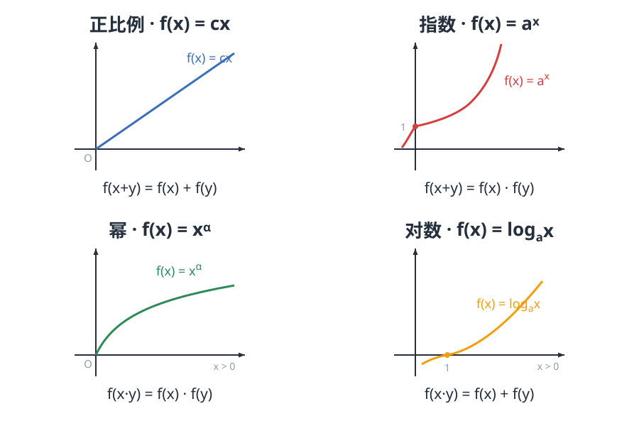

认识一个函数有两种方式。一种是直接给公式，比如 $f(x)=x^2$——长相全交代了，画图、求导随便你。另一种更含蓄：**不给公式**，只给几条它必须服从的规则，比如

$$f(x+y)=f(x)+f(y)\quad(\text{对任意实数 } x,y)$$

然后开始提问：$f(0)$ 是几？它是奇函数吗？单调吗？这样的函数叫作**抽象函数**。它像一场推理游戏：公式是嫌疑人的照片，函数方程是它的行为习惯——而行为习惯，往往比照片更能锁定身份。

## 赋值法：从特殊值开始盘问

推理的核心工具朴素得惊人：既然方程对任意 $x,y$ 成立，那就可以代入任何我们想代的东西。这招叫**赋值法**。拿上面这条最著名的方程（柯西方程）开刀。

**想知道 $f(0)$？** 令 $x=y=0$：

$$f(0)=f(0)+f(0)\quad\Longrightarrow\quad f(0)=0.$$

**想看奇偶性？** 令 $y=-x$，再用刚到手的 $f(0)=0$：

$$f(x)+f(-x)=f(0)=0\quad\Longrightarrow\quad f(-x)=-f(x),$$

一次代换就审出了奇函数的身份。

**想放大？** 令 $y=x$ 得 $f(2x)=2f(x)$，归纳得 $f(nx)=n\,f(x)$；再把 $x$ 换成 $\frac{x}{n}$，又得 $f\!\left(\frac{x}{n}\right)=\frac{1}{n}f(x)$。两步合起来：

$$f(qx)=q\,f(x)\qquad(q\in\mathbb{Q}).$$

取 $x=1$，记 $c=f(1)$，那么全体有理数都被拿捏了：$f(q)=cq$。到这里，方程已经把 $f$ 在 $\mathbb{Q}$ 上的身份完全锁死。剩下的无理数呢？只要教材再多送一句"$f$ 单调"或"$f$ 连续"，用有理数一夹，无理数也只能就范。于是：

> 在连续或单调这样的温和条件下，柯西方程的全部解就是正比例函数 $f(x)=cx$。

我们自始至终没见过 $f$ 的公式——身份纯靠规则逼了出来。

常用的起手式就这几板斧：

- **求 $f(0)$**：两个变量都塞 $0$；
- **判奇偶**：塞 $y=-x$；
- **证单调**：作差 $f(x_2)-f(x_1)$，把"差"塞进同一个括号；
- **找周期**：遇到 $f(x+a)=-f(x)$ 这种变号关系，连套两次，$f(x+2a)=f(x)$。

## 指纹方程：初等函数的另一张身份证

上面的结论值得反过来看：与其说我们在研究陌生函数，不如说每个熟悉的初等函数家族，都有一条专属的**指纹方程**。

| 指纹方程（定义域内恒成立） | 再补一句 | 锁定的身份 |
|---|---|---|
| $f(x+y)=f(x)+f(y)$ | 连续，或单调 | 正比例 $f(x)=cx$ |
| $f(x+y)=f(x)\,f(y)$ | 连续且不恒为零 | 指数 $f(x)=a^x,\ a=f(1)$ |
| $f(xy)=f(x)\,f(y)$ | 在 $(0,+\infty)$ 上连续且非常数 | 幂 $f(x)=x^{\alpha}$ |
| $f(xy)=f(x)+f(y)$ | 在 $(0,+\infty)$ 上连续且非常数 | 对数 $f(x)=\log_a x$ |

（对数的底数由任意一个具体值锁定，比如再补一句 $f(a)=1$。）

这个视角解释了一件课本上习以为常的事：为什么 $a^{x+y}=a^x a^y$、$\log_b(xy)=\log_b x+\log_b y$ 总被翻来覆去地强调——它们不是巧合，而是这些家族的身份证。反过来，哪天你遇到一个陌生的 $g$，想确认它是不是指数函数，不必看公式：验一条方程就够了。

## 实战：一道题用齐全部家当

> 设 $f$ 定义在 $\mathbb{R}$ 上，满足 $f(x+y)=f(x)+f(y)$，且当 $x>0$ 时 $f(x)<0$。解不等式 $f(3x-1)+f(2-x)\le 0$。

三步，每一步都是前面盘问过的老朋友。

**① 先摸底。** 令 $x=y=0$ 得 $f(0)=0$；令 $y=-x$ 得 $f(-x)=-f(x)$：奇函数。

**② 再验单调。** 任取 $x_1<x_2$，关键起手式是把差值改写成增量：

$$f(x_2)-f(x_1)=f(x_2-x_1).$$

由 $x_2-x_1>0$ 知右边小于零，故 $f(x_2)<f(x_1)$：$f$ 在 $\mathbb{R}$ 上**单调递减**。

**③ 脱掉外衣。** 左边两项先用方程合并成一项：

$$f(3x-1)+f(2-x)=f\big((3x-1)+(2-x)\big)=f(2x+1),$$

又 $0=f(0)$，不等式即 $f(2x+1)\le f(0)$。单调递减意味着"函数值越小 ⟺ 自变量越大"，脱掉 $f$ 时方向要反过来：

$$2x+1\ge 0\quad\Longrightarrow\quad x\ge-\frac12.$$

整道题没出现过 $f$ 的任何具体表达式，但它的奇偶性、单调性和不等式的解，全部被规则交了出来。

## 光有方程还不够：提防怪物

写下这条方程时，柯西心里想的都是"正常"的函数。但总有人较真：**如果什么都不补——既不许假设连续，也不许假设单调呢？** 1905 年，Hamel 证明：怪解不但存在，还多得很。存在处处满足 $f(x+y)=f(x)+f(y)$、却在任何一点都不连续的函数；更夸张的是，它们的图像在坐标平面上**稠密**——随便戳一个点，附近都趴着这条"曲线"上的点，可你永远画不出它。

这就是为什么教材总要贴心地多写一句"$f$ 在 $\mathbb{R}$ 上单调"或"$f$ 连续"：不是放水，而是把怪物挡在门外。约束条件不是负担，而是定义的一部分。（构造思路见文末折叠块。）

## 相关阅读

- [Cauchy's functional equation](https://en.wikipedia.org/wiki/Cauchy%27s_functional_equation)：本文主角的标准条目，附各种正则条件下的结论一览。
- [Hamel basis](https://en.wikipedia.org/wiki/Hamel_basis)：怪物背后的构造工具：把 $\mathbb{R}$ 看成 $\mathbb{Q}$ 上的向量空间。

> [!detail] 附：怪物的构造思路（可展开）
> 把 $\mathbb{R}$ 视为有理数域 $\mathbb{Q}$ 上的向量空间，用选择公理取一组基（Hamel 基）$\{e_i\}$：每个实数 $x$ 可唯一写成有限和 $x=q_1e_1+\cdots+q_ne_n$。随意给每个基向量指派系数 $c_i$，定义 $f(x)=q_1c_1+\cdots+q_nc_n$。加法把系数逐项相加，所以方程自动成立；只要诸 $c_i/e_i$ 不全相等，$f$ 就不是线性函数，进而不连续、图像稠密。换句话说，这些怪物是被选择公理放进数学里的。

> [!detail] 附：另外三条指纹怎么验证（可展开）
> 以指数为例：$f(x+y)=f(x)f(y)$。先注意 $f(x)=f\!\left(\frac{x}{2}\right)^2\ge 0$，且若在某点取零则 $f\equiv 0$，故非平凡解恒正。归纳得 $f(n)=f(1)^n=a^n$；由 $f\!\left(\frac{m}{n}\right)^n=f(m)$ 取正根得 $f\!\left(\frac{m}{n}\right)=a^{m/n}$；最后用连续性把无理数夹进去，即 $f(x)=a^x$。幂与对数的验证同型：先在有理数（整数）上安家，再用连续性铺满整个定义域。
