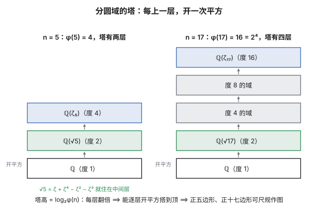
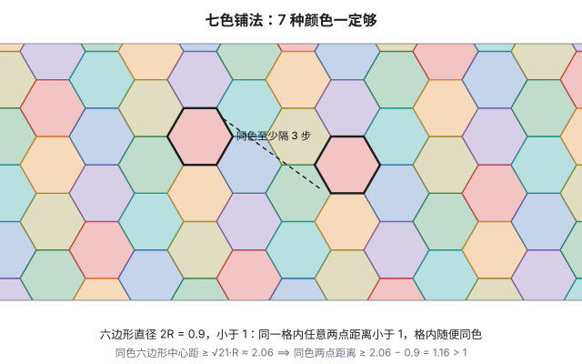
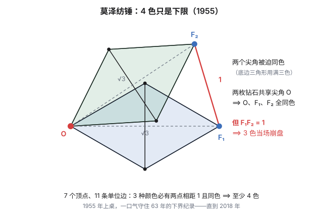

本站的文章大多追求"讲完备"：定义、定理、证明、验算，一条龙。但有些主题，价值恰恰在于"讲不完备"——它们要么背后是一整座学科（比如分圆域），要么至今没人知道完整答案（比如单位距离猜想）。硬写成教程，要么厚得吓人，要么失真。

所以开一个新栏目：**散篇·随谈**。导游图，不是证明课；指路，不越界。今天两站：分圆域，与单位距离猜想。前者是《单位根与正十七边形》欠下的续篇，后者是 2018 年那则著名新闻——而且两者最后会在一个意想不到的地方碰头。

## 上：分圆域——单位根的共和国

《单位根》那篇的结尾有一句被一笔带过的话：把单位根收拢成环 $\mathbb Z[\omega]$，再允许除法，就得到**分圆域** $\mathbb Q(\omega_n)$，它的伽罗瓦群恰好是 $(\mathbb Z/n\mathbb Z)^\times$。这句话值得展开成三段。

**其一：这句话在说什么。** $\mathbb Q(\omega_n)$ 是从有理数出发、把 $\omega_n=e^{2\pi i/n}$ 添加进来之后能到达的全部数——拿 $\omega_n$ 与有理数反复做加减乘除，走到的每一个角落。$\varphi(n)$ 个本原单位根在这片域里被对称地对待，而全部对称操作恰好由"把 $\omega_n$ 换成 $\omega_n^k$（$\gcd(k,n)=1$）"给出。**单位根之间的对称性，不多不少就是模 $n$ 的乘法群**——这句翻译是分圆域全部魔法的源头。

**其二：域是分层的。** $\varphi(n)$ 是域在 $\mathbb Q$ 上的次数，而当这个次数是 2 的幂时（且仅仅是那时），域可以搭成一座**开平方的塔**。最矮的那座住着黄金分割：在 $\mathbb Q(\zeta_5)$ 的中间层 $\mathbb Q(\sqrt5)$ 里，$\sqrt5$ 有一个让人愣一下的表达式

$$\sqrt5=\zeta_5+\zeta_5^4-\zeta_5^2-\zeta_5^3$$

——$\varphi=\frac{1+\sqrt5}2$ 原来一直住在五次单位根的家里。《切比雪夫》与《单位根》两篇从两个方向摸到 $\cos 36^\circ$，其实都是在 $\mathbb Q(\zeta_5)$ 的中间层摸到的它。

**其三：根号有身世。** 《单位根》里 $n=7$ 的高斯周期是 $\eta_0=\frac{-1+i\sqrt7}2$，正十七边形那篇里是 $\eta_0=\frac{-1+\sqrt{17}}2$——两组根号从哪来？答案是**高斯和** $g=\sum_k\left(\frac{k}{p}\right)\zeta_p^k$（按二次剩余符号加权求和），它满足

$$g^2=(-1)^{\frac{p-1}2}\,p$$

$p\equiv 1\pmod 4$（如 17）时 $g$ 是实数，周期是实的；$p\equiv 3\pmod 4$（如 7）时 $g$ 是纯虚数，周期是复的。两篇文章里那两枚根号的"虚实之别"，一行公式道尽。而这一切之上还盖着一顶王冠——**Kronecker–Weber 定理**：有理数的任何阿贝尔扩张，都住在某个分圆域里。分圆域是"模算术能造出的数"的总库；这句陈述级的话，背后是代数数论一整章（细节见文末）。

## 下：单位距离猜想——给整个平面染色

换一个世界。问一个问题：给平面染色，使得**距离恰好为 1** 的两个点永远不同色，最少要几种颜色？

这个问题叫 **Hadwiger–Nelson 问题**，上世纪四十到五十年代由 Hadwiger 与 Nelson 先后摆上台面。它难在先天：平面是连续统，顶点不可数，"图"大得没有边界——任何有限手段都只能摸到它的一角。七十年来，人类对答案的全部知识曾是两条：

- **7 种一定够。** 用直径略小于 1 的正六边形铺满平面，按周期规律上 7 种颜色：同色六边形之间至少隔开三层，同色两点的距离被抬到 1 以上。

- **4 种不够。** 1955 年的**莫泽纺锤**：7 个顶点、11 条单位边的小图。每个"钻石"由两个等边三角形拼成，3 染色时两个尖角被迫同色；两枚钻石共享一个尖角，于是三个尖角全同色——可另外两个尖角又被摆成恰好相距 1。3 色当场撞车。

于是答案被夹在 $[4,7]$ 里，一夹就是六十多年。2018 年 4 月，剧情突变：**Aubrey de Grey**——一位以抗衰老研究闻名的生物老年学家，数学是业余爱好——发布了一个 **1581 个顶点**的单位距离图，它是 5 色的：**"4 色就够了"这个 68 年的默认猜想阵亡**，下界从 4 推到 5。更精彩的是后续：数学社区立刻组织了 Polymath 协作项目，用 SAT 求解器等工具压缩"最小反例"——645、553、510——如今五百个顶点出头。问题的现状是"5、6 或 7，不知道"。顺带一句：这些证明都带着计算机签发的证书，"人证"与"机证"如何互相背书，本身就是个有意思的话题（漫士有一期视频把整条线讲得很清楚，见文末）。

## 中场：两个话题在哪里碰头

表面上看，分圆域（代数数论）与单位距离（组合几何）八竿子打不着。碰头点藏在坐标里。

单位距离世界里最早的一批"居民"——三角格点——恰好是**艾森斯坦整数** $\mathbb Z[\omega]$，其中 $\omega=e^{2\pi i/3}$ 是三次单位根：**单位根们自己铺成的棋盘**，正是单位距离问题最天然的战场（这个棋盘本身要 3 种颜色）。莫泽纺锤拼装时需要一个旋转角，解出来 $\cos\varphi=5/6$——纺锤的坐标落进 $\mathbb Q(\sqrt3,\sqrt{11})$ 这样的数域。事实上，"把平面换成某个数域 $F$ 之后再问染色数"本身就是一条研究线：换成有理数点 $\mathbb Q^2$，2 色就够了；数域越"富"，染色数越向完整的平面爬升。单位距离猜想的深渊边上，围着的正是分圆域及其亲戚们的地基——两个话题在这里握手。

## 尾声：为什么写随谈

这一篇没有把任何一个定理证完：分圆域的伽罗瓦对应只给了陈述，高斯和只给了公式，纺锤的 4 色性只给了论证梗概。这不是偷懒，而是体裁本意——**"知道一座山在哪里、山道通向何方"，与"亲自爬完山道"，都是值得记录的数学**。哪天想把其中一段展开成正篇，这篇随谈就是路标。

## 相关阅读

- [单位距离猜想攻破详解：人类数学家离失业还有多远？](https://www.bilibili.com/video/BV1G7jJ6nEbV)（Bilibili·漫士沉思录）：下篇故事的完整版，这期视频讲得非常清楚。
- [单位根与正十七边形:高斯的那一天](post.html?slug=roots-of-unity)(本站):分圆域的"前情"——单位根、分圆多项式与高斯周期。
- [A. de Grey, The chromatic number of the plane is at least 5](https://arxiv.org/abs/1804.02385)(arXiv):2018 年那条 1581 顶点的反例。
- [Hadwiger–Nelson problem](https://en.wikipedia.org/wiki/Hadwiger%E2%80%93Nelson_problem)(Wikipedia):问题的现状、历史与各种变体。
- [Cyclotomic field](https://en.wikipedia.org/wiki/Cyclotomic_field)(Wikipedia):分圆域词条，Kronecker–Weber 定理的陈述所在。

> [!detail] 技术细节
> **1. 莫泽纺锤的坐标与"同色强制"。** 钻石 = 两个等边三角形拼同一底边：顶点 $O,(a_1,b_1),F_1$，其中 $a_1b_1$ 是公共底边，$O,F_1$ 是两个尖角，$OF_1=\sqrt3$。3 染色下三角形 $Oa_1b_1$ 用满三色，$a_1$ 与 $b_1$ 已异色，故两尖角 $O,F_1$ 同色。纺锤 = 两枚钻石共享尖角 $O$，另一对尖角相距 1：由 $OF_1=OF_2=\sqrt3$、$F_1F_2=1$ 解出旋转角 $\cos\varphi=5/6$，坐标落在 $\mathbb Q(\sqrt3,\sqrt{11})$。
>
> **2. 七色铺法的参数。** 取正六边形外接圆半径 $R=0.45$（直径 $0.9<1$，格内任意两点距离小于 1），中心铺成三角格，颜色按 $(i+3j)\bmod 7$ 分配。逐项验证：格距 1 的六对邻居的颜色差为 $\pm1,\pm2,\pm3$，格距 2 的十二对的颜色差落在 $\{1,2,3,4,5,6\}$——都不是 0，于是同色六边形至少相距 3 步，中心距 $\ge\sqrt{21}R\approx2.06$，同色两点距离 $\ge 2.06-0.9=1.16>1$。（把这里改成 $(i+2j)$ 是常见的错法：$(2,-1)$ 型邻居会同色。）
>
> **3. 高斯和与周期的虚实。** 二次高斯和 $g=\sum_{k=0}^{p-1}\left(\frac{k}{p}\right)\zeta_p^k$ 满足 $g^2=(-1)^{\frac{p-1}2}p$。$p=7$：$g=i\sqrt7$，$\eta_0=\frac{-1+g}2=\frac{-1+i\sqrt7}2$；$p=17$：$g=\sqrt{17}$，$\eta_0=\frac{-1+\sqrt{17}}2$。这也解释了《单位根》那篇里 $n=7$ 的周期为什么带 $i$。
>
> **4. Kronecker–Weber 定理。** $\mathbb Q$ 的有限阿贝尔扩张 $K$ 必然包含于某个分圆域 $\mathbb Q(\zeta_n)$；最小的这样的 $n$ 叫 $K$ 的 conductor。二次域是最简单的例子：$\mathbb Q(\sqrt d)$ 含在 $\mathbb Q(\zeta_{|D|})$ 中（$D$ 是与 $d$ 相配的判别式）。定理的完整证明是代数数论一整章的内容，本篇只负责指出路标。
>
> **5. 关于"计算机签发的证书"。** de Grey 图与后续压缩版的"5 色性"由 SAT 求解器参与产出，且"该图不可 3 染色"这一步可以编码成命题逻辑后由求解器给出不可满足证明链，验证这条链只需要一段普通程序。数学共同体如何为这类"人机合作"的证明背书，是 2018 年这波进展留下的另一个话题。
