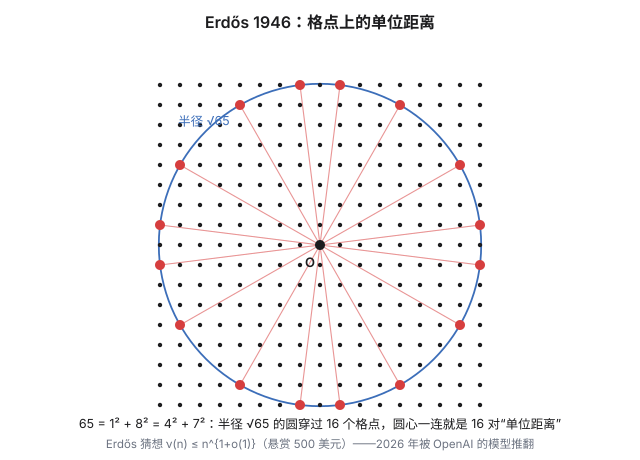

本站的文章大多追求"讲完备"：定义、定理、证明、验算，一条龙。但有些主题，价值恰恰在于"讲不完备"——它们要么背后是一整座学科（比如分圆域），要么是还没来得及消化的新进展（比如 2026 年春天那条震动组合几何的新闻）。硬写成教程，要么厚得吓人，要么失真。

所以开一个新栏目：**散篇·随谈**。导游图，不是证明课；指路，不越界。今天三站：分圆域，平面染色的悬案，以及一场刚落地的地震和它的余震——OpenAI 的模型推翻了 Erdős 的单位距离猜想，随后一个月，社区又把指数下界拧大了三十六个数量级。第一站和第三站会在中途握手，这不是修辞。

## 上：分圆域——单位根的共和国

《单位根与正十七边形》那篇的结尾有一句被一笔带过的话：把单位根收拢成环 $\mathbb Z[\omega]$，再允许除法，就得到**分圆域** $\mathbb Q(\omega_n)$，它的伽罗瓦群恰好是 $(\mathbb Z/n\mathbb Z)^\times$。这句话值得展开成三段。

**其一：这句话在说什么。** $\mathbb Q(\omega_n)$ 是从有理数出发、把 $\omega_n=e^{2\pi i/n}$ 添加进来之后能到达的全部数——拿 $\omega_n$ 与有理数反复做加减乘除，走到的每一个角落。$\varphi(n)$ 个本原单位根在这片域里被对称地对待，而全部对称操作恰好由"把 $\omega_n$ 换成 $\omega_n^k$（$\gcd(k,n)=1$）"给出。**单位根之间的对称性，不多不少就是模 $n$ 的乘法群**——这句翻译是分圆域全部魔法的源头。

**其二：域是分层的。** $\varphi(n)$ 是域在 $\mathbb Q$ 上的次数，而当这个次数是 2 的幂时（且仅仅是那时），域可以搭成一座**开平方的塔**。最矮的那座住着黄金分割：在 $\mathbb Q(\zeta_5)$ 的中间层 $\mathbb Q(\sqrt5)$ 里，$\sqrt5$ 有一个让人愣一下的表达式

$$\sqrt5=\zeta_5+\zeta_5^4-\zeta_5^2-\zeta_5^3$$

——$\varphi=\frac{1+\sqrt5}2$ 原来一直住在五次单位根的家里。《切比雪夫》与《单位根》两篇从两个方向摸到 $\cos 36^\circ$，其实都是在 $\mathbb Q(\zeta_5)$ 的中间层摸到的它。

**其三：根号有身世。** 《单位根》里 $n=7$ 的高斯周期是 $\eta_0=\frac{-1+i\sqrt7}2$，正十七边形那篇里是 $\eta_0=\frac{-1+\sqrt{17}}2$——两组根号从哪来？答案是**高斯和** $g=\sum_k\left(\frac{k}{p}\right)\zeta_p^k$（按二次剩余符号加权求和），它满足

$$g^2=(-1)^{\frac{p-1}2}\,p$$

$p\equiv 1\pmod 4$（如 17）时 $g$ 是实数，周期是实的；$p\equiv 3\pmod 4$（如 7）时 $g$ 是纯虚数，周期是复的。两篇文章里那两枚根号的"虚实之别"，一行公式道尽。而这一切之上还盖着一顶王冠——**Kronecker–Weber 定理**：有理数的任何阿贝尔扩张，都住在某个分圆域里。分圆域是"模算术能造出的数"的总库；记住这句话，本篇高潮要靠它供弹药。

## 下：两桩"单位距离"悬案

先澄清一个常见的混淆——我自己就栽在这里："单位距离"名下其实有**两桩**名案，一桩问**染色**，一桩问**计数**。前者至今未决；后者刚刚在 2026 年被解决，以最意外的方式。

### 染色：5、6 还是 7

给平面染色，使**距离恰好为 1** 的两个点永远不同色，最少要几种颜色？这是 Hadwiger–Nelson 问题。它难在先天：平面是连续统，顶点不可数。七十年来人类知道的全部是两条界：

- **7 种一定够。** 用直径略小于 1 的正六边形铺满平面，按周期规律上 7 种颜色：同色六边形至少隔开三层，同色两点的距离被抬到 1 以上。

- **4 种不够。** 1955 年的**莫泽纺锤**：7 个顶点、11 条单位边。每个"钻石"由两个等边三角形拼成，3 染色时两个尖角被迫同色；两枚钻石共享一个尖角，三个尖角全同色——可另外两个尖角恰好相距 1。3 色当场撞车。

2018 年 4 月，剧情突变：**Aubrey de Grey**——一位以抗衰老研究闻名的生物老年学家，数学是业余爱好——发布了一个 1581 个顶点的 5 色单位距离图：4 色猜想阵亡，下界推到 5。此后 Polymath 协作用 SAT 求解器把最小反例一路压缩到五百个顶点出头。染色问题的现状：**5、6 或 7，不知道**。

### 计数：Erdős 的 $n^{1+o(1)}$

另一桩不问染色，问**计数**：平面上 $n$ 个点，最多能出现多少对距离**恰好为 1** 的点对？记最大值 $\nu(n)$。这是 Erdős 1946 年的老问题，他当年就给出了两条界：

- **下界**：$\sqrt n\times\sqrt n$ 的整数格点——把格点看成高斯整数 $\mathbb Z[i]$。取 $m$ 为很多个 $4k+1$ 型素数之积，$m$ 有极多的两平方和表示，半径 $\sqrt m$ 的圆上就挤满格点，配对之后 $\nu(n)\ge n^{1+c/\log\log n}$；
- **上界**：单位圆两两至多交两点 ⟹ 单位距离图不含 $K_{2,3}$ ⟹ $\nu(n)=O(n^{3/2})$；1984 年 Spencer–Szemerédi–Trotter 用交叉数方法压到 $O(n^{4/3})$。

两条界之间的鸿沟（指数 $1+o(1)$ 对 $4/3$）保持了八十年。Erdős 猜想上界那头是真的：$\nu(n)\le n^{1+o(1)}$，并先后悬赏 300 与 500 美元。几乎所有组合几何学家都信了——包括 Erdős 本人。

## 中场：它们在哪里碰头

表面上看，分圆域（代数数论）与单位距离（组合几何）八竿子打不着。碰头点藏在坐标里。

单位距离世界里最早的一批"居民"——三角格点——恰好是**艾森斯坦整数** $\mathbb Z[\omega]$，其中 $\omega=e^{2\pi i/3}$ 是三次单位根：**单位根们自己铺成的棋盘**，正是这些组合几何问题最天然的战场。莫泽纺锤拼装时需要一个旋转角，解出来 $\cos\varphi=5/6$——纺锤的坐标落进 $\mathbb Q(\sqrt3,\sqrt{11})$ 这样的数域。事实上，"把平面换成某个数域 $F$ 之后再问染色数"本身就是一条研究线：换成有理数点 $\mathbb Q^2$，2 色就够了；数域越"富"，染色数越向完整的平面爬升。

写下这些的时候，"分圆域与单位距离在这里握手"还只是一个类比。2026 年春天，它变成了字面事实——握手的力度，下一节见。

## 高潮：2026 年，AI 与那 500 美元

2026 年 5 月，OpenAI 宣布：其内部模型**解决了一道悬赏 500 美元的 Erdős 问题**——证明 Erdős 的计数猜想是**错的**：

> 存在常数 $\delta>0$ 与无穷多个 $n$，使得 $\nu(n)\ge n^{1+\delta}$。

构造分三步（随谈级描述，细节以论文为准）：

**第一步，造塔（类域论）。** 从分圆域 $\mathbb Q(\zeta_r)$（$r\equiv 1\pmod 3$）里按特征剪出三次循环域，叠出基础域 $F$；在 $F$ 上取极大不分歧 pro-3 扩张的伽罗瓦群——Golod–Shafarevich 不等式保证剪裁后的塔

$$F=F_0\subset F_1\subset F_2\subset\cdots$$

无穷无尽；Chebotarev 定理挑出固定的一组素数 $q_1,\dots,q_t$，在每一层都完全分裂。因为塔处处不分歧，**根判别式 $\mathrm{rd}(F_j)=\mathrm{rd}(F)$ 不随层数增长**——这是全场最要害的一条。

**第二步，类群鸽笼（数域里"装"单位圆）。** $K=L(i)$ 是 CM 域：$L$ 全实，非平凡自同构 $c$ 在每个嵌入下都表现为普通复共轭。完全分裂的 $q_b$ 提供大量共轭素理想对，$2^m$ 个理想只落在 $h(K)$ 个理想类里——鸽笼一夹，得到指数多个元素 $u=\alpha/c(\alpha)$，满足 $u\cdot c(u)=1$：它在**每一个**复嵌入下模长都恰好是 1，而且分母有界。

**第三步，几何投影。** 把 $K$ 按 Minkowski 方式嵌进 $\mathbb C^f$（$f=[L:\mathbb Q]$），整数环成了一张高维格子；取"f 个圆盘的乘积"当窗口，窗口里格子点很多；$U$ 里每个 $u$ 都是"每个坐标模长恰为 1"的平移——窗口里的点和它平移后的像配对，投影到任意一个复坐标（在陪集上单射），得到的正是平面上的单位距离对。配对计数与装箱估计两头一夹：$\nu(n)\ge n^{1+\delta}$。

**为什么专家八十年没找到？** Will Sawin 的评论一针见血：Erdős 的原始构造是"域固定（$\mathbb Q(i)$）、参与分裂的素数越来越多"；最自然的推广是"换一个固定的 CM 域"——但那恰好原封不动退回 Erdős 的界。AI 的动作是把变量对调：**素数固定，让域沿着类域塔变大**。于是 $2^{tf}$ 的指数增益第一次压过了类数与判别式的指数成本——而控制后者的武器（不分歧塔、Minkowski 类数估计）全是现成的经典。

**AI 的部分不该被略过。** 证明由内部模型一次性生成，先经 AI 评分管线自检，再由 Alon、Bloom、Gowers、Litt、Sawin、Shankar、Tsimerman、Wang、Wood 九位数学家复核、简化并联名写下评论（人类还把 pro-3 塔换成了更好写的 pro-2 塔，把显式指数算到 $1+6.24\times10^{-38}$——别嫌小：猜想说的只是指数比 1 多一个 $\log\log$ 级别的尾巴，任何一个固定的 $\delta$ 都足以杀死它）。Bloom（erdosproblems.com 站长）写道："AI 解决了一道价值 500 美元的 Erdős 问题"——而他在结果出现一个月前，刚把这个问题列进自己的"十大 Erdős 问题"博文。Wood 的评论最打动我：如果一个月前把这群专家聚在一起找反例，他们大概率也找得到——**但没有人有理由去做这件事**。

**到此，上篇的类比全部兑现**：反例的原材料——从分圆域里剪出的基础域、类域塔、CM 结构——全是第一节"单位根共和国"的库存。上篇说分圆域与单位距离在这里握手；这一次，握手有了一个定理的重量。但这还只是开幕——真正的军备竞赛在反例之后才开始。

## 续集：四周，δ 从 10⁻³⁸ 拧到 0.036

反例落地时的 δ 小得可怜：Alon 等人的 remarks 版本把指数显式算出来是 $1+6.24\times10^{-38}$。别笑——猜想说的是指数比 1 多一个 $\log\log$ 级别的尾巴，任何一个固定的 $\delta$ 都足以杀死它。但"杀死"之后，真正的竞赛才开始，前后四周：

- **5 月上旬**：Lean 形式化完成，erdosproblems #90 的状态改为 **DISPROVED (LEAN)**；
- **5 月 20 日**：**Sawin** 发表显式下界 $n^{1.014}$（arXiv:2605.20579）——把他在 remarks 评论里埋的想法做成完整计算；
- **5 月底起**：MathOverflow 开出协作精修，接力纪录——mlewko 1.03184、spiderduckpig 1.03335、**Naslund** 1.03447 → 1.03467 → **1.03583**（当前纪录，尚待独立验证）；Tseng 附上可复现的逐点证书；
- **7 月**：Tao 发表构造综述，核心观察一句话——**所有已知构造都住在代数整数环里**。

压缩的原理没有新意，新意全在"拧旋钮"。指数由 $\delta\approx\gamma/(4B)$ 支配，两个旋钮：

- **收益旋钮 $\gamma$**：分裂素数给出的"单位平移"个数（对数上 $\approx t\log 2$）减去类数损失（$\log H$）。原版 $t\approx\ell^2/100$，收益勉强跑赢损失；Sawin 换成"**一个**分裂素数 + 幂次开满"（$k\approx 18r^3/\pi$，$r=2\cdot3\cdot5\cdot7\cdot11\cdot13\cdot17$），收益 $k^f$ 暴涨而损失只进对数；
- **成本旋钮 $B$**：分母判别式进窗口的装箱代价。Naslund 把几何部分的球堆积估计换成理想格上的**协体积界**（自称"本质上最优"），再把 $|T|$ 重新优化到 39。

上界那条战线也没闲着：$4/3$ 原地未动，但 Pach–Raz–Solymosi 已把"首次改进 $4/3$"条件性地归约为一个刚性框架猜想（弱版本已证明）——反例革命之后，上界研究也有了第一张地图。

三条启发，替这节收尾：**其一**，范式反转是稀缺品——自然的推广恰好退回原界，反直觉的对调才是矿，但"矿的形状"（固定一个变量、放开另一个）是可以复制的；**其二**，显式化是被低估的消化方式——从 $10^{-38}$ 到 1.0358 在原理上零新意，可每一步都可复现、可验证、可进 Lean，这正是社区接管一个突破的标准动作（Gowers：人类仍扮演消化者）；**其三**，门开了，门后各有各的锁——Sawin 分析过同方法打不进去的近邻（distinct distances、$\mathbb R^3$ 版本），惯性素数因子会吃掉收益。下一个问题，不是随便挑的。

## 尾声：为什么写随谈

这一篇没有把任何一个定理证完：分圆域的伽罗瓦对应只给了陈述，高斯和只给了公式，两桩悬案里一桩未决、一桩的新证明只给了骨架。这不是偷懒，而是体裁本意——**"知道一座山在哪里、山道通向何方"，与"亲自爬完山道"，都是值得记录的数学**。顺便记下 Wood 的那句评论：有趣而有力的数学，常常发生在把一个领域的想法搬进另一个领域的时候——AI 这次只是把这个动作做得比谁都果断。随谈这个栏目，记的正是这类搬运的路标。

哪天想把其中一段展开成正篇——分圆域入门、类域塔、或者 Szemerédi–Trotter 的交叉数证明——这篇随谈就是路标。

## 相关阅读

- [单位距离猜想攻破详解：人类数学家离失业还有多远？](https://www.bilibili.com/video/BV1G7jJ6nEbV)（Bilibili·漫士沉思录）：把 OpenAI 这次反例的来龙去脉讲得非常清楚。
- [Model disproves discrete geometry conjecture](https://openai.com/zh-Hans-CN/index/model-disproves-discrete-geometry-conjecture/)（OpenAI 官方公告）：论文全文与发布说明。
- [Erdős problem #90](https://www.erdosproblems.com/90)（erdosproblems.com）：计数问题的沿革、赏金与文献。
- [W. Sawin, An explicit lower bound for the unit distance problem](https://arxiv.org/abs/2605.20579)(arXiv):把 δ 从 10⁻³⁸ 拧到显式 1.014 的那一篇。
- [Erdős unit distance exponent](https://teorth.github.io/optimizationproblems/constants/84a.html)（Tao 的追踪页）：指数纪录的实时账本，"续集"一节的数字都来自这里。
- [Pach–Raz–Solymosi, Erdős's unit distance problem and rigidity](https://arxiv.org/abs/2507.15679)(arXiv):上界战线——把改进 4/3 归约为刚性框架猜想。
- [A. de Grey, The chromatic number of the plane is at least 5](https://arxiv.org/abs/1804.02385)(arXiv):染色问题那条线的 2018 年突破。
- [Hadwiger–Nelson problem](https://en.wikipedia.org/wiki/Hadwiger%E2%80%93Nelson_problem)(Wikipedia):染色问题的现状与变体。
- [Cyclotomic field](https://en.wikipedia.org/wiki/Cyclotomic_field)(Wikipedia):分圆域词条，Kronecker–Weber 定理的陈述所在。
- [单位根与正十七边形:高斯的那一天](post.html?slug=roots-of-unity)(本站):分圆域的"前情"——单位根、分圆多项式与高斯周期。

> [!detail] 技术细节
> **1. 莫泽纺锤的坐标与"同色强制"。** 钻石 = 两个等边三角形拼同一底边：顶点 $O,(a_1,b_1),F_1$，其中 $a_1b_1$ 是公共底边，$O,F_1$ 是两个尖角，$OF_1=\sqrt3$。3 染色下三角形 $Oa_1b_1$ 用满三色，$a_1$ 与 $b_1$ 已异色，故两尖角 $O,F_1$ 同色。纺锤 = 两枚钻石共享尖角 $O$，另一对尖角相距 1：由 $OF_1=OF_2=\sqrt3$、$F_1F_2=1$ 解出旋转角 $\cos\varphi=5/6$，坐标落在 $\mathbb Q(\sqrt3,\sqrt{11})$。
>
> **2. 七色铺法的参数。** 取正六边形外接圆半径 $R=0.45$（直径 $0.9<1$，格内任意两点距离小于 1），中心铺成三角格，颜色按 $(i+3j)\bmod 7$ 分配。逐项验证：格距 1 的六对邻居的颜色差为 $\pm1,\pm2,\pm3$，格距 2 的十二对的颜色差落在 $\{1,2,3,4,5,6\}$——都不是 0，于是同色六边形至少相距 3 步，中心距 $\ge\sqrt{21}R\approx2.06$，同色两点距离 $\ge 2.06-0.9=1.16>1$。（把这里改成 $(i+2j)$ 是常见的错法：$(2,-1)$ 型邻居会同色。）
>
> **3. 高斯和与周期的虚实。** 二次高斯和 $g=\sum_{k=0}^{p-1}\left(\frac{k}{p}\right)\zeta_p^k$ 满足 $g^2=(-1)^{\frac{p-1}2}p$。$p=7$：$g=i\sqrt7$，$\eta_0=\frac{-1+g}2=\frac{-1+i\sqrt7}2$；$p=17$：$g=\sqrt{17}$，$\eta_0=\frac{-1+\sqrt{17}}2$。这也解释了《单位根》那篇里 $n=7$ 的周期为什么带 $i$。
>
> **4. Kronecker–Weber 定理。** $\mathbb Q$ 的有限阿贝尔扩张 $K$ 必然包含于某个分圆域 $\mathbb Q(\zeta_n)$；最小的这样的 $n$ 叫 $K$ 的 conductor。二次域是最简单的例子：$\mathbb Q(\sqrt d)$ 含在 $\mathbb Q(\zeta_{|D|})$ 中（$D$ 是与 $d$ 相配的判别式）。定理的完整证明是代数数论一整章的内容，本篇只负责指出路标。
>
> **5. 关于染色问题的"计算机签发的证书"。** de Grey 图与后续压缩版的"5 色性"由 SAT 求解器参与产出，且"该图不可 4 染色"这一步可以编码成命题逻辑后由求解器给出不可满足证明链，验证这条链只需要一段普通程序。数学共同体如何为这类"人机合作"的证明背书，在 2026 年的计数问题反例里变成了更大的话题——见细节 8。
>
> **6. Erdős 格点构造的算术。** 高斯整数里 $m$ 的两平方和表示数为 $r_2(m)=4(d_1(m)-d_3(m))$，其中 $d_1,d_3$ 分别是 $\equiv 1,3\pmod 4$ 的因子个数。取 $m$ 为前 $k$ 个 $1\bmod 4$ 素数之积，则全部因子都 $\equiv 1\pmod 4$，$r_2(m)=2^{k+2}$；而这样的 $m\le n$ 可以取到 $k\approx\log\log n$，于是圆上格点数给出 $\nu(n)\ge n^{1+c/\log\log n}$。
>
> **7. CM 域的关键性质。** CM 域 = 全实域的二次全虚扩张。关键一条：$K$ 的元素在**某个**嵌入下模长为 1，当且仅当它在**所有**嵌入下模长为 1（等价于 $u\cdot c(u)=1$）。这就是构造里"每个坐标模长都恰好 1"的来源；也解释了为什么必须搬进 CM 域——全实域里模长为 1 的元素只有 $\pm1$。
>
> **8. 类群鸽笼的谱系。** " ideals 多、类少，鸽笼取差"这一招与 Ellenberg–Venkatesh 界类群挠率的工作同源；"素数固定、域沿类域塔变大"的范式此前已在别处供货：Lenstra 用类域塔造码，Litsyn–Tsfasman 造球堆积，Venkatesh 证高维球堆积，Kopp 连到等角线与 Stark 猜想。单位距离是这份清单上最新的顾客。Sawin 的评论补充了一个反直觉的观察：如果"固定域、增多分裂素数"，素数理想计数恰好退化回 Erdős 的界——这是这条路八十年无人走通的原因之一。
