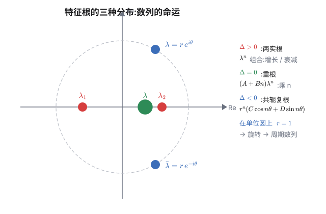

求递推数列的通项,有两件标准武器:线性递推的**特征根法**,和分式递推的**不动点法**。它们其实是同一件事的两面:把"递推"看成"变换",通项公式就是在提取变换的特征;而周期数列,就是特征恰好是**单位根**时的特例。这篇把两条线都完整走一遍,最后在周期数列处汇合。

## 一、二阶线性递推:特征根法

设

$$a_{n+2} = p\,a_{n+1} + q\,a_n$$

令 $a_n = \lambda^n$ 代入,得**特征方程** $\lambda^2 - p\lambda - q = 0$,判别式 $\Delta = p^2 + 4q$。按 $\Delta$ 的符号分三种情形:

| 判别式 | 特征根 | 通项 |
|---|---|---|
| $\Delta > 0$ | 两不同实根 $\lambda_1, \lambda_2$ | $a_n = A\lambda_1^{\,n} + B\lambda_2^{\,n}$ |
| $\Delta = 0$ | 重根 $\lambda$ | $a_n = (A + Bn)\lambda^{\,n}$ |
| $\Delta < 0$ | 共轭复根 $\lambda, \bar\lambda = re^{\pm i\theta}$ | $a_n = r^{\,n}(C\cos n\theta + D\sin n\theta)$ |

前两行在《[递推与迭代:不动点与轨道](post.html?slug=recurrence-iteration)》里用矩阵和若尔当块解释过,这里补第三行的推导:两根共轭时,$A\lambda^n + B\bar\lambda^{\,n} = r^{\,n}(Ae^{in\theta} + Be^{-in\theta})$,欧拉公式一合并就是 $r^{\,n}(C\cos n\theta + D\sin n\theta)$。注意 $\Delta < 0$ 时 $\lambda\bar\lambda = -q > 0$,所以模长

$$r = |\lambda| = \sqrt{-q}$$

$A,B$(或 $C,D$)由 $a_1, a_2$ 定出。



**三个例子**($\Delta$ 三种符号各一个):

- $a_{n+2} = a_{n+1} + a_n$:$\Delta = 5 > 0$,斐波那契,$\varphi, \psi$ 两实根;
- $a_{n+2} = 2a_{n+1} - a_n$:$\Delta = 0$,$\lambda = 1$,$a_n = A + Bn$——就是等差数列;
- $a_{n+2} = a_{n+1} - a_n$:$\Delta = -3 < 0$,$\lambda = e^{\pm i\pi/3}$,$r = 1$。取 $a_1 = a_2 = 1$,解出 $a_n = \frac{2}{\sqrt3}\sin\frac{n\pi}{3}$,数列是

$$1,\ 1,\ 0,\ -1,\ -1,\ 0,\ 1,\ 1,\ \dots$$

**周期 6**。注意 $r = 1$:根落在单位圆上,振幅不衰减也不增长,数列循环起来。这就是本文后半的主角。

## 二、分式递推:不动点法

设

$$a_{n+1} = \frac{p\,a_n + q}{r\,a_n + s}\qquad(r \ne 0)$$

**不动点**是满足 $x = f(x)$ 的数,即二次方程

$$r x^2 + (s - p)x - q = 0$$

记判别式 $\Delta = (s-p)^2 + 4rq$。

**情形一:两个不同不动点 $\alpha \ne \beta$。** 先算 $a_{n+1} - \alpha$。由 $\alpha$ 是不动点得 $q - s\alpha = -\alpha(p - r\alpha)$(展开 $p\alpha + q = \alpha(r\alpha + s)$ 即得),于是

$$a_{n+1} - \alpha = \frac{(p - r\alpha)a_n + (q - s\alpha)}{r a_n + s} = \frac{(p - r\alpha)(a_n - \alpha)}{r a_n + s}$$

对 $\beta$ 写同样的式子,两式相除,$r a_n + s$ 抵消:

$$\boxed{\ \frac{a_{n+1} - \alpha}{a_{n+1} - \beta} = \underbrace{\frac{p - r\alpha}{p - r\beta}}_{k}\cdot\frac{a_n - \alpha}{a_n - \beta}\ }$$

**比值是等比数列**,公比 $k$。于是 $\frac{a_n-\alpha}{a_n-\beta} = k^{\,n-1}\cdot\frac{a_1-\alpha}{a_1-\beta}$,解出 $a_n$ 即可。

**情形二:重不动点 $\alpha$。** 此时 $\alpha = \frac{p-s}{2r}$(判别式 $\Delta = 0$ 时求根公式直接给出),并且 $r\alpha + s = p - r\alpha$(代入 $\alpha$ 即验:两边都等于 $\frac{p+s}{2}$)。对倒数:

$$\frac{1}{a_{n+1}-\alpha} = \frac{r a_n + s}{(p-r\alpha)(a_n-\alpha)} = \frac{r(a_n-\alpha) + (r\alpha+s)}{(p-r\alpha)(a_n-\alpha)} = \frac{1}{a_n-\alpha} + \underbrace{\frac{r}{p-r\alpha}}_{d}$$

**倒数(平移后)是等差数列**,公差 $d$。于是 $\frac{1}{a_n-\alpha} = \frac{1}{a_1-\alpha} + (n-1)d$。

> 记忆口诀:**两个不动点,比值等比;一个不动点,倒数等差。** 和线性递推的"两实根组合、重根乘 $n$"正好平行。

**例子**。$a_{n+1} = -\dfrac{1}{a_n + 2}$:不动点 $x^2 + 2x + 1 = 0$,重根 $x = -1$;$\frac{1}{a_{n+1}+1} = \frac{1}{a_n+1} + 1$。取 $a_1 = 0$,得 $\frac{1}{a_n+1} = n$,即 $a_n = \frac1n - 1$——直接代入递推可验。

三种判别式的情形与线性递推惊人地平行:

| $\Delta = (s-p)^2+4rq$ | 不动点 | 处理 | 通项形态 |
|---|---|---|---|
| $> 0$ | 两不同实不动点 | 比值等比(公比 $k$ 为实数) | 有理式(指数) |
| $= 0$ | 重不动点 | 倒数等差 | 有理式(线性) |
| $< 0$ | 共轭复不动点 | 比值等比,$|k| = 1$ 自动 | 可能周期 |

## 三、周期数列:充要条件与最小正周期

**定义**:存在正整数 $T$ 使 $a_{n+T} = a_n$ 对所有 $n$ 成立;满足条件的最小 $T$ 叫**最小正周期**。

### 二阶线性递推

只看 $\Delta < 0$(实根和重根的情况最后总结)。通项 $a_n = r^{\,n}(C\cos n\theta + D\sin n\theta)$:

- **周期 ⟺ $r = 1$ 且 $\theta/2\pi \in \mathbb{Q}$**(唯一例外:恒零数列,周期 1)。$r < 1$ 时振幅衰减到 0,$r > 1$ 时无界增长,都不可能循环;$r = 1$ 时,周期存在 ⟺ 有 $T$ 使 $T\theta = 2\pi \times$ 整数 ⟺ $\theta/2\pi$ 是有理数;
- 若 $\theta/2\pi = k/m$($k, m$ 互质),则**最小正周期 = $m$**(只要数列不恒为零;单个 $\cos$ 型或 $\sin$ 型不影响周期,如 $\cos\frac{n\pi}{3}$ 的周期仍是 6)。

**为什么是 $m$**:$\cos(n+T)\theta = \cos n\theta$ 需要 $T\theta = 2\pi \ell$,即 $T \cdot \frac{2\pi k}{m} = 2\pi\ell$,$T = \frac{m\ell}{k}$,$k, m$ 互质时最小正解 $T = m$。

Δ > 0 时根为实数:$\lambda = 1$(常数)或 $\lambda = -1$(周期 2)之外,其余实根都无周期(两根都取 $\pm 1$ 时,叠加后周期至多 2)。Δ = 0 时 $a_n = (A+Bn)\lambda^{\,n}$:线性因子 $n$ 破坏一切循环,**除零序列外永无周期**。

### 分式递推

两不同不动点时,标准形给出 $(a_{n+1}-\alpha)/(a_{n+1}-\beta) = k\,(a_n-\alpha)/(a_n-\beta)$:

- **周期 ⟺ $k$ 是单位根**(存在 $m$ 使 $k^m = 1$),最小正周期 = $k$ 的阶;
- 重不动点:倒数等差,**无周期**;
- $\Delta < 0$ 时 $k = (p-r\alpha)/(p-r\beta)$ 是共轭复数之比,$|k| = 1$ **自动成立**——只需检查 $k$ 是不是单位根;若不是,轨道绕不动点旋转但永不闭合(稠密)。

### 统一视角

两条线在 $\Delta < 0$ 时**并不对称**:分式递推的乘子 $k = \frac{p-r\alpha}{p-r\bar\alpha}$ 是共轭复数之比,模长**自动为 1**;线性递推的特征根模长是 $\sqrt{-q}$(韦达 $\lambda\bar\lambda = -q$),**要 $q = -1$ 才落到单位圆上**,否则是螺旋发散($|λ| > 1$)或螺旋收敛($|λ| < 1$),都不可能是周期数列。而一旦落在单位圆上,判据就统一了:周期 ⟺ 特征是**单位根**(幅角是有理数倍 $\pi$)。求解最小正周期只需一步:

> 把特征写成 $e^{i\theta}$;若 $\theta/2\pi = \dfrac{k}{m}$($k, m$ 互质),最小正周期 $= m$。

## 四、例题练手

**例 1**。$a_1 = a_2 = 1$,$a_{n+2} = a_{n+1} - a_n$。① 求通项;② 求 $a_{2026}$;③ 证明 $\{a_n\}$ 是周期数列并求最小正周期。

① 特征方程 $\lambda^2 - \lambda + 1 = 0$,$\Delta = -3$,$\lambda = e^{\pm i\pi/3}$,$r = 1$,$a_n = C\cos\frac{n\pi}{3} + D\sin\frac{n\pi}{3}$。由 $a_1 = a_2 = 1$:$\frac{C}{2} + \frac{\sqrt3 D}{2} = 1$,$-\frac{C}{2} + \frac{\sqrt3 D}{2} = 1$,解得 $C = 0,\ D = \frac{2}{\sqrt3}$,故

$$a_n = \frac{2}{\sqrt3}\sin\frac{n\pi}{3}$$

② $\frac{\theta}{2\pi} = \frac{1}{6}$,$k = 1, m = 6$,最小正周期 6。$2026 = 6\times337 + 4$,故 $a_{2026} = a_4 = -1$。

③ 由通项,$a_{n+6} = a_n$ 且 6 是最小(周期 $m = 6$ 由最简分数给出)✓。数列 $1, 1, 0, -1, -1, 0, 1, 1, \dots$ 一目了然。

**例 2**。$a_1 = 0$,$a_{n+1} = \dfrac{2a_n + 1}{a_n + 2}$,求通项。

不动点 $x = \frac{2x+1}{x+2} \Rightarrow x^2 = 1$,$\alpha = 1,\ \beta = -1$。公比 $k = \frac{2-1}{2+1} = \frac13$。于是

$$\frac{a_n - 1}{a_n + 1} = \left(\frac13\right)^{n-1}\cdot\frac{-1}{1} = -3^{\,1-n}$$

解得

$$a_n = \frac{1 - 3^{\,1-n}}{1 + 3^{\,1-n}} = \frac{3^{\,n-1} - 1}{3^{\,n-1} + 1}$$

验证:$a_2 = \frac12,\ a_3 = \frac45,\ a_4 = \frac{13}{14}$,与直接递推一致 ✓。公比 $k = \frac13$ 不是单位根,数列单调奔向不动点 $1$,无周期。

**例 3**。$a_1 = 2$,$a_{n+1} = \dfrac{a_n + 1}{1 - a_n}$。证明 $\{a_n\}$ 是周期数列,并求最小正周期。

不动点 $x(1-x) = x+1 \Rightarrow x^2 = -1$,$\alpha = i,\ \beta = -i$(共轭复不动点,$\Delta = -4 < 0$)。公比(注意分母 $1 - a_n$ 给出 $r = -1$,不是 $1$):

$$k = \frac{p - r\alpha}{p - r\beta} = \frac{1 - (-1)i}{1 - (-1)(-i)} = \frac{1 + i}{1 - i} = i$$

$i$ 是 4 次单位根($i^4 = 1$),最小正周期 4。直接算: $2,\ -3,\ -\frac12,\ \frac13,\ 2,\ \dots$ ✓

**例 4**。$a_1 = 1,\ a_2 = \sqrt2$,$a_{n+2} = \sqrt2\, a_{n+1} - a_n$。求通项与最小正周期。

特征方程 $\lambda^2 - \sqrt2\,\lambda + 1 = 0$,$\Delta = -2$,$\lambda = e^{\pm i\pi/4}$,$r = 1$。$a_n = C\cos\frac{n\pi}{4} + D\sin\frac{n\pi}{4}$。由 $a_1 = 1,\ a_2 = \sqrt2$:$\frac{C+D}{\sqrt2} = 1$,$D = \sqrt2$,得 $C = 0$,$a_n = \sqrt2\sin\frac{n\pi}{4}$。

$\frac{\theta}{2\pi} = \frac18$ → 最小正周期 8。数列 $1, \sqrt2, 1, 0, -1, -\sqrt2, -1, 0, 1, \dots$ ✓

**例 5**。$a_{n+2} = p\,a_{n+1} - a_n$($p$ 为实参数)。① 证明:当 $|p| < 2$ 时,两根都在单位圆上;② 求所有使"对任意实数初值,数列都是周期数列"的 $p$;③ 求 $p = 0,\ 1,\ -1,\ \sqrt2$ 时的最小正周期。

① 特征方程 $\lambda^2 - p\lambda + 1 = 0$,判别式 $\Delta = p^2 - 4$。$|p| < 2$ 时 $\Delta < 0$,两根共轭,且 $\lambda\bar\lambda = 1$——这里 $q = -1$,正好是"模长自动为 1"的情形(第三节统一视角里的特例)。于是 $\lambda = e^{\pm i\theta}$,韦达给出 $p = \lambda + \bar\lambda = 2\cos\theta$。

② 对任意初值都周期 ⟺ $\theta/2\pi \in \mathbb{Q}$(唯一例外:恒零数列,周期 1)。即

$$p = 2\cos\frac{2\pi k}{m}\qquad (k, m \text{ 互质},\ 0 < k < \tfrac{m}{2})$$

③ $p = 0$:$\theta = \frac\pi2$,周期 4($1, 0, -1, 0, \dots$);$p = 1$:$\theta = \frac\pi3$,周期 6;$p = -1$:$\theta = \frac{2\pi}{3}$,周期 3($1, 1, -2, 1, 1, -2, \dots$);$p = \sqrt2$:$\theta = \frac\pi4$,周期 8。

> 思考:$p = \frac{\sqrt5-1}{2}$ 对应 $\theta = \frac{2\pi}{5}$,周期 5——**黄金分割的亲戚又出现了**。而 $p$ 取其他值(如 $p = 1.1$)时,$\theta/\pi$ 是无理数,轨道绕单位圆转圈但永不闭合。这就是"周期与非周期"的精确分界线:不是大小,是有理无理。

> 思考:若初值取成"轨道上已有的点"(如 $a_1 = 1, a_2 = 0$),周期仍是 8;但若取 $a_1 = a_2 = 0$,数列恒为零,周期是 1——**初值特殊时周期可能变小**,这是周期问题里最容易被忽略的边角。

## 五、追根:从思路到结论的完整初等证明

前面几节一直在用结论;这一节把**为什么**从头讲清楚。目标:不借助矩阵、不借助生成函数,只用中学代数,把特征根法和不动点法的每一步走完。

### 1. 特征方程是巧合吗?——不是,它是"找等比解"的必然答案

先回答三个连环问题:

**为什么存在特征根?** 因为二阶递推的解空间是**二维**的:初值 $a_1, a_2$ 两个数唯一决定整个数列;反过来,任意一对 $(a_1, a_2)$ 都对应唯一一个解。所以"所有解"是一个带两个自由参数的族——我们只需要找到两个"基本解",就能组合出一切。

**为什么找等比解 $a_n = \lambda^n$?** 一阶递推 $a_{n+1} = p\,a_n$ 的解就是等比数列 $a_n = a_1 p^{\,n-1}$。二阶递推是"两个一阶的耦合",最自然的猜测:解是两个等比叠加。于是先问:有没有单独的等比解?

**特征方程从哪来?** 把 $a_n = \lambda^n$ 代入递推 $a_{n+2} = p a_{n+1} + q a_n$:

$$\lambda^{n+2} = p\lambda^{n+1} + q\lambda^n \;\Longrightarrow\; \lambda^2 = p\lambda + q \;\Longrightarrow\; \lambda^2 - p\lambda - q = 0$$

(除以 $\lambda^n$ 时假设 $\lambda \ne 0$;$\lambda = 0$ 只给出平凡解,不影响结论。)**特征方程不是天外飞来的——它就是"等比解是否存在、有几个"这个问题的答案**:方程有几个根,递推就有几个基本等比解;根长什么样,通项就长什么样。

**为什么线性组合还是解(叠加原理)?** 递推式的每一项都是前两项的线性组合,所以若 $u_n, v_n$ 都是解,则 $A u_n + B v_n$ 也是解——直接代入:

$$(Au_{n+2} + Bv_{n+2}) = p(Au_{n+1} + Bv_{n+1}) + q(Au_n + Bv_n)$$

**为什么这两个基本解就够了?** 任意初值 $(a_1, a_2)$ 都要能由通解表示。对 $a_n = A\lambda_1^{\,n} + B\lambda_2^{\,n}$ 写初值条件:

$$A\lambda_1 + B\lambda_2 = a_1,\qquad A\lambda_1^2 + B\lambda_2^2 = a_2$$

把 $A, B$ 当未知数,系数行列式

$$\det\begin{pmatrix} \lambda_1 & \lambda_2 \\ \lambda_1^2 & \lambda_2^2 \end{pmatrix} = \lambda_1\lambda_2(\lambda_2 - \lambda_1)$$

两根不同时 $\lambda_2 - \lambda_1 \ne 0$;只要 $q \ne 0$(即 $\lambda_1\lambda_2 = -q \ne 0$),行列式非零,$A, B$ **存在且唯一**——任何初值都在通解里,通项公式完备。($q = 0$ 时递推退化为 $a_{n+2} = p a_{n+1}$,其实是一阶递推,单独处理。)

### 2. 情形 $\Delta = 0$:第二个解为什么是 $n\lambda^n$?

重根时 $\lambda^n$ 只有一个基本解,差一个。第二个解怎么找?两条初等路线:

**路线一:直接验证。** 把 $a_n = n\lambda^n$ 代入递推,算差值:

$$(n+2)\lambda^{n+2} - p(n+1)\lambda^{n+1} - q\,n\lambda^n = \lambda^n\Big[n(\lambda^2 - p\lambda - q) + (2\lambda^2 - p\lambda)\Big]$$

第一项 $n(\lambda^2 - p\lambda - q) = 0$($\lambda$ 是特征根);第二项 $\lambda(2\lambda - p)$:重根时特征多项式是 $(t - \lambda)^2 = t^2 - 2\lambda t + \lambda^2$,与 $t^2 - pt - q$ 逐项相等,得 $p = 2\lambda$,于是 $2\lambda - p = 0$。差值恒为零,**$n\lambda^n$ 是解** ✓

**路线二:差商极限。** 把重根看成"两个根几乎相等"的极限。两根不同时通解 $A\lambda_1^n + B\lambda_2^n$ 里的组合 $\frac{\lambda_2^n - \lambda_1^n}{\lambda_2 - \lambda_1}$ 随 $\lambda_2 \to \lambda_1$ 趋于

$$\lim_{\lambda_2\to\lambda_1}\frac{\lambda_2^n - \lambda_1^n}{\lambda_2 - \lambda_1} = n\lambda_1^{n-1}$$

——这正是导数 $\frac{d}{d\lambda}\lambda^n$。**"乘 $n$"不是猜出来的:两根相撞时,差商的极限自动给出 $n\lambda^{n-1}$**,归一后即第二基本解 $n\lambda^n$。于是通解 $a_n = (A + Bn)\lambda^{\,n}$;定系数:解 $(A+B)\lambda = a_1,\ (A+2B)\lambda^2 = a_2$,行列式 $\lambda^3 \ne 0$($\lambda \ne 0$),$A, B$ 唯一。

### 3. 情形 $\Delta < 0$:复根为什么最后给出实数 cos/sin?

两根是共轭复数 $\lambda = re^{i\theta},\ \bar\lambda = re^{-i\theta}$。形式通解 $A\lambda^n + B\bar\lambda^{\,n}$ 看起来是复数——但初值 $a_1, a_2$ 是实数,数列必须全实。分两步看:

**第一步:实初值 ⟹ 系数共轭。** 设 $A, B$ 是由实初值定出的系数。递推的系数全是实数,所以把通解整体取共轭,得到 $\bar A\bar\lambda^{\,n} + \bar B\lambda^{\,n}$,它对应同一个实初值;由唯一性它必须等于原解。而 $\lambda^n$ 与 $\bar\lambda^{\,n}$ 线性无关(两根不同),系数逐项相等:$\bar A = B$,即 $B = \bar A$。

**第二步:欧拉公式合并。** 把 $B = \bar A$ 代回:

$$a_n = A r^{\,n}e^{in\theta} + \bar A r^{\,n}e^{-in\theta} = 2r^{\,n}\,\text{Re}\!\left(Ae^{in\theta}\right)$$

设 $A = \frac{C - iD}{2}$($C, D$ 为实数),则

$$a_n = r^{\,n}(C\cos n\theta + D\sin n\theta)$$

全是实数 ✓。模长 $r$:由韦达定理 $\lambda\bar\lambda = -q$,而 $\Delta < 0$ 时 $-q > 0$,所以

$$r = |\lambda| = \sqrt{-q}$$

——这就是前面 $r$ 的来历。$C, D$ 仍由初值唯一确定(系数行列式 $\lambda\bar\lambda(\bar\lambda - \lambda) = -q(\bar\lambda - \lambda) \ne 0$)。

### 4. 分式递推:为什么看不动点?——完整分步

设 $f(x) = \dfrac{px+q}{rx+s}$,递推即 $a_{n+1} = f(a_n)$。**不动点 $\alpha = f(\alpha)$ 的作用是平移坐标系**:把数列换成"到不动点的距离" $e_n = a_n - \alpha$,递推变成

$$e_{n+1} = f(a_n) - \alpha = f(\alpha + e_n) - \alpha$$

对一般的函数这未必更简单;但对分式线性函数,分子里的常数项被消掉,误差递推退化为可化简的"齐次"形式——这正是方法的动机。不动点方程 $x = \frac{px+q}{rx+s}$ 整理:

$$rx^2 + (s-p)x - q = 0$$

**两个不同不动点 $\alpha \ne \beta$**:

第 1 步,由 $\alpha$ 是不动点 $p\alpha + q = \alpha(r\alpha + s)$,移项得关键恒等式:

$$q - s\alpha = r\alpha^2 - p\alpha = -\alpha(p - r\alpha)$$

第 2 步,代入 $a_{n+1} - \alpha$ 的分子:

$$a_{n+1} - \alpha = \frac{pa_n + q}{ra_n + s} - \alpha = \frac{(p - r\alpha)a_n + (q - s\alpha)}{ra_n + s} = \frac{(p - r\alpha)a_n - \alpha(p - r\alpha)}{ra_n + s} = \frac{(p - r\alpha)(a_n - \alpha)}{ra_n + s}$$

第 3 步,对 $\beta$ 写同式,两式相除(分母 $ra_n + s$ 抵消):

$$\frac{a_{n+1}-\alpha}{a_{n+1}-\beta} = \frac{p - r\alpha}{p - r\beta}\cdot\frac{a_n-\alpha}{a_n-\beta}$$

右边第一项是与 $n$ 无关的常数 $k$——**等比数列**。通项解出:

$$\frac{a_n-\alpha}{a_n-\beta} = k^{\,n-1}\cdot\frac{a_1-\alpha}{a_1-\beta},\qquad k = \frac{p - r\alpha}{p - r\beta}$$

再解这个关于 $a_n$ 的一次方程即得显式公式。

**重不动点 $\alpha$**:

第 1 步,重根条件:判别式 $\Delta = (s-p)^2 + 4rq = 0$,求根公式给出 $\alpha = \frac{p-s}{2r}$。由此推出 $r\alpha + s = p - r\alpha$(代入即验:两边都等于 $\frac{p+s}{2}$)。(边角:若 $p = r\alpha$,即 $s = -p,\ q = -p^2/r$,则 $f \equiv \alpha$ 是常值映射,问题平凡;以下默认 $p \ne r\alpha$。)

第 2 步,代入倒数:

$$\frac{1}{a_{n+1}-\alpha} = \frac{ra_n + s}{(p-r\alpha)(a_n-\alpha)} = \frac{r(a_n - \alpha) + (r\alpha + s)}{(p - r\alpha)(a_n - \alpha)} = \frac{1}{a_n-\alpha}\cdot\frac{r\alpha+s}{p-r\alpha} + \frac{r}{p-r\alpha}$$

第 3 步,由第 1 步 $\frac{r\alpha+s}{p-r\alpha} = 1$,第一项系数化为 1:

$$\frac{1}{a_{n+1}-\alpha} = \frac{1}{a_n-\alpha} + d,\qquad d = \frac{r}{p-r\alpha}$$

**等差数列**,公差 $d$。通项 $\frac{1}{a_n-\alpha} = \frac{1}{a_1-\alpha} + (n-1)d$。

### 5. 周期判据的完整证明

**线性情形(Δ<0)**:通项 $a_n = r^{\,n}(C\cos n\theta + D\sin n\theta)$,证充要条件。

$(\Leftarrow)$ 若 $r = 1$ 且 $\theta/2\pi = k/m \in \mathbb{Q}$,取 $T = m$,则 $T\theta = 2\pi k$,$\cos(n+T)\theta = \cos(n\theta + 2\pi k) = \cos n\theta$,$\sin$ 同理——$T$ 是周期。

$(\Rightarrow)$ 若存在周期 $T$。$r > 1$ 时 $|a_n|$ 无界增长(除非 $C = D = 0$ 的零序列),不可能; $r < 1$ 时 $a_n \to 0$,而周期序列的极限等于它的某一项,故该项为 0,整个序列恒为 0——非零序列排除。于是 $r = 1$。此时 $a_{n+T} = a_n$ 对一切 $n$。把 $\cos(n+T)\theta = \cos n\theta\cos T\theta - \sin n\theta\sin T\theta$ 及 $\sin$ 的同式代入 $a_{n+T} - a_n \equiv 0$,合并同类项:

$$\cos n\theta\big[C(\cos T\theta - 1) + D\sin T\theta\big] + \sin n\theta\big[-C\sin T\theta + D(\cos T\theta - 1)\big] \equiv 0$$

$\cos n\theta$ 与 $\sin n\theta$ 线性无关(取辐角主值 $\theta \in (0, \pi)$,一般初值 $C, D$ 不全为零),所以两个系数都为零;系数矩阵 $\begin{pmatrix}C & D\\ -D & C\end{pmatrix}$ 的行列式 $C^2 + D^2 \ne 0$,故 $\cos T\theta - 1 = 0$ 且 $\sin T\theta = 0$,即 $e^{iT\theta} = 1$,等价于 $\theta/2\pi = \ell/T \in \mathbb{Q}$ ✓

最小正周期:设 $\theta/2\pi = k/m$ 最简。周期条件 $T\theta = 2\pi\ell$ 即 $T = \frac{m\ell}{k}$;$k, m$ 互质时 $\ell$ 必须被 $k$ 整除,最小正解 $\ell = k$,$T = m$ ✓

**Δ=0 与 Δ>0**:$a_n = (A+Bn)\lambda^{\,n}$。若周期 $T$,则 $(A+B(n+T))\lambda^{\,n+T} = (A+Bn)\lambda^{\,n}$ 恒成立,$\lambda \ne 0$ 时比较含 $n$ 的部分:$BT\lambda^{\,n+T} \equiv 0$ ⟹ $B = 0$。于是只剩 $a_n = A\lambda^{\,n}$:实根 $\lambda$ 的周期 ⟺ $\lambda = \pm 1$。所以重根情形**一般无周期**(除非退化为常数或交替的特殊初值);Δ>0 同理:两根都在 $\{1, -1\}$ 中且组合非平凡时才可能周期。

**分式情形**:标准形 $u_n = k^{\,n-1}u_1$,其中 $u_n = \frac{a_n-\alpha}{a_n-\beta}$。若 $u_1 = 0$,则 $a_n \equiv \alpha$,常数,周期 1;若 $u_1 \ne 0$:$u_{n+T} = u_n$ 恒成立 ⟺ $k^{\,T} = 1$。所以:

- 周期 ⟺ $k$ 是单位根,最小正周期 = $k$ 的阶(使 $k^m = 1$ 的最小正整数);
- 重不动点:倒数等差,公差 $d = \frac{r}{p-r\alpha} \ne 0$($r \ne 0$,且上面已排除 $p = r\alpha$ 的常值退化),等差永不循环,**无周期**;
- $\Delta < 0$ 时 $k = \frac{p-r\alpha}{p-r\bar\alpha}$ 是共轭复数之比,$|k| = 1$ 自动成立,只需检查 $k$ 是否为单位根;若不是,轨道绕不动点旋转但永不闭合。

### 6. 高等数学的常规证明(略)

- **矩阵方法**(线性代数):二阶递推写成 $\begin{pmatrix}a_{n+1}\\a_n\end{pmatrix} = M\begin{pmatrix}a_n\\a_{n-1}\end{pmatrix}$,$M = \begin{pmatrix}p&q\\1&0\end{pmatrix}$,则 $M$ 的特征多项式 $\det(M - \lambda I) = \lambda^2 - p\lambda - q$——**特征根就是矩阵的特征值**;对角化后 $M^n = PD^nP^{-1}$,特征方向上的轨道恰是等比 $\lambda^{\,n}$;重根对应若尔当块,幂里出现 $n$。这是"为什么是 $\lambda^n$"最深刻的解释。(细节见《[递推与迭代](post.html?slug=recurrence-iteration)》。)
- **生成函数方法**:$\sum a_n x^n = \dfrac{\text{多项式}}{1 - px - qx^2}$,分母因式分解后部分分式,展开成几何级数,系数自动读出——特征方程的根以"分母的根"的面目出现。
- **动力系统视角**(分式递推):$f$ 是 Möbius 变换(分式线性映射),不动点处导数 $f'(\alpha) = k$ 叫**乘子**;周期 ⟺ 乘子是单位根。判别式 $\Delta > 0$ / $= 0$ / $< 0$ 对应双曲型 / 抛物型 / 椭圆型变换——第三节表格的深层来源。

## 尾声:一张对照表

| | 二阶线性递推 | 分式递推 |
|---|---|---|
| 标准形 | $a_{n+2} = pa_{n+1} + qa_n$ | $a_{n+1} = \dfrac{pa_n + q}{ra_n + s}$ |
| 特征对象 | 特征根 $\lambda$ | 不动点 $\alpha, \beta$ |
| $\Delta < 0$ | 共轭复根,$\vert\lambda\vert = \sqrt{-q}$ | 共轭复不动点,$\vert k\vert = 1$ 自动 |
| 通项工具 | $\lambda^{\,n}$ 线性组合 | 比值等比 / 倒数等差 |
| 周期 ⟺ | $\lambda$ 是单位根 | $k$ 是单位根 |
| 最小正周期 | $\theta/2\pi$ 最简分母 | $(\arg k)/2\pi$ 最简分母 |
| 无周期情形 | 重根、实根 $\ne \pm 1$、$\vert\lambda\vert \ne 1$ | 重不动点、$k$ 非单位根 |

递推是变换,通项公式是变换的特征,周期是特征恰好为单位根。判别式小于零时,复数特征把"增长"换成"旋转或螺旋"——线性递推的模长是 $\sqrt{-q}$,只有 $q = -1$ 才是纯旋转;分式递推的乘子模长自动为 1,是纯旋转。**纯旋转且旋转角是有理数倍 $\pi$ 时,数列就循环,否则绕圈不闭合**——同一个判据,两套武器。

> [!detail] 附:通项与周期验证(可展开)
> 纯 Python:对每道例题,把通项公式与递推逐项对比,并自动检测最小正周期:
> ```python
> from math import sqrt, sin, pi
>
> # 例1: a_{n+2} = a_{n+1} - a_n, a1=a2=1, 通项 (2/√3)sin(nπ/3)
> f1 = lambda n: 2/sqrt(3) * sin(n*pi/3)
> assert all(abs(f1(n+2) - (f1(n+1) - f1(n))) < 1e-9 for n in range(1, 30))
> assert abs(f1(2026) - (-1)) < 1e-9
> print("例1 ✓ 通项正确, a_2026 =", f1(2026))
>
> # 例2: a_{n+1} = (2a_n+1)/(a_n+2), a1=0, 通项 (3^(n-1)-1)/(3^(n-1)+1)
> f2 = lambda n: (3**(n-1) - 1) / (3**(n-1) + 1)
> assert all(abs(f2(n+1) - (2*f2(n)+1)/(f2(n)+2)) < 1e-12 for n in range(1, 20))
> print("例2 ✓ 通项正确")
>
> # 例3: a_{n+1} = (a_n+1)/(1-a_n), a1=2, 周期 4
> def seq3(n):
>     a = 2
>     for _ in range(1, n): a = (a+1)/(1-a)
>     return a
> assert all(abs(seq3(n+4) - seq3(n)) < 1e-12 for n in range(1, 10))
> print("例3 ✓ 周期 4")
>
> # 例4: a_{n+2} = √2 a_{n+1} - a_n, a1=1, a2=√2, 通项 √2 sin(nπ/4), 周期 8
> f4 = lambda n: sqrt(2) * sin(n*pi/4)
> assert all(abs(f4(n+2) - (sqrt(2)*f4(n+1) - f4(n))) < 1e-9 for n in range(1, 30))
> assert all(abs(f4(n+8) - f4(n)) < 1e-9 for n in range(1, 10))
> print("例4 ✓ 通项正确, 周期 8")
>
> # 通用最小正周期检测器
> def min_period(seq, limit=50):
>     a = [seq(i) for i in range(1, 60)]
>     for T in range(1, limit):
>         if all(abs(a[i+T] - a[i]) < 1e-6 for i in range(50 - T)):
>             return T
>     return None
> print("最小正周期: 例1 =", min_period(f1), " 例3 =", min_period(seq3), " 例4 =", min_period(f4))
>
> # 例5: a_{n+2} = p·a_{n+1} - a_n, |p|<2 时周期 ⟺ θ/2π 有理
> def seq5(p, a1, a2, n):
>     a, b = a1, a2
>     if n == 1: return a
>     for _ in range(2, n): a, b = b, p*b - a
>     return b
> for p, T in [(0, 4), (1, 6), (-1, 3), (sqrt(2), 8)]:
>     okT = all(abs(seq5(p, 1, 1, n + T) - seq5(p, 1, 1, n)) < 1e-9 for n in range(1, 20))
>     okH = any(abs(seq5(p, 1, 1, n + T//2) - seq5(p, 1, 1, n)) > 1e-6 for n in range(1, 3))
>     assert okT and okH, f"p={p} 周期检验失败"
>     print(f"例5 p={p}: 最小正周期 {T} ✓")
> ```

## 相关阅读

- [递推与迭代:不动点与轨道](post.html?slug=recurrence-iteration)(本站):特征根法的矩阵视角、重根的若尔当块解释,与本文的判别式分类互补。
- [再谈斐波那契:通项公式的两种推导](post.html?slug=fibonacci-part2)(本站):$\Delta > 0$ 情形的完整推导。
- [生成函数:把数列打包成代数](post.html?slug=generating-functions)(本站):第三条路——递推的生成函数解法,与特征根法互为印证。
