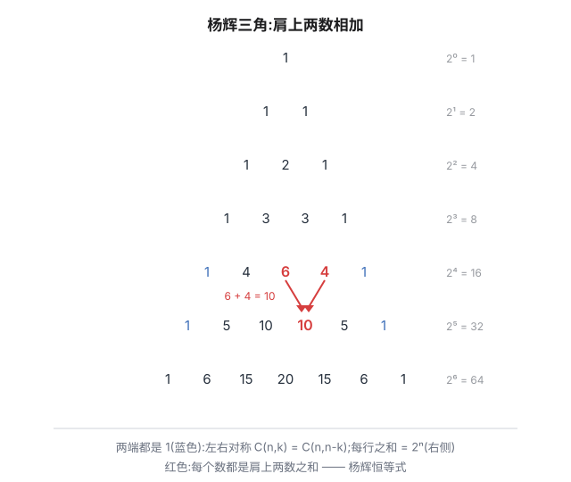
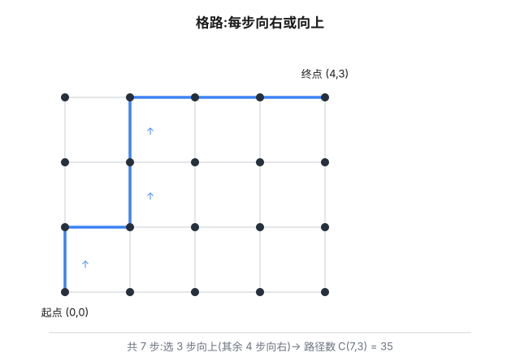

组合数 $\binom{n}{k}$ 大概是被恒等式包围得最紧的数学对象:递推、对称、求和、卷积,几百条恒等式挤在一起。好消息是它们**全都长在同一棵树上**——杨辉三角。这篇从三角出发,把最常用的几条恒等式串起来,看它们怎么互相证明、怎么被二项式定理一网打尽,最后落到几个最常见的计数模型。

## 杨辉三角:恒等式的温床



这个三角有几个一眼可见的性质,每一条都是一条恒等式:

**肩上相加(杨辉恒等式)**。第 $n$ 行第 $k$ 个数是 $\binom{n}{k}$,它等于肩上两个数之和:

$$\binom{n}{k} = \binom{n-1}{k} + \binom{n-1}{k-1}$$

组合解释干净利落:从 $n$ 个人里选 $k$ 个,盯着最后一个人——选他,剩下从 $n-1$ 人里选 $k-1$ 个;不选他,则从 $n-1$ 人里选 $k$ 个。两条路互不重叠,加起来就是全部。

**左右对称**。$\binom{n}{k} = \binom{n}{n-k}$:选 $k$ 个留下,等价于决定哪 $n-k$ 个不选。

**每行之和翻倍**。$\sum_{k=0}^{n}\binom{n}{k} = 2^n$:所有子集的个数。三角里看,每一行都是上一行的两倍。

**交错和为零**($n \ge 1$):$\sum_{k=0}^{n}(-1)^k\binom{n}{k} = 0$。奇数子集和偶数子集一样多——把每个子集 $S$ 与 $S \triangle \{1\}$ 配对,一奇一偶,不多不少。

这些恒等式用组合解释证明,叫**计数证明**;后面会看到另一条路:代数。

## 二项式定理:代数引擎

组合数的另一个源头是二项式定理:

$$(1+x)^n = \sum_{k=0}^{n}\binom{n}{k}x^k$$

它的组合意义就是杨辉三角的"肩上相加"循环 n 遍:每个因式 $(1+x)$ 要么贡献 $x$ 要么贡献 $1$,贡献 $x$ 的因式有 $k$ 个,方案数 $\binom{n}{k}$。而**把 $x$ 换成特殊值,恒等式就从定理里流出来**:

- $x = 1$:$\sum\binom{n}{k} = 2^n$(行和);
- $x = -1$:$\sum(-1)^k\binom{n}{k} = 0$(交错和);
- **两边求导再代 $x=1$**:$n(1+x)^{n-1} = \sum k\binom{n}{k}x^{k-1}$,得

$$\sum_{k=1}^{n} k\binom{n}{k} = n\cdot 2^{n-1}$$

它的组合意义也很有意思:左边 = 先选一个 $k$ 人委员会、再从中选主席,方案数 $\sum k\binom{n}{k}$;右边 = 先选主席($n$ 种),其余 $n-1$ 人任意决定入不入会($2^{n-1}$ 种)。**同一种"委员会+主席"数了两遍,必相等**——这就是"选队长"模型。

顺带收获**吸收恒等式**:

$$k\binom{n}{k} = n\binom{n-1}{k-1}$$

代数上一行就完($k\cdot\frac{n!}{k!(n-k)!} = \frac{n!}{(k-1)!(n-k)!}$);组合上还是选队长:左边先定主席再补队友,右边先选主席再随便挑。

## 范德蒙德卷积:两个口袋

上面的恒等式都只涉及一行,下面这条把**两行**卷在一起:

$$\sum_{k}\binom{m}{k}\binom{n}{r-k} = \binom{m+n}{r}$$

组合证明:男 $m$ 人、女 $n$ 人,从中选 $r$ 人,枚举男的选 $k$ 个。代数证明也不难,但组合证明三行就讲完了——这正是计数证明的魅力。

**特例**($m = n = r$):$\sum_k\binom{n}{k}\binom{n}{n-k} = \binom{2n}{n}$,用对称性改写:

$$\sum_{k=0}^{n}\binom{n}{k}^2 = \binom{2n}{n}$$

"同一行的平方和等于中间那行中间那个数"——杨辉三角里最漂亮的一条。

## 常见模型一:格路

组合数还有个几何老家:格路。从 $(0,0)$ 走到 $(a,b)$,每步只能**向右或向上**,一共 $a+b$ 步,其中恰好 $a$ 步向右,所以路径数

$$\binom{a+b}{a}$$



格路最大的好处是**恒等式可以"看见"**。比如范德蒙德卷积,看成从 $(0,0)$ 到 $(m+n, r)$ 的路径:把路径按"经过竖线 $x = m$ 时的高度 $k$"分类——到 $(m,k)$ 有 $\binom{m}{k}$ 种走法,从 $(m,k)$ 到终点有 $\binom{n}{r-k}$ 种(水平还剩 $n$ 步,还需上升 $r-k$ 步),乘起来再求和,就是总路径数。**分类计数和代数展开,说的是同一件事。**

## 常见模型二:投票问题

最后一个模型通向一个老朋友。$A$、$B$ 两人竞选,各得 $n$ 票,计票过程中 $A$ 的票数**始终不少于** $B$ 的计票顺序有多少种?

把 $A$ 票记作"上"、$B$ 票记作"下",这就是从 $(0,0)$ 到 $(n,n)$ 且**不越过对角线**的格路数。直接数是 $2^{2n}$ 条里数不过来,但反射原理一句话:坏路径(碰到对角线以下)与某条对称路径一一对应,共有 $\binom{2n}{n-1}$ 条。于是

$$\binom{2n}{n} - \binom{2n}{n-1} = \frac{1}{n+1}\binom{2n}{n}$$

**卡特兰数**——上一篇《[生成函数:把计数打包成多项式](post.html?slug=generating-functions-counting)》里它从 $\frac{1-\sqrt{1-4x}}{2x}$ 的系数里走出来,这篇它从格路和反射原理里走出来。同一个数,两个世界。

## 常见模型三:分配与排列

**平均分配**。把 $2n$ 本不同的书平均分成 $n$ 组(组不区分先后),先假装组有编号:$\frac{(2n)!}{(2!)^n}$,再除以组的排列 $n!$:

$$\frac{(2n)!}{(2!)^n \cdot n!}$$

经典易错点:分给 $n$ 个**不同的人**时,人和组一一对应,组自动有了名字,方案数是 $\frac{(2n)!}{(2!)^n}$——**除不除 $n!$,全看组有没有名字**。6 本书平均分 3 组:$\frac{6!}{2^3 \cdot 3!} = 15$;再分给 3 个学生:$\frac{6!}{2^3} = 90$。

**多技能组队**。带约束的组队问题,套路是**按短板分类**。公司 8 名工程师,其中 3 名擅长硬件,选 4 人组队且至少 2 名硬件:

$$\binom{3}{2}\binom{5}{2} + \binom{3}{3}\binom{5}{1} = 3\cdot 10 + 1\cdot 5 = 35$$

(2 名硬件 + 2 名软件,或 3 名硬件 + 1 名软件;两类互斥,相加。)这正是范德蒙德卷积的"截断版":把"硬件人数"按约束切成几段分别求和。也可以反着数——总数 $\binom{8}{4} = 70$ 减去硬件至多 1 人的 $\binom{5}{4} + \binom{3}{1}\binom{5}{3} = 35$,殊途同归。

**隔板法**。把 $n$ 个**相同**的球分给 $k$ 个人(允许空手):$\binom{n+k-1}{k-1}$。上一篇《[生成函数:把计数打包成多项式](post.html?slug=generating-functions-counting)》专门讲过,这里只补一个变体:每人**至少 2 个**怎么办?先每人垫底发 1 个(用掉 $k$ 个),剩下的随便分——垫底只改变"剩余球数",隔板照旧。12 个球分 4 人、每人至少 2 个:先各发 2 个(用掉 8 个),剩 4 个任意分配,$\binom{4+4-1}{3} = 35$。

**插空法**。不相邻问题的标准工具:7 人排队,3 名女生两两不相邻——先排 4 名男生($4!$ 种),产生 5 个空位(含两端),选 3 个把女生插进去:

$$4! \cdot \binom{5}{3} \cdot 3! = 1440$$

"先排没限制的,再把有限制的插进空隙"——和隔板法的"先垫底再分配"是同一句口诀:**把约束消化成空隙,剩下的交给组合数**。

## 综合例题

**例 1(主席、秘书与财务)**。证明 $\displaystyle\sum_{k=0}^{n} k^3\binom{n}{k} = n^2(n+3)\,2^{n-3}$。

代数:对二项式定理连续作用三次算子 $\theta = x\frac{d}{dx}$:

$$(1+x)^n \;\xrightarrow{\theta}\; nx(1+x)^{n-1} \;\xrightarrow{\theta}\; nx(1+nx)(1+x)^{n-2} \;\xrightarrow{\theta}\; nx(1+nx)(1+x)^{n-2} + n^2x^2(1+x)^{n-2} + n(n-2)x^2(1+nx)(1+x)^{n-3}$$

代 $x = 1$: $n(1+n)2^{n-2} + n^2 2^{n-2} + n(n-2)(1+n)2^{n-3} = 2^{n-3}\cdot n(n^2+3n) = n^2(n+3)2^{n-3}$ ✓

组合:选 $k$ 人委员会,再指定**主席、秘书、财务**三个职位(可兼任,共 $k^3$ 种安排)。按"几个人身兼多职"分类:

- **一人全兼**:$k$ 种,求和 $\sum k\binom{n}{k} = n\,2^{n-1}$(选队长);
- **两人兼职、一人独享**:3 种"哪两个职位同人",$\sum 3k(k-1)\binom{n}{k} = 3n(n-1)2^{n-2}$;
- **三职三人**:$\sum k(k-1)(k-2)\binom{n}{k} = n(n-1)(n-2)2^{n-3}$。

三项相加,提公因式 $2^{n-3}$:

$$4n + 6n(n-1) + n(n-1)(n-2) = n(n^2+3n) = n^2(n+3)$$

三种职位安排和三类兼职情况,数的是同一批委员会——两个方向都必须给出同一个数。

**例 2(非平均分组的坑)**。6 本不同的书分成三组:① 组的大小为 1、2、3;② 组的大小为 1、1、4。各有多少种分法?

① $\frac{6!}{1!\,2!\,3!} = 60$:组大小各不相同,天然区分,不用除。② $\frac{6!}{4!\,1!\,1! \cdot 2!} = 15$:两个"1 本组"长得一模一样,必须除以 $2!$。**平均分配要除序,非平均分组只有"重复大小的组"才除序**——先分组再排列的题,坑全在"哪几个组长得一样"。

**例 3(圆桌插空 + 多档垫底)**。① 8 人围圆桌而坐,3 名女生两两不相邻;② 20 个相同球分给 5 人,甲至少 3 个、乙至少 2 个、其余每人至少 1 个。

① 先排 5 名男生围圆桌:$(5-1)! = 24$;圆桌的空隙只有 **5 个**(男生之间),选 3 个插入女生:$24\binom{5}{3}3! = 1440$。(对比直线排队是 $4!\binom{5}{3}3!$——圆桌的空隙比直线少一个,这也是"圆排列"最常见的坑。)② 先垫底:甲 3 + 乙 2 + 丙丁戊各 1,共 8 个,剩 12 个任意分:$\binom{12+5-1}{4} = \binom{16}{4} = 1820$。垫底数各不相同也无妨——**垫底只消耗球,不改变"剩余球任意分"的结构**。

**例 4(圆桌不相邻,高难)**。圆周上 $n$ 个点,选 $k$ 个互不相邻(相邻含首尾),有多少种?

按点 1 选不选分类。**点 1 不选**:剩下 $n-1$ 个点排成一条线(环断开,"首尾相邻"的约束消失),选 $k$ 个互不相邻——长度为 $m$ 的直线选 $k$ 个不相邻是 $\binom{m-k+1}{k}$,这里 $m = n-1$,得 $\binom{n-k}{k}$;点 1 **选**:它的两个邻居都不能选,剩 $n-3$ 个点选 $k-1$ 个,得 $\binom{n-k-1}{k-1}$。合计:

$$\binom{n-k}{k} + \binom{n-k-1}{k-1}$$

验证:$n = 6,\ k = 3$(正六边形选 3 个互不相邻的顶点):$\binom{3}{3} + \binom{2}{2} = 2$——只有隔一个取一个的两种"正三角形" ✓。

## 尾声:两种语言

回头数数这篇用过的证明:

| 恒等式 | 计数证明 | 代数证明 |
|---|---|---|
| 肩上相加 | 最后一个选不选 | — |
| 对称 | 决定不选谁 | 阶乘展开 |
| 行和 | 子集数 | $x=1$ |
| 交错和 | 奇偶配对 | $x=-1$ |
| 选队长 | 委员会+主席 | 求导 |
| 吸收 | 先主席后队友 | 阶乘展开 |
| 范德蒙德 | 两个口袋/格路分类 | 生成函数 |

同一个恒等式,计数证明告诉你**它为什么对**,代数证明告诉你**它从哪来**。而杨辉三角是两者的共同记忆:所有系数都长在那一张三角里,翻到哪一行,哪一行就有故事。

> [!detail] 附:恒等式数值验证(可展开)
> 零依赖纯 Python,验证 $n \le 10$ 范围内所有恒等式:
>
> ```python
> from math import comb
>
> def C(n, k):
>     return comb(n, k) if 0 <= k <= n else 0
>
> # 1) 肩上相加: C(n,k) = C(n-1,k) + C(n-1,k-1)
> assert all(C(n, k) == C(n-1, k) + C(n-1, k-1)
>            for n in range(1, 11) for k in range(n + 1))
>
> # 2) 对称 + 行和 + 交错和
> assert all(C(n, k) == C(n, n-k) for n in range(11) for k in range(n + 1))
> assert all(sum(C(n, k) for k in range(n + 1)) == 2**n for n in range(11))
> assert all(sum((-1)**k * C(n, k) for k in range(n + 1)) == 0 for n in range(1, 11))
>
> # 3) 选队长: sum k*C(n,k) = n*2^(n-1)
> assert all(sum(k * C(n, k) for k in range(1, n + 1)) == n * 2**(n-1)
>            for n in range(1, 11))
>
> # 4) 吸收: k*C(n,k) = n*C(n-1,k-1)
> assert all(k * C(n, k) == n * C(n-1, k-1)
>            for n in range(1, 11) for k in range(1, n + 1))
>
> # 5) 范德蒙德卷积: sum C(m,k)C(n,r-k) = C(m+n,r)
> assert all(sum(C(m, k) * C(n, r-k) for k in range(r + 1)) == C(m+n, r)
>            for m in range(6) for n in range(6) for r in range(m + n + 1))
>
> # 6) 平方和: sum C(n,k)^2 = C(2n,n)
> assert all(sum(C(n, k)**2 for k in range(n + 1)) == C(2*n, n)
>            for n in range(1, 11))
>
> # 7) 投票问题: A 始终 >= B 的计票顺序数 = C(2n,n)/(n+1)(暴力枚举)
> def vote(n):
>     cnt = 0
>     for mask in range(1 << (2 * n)):          # 0=A票(上), 1=B票(下)
>         a = b = 0
>         ok = True
>         for i in range(2 * n):
>             if mask >> i & 1: b += 1
>             else: a += 1
>             if b > a: ok = False; break
>         if ok and a == n and b == n: cnt += 1
>     return cnt
> assert all(vote(n) == C(2*n, n) // (n + 1) for n in range(1, 5))
>
> # 8) 主席+秘书+财务(可兼任): sum k^3*C(n,k) = n^2(n+3)*2^(n-3)
> assert all(sum(k**3 * C(n, k) for k in range(1, n + 1)) == n*n*(n+3) * 2**(n-3)
>            for n in range(3, 11))
>
> # 9) 圆周不相邻: n 点选 k 个互不相邻 = C(n-k,k) + C(n-k-1,k-1)(暴力枚举)
> def circle(n, k):
>     cnt = 0
>     for mask in range(1 << n):
>         if bin(mask).count('1') != k: continue
>         if mask & (mask << 1): continue                # 线性相邻
>         if mask & 1 and mask & (1 << (n - 1)): continue  # 首尾相邻
>         cnt += 1
>     return cnt
> assert all(circle(n, k) == C(n-k, k) + C(n-k-1, k-1)
>            for n in range(3, 10) for k in range(1, n // 2 + 1))
> print("全部恒等式验证通过 ✓")
> ```

## 相关阅读

- [排列组合进阶:从圆排列到容斥原理](post.html?slug=排列组合进阶)(本站):基本计数工具,本文恒等式的"原料"。
- [生成函数:把计数打包成多项式](post.html?slug=generating-functions-counting)(本站):卡特兰数从生成函数里走出来的那篇,与本文的投票模型互为镜像。
- [Proofs that Really Count](https://book.douban.com/subject/3003381/)(Benjamin & Quinn):计数证明的宝库,两百多条恒等式全是"数两遍"。
