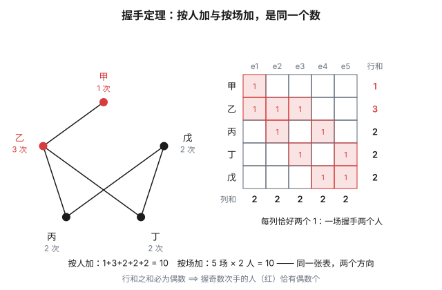
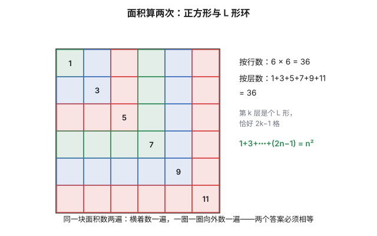
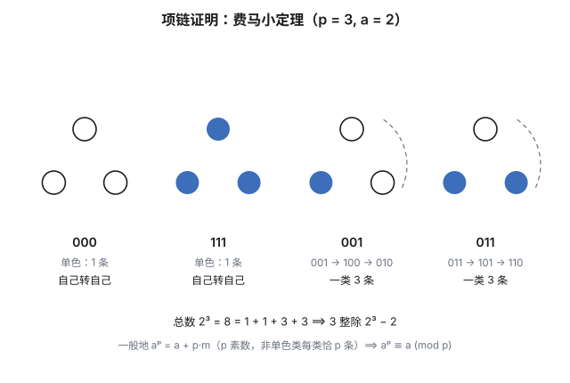

数学里有一类证明，几乎不"算"什么：它只是把同一个量用两种方式各数一遍，然后宣布两边相等。这个动作朴素到不像一种方法，却有个响亮的名字——**算两次**。它大概是数学里性价比最高的原理：一句话就能学会，却从晚会上的握手一路管到费马小定理和高斯积分。

先看一道**没有任何数据**的题。

## 一、握手定理：一张 0-1 表

> 一群人聚会，彼此握手。证明：握过**奇数**次手的人，必有偶数个。

没有人数、没有握手记录，从哪下手？答案是：别盯着人看，先造一张表。每一**行**是一个人，每一**列**是一场握手；某人参加了某场握手，交叉的格子里就填 1，否则填 0。五个人握了五次手，表长这样：

现在对这张表做两次加总：

- **按行加**：第 $i$ 行的和 $d_i$ 是第 $i$ 个人的握手次数，总和 $\sum_i d_i$；
- **按列加**：每场握手恰好两个人，每列的和都是 $2$，总和 $2m$（$m$ 为握手场数）。

同一张表，两个方向，答案必须相等：

$$\sum_i d_i=2m$$

这就是**握手定理**。右边是偶数，所以左边也是偶数；而一堆整数之和为偶数时，其中奇数的个数必为偶数——**握过奇数次手的人恰有偶数个**，证毕。

值得多看一眼的是这张表本身：行是"人"，列是"场次"，格子里是"参不参加"。**算两次的全部内容，就是给一张这样的表把行和总和、列和总和各算一遍。** 后面所有例子，不过是在换表。

## 二、几何也算两遍：1+3+5+⋯+(2n−1)=n²

表不一定真画出来，"换个方式分块"也是算两次——总量按一种方式分类求和，与按另一种方式分类求和，对出同一个总数。最直观的例子在方格纸上：

数一块 $n\times n$ 方格板的面积。横竖数，是 $n^2$；换个数法——从左上角那一格开始，一圈一圈向外长：第 1 圈 $1$ 格，第 2 圈 $3$ 格，第 $k$ 圈是个 L 形，恰好 $2k-1$ 格。两种数法数的是**同一块面积**：

$$1+3+5+\cdots+(2n-1)=n^2$$

同样的骨架换到组合数上，就是**曲棍球杆恒等式**：从 $\{1,2,\dots,n+1\}$ 里选 $r+1$ 个数，直接数是 $\binom{n+1}{r+1}$；按"最大的数是 $i$"分类，每类是从 $i-1$ 个更小的数里选 $r$ 个：

$$\binom{r}{r}+\binom{r+1}{r}+\cdots+\binom{n}{r}=\binom{n+1}{r+1}$$

《组合恒等式》里那批恒等式，很多都能这样"换一种分法"数出来——那篇负责批量生产，这篇只谈方法本身。

## 三、转项链：费马小定理

接下来的例子里表退场了，但算两次的魂还在：**把总数分组，两种方式对总账。** 它要证的是个数论定理：

> $p$ 是素数，$a$ 是任意正整数，则 $a^p\equiv a\pmod p$。

看字符表上长度为 $p$ 的所有字符串（字符共 $a$ 种），总共 $a^p$ 条——这是**总账**。把每条字符串首尾相接弯成一圈项链，让它旋转，能互相转出来的归为一类。问题变成：每一类有多大？

只有两种可能：

- **转一格就回到自己。** 每个位置的字符都与"右邻"相同，一圈转下来所有字符全相同——**单色项链**，一共只有 $a$ 条（全 1、全 2、……、全 $a$）。
- **转任何一格都回不去。** 那这一类恰好 $p$ 条。这里用了一次素数性：假如转 $r$ 格（$1\le r\le p-1$）能回原位，字符就得满足"与右移 $r$ 格处相同"。从任意位置出发，每步跳 $r$ 格——因为 $\gcd(r,p)=1$，这些位置会跑遍圆圈上全部 $p$ 个位置，于是所有字符全相同，与"非单色"矛盾。

于是总账清点完毕：$a$ 条单色各占一类，其余每类整整齐齐 $p$ 条。两种数法对出来：

$$a^p=\underbrace{a}_{\text{单色项链}}+\underbrace{p\cdot m}_{\text{其余各类}}\qquad\Longrightarrow\qquad p\mid a^p-a$$

这就是**费马小定理**。整个证明没有一行同余运算的推导，力气全部花在一件事上：怎么分组。分组分对了，同余是白送的。

## 四、换序与换系：分析里的算两次

有限张表的行和列和当然能随便换着加。惊人的是，这张表一路通进了分析。

最直接的化身是**交换求和次序**：$\sum_i\sum_j a_{ij}=\sum_j\sum_i a_{ij}$，按行加与按列加。线性代数里有个两行的推论——迹的轮换性：

$$\operatorname{tr}(AB)=\sum_i\sum_k a_{ik}b_{ki}=\sum_k\sum_i b_{ki}a_{ik}=\operatorname{tr}(BA)$$

矩阵乘法不可交换，迹却把 $AB$ 和 $BA$ 缝在了一起——靠的只是把同一张数表横着、竖着各加一遍。

重头的例子是**高斯积分**。$I=\displaystyle\int_0^\infty e^{-x^2}\,dx$ 没有初等原函数，硬算无门；但 $I^2$ 有戏——把两个相同的积分乘起来，"摊平"成一张二维的表：

$$I^2=\int_0^\infty\!\!\int_0^\infty e^{-(x^2+y^2)}\,dx\,dy$$

直角坐标里这张表还是数不动；可 $e^{-(x^2+y^2)}$ 在**极坐标**里只跟半径有关，而圆环的面积元恰好自带一个 $r$：

$$I^2=\int_0^{\pi/2}\!\!\int_0^\infty e^{-r^2}\,r\,dr\,d\theta=\frac{\pi}2\cdot\frac12=\frac{\pi}4\quad\Longrightarrow\quad I=\frac{\sqrt\pi}2$$

同一个 $I^2$：直角坐标里一筹莫展，极坐标里一行收掉。$\dfrac{\sqrt\pi}2$ 这个让无数人第一次见识分析之美的常数，骨子里也是一次算两次。

## 五、回到那张表：洗牌的平均不动点

最后回到概率——第一节的表会原封不动地复活。把 $n$ 张牌随机洗乱，平均有几张恰好留在原来的位置上？

考虑所有 $n!$ 种排列，数清楚"对子" $(\sigma,i)$：排列 $\sigma$ 恰好让位置 $i$ 不动（$\sigma(i)=i$）。两种方向数同一批对子：

- **按位置数**：钉死位置 $i$，其余 $n-1$ 个位置随便排，共 $(n-1)!$ 个排列；$n$ 个位置合计 $n\cdot(n-1)!=n!$ 对。
- **按排列数**：排列 $\sigma$ 贡献的对数是它的**不动点个数** $\#\mathrm{Fix}(\sigma)$；总和为 $\sum_\sigma \#\mathrm{Fix}(\sigma)=n!\cdot\mathbb E[\#\mathrm{Fix}]$。

两种数法必须相等：

$$\mathbb E[\#\mathrm{Fix}]=\frac{n!}{n!}=1$$

**无论 $n$ 多大，平均恰好一张牌在原位。** 单次洗牌可能一张都不动、也可能动好几张，但平均值被钉死在 $1$，一个额外条件都不需要。

注意这题的表：行是排列，列是位置，格子填"是否不动"——和第一节的表是同一张，只是握手换成了洗牌。算两次的答案从"偶数"变成"$1$"，骨架一字未改。

## 尾声：找一张好表

回头看这一路：握手定理数的是"人×场次"，奇数求和数的是"方格×层"，项链数的是"项链×类"，高斯积分摊的是"平面×坐标"，不动点数的是"排列×位置"。名称各不相同——double counting、交换求和次序、Fubini、示性变量、分类相加——骨架只有一副：

**行方向给出一个表达式，列方向给出另一个表达式，中间那张表保证它们相等。**

所以这个方法的全部艺术，在于找一张"双方都数得清"的表：行方向要数得出来，列方向也要数得出来，而格子本身的含义要经得起两种读法。找对了表，证明就只剩加法；找不对，硬算十行也未必到得了终点。上一篇《单位根》里的筛选公式其实也是同一件事——同一个和，按二项式展开数一遍，按单位根的"筛子"再数一遍。

下次面对一个看起来要硬算的求和，先停一秒问：**它是不是某张表的行和？那张表的列和，好算吗？**

## 相关阅读

- [组合恒等式:从杨辉三角到二项式定理](post.html?slug=combinatorial-identities)(本站):二节的曲棍球杆在那里有代数与格路两条生产线，恒等式的"量产"看那篇，"方法"看这篇。
- [鸽笼原理](post.html?slug=pigeonhole-principle)(本站):姊妹方法——抽屉负责"存在"，算两次负责"定量"。
- [单位根与正十七边形:高斯的那一天](post.html?slug=roots-of-unity)(本站):筛选公式是"换序求和"的有限版，单位根在那篇里兼任筛子。
- [Double counting](https://en.wikipedia.org/wiki/Double_counting)(Wikipedia):握手定理、Sperner 定理等更多经典双算。
- [Fermat's little theorem](https://en.wikipedia.org/wiki/Fermat%27s_little_theorem)(Wikipedia):项链证明的标准表述与欧拉定理的推广。

> [!detail] 技术细节
> **1. "奇数个奇数之和为奇数"的严格化。** 设奇度点有 $k$ 个，则 $\sum_i d_i\equiv k\pmod 2$（偶数项贡献 $0$，奇数项贡献 $1$）。而 $\sum_i d_i=2m$ 为偶数，故 $k$ 为偶数。
>
> **2. 曲棍球杆恒等式的验算。** 取 $r=1$、$n=3$：左边 $\binom11+\binom21+\binom31=1+2+3=6$，右边 $\binom42=6$ ✓。"最大元素"的分类不重不漏：每个 $(r+1)$-子集恰有一个最大元素，而最大元素为 $i$ 时，其余 $r$ 个必须取自 $\{1,\dots,i-1\}$。
>
> **3. 项链证明中素数性用在哪。** 关键一步是"转 $r$ 格回原位 $\Rightarrow$ 单色"：从位置 $0$ 出发，位置 $0,r,2r,\dots\pmod p$ 因 $\gcd(r,p)=1$ 而遍历全部 $p$ 个位置。素数性不可少：$p=4$、$a=2$ 时，串 $0101$ 的周期是 $2$，所在类只有 $2$ 条；此时 $2^4-2=14$ 不被 $4$ 整除，定理确实失效。术语上，这是轨道-稳定子定理的最简特例：轨道大小整除 $p$，而 $p$ 是素数。
>
> **4. 高斯积分的合法性。** 把 $I^2$ 摊成二重积分、再把二重积分换极坐标，两步都靠"被积函数非负"（Tonelli 定理）：非负时换序永不改变答案，哪怕是 $\infty$。中间那步 $\int_0^\infty e^{-r^2}r\,dr=\frac12$ 由换元 $u=r^2$ 立得；最后开方取正根是因为 $I>0$。
>
> **5. 换序什么时候会出事。** 无穷求和若不绝对收敛，行和与列和可以给出不同答案：取 $a_{ij}=1$（当 $j=i$）、$-1$（当 $j=i+1$）、其余为 $0$，则每个行和都是 $0$（按行加总得 $0$），而列和依次为 $1,0,0,\dots$（按列加总得 $1$）。$0\neq1$——所以正文里反复强调"非负""有限"，那不是胆小，是必要。
>
> **6. 平均不动点的后续。** $\#\mathrm{Fix}$ 的分布随 $n\to\infty$ 趋于泊松分布 $\mathrm{Poisson}(1)$；"一张都不动"的概率等于错排数除以 $n!$，趋于 $1/e$。均值钉死在 $1$ 与这些精细行为并不矛盾——期望只是分布的第一个矩。
