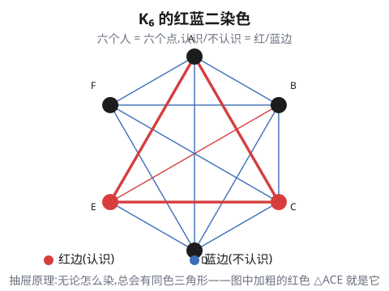
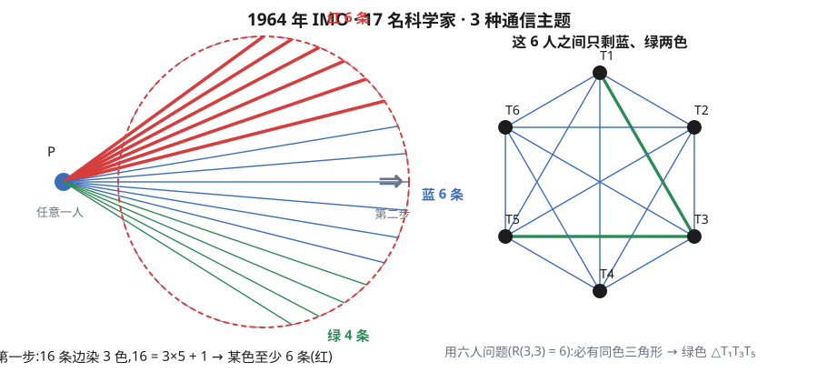
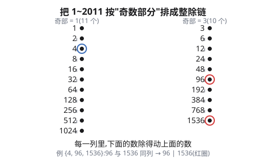
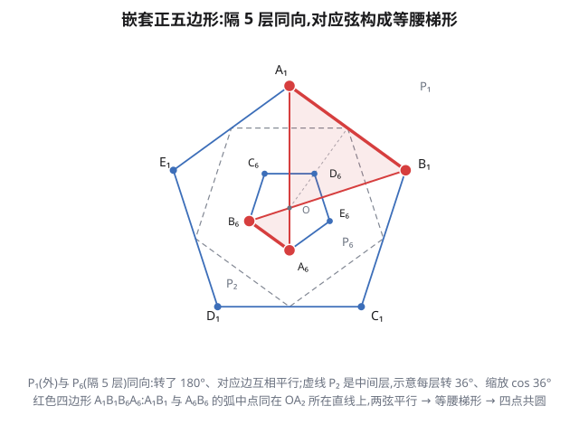

一样东西只有 $n$ 个抽屉,却要放 $n+1$ 个物体——总有一个抽屉至少装两个。这个事实平凡到什么程度呢?一年最多 366 天(闰年),全校 367 名学生,必有两人同一天生日,不需要任何别的知识。它许多:**鸽巢原理**、**抽屉原理**、**狄利克雷原理**(1834 年,Dirichlet 用"抽屉"做过表述,英语世界则叫 pigeonhole)。当你把一个问题翻译成"许多物体放进少数抽屉",答案往往就自己跳出来了。

## 一、原理的三种形态

最基本的一句话是:

> 若 $mn+1$ 个物体放进 $n$ 个抽屉,则至少有一个抽屉里有至少 $m+1$ 个物体。

($m=1$ 就是最常见的"$n+1$ 个物体进 $n$ 个抽屉,必有抽屉装两个"。)

做题时,它通常化装成另外两种样子:

- **平均形态**:若 $\dfrac{s_1+\cdots+s_n}{n} > m$,则某个 $s_i \ge m+1$。平均值超过 $m$,总有一个抽屉超过 $m$。说得再直白些:**总量除以抽屉数,向上取整,就是某个抽屉的下界**。
- **划分形态**:把一个集合切成 $m$ 块,若要取 $m+1$ 个元素,必有两个落在同一块。

后面的九道例题,几乎全是这三句话的换装:难点从来不是原理本身,而是**想清楚谁是抽屉、谁是鸽子**。

## 二、图论开胃菜:六人问题(1947 匈牙利数学竞赛)

> 任六个人中,必有三个人互相认识,或者三个人互相不认识。

把六个人画成六个点 $A,B,C,D,E,F$;两人认识就连一条**红**边,不认识连一条**蓝**边。于是"必有三个人互相认识或互相不认识"就变成:**红蓝二染色的完全图 $K_6$ 中必有同色三角形**。

从 $A$ 出发有 5 条边,只有红蓝两色。划分形态,$5 = 2 \times 2 + 1$:至少有 3 条同色边。不妨设 $AB, AC, AD$ 三条都是红的。

现在看 $B,C,D$ 三人之间的三条边:

- 若其中有一条红的,比如 $BC$ 红,则 $\triangle ABC$ 三边全红——$A,B,C$ 三人两两认识 ✓;
- 若三条全蓝,则 $\triangle BCD$ 三边全蓝——$B,C,D$ 三人两两不认识 ✓。

两种可能都导出结论,证毕。图论里这句话写作 $R(3,3) \le 6$(任意 6 个点两两连边、染两色,必有单色三角形);反过来 5 个点可以做到没有(正五边形边染红、五角星边染蓝即可),所以 $R(3,3)=6$。这个 6,下一题还要用一次。

## 三、两次抽屉:17 位科学家的会议(1964 年第 6 届 IMO 第 4 题)

> 17 名科学家,每两名之间都通信,而且任意两名通信时只讨论三道题目中的一道。证明:至少有三名科学家,他们两两之间通信时讨论的是同一个题目。

把科学家当顶点,通信当边;两位讨论第 $i$ 题就把边染成第 $i$ 色。要证明:三色完全图 $K_{17}$ 必有同色三角形。

**第一步抽屉**。任取一位科学家 $P$。它发出去的 16 条边染了 3 色,平均形态:$16 = 3 \times 5 + 1$,所以某种颜色——设红色——至少有 6 条。记这 6 位"红邻居"为 $T_1,\dots,T_6$。

**第二步抽屉**。这 6 人之间一共有 $\binom{6}{2}=15$ 次通信。注意它们之间**不能再讨论第 1 题**:若 $T_i$ 与 $T_j$ 讨论第 1 题,则 $P$、$T_i$、$T_j$ 三人两两讨论第 1 题,已经得证。所以 15 条边只染蓝、绿两色——这不就是上一题的 $K_6$ 二染色?由 $R(3,3)=6$,必有同色三角形,例如绿色 $\triangle T_1T_3T_5$。这三点两两讨论同一题,证毕。

顺带说一句:第一步里"红邻居至少 6 个"用的是平均形态,第二步用的是上一节的 $R(3,3)=6$。两道题像俄罗斯套娃一样套在一起——**抽屉原理允许你一层一层地用**。事实上 $17$ 也是最小的:1955 年 Gleason 与 Greenwood 构造了 16 人的反例,即多色拉姆齐数 $R(3,3,3)=17$——本题正是它的"$\le 17$"那一半。

## 四、数论的抽屉:整除链(2011 西部)

先看一条经典引理,它是整套数论抽屉的起点:

> **引理** 任取 $n+1$ 个不超过 $2n$ 的正整数,必有两个数,其中一个整除另一个。

证明:每个正整数都能唯一写成 $2^k \cdot m$ 的形式,其中 $m$ 为**奇数**(称为"奇数部分")。例如 $24 = 2^3 \times 3$。在 $1$ 到 $2n$ 里,奇数只有 $n$ 个(它们就是全部可能的奇数部分);而我们有 $n+1$ 个数。抽屉:两个数必有相同的奇数部分 $m$。它们都在链条 $m, 2m, 4m, 8m, \dots$ 上,小的整除大的 ✓。

这条"整除链"的思想马上能用来解决竞赛题:

> (2011 西部数学邀请赛)设 $M$ 是集合 $\{1,2,\dots,2011\}$ 的子集,满足:在 $M$ 的任意三个元素中,都可以找到两个元素 $a,b$,使得 $a \mid b$ 或 $b \mid a$。求 $|M|$ 的最大值。

**构造下界($|M| \ge 21$)**。条件说"任意三个元素里有两个可比"——即 $M$ 里不能同时出现三个两两不整除的数。取两条最长的整除链:

- 奇数部分 $1$:$\ 1, 2, 4, 8, \dots, 1024$,共 11 个;
- 奇数部分 $3$:$\ 3, 6, 12, \dots, 1536$,共 10 个。

把它们并成 $M$(共 21 个元素)。任意取其中 3 个元素,2 条链装 3 个数,划分形态:必有 2 个落在同一条链,而同一链里一个整除另一个 ✓。所以 $|M| \ge 21$ 可达。

**上界($|M| \le 21$)**,这是全篇我最喜欢的一段反证。假设 $|M| \ge 22$,把 $M$ 的元素排成 $a_1 < a_2 < \cdots < a_k$($k \ge 22$)。

**关键观察**:必有 $a_{n+2} \ge 2a_n$。否则 $a_n < a_{n+1} < a_{n+2} < 2a_n$,这中间三个数两两不可能有整除关系:若其中 $a_i \mid a_j$($i<j$),则 $a_j \ge 2a_i \ge 2a_n$,但 $a_j < 2a_n$,矛盾。三个两两不整除的元素违反了条件 ✗。所以必然 $a_{n+2} \ge 2a_n$。

于是从 $a_2 \ge 2$ 出发:

$$a_4 \ge 2a_2 \ge 4,\quad a_6 \ge 2a_4 \ge 8,\quad \dots,\quad a_{22} \ge 2^{10}a_2 \ge 2^{11} = 2048 > 2011,$$

矛盾($M \subseteq \{1,\dots,2011\}$)✗。因此 $|M| \le 21$,与构造合起来:

$$\boxed{\,|M|_{\max} = 21\,}$$

有意思的是,这道题的抽屉并不在整除链本身,而在"**$a_{n+2}$ 至少翻倍**"这个杠杆上:22 个数被迫在 1 到 2011 里摊开,摊不下了。

## 五、数论的另一个抽屉:删数与乘积(2026 新题)

> 从 1, 2, 3, \dots, 2026 中删去一些数,使得剩下的数中任意两个不同的数的乘积都不再是剩下的数。问最少要删去多少个数。

先猜后证。"剩下的任意两个数的乘积要超过 2026"——最小的可能乘积是 $45 \times 46 = 2070 > 2026$。所以:

**构造(44 个够)**。保留 $\{45, 46, \dots, 2026\}$,删去 $\{1, 2, \dots, 44\}$,共删 44 个。任意两个不同保留数的乘积至少是 $45 \times 46 = 2070$,超出 2026,不可能等于任何保留数 ✓。

**上界(44 个必须)**。设删去 $d$ 个数,剩余集合为 $K$,最小元素为 $s$。

- 若 $s \ge 45$:$K \subseteq \{45,\dots,2026\}$,至多 $2026-45+1 = 1982$ 个数,即 $d \ge 44$ ✓;
- 若 $s = 1$:则对 $K$ 里任何别的数 $x$,$1$ 与 $x$ 是两个不同的保留数,而乘积 $1 \cdot x = x$ 仍是保留数,违反条件——除非 $K = \{1\}$,那是删了 2025 个,更差;
- 剩下 $2 \le s \le 44$。一方面 $1,2,\dots,s-1$ 全被删,贡献 $s-1$ 个删除;另一方面,对每个**保留**的 $b \in (s,\, 2026/s]$,乘积 $sb \le 2026$ 必须被删($s$ 与 $b$ 是两个不同的保留数,它们的积若保留就违反条件)。区间 $(s, 2026/s]$ 内共有 $\lfloor 2026/s \rfloor - s$ 个数,其中被删的至多 $d-(s-1)$ 个,所以至少留下
  $$\lfloor 2026/s \rfloor - s - \bigl(d - (s-1)\bigr)$$
  个这样的 $b$,即删除数至少还要
  $$d \;\ge\; (s-1) + \Bigl(\bigl\lfloor 2026/s \bigr\rfloor - s - d + s - 1\Bigr)
  \;\Longrightarrow\; 2d \ge s - 2 + \bigl\lfloor 2026/s \bigr\rfloor .$$
  在 $2 \le s \le 44$ 上,这一步不能分开取最值($s-2$ 的最大值 42 与 $\lfloor 2026/s \rfloor$ 的最小值 46 不在同一个 $s$ 取到),要整体处理:$\lfloor 2026/s \rfloor \ge 2026/s - 1$,于是
  $$2d \ge s-2+\lfloor 2026/s \rfloor \ge s + 2026/s - 3 .$$
  函数 $s + 2026/s$ 在 $[2,44]$ 上递减($s \le 44 < \sqrt{2026} \approx 45.0$),所以 $s + 2026/s \ge 44 + 2026/44 = 90.045\ldots$,即 $2d \ge 87.045\ldots > 87$;而 $2d$ 是整数,只能 $2d \ge 88$,于是 $d \ge 44$ ✓。

所以最少删去

$$\boxed{\,44\ \text{个数}\quad(\text{保留 }45, 46, \dots, 2026)\,}$$

这道题的抽屉藏得很深:它把"最小保留数 $s$"当成抽屉的隔板,凡是 $s$ 的倍数区间都得跟着删,删着删着,44 就是下限。

## 六、几何染色:相似比为 1995 的同色三角形(1995 高联二试)

> 将平面上的每个点都以红、蓝两色之一着色。证明:存在两个相似三角形,它们的相似比为 1995,并且每一个三角形的三个顶点同色。

这题有一个特别短的证法(是这一节的主角),还有一个特别"抽屉"的网格证法(放附录)。

**短证法(同心圆)**。任取一点 $O$,作以 $O$ 为圆心、半径 $a$ 与 $1995a$ 的两个同心圆。

在小圆上任取 9 个点。两色着色,划分形态,$9 = 2 \times 4 + 1$:至少 5 个同色,设为红的 $A,B,C,D,E$(若那 5 个点本是蓝的,把两色名字对调即可)。作射线 $OA, OB, OC, OD, OE$,交大圆于 $A', B', C', D', E'$。这 5 个点里至少 3 个同色——若是红的(如 $A',B',C'$),与小圆红点直接配对;若是蓝的(如 $B',D',E'$),相应的 $B,D,E$ 仍来自小圆的五个红点,依然全红。

以红的情形为例:$\triangle ABC$ 全红,$\triangle A'B'C'$ 全红;而 $A'$ 在射线 $OA$ 上、$B'$ 在 $OB$ 上、$C'$ 在 $OC$ 上,距离 $O$ 都是小圆的 1995 倍——两个三角形以 $O$ 为位似中心,位似比为 1995,当然相似 ✓。蓝的情形一字不差(小圆三角形全红、大圆三角形全蓝,位似比仍是 1995)。

抽屉在这里出现了两次:9 个点落进 2 个颜色,$5$ 个同色;5 个点落进 2 个颜色,$3$ 个同色。两次都只差一点点,而 1995 的比例恰好让两批点遥相呼应。

(*另一个网格证法:先证明平面上必有同色直角三角形,补成矩形,把每条边 1995 等分,再用"相邻分点必同色"逐行下探,找到一个 $1/1995$ 缩小的同色直角三角形。细节见附录。*)

## 七、几何染色:同色四点共圆(2019 印度数学奥林匹克 P2)

> 已知 $A_1B_1C_1D_1E_1$ 为正五边形。对 $2 \le n \le 11$,设正五边形 $A_nB_nC_nD_nE_n$ 的顶点为正五边形 $A_{n-1}B_{n-1}C_{n-1}D_{n-1}E_{n-1}$ 各边的中点。将这 11 个正五边形的全部 55 个顶点任意染为红色或蓝色。求证:在这 55 个顶点中存在同色的四个点,构成一个圆内接四边形(四点共圆)。

(配图见下;这里先看清结构。)抽屉在这一节只干一件事:每个五边形 5 个点染两色,必有一色至少 3 个。

**事实 1**:正五边形的任意 4 个顶点都在它的外接圆上。所以若某个五边形里有 $\ge 4$ 个同色顶点,立即得证;剩下只需对付"每个五边形恰好 3 红 2 蓝"的局面。换一下颜色名,第 1 层 $P_1$ 的三个红点只可能是 **(i) 三个连续**(如 $A_1B_1C_1$),或 **(ii) 三个非连续**(如 $A_1C_1D_1$)——两类都要打发。

**事实 2(同向层与等腰梯形)**:这 11 个五边形全部同心(中心记为 $O$)。第 $n+1$ 层的顶点是第 $n$ 层边的中点,所以第 $n$ 层是把第 1 层绕 $O$ 旋转 $(n-1)\cdot 36°$、缩放 $\cos^{n-1}36°$ 得到的。于是**隔 5 层回到同向**:转了 $180°$,对应边互相平行($P_1,P_6,P_{11}$ 同向;$P_2$ 与 $P_7$、$P_3$ 与 $P_8$、$P_4$ 与 $P_9$、$P_5$ 与 $P_{10}$ 亦两两同向);相邻层则转了 $36°$,并不平行。

同向层之间,两条弦只要"弧中点落在同一半径上"就互相平行:例如 $A_1C_1$ 的弧中点在半径 $OB_1$ 上,$D_6E_6$ 的弧中点也在 $OB_1$ 上,故 $A_1C_1 \parallel D_6E_6$;同理 $A_1B_1 \parallel C_6E_6$。而关于直线 $OB_1$ 的反射把 $A_1$ 映到 $C_1$、把 $D_6$ 映到 $E_6$,所以四边形 $A_1C_1E_6D_6$ 的两腰相等——它是**等腰梯形**,必有外接圆。下图的红色四边形 $A_1B_1B_6A_6$ 则是同向层间**同位置的一对边**:$A_1B_1$ 与 $A_6B_6$ 的弧中点同在直线 $OA_2$ 上(那正是 $P_2$ 顶点 $A_2$ 所在的半径,图中虚线所示),故 $A_1B_1 \parallel A_6B_6$——同样是等腰梯形、同样有外接圆。

有了两件事实,剩下的是一步逼供:第 6 层是与 $P_1$ 同向的那个五边形,颜色只要在它的 $D_6,E_6$ 两个位置对上号,等腰梯形立刻交出同色四点。

**情形一:三个连续红。**设 $A_1B_1C_1$ 红、$D_1E_1$ 蓝。看 $D_6,E_6$:

- **$D_6E_6$ 全蓝**:$D_1E_1E_6D_6$ 全蓝($D_1E_1 \parallel D_6E_6$)✓;
- **$D_6E_6$ 全红**:第 6 层 5 点 3 红 2 蓝,$A_6B_6C_6$ 里恰有 2 蓝 1 红——
  - 红在 $B_6$:$A_6C_6D_1E_1$ 全蓝($A_6C_6 \parallel D_1E_1$)✓;
  - 红在 $A_6$:$A_1C_1D_6E_6$ 全红($A_1C_1 \parallel D_6E_6$)✓;
  - 红在 $C_6$:$A_1B_1C_6E_6$ 全红($A_1B_1 \parallel C_6E_6$)✓;
- **$D_6E_6$ 一红一蓝**:$A_6B_6C_6$ 里恰有 1 蓝 2 红——
  - 蓝在 $A_6$:$B_1C_1B_6C_6$ 全红 ✓;
  - 蓝在 $B_6$:$A_1C_1A_6C_6$ 全红 ✓;
  - 蓝在 $C_6$:$A_1B_1A_6B_6$ 全红 ✓。

每个子情形都当场冒出一个同色等腰梯形——**三个连续红,连第 11 层都不用看**。三个非连续红的情形几乎一样($A_1D_1B_6C_6$、$A_1D_1A_6D_6$ 这类全红,或 $B_1E_1C_6D_6$ 全蓝),完整分支放附录 B。

这一节的抽屉在哪?只有开头那一刀:每层 5 点染两色必有 $\ge 3$ 同色,多的第四点是**事实 1** 白送的;三红是连续还是非连续,也只有两类。剩下的全交给几何——**隔五层的孪生五边形**把"平行"变成"共圆",颜色连推都不用推,当场交代。

## 八、平均的力量:十五道填空题(2009 西部)

> 有 $n$($n>12$)个人参加某次数学邀请赛,试卷由十五道填空题组成,每答对一题得 1 分,不答或答错得 0 分。分析每一种可能的得分情况,发现:只要其中任意 12 个人得分之和不少于 36 分,则这 $n$ 个人中至少有 3 人答对了至少三道同样的题。求 $n$ 的最小可能值。

这题把平均形态用到了极致。

**先翻译成人话**:条件"任意 12 人得分和 $\ge 36$"其实在说"最差的一打人也不差";结论"$\exists$ 三道题,至少 3 个人全对"。

设第 $i$ 人答对 $s_i$ 题。看所有 12 人组的得分和:一共 $\binom{n}{12}$ 个组,每人被数进 $\binom{n-1}{11}$ 个组,所以这些组得分的**平均**是

$$\frac{\binom{n-1}{11}}{\binom{n}{12}}\cdot S \;=\; \frac{12}{n}\,S \;\ge\; 36
\quad\Longrightarrow\quad S = \sum_{i=1}^{n} s_i \;\ge\; 3n .$$

即:**平均每人至少答对 3 题**。这是第一个抽屉(平均形态)。

现在数"三元组":第 $i$ 人答对的题里任取 3 道,有 $\binom{s_i}{3}$ 种取法;两边数:

$$\sum_{i=1}^{n} \binom{s_i}{3}
\;=\; \sum_{\{j,k,l\}} \#\{\text{同时答对第 }j,k,l\text{ 题的人}\} ,$$

右边是对 15 道题的所有 $\binom{15}{3}=455$ 个三道题元组求和。若无 3 人同对某三道题,右边每项 $\le 2$,总和 $\le 910$。

左边呢?先证一个初等引理:**对一切整数 $k \ge 0$,有 $\binom{k}{3} \ge 3k - 8$**——$k \le 2$ 时左边为 0、右边非正;$k = 3,4$ 时两边相等($1 = 9-8$,$4 = 12-8$);$k \ge 5$ 时左边按三次方增长,右边只按线性增长,不等式继续成立。于是

$$\sum_{i=1}^{n}\binom{s_i}{3} \;\ge\; \sum_{i=1}^{n}(3s_i - 8) \;=\; 3S - 8n .$$

而 $S = \sum s_i \ge 3n$(上面第一只抽屉),所以 $\sum \binom{s_i}{3} \ge 9n - 8n = n$。当 $n \ge 911$ 时 $n > 910$,左边 $>$ 右边 $\le 910$,矛盾——必有 3 人同对三道题 ✓。故 $n \ge 911$ 充分。

**$n = 910$ 不够**:把 15 道题的 455 个三元组,每个三元组安排 2 名学生专答(共 $455 \times 2 = 910$ 人,第 $i$ 人恰好答对其负责的三道题)。于是任何 12 人得分和 $= 36$ ✓ 条件满足,但没有任何三道题有 3 人同对 ✗。所以 $n$ 必须 $\ge 911$。

$$\boxed{\,n_{\min} = 911\,}$$

这题的精髓:条件只给了"平均 $\ge 3$",结论要的是"三人同对三道题";中间的桥是 $\binom{15}{3}=455$ 与"每三元组至多 2 人"的容量 910——**抽屉的容量,就是 2×455**。

## 九、综合:三十五元子集(2011 东南)

> 求所有的正整数 $n$,使得在集合 $M = \{1, 2, 3, \dots, 50\}$ 的任意一个 35 元子集中,都存在两个不同元素 $a, b$,满足 $a+b = n$ 或 $a-b = n$。

把这题做成一张图:顶点 $1,\dots,50$;若 $a+b=n$ 或 $a-b=n$ 就连一条边。"任意 35 元子集都有边" ⟺ 图的最大独立集 $\alpha \le 34$。

两类边各有各的结构:

- **差边** $\{a, a+n\}$($a = 1, 2, \dots, 50-n$,共 $50-n$ 条)并不总是两两不共顶点——$n=1$ 时 $\{1,2\}$ 与 $\{2,3\}$ 就共享顶点 2。但差边图是若干条**链**的并:对 $r=1,\dots,n$,第 $r$ 条链是 $r, r+n, r+2n, \dots$。长 $\ell$ 的链,最大匹配是 $\lfloor \ell/2 \rfloor$(独立集至多取 $\lceil \ell/2 \rceil$ 个点)。把 $n=1..32$ 的链长逐条代入,$\sum_r \lfloor \ell_r/2 \rfloor$ 的最小值是 **17**,恰在 $n=17$ 取到(前 16 条链都长 3、各贡献 1,末链 $\{17,34\}$ 长 2、贡献 1);于是 $\alpha \le 50 - 17 = 33 \le 34$ ✓;
- **和边** $\{a, n-a\}$:对 $33 \le n \le 69$,$a$ 从 $\max(1,n-50)$ 取到 $\lfloor (n-1)/2 \rfloor$,这些边**两两不共顶点**——否则某顶点 $x=a_1=n-a_2$ 同时属于两条边,推出 $n=a_1+a_2 \le 2\lfloor (n-1)/2 \rfloor \le n-1$,矛盾。和边是真正的匹配,至少 $\lfloor (33-1)/2 \rfloor = 16$ 条(两端 $n=33$ 与 $n=69$ 最少,恰 16 条),故 $\alpha \le 50 - 16 = 34$ ✓;
- **$n \ge 70$**:反例——取 $S = \{1, 2, \dots, 35\}$。任意两个元素的和 $\le 34+35 = 69 < n$,差 $\le 34 < n$,子集里没有任何 $a+b=n$ 或 $a-b=n$ ✗。

三档全覆盖:

$$\boxed{\,n = 1, 2, \dots, 69\,}$$

这道题让我们看到独立集与匹配的博弈:独立集每"吃"一条匹配边就少一个点,匹配越大防空越严。$n \le 32$ 时差边织成的链网交出 17 条匹配;$33 \le n \le 69$ 时和匹配还剩 16 条;等 $n \ge 70$,两种边都稀疏了(和边只剩 $\le 15$ 条),$\{1,\dots,35\}$ 便安然无恙。

## 十、巅峰:整点朋党(2008 IMO Shortlist C3)

把抽屉用到了极致的,是下面这题——它把"格子点按坐标取模分类"变成了一座精准的度量衡。

> 考虑坐标平面上所有整点的集合 $S$。对正整数 $k$,称两点 $A,B\in S$ 为 **$k$-朋友**,如果存在点 $C\in S$ 使得 $\triangle ABC$ 的面积为 $k$;称集合 $T\subseteq S$ 为 **$k$-朋党**,如果 $T$ 中任意两点都是 $k$-朋友。求最小的正整数 $k$,使得存在一个多于 200 个点的 $k$-朋党。

**一个关键判定**。设 $\Delta x = x_A - x_B,\ \Delta y = y_A - y_B$。$\triangle ABC$ 面积的二倍是 $|\det(B-A, C-A)|$;当 $C$ 跑遍所有整点时,这个行列式恰取遍 $\gcd(\Delta x, \Delta y)$ 的**所有倍数**(见附录的验证)。所以

$$A,B \text{ 是 } k\text{-朋友} \iff \gcd(\Delta x,\Delta y) \mid 2k .$$

问题变成:找最小的 $k$,使存在 $>200$ 个整点,任意两点的坐标差之最大公约数都整除 $2k$。

**构造($k = 180180$ 可行)**。取 $15 \times 15$ 的方格点阵

$$T = \{(i,j) : 0 \le i,j \le 14\},\qquad |T| = 225 > 200 .$$

任意两点的坐标差满足 $|\Delta x|, |\Delta y| \le 14$,所以 $\gcd(\Delta x,\Delta y) \le 14$,它整除 $\operatorname{lcm}(1,2,\dots,14) = 360360 = 2 \times 180180$。取 $k = 180180$,由判定,任意两点都是 $k$-朋友 ✓。

**上界($k$ 不能更小)**。假设 $k < 180180$。那么 $1,2,\dots,14$ 中必有一个 $m$ 不整除 $2k$(否则 $\operatorname{lcm}(1,\dots,14) \mid 2k$,即 $k \ge 180180$;而 $\operatorname{lcm}(1,\dots,14)$ 是偶数)。

设 $T$ 是任意 $k$-朋党,$|T| > 200$。把整点按**坐标对 $m$ 取余**分成 $m^2$ 个剩余类——这是我们的抽屉。$|T| > 200 > m^2$($m \le 14$ 所以 $m^2 \le 196$),抽屉:有两点 $A,B$ 落在同一个剩余类,即 $m \mid \Delta x$ 且 $m \mid \Delta y$,故 $m \mid \gcd(\Delta x,\Delta y)$。

但 $T$ 里任意两点都是 $k$-朋友,判定说 $\gcd(\Delta x,\Delta y) \mid 2k$;而 $m \nmid 2k$,矛盾。所以 $|T| \le 200$,不可能多于 200。因此最小的 $k$ 正是

$$\boxed{\,k = \frac{\operatorname{lcm}(1,2,\dots,14)}{2} = 180180\,}$$

这题的"抽屉"是用得最精致的一次:抽屉不是现成的集合,而是你自己造的——**按模 $m$ 把平面分成 $m^2$ 个小方格**,再让 $|T|$ 恰好挤穿 $m^2$。平均思想(超过 $m^2$ 个点放进 $m^2$ 个格)与数论($m \mid \gcd$)在这里合流,这就是抽屉原理的完全体。

## 尾声:抽屉原理的使用手册

看完全篇,值得带走的不是某个结论,而是三句话:

1. **先找抽屉,再找鸽子。**抽屉通常是:剩余类(奇偶、同余、负余数类)、奇因子、区间分块、颜色、得分档;鸽子是你要证明"存在"的那些对象。
2. **平均就是抽屉。**不知道具体分布时,总量除以类数是下界的第一来源(2009 西部靠它;2011 东南靠匹配);想构造反例,就把数量精确地凑到"刚好不溢出"(2008 的 $m^2$、2011 东南的 69)。
3. **抽屉可以嵌套,也可以自己造。**1964 年的两步抽屉、2019 五边形靠"隔五层同向"的等腰梯形、2008 那把自己按模造的 $m^2$ 个方格——抽屉原理真正的精髓不是技巧,而是一种世界观:**有限的世界里,挤一挤,总会溢出**。

## 相关阅读

- [排列组合进阶:从圆排列到容斥原理](post.html?slug=permutations-combinations)(本站):计数基本工具,容斥与抽屉往往并肩出现。
- [组合恒等式:从杨辉三角到二项式定理](post.html?slug=combinatorial-identities)(本站):$\binom{15}{3}=455$ 这类数,是竞赛计数的常用量。
- [生成函数:把计数打包成多项式](post.html?slug=generating-functions-counting)(本站):抽屉负责存在性,生成函数负责通项。
- [IMO Shortlist 2008 C3(k-朋党)](https://artofproblemsolving.com/community/c6h287860)(AOPS):本文第十节的原帖,含各国解法与讨论。
- [2009 中国西部数学奥林匹克·第 7 题(求最小 n)](https://artofproblemsolving.com/community/c6h466254s1_find_the_least_n)(AOPS):第八节的原题出处,帖内可见当年对题意的推敲。

> [!detail] 技术细节与解题备忘
> 
> ### A. 1995 高联的网格证法(法一)
> 
> 先证平面上必有同色直角三角形。取一条直线 $l$,其上必有两点 $P,Q$ 同色(设红色)。过 $P,Q$ 作 $l$ 的垂线 $l_1,l_2$。若 $l_1$ 或 $l_2$ 上还有红点 $R$,则 $\triangle PQR$(或 $\triangle PQS$)是红色直角三角形;否则,$l_1,l_2$ 上除 $P,Q$ 外全是蓝点,取 $l_1$ 上蓝点 $R,S$,过 $R$ 作 $l_1$ 的垂线交 $l_2$ 于蓝点 $T$,则 $\triangle RST$ 蓝色且直角 ✓。
> 
> 设 $\triangle ABC$ 是同色直角三角形,$\angle B = 90°$,补成矩形 $ABCD$。把每条边 $n = 1995$ 等分,得到 $n^2$ 个小矩形。边 $AB$ 上共 $n+1 = 1996$ 个分点:$n$ 是奇数,若相邻分点全部异色,则颜色沿边交替,$A$ 与 $B$ 异色,与 $\triangle ABC$ 同色矛盾——所以必有相邻同色分点 $E,F$。
> 
> 沿 $EF$ 所在竖条逐行往下看:每行看"上边两点颜色"。若某行下边两点中有与上边同色的,立刻得到同色小直角三角形(直角在格点上,两直角边分别是 $a/n$ 与 $b/n$);若下边两点都换成了另一色,则它们彼此同色,继续下一行。走到底仍没找到,则这竖条的每条竖边两端同色。对 $BC$ 边同样处理(横条)。两竖条与两横条相交的 $a/n \times b/n$ 小矩形 $GHNM$ 中,$M$、$H$ 都与 $N$ 同色,$\triangle MNH$ 是同色直角三角形,与 $\triangle ABC$ 相似、比 $1/1995$ ✓。
> 
> ### B. 2019 印度题:两种"三红排布"的完整演示
> 
> **结构事实验证**。第 $n+1$ 层顶点是第 $n$ 层边的中点,故第 $n$ 层 = 第 1 层绕 $O$ 旋转 $(n-1)\cdot 36°$、缩放 $\cos^{n-1}36°$;隔 5 层转了 $180°$,回到同向($P_1,P_6,P_{11}$ 以及 $P_2$↔$P_7$、$P_3$↔$P_8$、$P_4$↔$P_9$、$P_5$↔$P_{10}$)。同向层之间的平行弦判据:**两弦端点的弧中点在同一个半径方向**(等价地:两端位置之和模 5 相同),如 $A_1C_1 \parallel D_6E_6$、$A_1B_1 \parallel C_6E_6$、$B_1E_1 \parallel C_6D_6$;每个中点方向对应 $2 \times 2$ 条弦,每对同向层共有 $20$ 个这样的等腰梯形,全部可程序逐一验证。
> 
> 若某层 $\ge 4$ 同色,完成,故各层都是 3 红 2 蓝;换色名后 $P_1$ 的三个红点仅两类:
> 
> **情形一:三红连续**($A_1B_1C_1$ 红、$D_1E_1$ 蓝,正文已演示)。仍只看第 6 层:
> 
> | $D_6E_6$ 情形 | 同色共圆四边形 |
> |---|---|
> | 全蓝 | $D_1E_1E_6D_6$ 全蓝 |
> | 全红,红在 $B_6$ | $A_6C_6D_1E_1$ 全蓝 |
> | 全红,红在 $A_6$ | $A_1C_1D_6E_6$ 全红 |
> | 全红,红在 $C_6$ | $A_1B_1C_6E_6$ 全红 |
> | 一红一蓝,蓝在 $A_6$ | $B_1C_1B_6C_6$ 全红 |
> | 一红一蓝,蓝在 $B_6$ | $A_1C_1A_6C_6$ 全红 |
> | 一红一蓝,蓝在 $C_6$ | $A_1B_1A_6B_6$ 全红 |
> 
> **情形二:三红非连续**(设 $A_1C_1D_1$ 红、$B_1E_1$ 蓝;其余四个非连续排布由旋转得到,同此):
> 
> | $D_6E_6$ 情形 | 同色共圆四边形 |
> |---|---|
> | 全蓝(则 $A_6B_6C_6$ 全红) | $A_1C_1A_6C_6$ 全红 |
> | 全红 | $A_1C_1D_6E_6$ 全红 |
> | 一红一蓝,蓝在 $A_6$(则 $B_6C_6$ 红) | $A_1D_1B_6C_6$ 全红 |
> | 一红一蓝,蓝在 $B_6$(则 $A_6C_6$ 红) | $A_1C_1A_6C_6$ 全红 |
> | 一红一蓝,蓝在 $C_6$,且 $D_6$ 红 | $A_1D_1A_6D_6$ 全红 |
> | 一红一蓝,蓝在 $C_6$,且 $E_6$ 红 | $B_1E_1C_6D_6$ 全蓝 |
> 
> 表中每个四边形都以一对平行弦为底(如 $B_1E_1 \parallel C_6D_6$:两弦弧中点同在 $180°$ 方向),关于对应半径反射两腰互换,是等腰梯形,故共圆。注意演示只用到 $P_1$ 与 $P_6$;其余九个五边形并未上场——它们的存在只是让"隔五层同向"的结构每 5 层重复一轮。真正的难点不在抽屉,而在看出 $P_6$ 是 $P_1$ 的"同向孪生"。
> 
> ### C. 2008 IMO SL 判定引理的验证
> 
> 记 $v = (\Delta x, \Delta y)$。$\triangle ABC$ 面积的二倍为 $|\det(v, w)|$,其中 $w = C - A$。固定 $v \neq 0$,当 $w$ 跑遍 $\mathbb{Z}^2$ 时,$\det(v,w) = \Delta x\, w_2 - \Delta y\, w_1$ 恰取遍 $\gcd(\Delta x,\Delta y)$ 的所有倍数(辗转相除的线性组合形式:Bézout 给出取到 $\gcd$ 的 $w$,缩放给出所有倍数)。于是 $[ABC] = k$ 有整点解 $C$,当且仅当 $2k$ 是 $\gcd(\Delta x,\Delta y)$ 的倍数。
> 
> ### D. 本书涉及的其他细节
> 
> - 2011 西部上界里的杠杆:若 $a_{n+2} < 2a_n$,则 $a_n,a_{n+1},a_{n+2}$ 两两不整除(见正文);这条引理对任何 $[1, N]$ 上的"任意三数有整除对"问题通用。
> - 2009 西部的引理:$\binom{k}{3} \ge 3k-8$ 对一切 $k \ge 0$ 成立($k \le 2$ 时左边 $0$、右边 $\le -2$;$k=3,4$ 取等;$k \ge 5$ 时左边立方增长)。配合"任意 12 人 $\ge 36$ 分 $\Rightarrow S \ge 3n$",得 $\sum \binom{s_i}{3} \ge 3S - 8n \ge n$。
> - 2026 删数:阈值 45 来自 $45 \times 46 = 2070 > 2026$;一般地,对 $\{1,\dots,N\}$,$m = \left\lfloor (\sqrt{4N+1}-1)/2 \right\rfloor + 1$(即最小 $m$ 使 $m(m+1) > N$)时保留 $\{m,\dots,N\}$ 通常是最优构造,下界用"最小保留数 $s$ 的倍数区间计数"。
> - 2011 东南:$n \le 32$ 用差边图的最大匹配(链的并,逐条数链长,最小 17、在 $n=17$ 取到),$33 \le n \le 69$ 用和匹配($\ge 16$ 条,两端最少),$n \ge 70$ 反例 $\{1,\dots,35\}$。