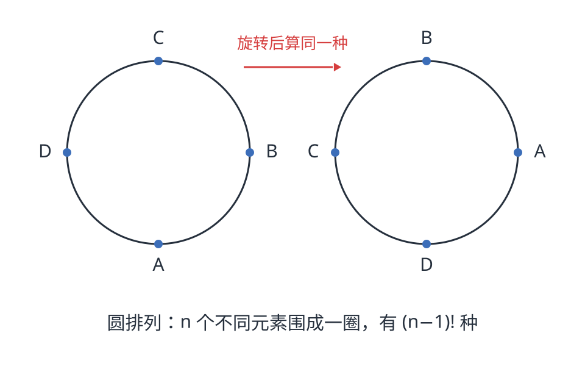
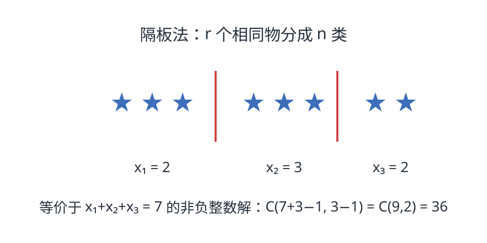
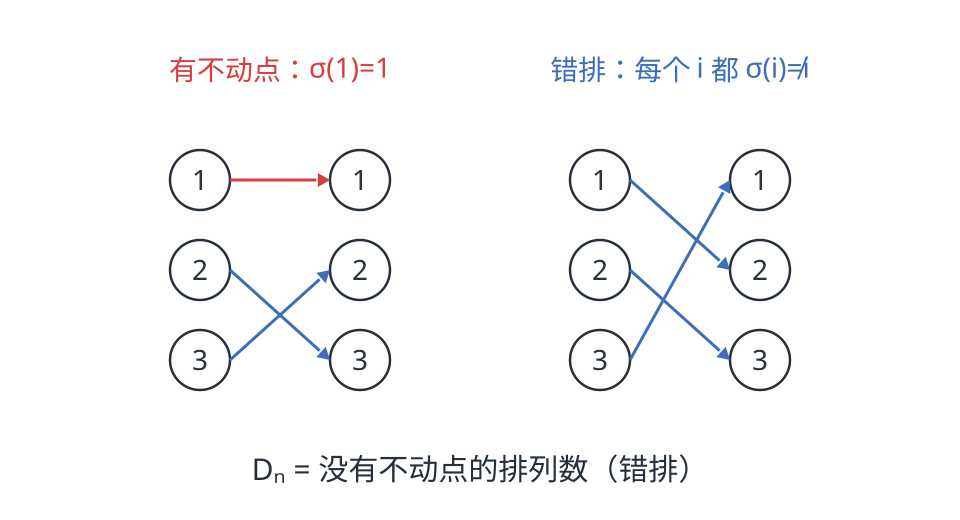
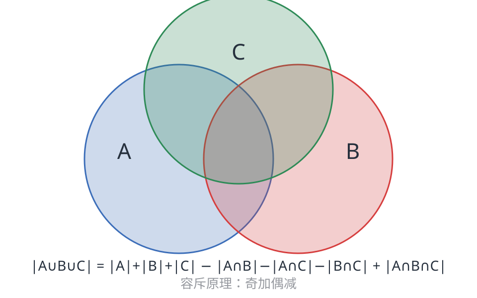

排列组合不只有 $C_n^r$ 和 $A_n^r$。很多进阶计数问题，本质上都是同一句话的变体：**先按某个标准数，再处理重复、对称与限制**。这篇文章从基本公式快速推起，然后沿着一条主线——圆排列、可重复、不全相异、错排、置换不动点、容斥原理——把常见的"进阶"计数方法串起来。==文章较长请耐心阅读。==

## 零、基本排列组合：先放大，再除以重复

计数问题最底层的依据是**乘法原理**：一件事分 $k$ 步完成，第 $i$ 步有 $m_i$ 种方法，那么总方法数是

$$m_1 m_2 \cdots m_k$$

从 $n$ 个不同元素中有序地取出 $r$ 个排成一列，叫**排列**，记作 $A_n^r$。第一个位置有 $n$ 种选法，第二个有 $n-1$ 种，……第 $r$ 个有 $n-r+1$ 种，所以

$$A_n^r = n(n-1)\cdots(n-r+1) = \frac{n!}{(n-r)!}$$

如果只关心**选哪些**、不关心顺序，就是**组合** $C_n^r$。为什么除以 $r!$？因为从选出的 $r$ 个元素排成一列有 $r!$ 种顺序，而这 $r!$ 个排列对应同一个 $r$ 元子集；所以每一种组合在排列里被数了 $r!$ 次，于是

$$C_n^r = \frac{A_n^r}{r!} = \frac{n!}{r!(n-r)!} = \binom{n}{r}$$

组合数有几个常用性质，后面会反复用到：

$$\binom{n}{r} = \binom{n}{n-r}, \qquad \binom{n}{r} = \binom{n-1}{r-1} + \binom{n-1}{r}, \qquad \sum_{r=0}^{n} \binom{n}{r} = 2^n$$

第二条叫**帕斯卡恒等式**，第三条来自二项式定理 $(1+x)^n = \sum \binom{n}{r} x^r$ 中令 $x=1$。

这两条公式是整个计数大厦的地基。后面所有内容几乎都是同一个套路：**先按容易的方式数，再把多算的部分除掉**。

## 一、圆排列：抹掉起点

把 $n$ 个不同的人围成一圈坐，有多少种坐法？直线排列是 $n!$，但圆桌上没有"第一个位置"：整体旋转一圈，在直线意义下是 $n$ 种不同排法，在圆桌意义下是同一种。因此

$$n \text{ 个不同元素围成一圈} \quad\Longrightarrow\quad \frac{n!}{n} = (n-1)!$$

另一种更直接的看法：圆桌没有"第一个位置"，那就**先固定一个人**（比如让 A 坐在任意一个固定座位），剩下的 $n-1$ 个人再沿着圆周排成一列，所以是 $(n-1)!$。两种看法殊途同归。

更一般地，从 $n$ 个不同元素中选出 $r$ 个围成一圈：先选出 $r$ 个元素 $\binom{n}{r}$，再把这 $r$ 个元素圆排列 $(r-1)!$，所以是

$$\binom{n}{r}(r-1)! = \frac{n!}{r\,(n-r)!}$$

如果题目把**翻转也看作相同**（比如项链、手环），且 $r \ge 3$，还要再除以 $2$。理由：$r$ 个互不相同的元素围成的圈没有左右对称性，所以每个圆排列和它的镜像恰好组成一对，数的时候把每一对当成一种，就要除以 $2$。

> **例 1（圆排列 + 不相邻）** 6 个人围圆桌坐，有多少种坐法？若甲、乙不相邻，又有多少种？

答案：$6$ 人圆桌共 $(6-1)! = 120$ 种。甲乙不相邻：先不管限制是 $120$ 种；把甲乙绑成一个"块"再围成一圈，有 $2 \times (5-1)! = 48$ 种相邻坐法，所以不相邻是 $120 - 48 = 72$ 种。

## 二、可重复排列：每一位都有 n 种选择

**可重复排列**是最简单的一类：$n$ 种元素，每种都可以重复使用，取 $r$ 个排成一列。每一位都有 $n$ 种选择，互不影响：

$$n^r$$

比如 3 位数字密码有 $10^3$ 种，掷 5 次骰子的结果序列有 $6^5$ 种。这里顺序是重要的，$(1,2)$ 和 $(2,1)$ 算两种。

## 三、可重复组合：隔板法

**可重复组合**就微妙一些：$n$ 种元素，每种可重复取，取 $r$ 个但不计顺序。它等价于方程

$$x_1 + x_2 + \cdots + x_n = r, \qquad x_i \ge 0$$

的非负整数解个数。用**隔板法**：把 $r$ 个相同物体排成一排，插入 $n-1$ 块隔板分成 $n$ 份，第 $i$ 份的个数就是 $x_i$。反过来，任意一个非负整数解也唯一对应一个这样的"星板图"，所以计数变成：$r$ 个物体和 $n-1$ 块板一共 $r+n-1$ 个位置，选 $n-1$ 个位置放板（板子彼此相同，所以是组合不是排列）：

$$\binom{r+n-1}{n-1} = \binom{r+n-1}{r}$$

如果要求每个 $x_i \ge 1$（即"每类至少取一个"），先各给 1 个，剩下 $r-n$ 个再随便分：

$$\binom{r-1}{n-1}$$

隔板法最常见的变体是给某些变量加上限，这时通常要借助后面的**容斥原理**。

> **例 2（隔板法 + 上界限制）** 求 $x_1+x_2+x_3 = 10$ 的非负整数解中，满足 $x_1 \le 3$ 的解的个数。

先不管 $x_1$ 的限制：$\binom{10+3-1}{2} = 66$。再减去 $x_1 \ge 4$ 的解：令 $y = x_1 - 4$，则 $y + x_2 + x_3 = 6$，有 $\binom{8}{2} = 28$ 个。答案 $66 - 28 = 38$。

## 四、不全相异元素的排列：除以内部的重复

如果 $n$ 个物体里有些完全相同——第 $i$ 类有 $n_i$ 个，$\sum n_i = n$——把它们排成一列的不同排列数是

$$\frac{n!}{n_1!\, n_2! \cdots n_k!}$$

理由还是"先放大再除重"：先假装 $n$ 个物体全不同，有 $n!$ 种；每一类内部的 $n_i!$ 种顺序其实只算同一种，所以逐个除掉。

> **例 3（不全相异 + 不相邻）** 把 MISSISSIPPI 的 11 个字母排成一列，要求任意两个 I 都不相邻，有多少种？

先排不含 I 的 7 个字母：M, S, S, S, S, P, P，共 $\frac{7!}{4!\,2!} = 105$ 种。它们产生 8 个空位（含两端），选 4 个空位放入 4 个 I：$\binom{8}{4} = 70$。答案 $105 \times 70 = 7350$。

## 五、不全相异元素的组合：有限多重集

"不全相异"如果只做排列，除法就够了；但如果问**从一堆有重复、且有数量上限的元素里选 $r$ 个**，就不能简单除以阶乘了。这时最干净的工具是**生成函数**。

设第 $i$ 类元素最多可取 $n_i$ 个，则取 $r$ 个的组合数，就是下面这个多项式里 $x^r$ 的系数：

$$\prod_{i=1}^k \big(1 + x + x^2 + \cdots + x^{n_i}\big)$$

为什么系数就是答案？展开时从第 $i$ 个因式里选一项 $x^{a_i}$，表示"第 $i$ 类取 $a_i$ 个"；把所有因式选的指数相加，得到 $\sum a_i$，正好是取出的总数。于是 $x^r$ 的系数统计了所有满足 $\sum a_i = r$ 且 $0 \le a_i \le n_i$ 的取法，每一种取法恰好对应一项。

> **例 4（有限多重集组合）** 从 1 个红球、2 个蓝球、3 个绿球中任取 3 个（同色球不加区分），有多少种取法？

答案就是

$$(1+x)(1+x+x^2)(1+x+x^2+x^3)$$

中 $x^3$ 的系数。展开得 $1+3x+5x^2+6x^3+\cdots$，所以是 $6$ 种。

如果每种元素没有数量上限，这个生成函数退化为 $\left(\frac{1}{1-x}\right)^n$，$x^r$ 系数正是 $\binom{n+r-1}{r}$——和隔板法殊途同归。

## 六、错位排列：伯努利的装错信笺问题

**错位排列**（derangement）指没有元素停在原位的排列。经典故事是**伯努利装错信笺问题**：$n$ 封信随机装入 $n$ 个写好的信封，问全部装错有多少种，记作 $D_n$。

用容斥原理可以完整推出公式。设 $A_i$ 表示"第 $i$ 封信装对了"，则"全错"就是不属于任何 $A_i$ 的排列数。由容斥原理的补集形式：

$$D_n = \sum_{k=0}^{n} (-1)^k \sum_{|S|=k} \left|\bigcap_{i \in S} A_i\right|$$

固定一个 $k$ 元集合 $S$：$\bigcap_{i\in S} A_i$ 表示这 $k$ 封信都装对，其余 $n-k$ 封随便装，所以有 $(n-k)!$ 种；而这样的 $S$ 有 $\binom{n}{k}$ 个。代入得

$$D_n = \sum_{k=0}^{n} (-1)^k \binom{n}{k}(n-k)! = n! \sum_{k=0}^{n} \frac{(-1)^k}{k!}$$

注意右边的和式 $\sum_{k=0}^{n} (-1)^k/k!$ 正是 $e^{-1}$ 的泰勒展开 $e^{-1}=\sum_{k=0}^{\infty}(-1)^k/k!$ 的前 $n+1$ 项部分和。所以 $D_n/n!$ 不是"约等于"某个神秘常数，而**本身就是 $e^{-1}$ 的部分和**；当 $n\to\infty$ 时，这个部分和收敛到完整的泰勒级数，也就是 $e^{-1}$。

前几项是

| $n$ | 1 | 2 | 3 | 4 | 5 | 6 |
|---|---:|---:|---:|---:|---:|---:|
| $D_n$ | 0 | 1 | 2 | 9 | 44 | 265 |

它还有两个好用的递推：

$$D_n = (n-1)(D_{n-1} + D_{n-2}), \qquad D_n = nD_{n-1} + (-1)^n$$

因为 $e^{-1} = \sum (-1)^k/k!$，所以 $D_n$ 非常接近 $\dfrac{n!}{e}$：

$$\frac{D_n}{n!} \;\to\; \frac{1}{e} \approx 0.3679$$

也就是说，**随机把 $n$ 封信装进 $n$ 个信封，全部装错的概率约为 $36.8\%$**，而且 $n$ 越大越接近这个值——这大概是最反直觉的计数结论之一：无论多少封信，全错的概率都稳定在三分之一多一点。

> **例 5（帽子问题）** $n$ 个人把帽子放在一起，散场时每人随机拿一顶。求至少一个人拿到自己帽子的概率，并求 $n \to \infty$ 时的极限。

至少一人拿到自己帽子 = 全体 $-$ 全错，概率 $1 - \dfrac{D_n}{n!}$，极限 $1 - \dfrac{1}{e}$。

## 七、错排的亲戚们：一些有趣的问题

错排问题有很多变体，竞赛里常以"信、信封、帽子、钥匙"等故事出现。

- **恰好 $k$ 个人拿到自己的帽子**：先选这 $k$ 个人 $\binom{n}{k}$，剩下的人全部错排 $D_{n-k}$，所以有 $\binom{n}{k}D_{n-k}$ 种。
- **至少一个人拿到自己的帽子**：$n! - D_n$。
- **没有一个人拿到自己的帽子**：就是 $D_n$。
- **指定某 $k$ 个人都拿到自己的帽子**：这 $k$ 个人固定，剩下 $n-k$ 个人随便排，$(n-k)!$ 种；注意这里不要求其他人是否错排，所以不是 $\binom{n}{k}D_{n-k}$——那是"恰好 $k$ 个人拿到自己的帽子"。

这些数字统称 **rencontres numbers**（相遇数），它们和"不动点"紧密相关，下一节会从置换的角度再看一遍。

还有一个著名的难问题：** ménage problem（夫妻入座问题）**——$n$ 对夫妻围圆桌交替就座，且夫妻不相邻。它比普通错排难得多，答案是某个复杂的交错级数。这里只作拓展，竞赛中遇到时通常会有更具体的提示。

> **例 6（错排变体）** 4 个人各有一顶帽子，随机取回。求恰好有 1 个人拿到自己帽子的方法数。

选拿到自己帽子的那个人：$\binom{4}{1} = 4$ 种；剩下 3 个人必须全错，$D_3 = 2$。答案 $4 \times 2 = 8$。

## 八、置换与不动点

排列的现代说法是**置换**：$\{1,2,\dots,n\}$ 到自身的一个双射 $\sigma$。如果 $\sigma(i) = i$，就说 $i$ 是 $\sigma$ 的**不动点**。

- **恰好 $k$ 个不动点的排列数**：先选出这 $k$ 个位置 $\binom{n}{k}$，剩下 $n-k$ 个元素必须全部错排，所以是

$$\binom{n}{k} D_{n-k}$$

- **随机排列中不动点个数的期望**：对每个 $i$ 定义指示变量 $X_i$（$\sigma(i)=i$ 时为 1），则 $E[X_i] = \frac{1}{n}$。由期望线性性，

$$E[\text{不动点个数}] = \sum_{i=1}^n E[X_i] = n \cdot \frac{1}{n} = 1$$

不管 $n$ 多大，随机排列平均恰好有 1 个不动点。而 $k$ 个不动点的概率

$$\frac{\binom{n}{k} D_{n-k}}{n!} = \frac{D_{n-k}}{k!\,(n-k)!} = \frac{1}{k!}\cdot\frac{D_{n-k}}{(n-k)!} \;\to\; \frac{e^{-1}}{k!}$$

最后一步用了 $D_m/m! \to e^{-1}$。这些极限值 $e^{-1}/k!$ 正好是 Poisson(1) 分布的概率质量函数，所以当 $n$ 很大时，不动点个数近似服从参数为 1 的 **Poisson 分布**。

如果把置换写成**轮换分解**，错排还有一个漂亮的等价说法：**没有长度 1 的轮换**。比如 $\sigma = (1\,2)(3\,4\,5)$ 有 0 个不动点，$\sigma = (1)(2\,3)$ 有 1 个不动点。这个视角在研究群论和组合恒等式时很有用。

> **例 7（不动点概率）** 随机取一个 $n$ 元排列，求恰好有 2 个不动点的概率，并求 $n\to\infty$ 的极限。

概率为 $\dfrac{\binom{n}{2}D_{n-2}}{n!}$，极限为 $\dfrac{e^{-1}}{2}$。

## 九、容斥原理：奇加偶减

容斥原理是计数版的"排除法"：要数并集，先把每个集合单独加起来，再减去两两重叠，加上三三重叠……符号一正一负交替。

$$|A_1 \cup \cdots \cup A_n| = \sum_i |A_i| - \sum_{i<j} |A_i \cap A_j| + \sum_{i<j<k} |A_i \cap A_j \cap A_k| - \cdots$$

为什么"奇加偶减"不会多算？任取一个属于恰好 $m$ 个集合的元素 $x$。在右边，它先被 $m$ 个单集合各算一次，又被 $\binom{m}{2}$ 个交集各减一次，再被 $\binom{m}{3}$ 个交集各加一次……总共被算

$$\sum_{i=1}^{m} (-1)^{i+1}\binom{m}{i} = 1$$

次（由二项式定理 $(1-1)^m = 0$ 移项即得）。所以每个元素恰好被计入一次。

它最常用的形式是**补集形式**：在全集 $U$ 中，不满足任何一条性质的元素个数为

$$|U| - \sum_i |A_i| + \sum_{i<j} |A_i \cap A_j| - \cdots$$

错排公式正是它的杰作：设 $A_i$ = "第 $i$ 封信装对了"，则"全错"就是不属于任何 $A_i$ 的元素个数。容斥还能处理上界限制、互质计数、限定位置的排列等一大类问题。

容斥还有一层更精细的**邦费罗尼不等式**：截断到奇数项得到上界，截断到偶数项得到下界。竞赛中有时不需要精确值，只需要估计范围时很好用。

> **例 8（容斥 + 互质）** 求 $1$ 到 $1000$ 中与 $30$ 互质的整数个数。

$30 = 2 \times 3 \times 5$。设 $A_2, A_3, A_5$ 分别表示能被 $2,3,5$ 整除的数。不能被任何一个整除的个数为

$$1000 - (500+333+200) + (166+100+66) - 33 = 266$$

所以答案是 $266$。

## 十、练习题精选：

下面这些题不再是一眼套公式，需要自己构造容斥、递推或对称性计数。建议先想清楚"重复了什么、该除以什么"，再看文末解答。

1. **满射计数**：设 $f:\{1,\dots,n\}\to\{1,\dots,m\}$。用容斥原理证明满射个数为
$$\sum_{i=0}^{m}(-1)^i\binom{m}{i}(m-i)^n$$
并求 $n=5,m=3$ 时的值。

2. **不动点的方差**：设 $X$ 为随机 $n$ 元排列的不动点个数（$n\ge2$），证明 $\operatorname{Var}(X)=1$。

3. **错排的奇偶性**：证明 $D_n$ 为偶数当且仅当 $n$ 为奇数。

4. **多重上界**：求 $x_1+x_2+x_3+x_4=15$ 的整数解个数，其中 $0\le x_1\le3,\ 0\le x_2\le4,\ 0\le x_3\le5,\ 0\le x_4\le6$。

5. **夫妇圆桌不相邻**：4 对夫妇（8 人）围圆桌就座，要求每对夫妇都不相邻，有多少种坐法？

6. **正六边形染色**：用 3 种颜色给正六边形的 6 个顶点染色，旋转与翻转后相同的视为同一种，有多少种不同染色？

## 十一、延伸：生成函数与一张公式表

前面第五节已经用了普通生成函数处理有限多重集组合。生成函数是计数问题的"大炮"：把数列打包成幂级数，系数就是答案。比如错排的**指数生成函数**有一个非常紧凑的式子：

$$\sum_{n=0}^{\infty} \frac{D_n}{n!} x^n = \frac{e^{-x}}{1-x}$$

验证也很直接：$e^{-x} = \sum (-1)^k x^k/k!$，$\frac{1}{1-x} = \sum x^m$，两者相乘后 $x^n$ 的系数是

$$\sum_{k=0}^{n} \frac{(-1)^k}{k!}$$

而 $D_n/n!$ 正好等于这个和。这比逐项硬算更接近本质：**错排数就是 $\dfrac{1}{1-x}$ 与 $e^{-x}$ 的卷积**。

最后把本文的核心公式收进一张表：

| 情境 | 数量 |
|---|---|
| $n$ 个不同元素取 $r$ 的排列 | $A_n^r = \dfrac{n!}{(n-r)!}$ |
| $n$ 个不同元素取 $r$ 的组合 | $C_n^r = \dfrac{n!}{r!(n-r)!}$ |
| $n$ 个不同元素围成一圈 | $(n-1)!$ |
| 从 $n$ 个中选 $r$ 个围成一圈 | $\dfrac{n!}{r\,(n-r)!}$ |
| $n$ 种元素可重复取 $r$ 的排列 | $n^r$ |
| $n$ 种元素可重复取 $r$ 的组合 | $\dbinom{n+r-1}{r}$ |
| $n$ 个含重复类 $n_1,\dots,n_k$ 的全排列 | $\dfrac{n!}{n_1!\cdots n_k!}$ |
| $n$ 个元素的错排 | $D_n = n!\displaystyle\sum_{k=0}^{n}\dfrac{(-1)^k}{k!}$ |
| 恰好 $k$ 个不动点的 $n$ 元排列 | $\dbinom{n}{k} D_{n-k}$ |

## 相关阅读

- [递推与迭代：不动点与轨道](post.html?slug=recurrence-iteration)（本站）：从函数迭代看不动点，和本文的置换不动点是两种不同味道的"不动点"。
- [生成函数：把数列打包成代数](post.html?slug=generating-functions)（本站）：处理多重集组合、卡特兰数等计数问题的利器。

> [!detail] 附：练习题解答与更多细节（可展开）
>
> **题 1** 设 $A_i$ 表示"值 $i$ 没有被取到"，则满射就是不属于任何 $A_i$ 的映射。由容斥：
>
> $$m^n - \binom{m}{1}(m-1)^n + \binom{m}{2}(m-2)^n - \cdots = \sum_{i=0}^{m}(-1)^i\binom{m}{i}(m-i)^n$$
>
> $n=5,m=3$ 时：$3^5 - 3\cdot2^5 + 3\cdot1^5 = 243 - 96 + 3 = 150$。
>
> **题 2** 设 $X_i$ 为"第 $i$ 个位置是不动点"的指示变量，$X=\sum X_i$。已知 $E[X]=1$。又
>
> $$E[X^2]=E[X]+2\sum_{i<j}P(X_i=X_j=1)$$
>
> 而 $P(X_i=X_j=1)=\dfrac{(n-2)!}{n!}=\dfrac{1}{n(n-1)}$，共有 $\binom{n}{2}$ 对，所以
>
> $$E[X^2]=1+2\binom{n}{2}\cdot\frac{1}{n(n-1)}=2$$
>
> 因此 $\operatorname{Var}(X)=E[X^2]-E[X]^2=2-1=1$。
>
> **题 3** 用递推 $D_n=nD_{n-1}+(-1)^n$ 模 2：$D_n\equiv D_{n-1}+1 \pmod 2$。$D_1=0$ 为偶，于是 $D_2\equiv1$，$D_3\equiv0$，……奇偶性交替，故 $D_n$ 为偶数当且仅当 $n$ 为奇数。
>
> **题 4** 无限制时 $\binom{18}{3}=816$。设 $A_i$ 表示 $x_i$ 超过上界（即 $x_1\ge4,\ x_2\ge5,\ x_3\ge6,\ x_4\ge7$）。逐个容斥：
>
> - 单集合：$364+286+220+165=1035$；
> - 两两交集：$84+56+35+35+20+10=240$；
> - 三三交集：$1$（只有 $x_1\ge4,\ x_2\ge5,\ x_3\ge6$ 且总和为 15 时 $x_4=0$ 可行）；
> - 四交集为 $0$。
>
> 所以满足上界的解数 $=816-1035+240-1=20$。
>
> **题 5** 设 $A_i$ 表示第 $i$ 对夫妇相邻。对任意 $k$ 对夫妇，先把每对绑成一个块，共 $8-k$ 个对象围成一圈，再乘每对内部的 $2^k$ 种顺序：
>
> $$|\cap_{i\in S}A_i|=(7-k)!\,2^k$$
>
> 由容斥：
>
> $$\sum_{k=0}^{4}(-1)^k\binom{4}{k}(7-k)!\,2^k = 5040-5760+2880-768+96=1488$$
>
> **题 6** 用 Burnside 引理。正六边形的二面体群 $D_6$ 有 12 个元素，逐类统计不变染色数：
>
> - 恒等：$3^6=729$；
> - 旋转 $60^\circ,300^\circ$：各 $3$；
> - 旋转 $120^\circ,240^\circ$：各 $9$；
> - 旋转 $180^\circ$：$27$；
> - 过相对顶点的 3 条反射轴：各 $3^4=81$；
> - 过相对边的 3 条反射轴：各 $3^3=27$。
>
> 总和 $729+3+9+27+9+3+3\cdot81+3\cdot27=1104$，除以 $12$ 得 $92$。
>
> **生成函数小例**：从 1 个红球、2 个蓝球、3 个绿球中任取 3 个（同色球不加区分），就是
>
> $$(1+x)(1+x+x^2)(1+x+x^2+x^3)$$
>
> 中 $x^3$ 的系数，展开得 $6$ 种。
>
> **错排递推的证明思路**：考虑元素 $1$，它被放到第 $k$ 个位置（$k \ne 1$），有 $n-1$ 种选法。若元素 $k$ 也放到第 $1$ 个位置，则剩下的 $n-2$ 个元素全错排，$D_{n-2}$ 种；若元素 $k$ 不放到第 $1$ 个位置，则把"第 $1$ 个位置"临时看成"$k$ 不能去的位置"，剩下的 $n-1$ 个元素全错排，$D_{n-1}$ 种。于是 $D_n = (n-1)(D_{n-1}+D_{n-2})$。
