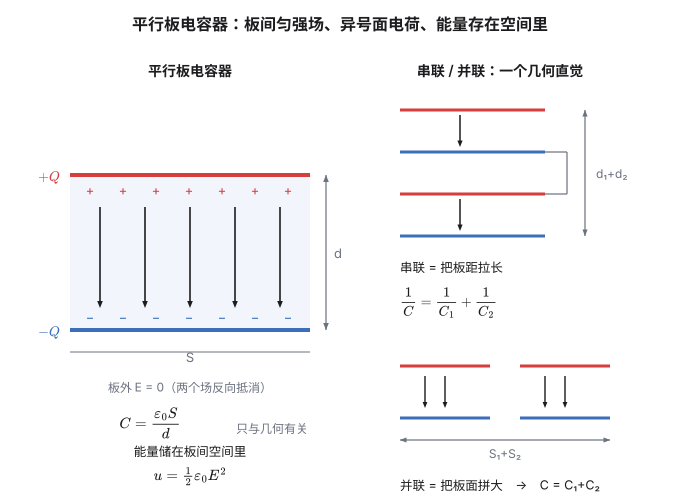
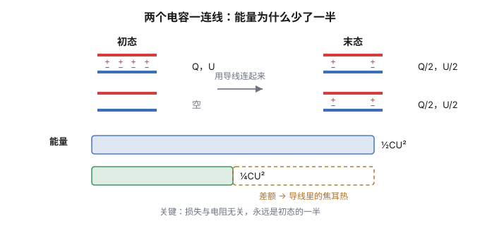

1745 年，荷兰莱顿大学的穆申布鲁克（Pieter van Musschenbroek）做了一个实验：把一根金属杆插进一个盛水的玻璃瓶，杆子连上静电起电机，他以为电荷会存进瓶子里。当他一只手托着瓶子、另一只手碰到金属杆的瞬间——

他被狠狠地电了一下。后来他给一位法国科学家写信，说"我不会为了法兰西王国再挨一次"。

这就是**莱顿瓶**。它是人类第一个能储存电荷的装置，也是电学从"摩擦起电的表演"变成"可以反复使用的工具"的转折点。有了它，电荷可以被"装起来"、搬走、在别处释放。富兰克林的风筝实验、伽伐尼的青蛙腿、一直到伏打电池，都建立在"能存电"这件事上。

这一篇讲的就是这个容器——**电容器**——以及一个更根本的问题：**被装起来的到底是什么？**

## 一、电容：又一个比值定义

把电荷 $Q$ 放到一个孤立导体上，它会有一个电势 $\varphi$（相对于无穷远）。实验发现：

$$\varphi \propto Q$$

比例系数就是这个导体的**电容**：

$$\boxed{\ C = \frac{Q}{\varphi}\ }$$

（更常用的写法是 $C = Q/U$，$U$ 是两个导体之间的电势差。）

"为什么能除"这个问题，答案和上一篇完全一样：因为 $\varphi \propto Q$。除掉之后，剩下的 $C$ 只跟导体的**几何形状**和周围的**介质**有关，与它带了多少电、电压多高无关。

但这里必须提醒一句：$\varphi \propto Q$ 是一条**实验事实**，不是定义。定义只能规定"$C$ 就是 $Q/\varphi$"，不能保证它是一个常数。只有当线性关系真的成立，$C$ 才配得上"这个导体的电容"这个说法。大多数情况下它成立得很好；但在强场、非线性介质、或者纳米尺度下，它会破。

单位是**法拉**：

$$1\ \mathrm{F} = 1\ \mathrm{C/V}$$

**法拉是个巨大的单位。** 一个大得多的参照物：整个地球作为孤立导体的电容是

$$C_\oplus = 4\pi\varepsilon_0 R_\oplus = 4\pi\times 8.854\times10^{-12}\times 6.371\times 10^6 \approx 7.1\times 10^{-4}\ \mathrm{F}$$

也就是大约 **710 微法**。整个地球才 710 微法，所以日常说的"1 法拉的电容"是超级电容的量级。普通电路里的电容通常是微法（$10^{-6}$）、纳法（$10^{-9}$）、皮法（$10^{-12}$）量级。

## 二、平行板：把 C 算出来

电容既然是几何量，就该能从几何算出来。拿最简单的模型：两块面积 $S$、间距 $d$ 的平行金属板，分别带 $+Q$ 和 $-Q$。

**第一步，求板间场强。** 用高斯定理。一块面密度为 $\sigma = Q/S$ 的无限大带电平面，两侧各产生 $E = \dfrac{\sigma}{2\varepsilon_0}$（上一篇算过）。

两块板叠加：在**板间**，两个场同向，加起来是

$$E = \frac{\sigma}{2\varepsilon_0}+\frac{\sigma}{2\varepsilon_0} = \frac{\sigma}{\varepsilon_0} = \frac{Q}{\varepsilon_0 S}$$

在**板外**，两个场反向抵消，$E=0$。

**第二步，求电压。**

$$U = Ed = \frac{Qd}{\varepsilon_0 S}$$

**第三步，除一下。**

$$\boxed{\ C = \frac{Q}{U} = \frac{\varepsilon_0 S}{d}\ }$$

看这个结果：**只有 $S$、$d$、$\varepsilon_0$，没有 $Q$，也没有 $U$。** 这正是"电容是几何量"的定量体现。

量纲自检：

$$[\varepsilon_0 S/d] = \frac{\mathrm{C^2/(N\cdot m^2)}\cdot\mathrm{m^2}}{\mathrm{m}} = \frac{\mathrm{C^2}}{\mathrm{N\cdot m}} = \frac{\mathrm{C^2}}{\mathrm{J}} = \frac{\mathrm{C}}{\mathrm{V}}\ ✓$$

> [!note] 一个诚实的补充：边缘效应
> 上面每一步都用了"无限大平面"。真实平行板是有限大的，**边缘处的场线会向外鼓出去**（就像被挤扁的磁铁那样），那里 $E$ 不等于 $\sigma/\varepsilon_0$。
>
> 所以 $C = \varepsilon_0 S/d$ 是**近似**，在 $S \gg d^2$ 时很好。想更准就得解拉普拉斯方程——这正说明上一篇那个"整个静电学就是一个方程"的说法不是修辞：**边缘效应没有公式，只能解方程。**

## 三、串并联：一个几何直觉

**并联**（两电容接同样的电压）：每个都承受 $U$，总电荷是两者之和。

$$Q = Q_1+Q_2 = C_1U+C_2U \Rightarrow \boxed{C = C_1+C_2}$$

**串联**（两电容首尾相接，中间那个"孤岛"净电荷为零）：两者电荷相同，总电压是两者之和。

$$U = U_1+U_2 = \frac{Q}{C_1}+\frac{Q}{C_2} \Rightarrow \boxed{\frac{1}{C} = \frac{1}{C_1}+\frac{1}{C_2}}$$

**注意这和电阻是反的**（电阻并联才是倒数和）。为什么反？因为定义里 $Q$ 和 $U$ 的位置对调了：电容是 $Q/U$，电阻是 $U/I$。同样的物理（叠加），因为定义的分子分母换了位置，结论就翻过来。

一个很有用的几何直觉：

- **串联 = 增大板距 $d$**（$C=\varepsilon_0S/d$，$\dfrac1C=\dfrac{d}{\varepsilon_0S}$，所以 $1/C$ 相加就是 $d$ 相加）；
- **并联 = 增大板面积 $S$**（$C$ 相加就是 $S$ 相加）。

有这两个图像，串并联公式就不用背了。

## 四、那个 ½ 是从哪冒出来的

现在算储存的能量。

**别用 $W = QU$。** 为什么不能？因为**在充电过程中 $U$ 是在变的**——一开始电压是 0，最后才是 $U$。乘 $U$ 会高估。

正确的做法是**一点一点搬**。设板上已有电荷 $q$，此时板间电压是 $u = q/C$。再搬一份 $dq$ 上去，需要做的功是

$$dW = u\,dq = \frac{q}{C}dq$$

从 0 积到 $Q$：

$$W = \int_0^Q \frac{q}{C}\,dq = \frac{1}{C}\cdot\frac{Q^2}{2} = \boxed{\ \frac{Q^2}{2C} = \frac12 CU^2 = \frac12 QU\ }$$

（后两个形式由 $Q = CU$ 代入得到。）

**所以那个 ½ 的来源是"平均"。** 电压从 0 线性涨到 $U$，**平均值是 $U/2$**，所以总功等于"总电荷乘平均电压"：

$$W = Q\cdot\frac{U}{2} = \frac12 QU$$

三个形式该用哪个？看**哪个量是固定的**：

- 电容断开电源（$Q$ 固定）：用 $\dfrac{Q^2}{2C}$；
- 电容接着电源（$U$ 固定）：用 $\dfrac12 CU^2$。

这个区别在讨论"插入介质后能量怎么变"这类问题时是决定性的。

顺便说一句：这个 ½ 不是电容器特有的。 凡是"线性响应"的储能都是这个形式：

$$\text{弹簧 } \frac12 kx^2,\qquad \text{动能 } \frac12 mv^2,\qquad \text{电感 } \frac12 LI^2,\qquad \text{电容 } \frac12 CU^2$$

它们全都来自"$\int(\text{线性量})\,d(\text{线性量})$"这个结构。**同一个 ½，同一个积分。**

## 五、能量存在哪里？

到这里有个问题值得追问：这 $\dfrac12 CU^2$ 的能量，**存在哪里**？

一个自然的回答是"存在电荷上"。但把平行板的表达式改一改，会看到一件很不一样的事：

$$W = \frac12 CU^2 = \frac12\cdot\frac{\varepsilon_0 S}{d}\cdot(Ed)^2 = \frac12\varepsilon_0 E^2\cdot\underbrace{(Sd)}_{\text{体积}}$$

$Sd$ 正是两块板之间的**空间体积**。所以

$$\boxed{\ u = \frac12\varepsilon_0 E^2\ }$$

$u$ 是**能量密度**（单位体积的能量）。

这一步的意义比它看起来大得多。它说：**能量不属于电荷，而属于场——属于空间本身。** 板间那片真空里，什么都没放，却"装"着能量。

这个观念是后面所有内容的伏笔。因为一旦能量能存在空间里，它就**不需要依附于电荷**了——它可以自己跑、自己振荡。到第五篇你会看到，光就是一个自己在真空里传播的电场和磁场，它带着 $\dfrac12\varepsilon_0E^2$ 的能量穿越宇宙，中间什么电荷都没有。

顺便，这个公式也让"为什么电容器储能很弱"一目了然：

$$u = \frac12\varepsilon_0E^2$$

空气的击穿场强约 $3\times10^6\ \mathrm{V/m}$，代进去

$$u \approx \frac12\times 8.854\times10^{-12}\times (3\times10^6)^2 \approx 40\ \mathrm{J/m^3}$$

**一立方米只装 40 焦耳。** 这就是电场储能的物理上限——不是工程水平不够，是 $\varepsilon_0$ 太小。把各种储能方式排一排，这个阶梯很说明问题：

| 储能方式 | 能量密度（$\mathrm{J/m^3}$） |
|---|---|
| 电场（空气击穿极限） | $\sim 4\times10^{1}$ |
| 普通电容器 | $10^{3}$–$10^{5}$ |
| 超级电容 | $10^{6}$–$10^{7}$ |
| 锂离子电池 | $\sim 10^{9}$ |
| 汽油 | $\sim 3\times10^{10}$ |
| 铀-235 核裂变 | $\sim 10^{18}$ |

**从电容器到核燃料，跨了 16 个数量级。** 这也解释了为什么电动车用电池而不是电容——除了充放电快慢之外，能量密度差了四个数量级。

## 六、电介质：叠加原理的边界

往平行板之间插一块绝缘体（**电介质**），电容会变大——通常变大几倍到几十倍。水的话，$\varepsilon_r \approx 80$。

为什么？

介质由分子组成。外电场会把分子里的正负电荷拉开一点（或者把本来就有极性的分子转向）——这叫**极化**。极化产生的附加场**方向与外场相反**，所以**净场被削弱**：

$$E = \frac{E_0}{\varepsilon_r}$$

于是同样的电荷 $Q$ 对应更小的电压 $U$，由 $C = Q/U$ 得到

$$C = \frac{\varepsilon_r\varepsilon_0 S}{d} = \frac{\varepsilon S}{d},\qquad \varepsilon = \varepsilon_r\varepsilon_0$$

但这里有一个结构性的变化，值得专门指出来。

在真空里，场就是各个电荷产生的场直接相加——**叠加原理**。在介质里，情况变了：

1. 外场使介质极化；
2. 极化产生附加场；
3. 附加场改变了介质内的总场；
4. 而极化程度又取决于总场……

**这是一个自洽问题**：场决定极化，极化又反过来决定场。得联立求解（实际上是一个积分方程，或者用 $\vec D$ 这个辅助量把它包装成看起来线性的形式）。

所以：**叠加原理在真空里成立，在介质里失效。** 上一篇说过"叠加原理是独立假设"，现在看到了它的第一条边界。后面还会遇到第二条（强场下的非线性光学）。

> [!warning] 关于"耐压"
> 电介质不只是增大电容，它还决定了电容器的**耐压值**。介质被击穿（变成导体）的临界场强叫**击穿场强**：空气约 $3\ \mathrm{MV/m}$，变压器油约 $10$–$20\ \mathrm{MV/m}$，云母、陶瓷更高。
>
> 所以选介质是一场权衡：$\varepsilon_r$ 大的介质往往耐压不高。电容器的规格表上"容量"和"耐压"必须同时看——这也是为什么给电容器充电时，不能只看它标了多少微法。

## 七、一个漂亮的悖论：能量少了一半

最后讲一个我很喜欢的经典问题。它简单到可以口算，但结论相当反直觉。

**设置**：两个完全相同的电容器 $C$。第一个带了电荷 $Q$（电压 $U = Q/C$），第二个完全不带电。现在用一根导线把它们连起来。

**电荷守恒**：总电荷 $Q$ 平分到两个电容上，每个 $Q/2$，于是每个的电压变成 $U/2$。

**算能量**：

$$\text{初态：}\ W_i = \frac{Q^2}{2C}$$

$$\text{末态：}\ W_f = 2\times\frac{(Q/2)^2}{2C} = 2\times\frac{Q^2}{8C} = \frac{Q^2}{4C}$$

**末态能量恰好是初态的一半。另一半去哪了？**

答案是：**在导线里变成了焦耳热。**

但这里有一个陷阱需要小心——很多人会想："那把导线电阻弄得越小，损失不就越小了吗？" 答案是不会，而且理由很漂亮。

设导线电阻为 $R$。两个电容串联后的等效电容是 $C/2$，初始电压差为 $U$，所以放电电流按

$$I(t) = \frac{U}{R}\,e^{-2t/RC}$$

衰减。电阻上耗散的能量是

$$W_R = \int_0^\infty I^2R\,dt = \int_0^\infty \frac{U^2}{R}e^{-4t/RC}dt = \frac{U^2}{R}\cdot\frac{RC}{4} = \frac14 CU^2$$

**$R$ 消掉了。** 而 $\dfrac14 CU^2$ 恰好是初态能量 $\dfrac12 CU^2$ 的一半——**损失与电阻无关，永远是一半。**

**换句话说：只要你"直接连起来"，损失就一定是恰好一半，跑不掉。** 想不损失，只能换一种搬运方式——用电感（电流缓慢建立，能量在 $L$ 和 $C$ 之间来回振荡，而不是在电阻上烧掉），或者用恒流源缓慢充电。

> [!tip] 一个更一般的结论
> 用一个固定电压 $V$ 的电源给一个不带电的电容充电，**无论串联多大电阻**：
>
> - 电源做的功：$W_{\text{源}} = QV = CV^2$；
> - 电容存下的能量：$\dfrac12 CV^2$；
> - 电阻烧掉的：$\dfrac12 CV^2$。
>
> **效率永远是 50%。** 这个结论第一次遇到时很别扭，但它是对的——因为"电压从 0 涨到 V"这件事本身要求有一个非零的电势差在推电荷，而有电势差就有耗散。**想突破 50%，就不能用恒压源，得用"可逆"的方式（恒流、或者 LC 振荡）。**

## 相关阅读

- 上一篇：[《电与磁漫谈（二）：场与势》](post.html?id=field-and-potential)——高斯定理、带电球壳，以及 $E=-\nabla\varphi$。
- 下一篇：[《电与磁漫谈（四）：运动的侧脸》](post.html?id=magnetism)——磁从哪来，为什么它总"侧着"作用，以及回旋加速器怎么工作。
- [Capacitor](https://en.wikipedia.org/wiki/Capacitor)（Wikipedia）：包括各种实际电容的构造与介质选择。

> [!detail] 技术细节：数值自检
> **1. 地球的电容。** $C = 4\pi\varepsilon_0 R_\oplus = 4\pi\times8.8541878128\times10^{-12}\times6.371\times10^6$。先算 $4\pi\varepsilon_0 = 1.11265\times10^{-10}$，乘 $6.371\times10^6$ 得 $7.089\times10^{-4}\ \mathrm{F} \approx 709\ \mu\mathrm{F}$ ✓。（顺带：地表大气电场约 $120\ \mathrm{V/m}$，由高斯定理反推地球表面的净负电荷 $Q = \varepsilon_0E\cdot4\pi R_\oplus^2 \approx 8.854\times10^{-12}\times120\times5.10\times10^{14} \approx -5\times10^5\ \mathrm{C}$；除以电容得地表电势约 $-7\times10^8\ \mathrm{V}$。）
>
> **2. 一个具体电容。** $S = 1\ \mathrm{cm^2} = 10^{-4}\ \mathrm{m^2}$、$d = 1\ \mathrm{mm} = 10^{-3}\ \mathrm{m}$、空气：$C = 8.854\times10^{-12}\times10^{-4}/10^{-3} = 8.854\times10^{-13}\ \mathrm{F} \approx 0.89\ \mathrm{pF}$。**所以"1 法拉"确实是个巨大的单位**——要做 1 F 的平行板电容，需要 $S/d \approx 1.13\times10^{11}\ \mathrm{m}$。
>
> **3. 击穿极限下的能量密度。** $u = \frac12\varepsilon_0E^2 = 0.5\times8.854\times10^{-12}\times(3\times10^6)^2 = 0.5\times8.854\times10^{-12}\times9\times10^{12} = 39.8\ \mathrm{J/m^3}$ ✓。
>
> **4. 表格里那些数的来源。** 汽油按 $34.2\ \mathrm{MJ/L}$ 换算：$34.2\times10^6\ \mathrm{J}/10^{-3}\mathrm{m^3} = 3.42\times10^{10}\ \mathrm{J/m^3}$。锂离子电池按 $500\ \mathrm{Wh/L}$：$500\times3600/10^{-3} = 1.8\times10^{9}\ \mathrm{J/m^3}$。铀-235 按 $8.2\times10^{13}\ \mathrm{J/kg}$、密度 $1.9\times10^4\ \mathrm{kg/m^3}$：$1.6\times10^{18}\ \mathrm{J/m^3}$。**注意这是"理论释能"，不是"实际可得"。**
>
> **5. RC 耗散的完整积分。** 设 $t$ 时刻转移电荷为 $x(t)$，则两电容电压分别为 $\dfrac{Q-x}{C}$、$\dfrac{x}{C}$，导线电压降为 $\dfrac{Q-2x}{C} = RI$，且 $I = dx/dt$。解得 $x(t) = \dfrac Q2(1-e^{-2t/RC})$，$I(t) = \dfrac{Q}{RC}e^{-2t/RC}$。于是 $W_R = \int I^2R\,dt = \dfrac{Q^2}{RC^2}\cdot\dfrac{RC}{4} = \dfrac{Q^2}{4C} = \dfrac14 CU^2$ ✓（用了 $Q = CU$）。**注意它是初态能量 $\dfrac12CU^2$ 的一半——这正是"损失恰好一半"的定量版本；$R$ 确实消掉了。**
>
> **6. 恒压源充电的效率。** 电源做功 $W_{\text{源}} = \int V\,dq = V\cdot Q = CV^2$；电容储能 $\dfrac12CV^2$；差额 $\dfrac12CV^2$ 全部耗散在回路电阻上，与 $R$ 无关（同上积分）。**这是"用恒压源充电效率上限 50%"的严格版本。** 注意这个 50% 与上一条的"损失一半"是两个不同的问题：上一条是**电荷守恒约束下两电容均分**（末态只剩初态的一半），这一条是**电源做功有一半变成热**。
>
> **7. 串联的"电荷相同"为什么成立。** 两个电容串联时，中间那两片极板（通过导线相连）构成一个孤立导体。初始净电荷为零，所以充电过程中这两片上的电荷始终为 $+Q$ 和 $-Q$，于是两个电容各自带的电荷量都等于 $Q$ ✓。**这一步依赖"中间部分与外界绝缘"，若中间有接地点就不成立。**
