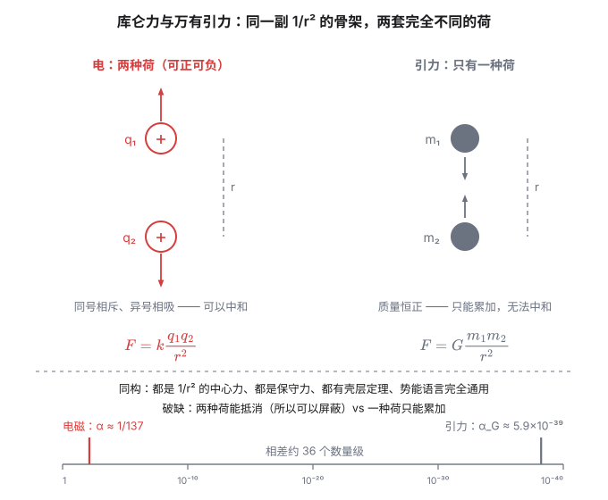

两千多年前，古希腊人发现用毛皮摩擦过的琥珀能把干草屑吸起来。这个现象被记了下来，然后被搁置了两千年——因为在很长一段时间里，它只是"琥珀的一个怪癖"，连个正经名字都没有。直到 1600 年，伊丽莎白一世的御医吉尔伯特（William Gilbert）认真研究了这件事，给它起了个名字：*electricus*，来自希腊语的"琥珀"（ἤλεκτρον）。

这个词后来变成了 electricity。而吉尔伯特本人更感兴趣的是磁——他用磁石做了大量实验，写下《论磁》，被认为是实验物理的开端。

一个有趣的细节：吉尔伯特区分了"电"和"磁"，认为它们是两种完全不同的东西。他错了，但错得很有道理——在 1600 年，看不出这两者有任何关系的理由。这个"看起来毫无关系"，要等两百多年才被推翻。

## 一、两种电荷，以及一个被反复重新发明的结论

1733 年，法国人杜菲（du Fay）发现摩擦过的玻璃和摩擦过的树脂，彼此吸引；但两块摩擦过的玻璃，彼此排斥。他于是提出"两种电"：玻璃电和树脂电。

1747 年，富兰克林把这两个名字改成了我们熟悉的版本：**正电**和**负电**。他还提出电荷是守恒的——摩擦只是把电荷搬来搬去，不是凭空造出来。

这里有一个值得停一下的问题：**为什么恰好是两种？**

如果是三种、四种电荷，物理也照样能写下去。事实上，这个"恰好两种"直到 1930 年代才被理解：电荷是"守恒量"，而在自然界的所有守恒量里，它只以 $\pm 1$ 两种形式出现。为什么？目前没有人知道完整的答案。有一个很漂亮的思路来自狄拉克（1931）：**如果宇宙中存在磁单极子，那么电荷就必然是被量子化的**。反之，如果电荷真的是量子化的，可能也在暗示磁单极的存在。这个论证很干净，可惜至今没人找到过一个磁单极。

## 二、库仑：一条律，两种命运

1785 年，库仑（Charles-Augustin de Coulomb）用自制的扭秤测量了两个带电小球之间的力，得到了那条著名的平方反比律：

$$\vec F_{12} = k\,\frac{q_1 q_2}{r^2}\,\hat r_{12}$$

$\hat r_{12}$ 是从 1 指向 2 的单位矢量；$q_1q_2>0$ 时力沿 $\hat r_{12}$（排斥），$q_1q_2<0$ 时反向（吸引）。

有一个常被略过的细节：**这条律其实早于库仑 12 年就被普利斯特利（Joseph Priestley）猜到了**。1767 年，普利斯特利注意到富兰克林的一个实验现象——把一个带电的软木球放进带电金属杯内部，球上竟然测不到力。普利斯特利想起牛顿证明过的一个结论：均匀球壳内部引力为零。既然"内部无作用"在引力里等价于平方反比，那么在电里也应该一样。

**这是一次纯粹的类比推理，而且它对了。** 后来卡文迪什（Henry Cavendish）在 1773 年也独立得到了平方反比，并做了实验验证——但他没发表，这些手稿直到一百年后才被麦克斯韦整理出来。

顺便说句公道话：库仑的原始数据谈不上精密，后世研究者对他的记录也有过争议。但这件事无关紧要——**真正把平方反比钉死的是两百年后的实验**。现代做法是假设力律为 $F\propto r^{-(2+\delta)}$，然后去测 $\delta$ 有多小。1971 年 Williams 等人用改良的扭秤给出

$$|\delta| < 2.7\times 10^{-16}$$

这意味着一件事：**如果库仑力是靠交换某个极轻的粒子来传递的，那这个粒子的质量必须小于约 $10^{-14}\,\mathrm{eV}/c^2$——比电子还轻近 20 个数量级。** 平方反比不是"大致成立"，它精确得令人不安。

## 三、电荷的算术规则

在往下走之前，把电荷这个量的"算术"整理一下——因为后面所有内容都建立在这几条上。

**其一，电荷是量子化的。** 任何带电体的电荷都是基本电荷 $e$ 的整数倍：

$$q = ne,\qquad e = 1.602176634\times 10^{-19}\ \mathrm{C}$$

（2019 年国际单位制改革后，$e$ 是**定义值**，精确等于这个数，不再有误差棒。反过来，库仑这个单位变成了由 $e$ 定义出来的。）

$1\ \mathrm{C}$ 有多大？$1/1.602\times10^{-19} \approx 6.24\times 10^{18}$，也就是六百多亿亿个电子。**库仑是个巨大的单位**——我们日常遇到的静电，电荷量通常是纳库仑甚至皮库仑量级。这一点在后面算力的时候会很直观。

**其二，电荷守恒。** 任何孤立系统（更一般地：任何过程）中总电荷不变。这条律在一切已知相互作用中成立，包括粒子物理里那些最疯狂的反应。

**其三，电荷是洛伦兹不变量。** 一个电子不管跑得多快，它的电荷量始终是 $-e$，不随速度变化。这一点很特别——质量会随速度变（狭义相对论），电荷不会。它甚至能反过来用：如果电荷会变，原子的电中性早就破了，而实验告诉我们，原子中正负电荷的匹配精度好于 $10^{-21}$。

**其四，叠加。** 多个电荷对某点的作用，等于各自单独作用的矢量和。**注意：这条不能从库仑定律推出来。** 库仑定律只描述"两个电荷之间"，而叠加原理是一个**独立的实验事实**。整个静电学之所以能解，全靠这条。

## 四、量纲里的秘密：k 和 ε₀ 是谁？

现在进入这篇的正题。

把库仑定律拿出来做量纲分析。已知 $[F] = MLT^{-2}$，$[r^2]=L^2$，那么

$$[k] = \frac{[F][r^2]}{[q]^2} = \frac{ML^3T^{-2}}{[q]^2}$$

请注意这个结果的样子：**$k$ 的量纲里带着 $[q]^{-2}$。** 这句话的意思是——$k$ 的量纲取决于你怎么定义电荷。换句话说，$k$ 的数值和量纲都不是物理，**它们是你选的那套记账方式**。

在 SI 里，我们走了一条"绕路"：先定电流的单位安培（2019 年后由 $e$ 定义），再由 $1\ \mathrm{C} = 1\ \mathrm{A\cdot s}$ 定义电荷。于是电荷成了一个独立的量纲 $Q$，$k$ 就只能被迫成为一个有量纲的常数。为了后面的公式少写 $4\pi$，人们把它写成

$$k = \frac{1}{4\pi\varepsilon_0},\qquad \varepsilon_0 = 8.8541878128(13)\times 10^{-12}\ \mathrm{F/m}$$

$\varepsilon_0$ 叫**真空介电常数**。它的出现没什么神秘的：只是 $1/4\pi$ 被吸收进去之后剩下的那个数。

> [!note] 2019 年之后的一个小变化
> 在旧 SI 里，$\mu_0 = 4\pi\times 10^{-7}\ \mathrm{H/m}$ 是**定义值**（因为安培的定义就是"两根平行导线之间力的值"），而 $\varepsilon_0$ 由 $c^2 = 1/(\mu_0\varepsilon_0)$ 精确给出。
>
> 2019 年 SI 重定义后，$e$、$h$、$c$、$k_B$ 成了定义值，安培改由 $e$ 定义。结果是**反过来**了：$\mu_0$ 和 $\varepsilon_0$ 都变成了实验测量量，各自带上不确定度（括号里的 $(13)$ 就是它）。这是"哪个常数是精确的"这个问题被重新洗了一次牌。

### 那个 1/4π 是从哪来的

这个 $4\pi$ 值得单独说，因为它是**几何**，不是物理。

设想一个点电荷在原点，看它的"力场"向外摊开。在半径 $r$ 处，同样多的"东西"被摊在整个球面上，而球面积是 $4\pi r^2$。所以强度按 $1/r^2$ 衰减——**平方反比律本质上是"三维空间里球面积正比于 $r^2$"这一条几何事实**。

顺手就能推广：**如果空间是 $n$ 维的，力律会是 $1/r^{\,n-1}$。** 因为在 $n$ 维空间里，"半径 $r$ 的球面"面积正比于 $r^{n-1}$。这个结论不依赖任何动力学，纯粹是"东西要摊开"。

再往下走一步：把所有球面上的场加起来（也就是**通量**），得到的是 $4\pi k q = q/\varepsilon_0$——**与 $r$ 无关**。这正是高斯定理 $\oint\vec E\cdot d\vec A = Q_{\text{内}}/\varepsilon_0$ 的内容，$4\pi$ 被 $\varepsilon_0$ 吃掉了。所以那个 $4\pi$ 不是被"消掉"了，它一直都在，只是藏进了常数里。（之二会专门讲高斯定理。）

### 换一套记账方式：高斯单位制

既然 $k$ 的量纲由电荷的定义决定，那我们完全可以**反过来定义电荷**，让 $k$ 变成一个无量纲的 1。这就是高斯单位制（CGS-esu）的做法：

$$F = \frac{q_1q_2}{r^2}\quad(\text{力用 dyn，长度用 cm})$$

现在 $[q^2] = [F r^2] = ML^3T^{-2}$，于是

$$[q] = M^{1/2}L^{3/2}T^{-1}$$

**电荷的量纲变成了"质量平方根乘长度二分之三次方除以时间"**——听起来荒谬，但它完全自洽。代价是：力律里再没有常数，可只要一换成 SI 单位，就得乘一个换算因子。

这个因子是多少？两个 1 statC 的电荷相距 1 cm，斥力是 1 dyn $=10^{-5}\ \mathrm{N}$。代回 SI 的库仑定律反解电荷：

$$q = r\sqrt{\frac{F}{k}} = 0.01\times\sqrt{\frac{10^{-5}}{8.988\times 10^9}} \approx 3.336\times 10^{-10}\ \mathrm{C}$$

所以 $1\ \mathrm{C} \approx 2.998\times 10^{9}\ \mathrm{statC}$。注意这个数——$2.998\times 10^9$ 差不多就是光速（以 cm/s 计）除以 10。

**这不是巧合。** SI 和高斯单位制之间的换算因子本质上就是 $c$：两套单位制真正的区别在于"把 $c$ 藏在哪里"。SI 把 $c$ 藏进了 $\varepsilon_0$（通过 $c^2=1/\mu_0\varepsilon_0$），高斯制让它显式地出现在麦克斯韦方程组里。这也是为什么理论物理的书偏爱高斯制——公式短，物理露在外面。

### 什么是物理，什么只是记账

到这里可以给一个判断标准了。

$k = 8.988\times 10^9\ \mathrm{N\cdot m^2/C^2}$ 这个数**不是物理**。它没有告诉我们任何关于世界的信息，它只是"我们选了库仑和米"的结果。换一套单位，它就变成 1，或者变成别的什么。

但下面这个组合是物理：

$$\alpha = \frac{k e^2}{\hbar c} = \frac{e^2}{4\pi\varepsilon_0\hbar c} \approx \frac{1}{137.035999084}$$

这叫**精细结构常数**。它无量纲——不管你用 SI、高斯制还是任何别的单位，算出来都是 $1/137$。它才是真正在描述"电磁相互作用有多强"的那个数。

> [!tip] 一条好用的判据
> 看到一个常数，先问：**它无量纲吗？**
>
> - 有量纲的常数（$k$、$G$、$\varepsilon_0$）——数值依赖单位制，**信息量为零**，别去记它的数，记住它怎么来的就行；
> - 无量纲的组合（$\alpha \approx 1/137$、$m_p/m_e \approx 1836$）——这些是宇宙的"参数"，才是物理。
>
> 这条判据在量纲分析里叫白金汉 π 定理：**$n$ 个物理量、$m$ 个基本量纲，就只剩 $n-m$ 个独立的无量纲组合。** 库仑定律里的 $F,q_1,q_2,r,k$ 五个量，量纲只有三个（$M,L,T$），所以只有两个独立的无量纲组合——其中一个就是 $\alpha$ 的骨架。

## 五、能不能类比重力？能到哪一步？

这是这一篇最想聊的问题。把两条律并排放：

$$F_{\text{电}} = k\frac{q_1q_2}{r^2},\qquad F_{\text{引}} = G\frac{m_1m_2}{r^2}$$

**长得一模一样。** 历史上这个相似性给了物理学家极大的信心，也确实带出了不少正确结论。但类比的边界在哪？值得逐条拆。

### 类比成立的部分

**其一，数学结构完全同构。** 都是平方反比、中心力、保守力。所以：

- 两者都能定义势（电势、引力势），势能语言一字不改地搬过来；
- 两者都满足高斯定理（引力版：$\oint \vec g\cdot d\vec A = -4\pi G M_{\text{内}}$）；
- 引力里的**壳层定理**（均匀球壳内部场为零、球壳外等效于质点）在电里原样成立——这正是之二要讲的带电球壳。事实上，普利斯特利就是靠这个类比猜出库仑定律的。

**其二，历史路径也相似。** 牛顿的引力是"超距作用"被接受的开端；库仑定律则把这个框架搬到了电上。两者的"场"观念也是同步进化的。

### 类比破缺的部分

但下面这些差异，一条比一条深刻。

**第一，荷的数目：两种 vs 一种。**

引力只有吸引（因为质量恒正），电有正有负。这一个差别带来了**屏蔽**的可能性。

为什么屏蔽这么重要？因为引力是"累加"的：地球里面每一块石头都在拉你，你没法让它们互相抵消。但电可以——正负电荷一混，外部场就没了。**静电屏蔽、导体内部场强为零、化学键的饱和性、乃至"物质能存在"这件事，全都建立在"两种电荷可以抵消"上。**

顺手推一个极端结论：如果引力也有负质量，那宇宙会是另一个样子——而且等效原理会立刻崩掉。**"引力只有吸引"不是偶然，它和"引力即几何"是同一件事的两面。**

**第二，强度：差了 36 个数量级。**

拿质子来比。电磁的耦合强度是 $\alpha \approx 1/137$；引力的对应量是

$$\alpha_G = \frac{Gm_p^2}{\hbar c} \approx 5.9\times 10^{-39}$$

比 $\alpha$ 小约 $10^{36}$ 倍。

这个差距有多离谱？算个具体的：两个 $1\ \mathrm{C}$ 的点电荷相距 $1\ \mathrm{m}$，斥力是

$$F = k\frac{1\times 1}{1^2} \approx 9.0\times 10^{9}\ \mathrm{N}$$

换算成重量，约 **92 万吨**。也就是说，如果你手上真能攒出 1 库仑的净电荷，你和一米外同样带电的那个人之间的斥力，相当于两艘大型航母压在彼此身上。

反过来说：**你之所以能安然站在地球上而没被地球的引力压垮，恰恰是因为引力弱得可怜。** 一根头发丝上攒下 1 纳库仑的电荷，它产生的电场就和整个地球的引力场同量级——这不是比喻，是可以算出来的（见文末自检第 4 条）。

**第三，介质：电有，引力没有。**

电可以在介质里被削弱（极化、$\varepsilon_r$），引力不行。为什么不行？因为引力质量和惯性质量相等（等效原理），你找不到一种"屏蔽引力质量但不屏蔽惯性质量"的材料。**这也是引力必须是几何理论的原因**——没有任何东西能"挡住"它，它就只能被理解为时空本身的弯曲。

**第四，动态行为：这是最本质的一条。**

静止的电荷之间有库仑力。但电荷一旦动起来，就会多出别的东西——**磁力**。两个平行电流之间有力，而两个平行运动的质点之间没有对应的"引力磁力"。

这条差异是整个系列的主线：**电磁是一体的**（之二到之五会一步步把"电"和"磁"缝成同一个东西），而引力在这一点上完全是另一个故事。吉尔伯特在 1600 年认为电和磁毫无关系——他之所以这么想，是因为他没见过运动的电荷。

**第五，一个至今没有答案的问题：为什么 $q$ 和 $m$ 无关？**

引力有一个奇迹般的性质：$F = ma$ 里的 $m$ 和 $F = Gm_1m_2/r^2$ 里的 $m$ 是同一个东西。这叫等效原理，是广义相对论的起点。

电没有对应的东西。电荷 $q$ 和质量 $m$ 是两个完全独立的量——电子和质子电荷一样、质量差 1836 倍。**为什么？没有人知道。** 我们只知道它们无关，并把这件事当成基本事实写进理论。

### 类比的收尾：如果只有引力

最后说一个我觉得挺震撼的推论。

引力只有吸引，所以宇宙中任何一团物质都在往一起塌。要撑住它，只能靠别的东西——压强、角动量、以及**电磁力**。

而电磁力之所以能"撑"，恰恰因为它有两种荷。正负电荷一中和，物质变成电中性；但一旦被拉开一点，就产生了往回拉的力——这就是**化学键、固体、以及"物体有确定大小"的来源**。你身体里每一个原子的尺寸，都是电磁力和量子力学谈判的结果，跟引力毫无关系。

**换句话说：引力决定了星系和恒星的结构，但决定"你会不会穿过地板"的是电。** 宇宙里最弱的力，管着最大的东西；第二强的力，管着最小的东西。

## 六、写在后面：这一篇埋了哪些线

回看一下，这一篇其实只做了一件事：**把电荷当成一个可以"算"的量，把它的算术规则和单位制约定分清楚。**

但有三个地方，我故意留了尾巴：

1. **"静止"这个前提。** 库仑定律只对静止电荷成立。一旦电荷运动，就冒出磁力——这是之四的主题。
2. **叠加原理是独立假设。** 它让一切线性，是整个静电学可解的原因。但它的边界在哪？在介质里、在强场下会失效——这是之三的伏笔。
3. **那个 $1/r^2$ 和 $4\pi$。** 它来自三维空间的球面积。把这层几何写清楚，就得到了高斯定理——这是之二的开场。

下一篇我们处理一个更根本的问题：**"场"到底是什么？** 以及一个看上去很朴素、其实需要小心对待的操作——**为什么可以把力除以电荷？**

## 相关阅读

- 下一篇：[《电与磁漫谈（二）：场与势》](post.html?id=field-and-potential)——从 $E=F/q$ 的合法性讲起，到 $E=-\nabla\varphi$ 为什么必须带负号，再到高斯定理与带电球壳。
- [Coulomb's law](https://en.wikipedia.org/wiki/Coulomb%27s_law)（Wikipedia）：包括历史上各种验证平方反比的实验方法。
- [Fine-structure constant](https://en.wikipedia.org/wiki/Fine-structure_constant)（Wikipedia）：$\alpha$ 的测量史与它在量子电动力学中的地位。

> [!detail] 技术细节：数值自检
> **1. 基本电荷与库仑的关系。** $e = 1.602176634\times10^{-19}\ \mathrm{C}$（精确值）。$1\ \mathrm{C}$ 对应 $1/e \approx 6.241509074\times 10^{18}$ 个基本电荷。
>
> **2. $k$ 与 $\varepsilon_0$。** $\varepsilon_0 = 8.8541878128(13)\times10^{-12}\ \mathrm{F/m}$，$k = 1/(4\pi\varepsilon_0) = 8.9875517923(14)\times 10^{9}\ \mathrm{N\cdot m^2/C^2}$。用 $c^2 = 1/(\mu_0\varepsilon_0)$ 可以反查 $\mu_0 = 1.25663706212(19)\times10^{-6}\ \mathrm{H/m}$——注意它已经不精确等于 $4\pi\times10^{-7}$ 了。
>
> **3. 两个 1 C 电荷相距 1 m。** $F = 8.9876\times10^9\ \mathrm{N}$；等效重量 $F/g = 8.9876\times10^9/9.80665 \approx 9.16\times10^{8}\ \mathrm{kg}$，约 92 万吨。
>
> **4. 头发丝 vs 地球。** 一根头发丝的直径约 $70\ \mu\mathrm{m}$。若让它带上 $q$，在距离 $d$ 处产生的场强 $E = kq/d^2$。取 $d = 1\ \mathrm{m}$、要求 $E$ 与地球表面引力场 $g = 9.8\ \mathrm{N/kg}$ 相当：$q = gd^2/k = 9.8/8.9876\times10^9 \approx 1.09\times10^{-9}\ \mathrm{C}$，即约 1 纳库仑。**纳库仑量级的电荷，其电场强度就与整个地球的引力场同量级。**
>
> **5. 高斯单位制的换算。** 由 $1\ \mathrm{statC}$ 定义（相距 1 cm 时斥力 1 dyn）反解：$q = r\sqrt{F/k} = 0.01\times\sqrt{10^{-5}/8.9876\times10^{9}} = 3.3356\times10^{-10}\ \mathrm{C}$。故 $1\ \mathrm{C} = 2.9979\times10^{9}\ \mathrm{statC}$，而 $c = 2.9979\times10^{10}\ \mathrm{cm/s}$——比值恰为 $c/10$。$e = 4.8032\times10^{-10}\ \mathrm{statC}$（esu）即由此而来。
>
> **6. $\alpha$ 的算法。** $\alpha = k e^2/(\hbar c) = 8.9876\times10^{9}\times(1.6022\times10^{-19})^2/(1.0546\times10^{-34}\times 2.9979\times10^{8}) \approx 2.307\times10^{-28}/3.1615\times10^{-26} \approx 7.297\times10^{-3}$，倒数 $137.036$ ✓。
>
> **7. 引力的耦合强度。** $\alpha_G = Gm_p^2/(\hbar c)$：$G = 6.67430(15)\times10^{-11}$，$m_p = 1.67262192\times10^{-27}\ \mathrm{kg}$，得 $Gm_p^2 \approx 1.867\times10^{-64}$，除以 $\hbar c \approx 3.1615\times10^{-26}$，得 $5.906\times10^{-39}$。与 $\alpha$ 之比约 $1.23\times10^{36}$ ✓。
>
> **8. 关于 $\delta$ 的实验界。** 1971 年 Williams、Faller、Hill 用改良扭秤与"带电球壳内外场差"法给出 $|\delta| < 2.7\times10^{-16}$；后续用不同原理（如光泵、微波腔）的实验把界压得更紧，但量级仍在 $10^{-16}$ 附近。把 $\delta$ 解释为"传递相互作用的粒子有质量"时，对应的质量上限约 $10^{-14}\ \mathrm{eV}/c^2$。
