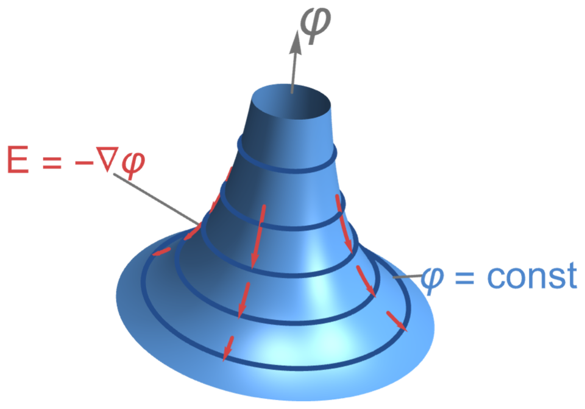
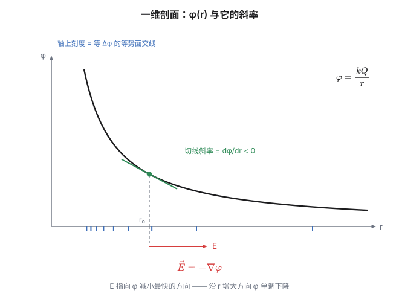
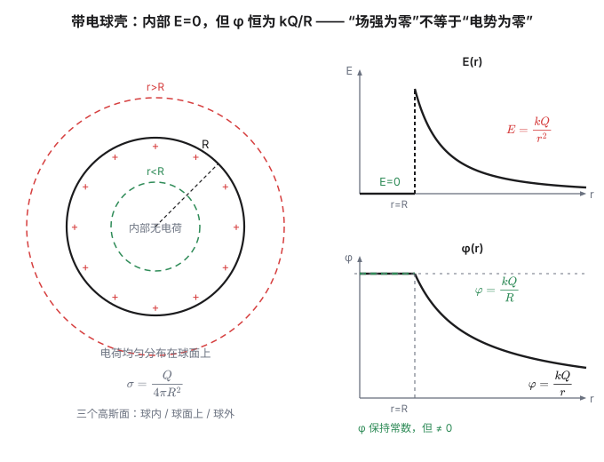

牛顿的引力定律里有一个让人不安的地方：太阳和地球之间隔着 1.5 亿公里真空，凭什么"知道"对方在哪？

牛顿自己也不安。他在给本特利的信里写过，让引力"隔空作用"而不经由任何中介，在他看来是"荒谬到我不相信任何有哲学思考能力的人会接受"。但他在《原理》里还是把这条律写下来了——因为它管用。

这个不安悬置了将近两百年。直到法拉第做电磁实验的时候，他发现了一件很有画面感的事：把铁屑撒在磁铁周围，铁屑会自动排成一条条线。法拉第把这些线叫**力线**（lines of force），并且坚持认为它们是**真实的物理对象**——场是"充满空间的某种张力状态"，电荷之间的作用是通过它一层层传过去的。

同时代的数学家（包括麦克斯韦）最初觉得这个想法太物理、太不严格。但麦克斯韦后来正是用"力线"的图像写出了方程组。**今天我们认为场是真的**：它会携带能量、携带动量，会以有限速度传播，会自己振动成波。你手机收到的信号，就是一个脱离任何电荷而独立存在的场。

这一篇就来讲：**场是怎么被"定义"出来的，以及为什么它的两个描述（力的语言、能量的语言）之间隔着一个梯度。**

## 一、为什么可以除以 q

先把最朴素的问题问清楚。

$$\vec E = \frac{\vec F}{q}$$

这个式子凭什么成立？"除以电荷"在这里到底是什么意思？

要回答这个，得先承认一件事：**在库仑定律里，力是和电荷成正比的。**

$$\vec F = k\frac{Qq}{r^2}\hat r = q\cdot\underbrace{\left(k\frac{Q}{r^2}\hat r\right)}_{\text{与 }q\text{ 无关}}$$

$Q$ 是"源"，$q$ 是"试探电荷"。把 $q$ 提出来之后，括号里那坨东西**只跟源和位置有关，跟你放进去的试探电荷无关**。于是它可以被赋予一个名字，叫"该点的电场强度"。

所以 $E=F/q$ 的合法性，来自三条前提：

1. **线性性**：$\vec F \propto q$。力必须严格正比于试探电荷，否则"$F/q$"就不是"场的性质"，而是"这对电荷的性质"。这条来自库仑定律的形式。
2. **$q$ 必须足够小**：严格地写应该是 $\vec E = \lim\limits_{q\to 0}\dfrac{\vec F}{q}$。因为真实的试探电荷会**扰动原来的电荷分布**——它会把导体上的电荷吸过来、把介质极化。要让"场"是一个与试探无关的客观量，就得让试探电荷小到不改变场。
3. **方向**：$q>0$ 时 $\vec F$ 与 $\vec E$ 同向，$q<0$ 时反向。所以 $\vec E$ 的方向定义为**正电荷受力的方向**。

> [!tip] 这是一个可以到处套用的模式
> 凡是"力正比于某个属性"的地方，都能这样"除"出一个场：
>
> - $\vec g = \dfrac{\vec F}{m}$ ——重力场（单位质量受的重力）；
> - $\vec E = \dfrac{\vec F}{q}$ ——电场；
> - $\vec a = \dfrac{\vec F}{m}$ ——加速度（某种意义上也是）。
>
> **所以"场"不是什么神秘的实体，它是一个记账方式的产物：把"源"和"被作用的东西"分开，把后者除掉。** 剩下的那部分，就是"空间每一点上的一份说明书"——告诉你"如果在这里放个东西，会发生什么"。

这个"除法"的意义值得再强调一次：**它把"依赖两个物体的量"变成了"只依赖一个物体和一个位置的量"。** 这是物理学里最常见的降维手法——把"相互作用"重写成"场 + 局部的响应"。

## 二、叠加：线性系统是怎么来的

现在场定义好了。接下来最关键的实验事实是：

$$\vec E_{\text{总}} = \vec E_1 + \vec E_2 + \cdots$$

**叠加原理。** 注意：**这条不能从库仑定律推出来**（库仑定律只管两个电荷之间），它是一个独立的实验输入。而它带来的后果是决定性的——**静电场是一个线性系统**。

先只看**离散的**情形：空间里有 $N$ 个点电荷，某一点的场就是这 $N$ 个矢量加起来：

$$\vec E_{\text{总}} = \sum_{i=1}^{N}\frac{k\,q_i}{r_i^2}\,\hat r_i$$

这就是高中物理里一直在做的事——几个电荷，几个矢量相加。

**但电荷常常是连续分布的**（一根带电的细棒、一个带电的球面），没法一个个数。这时怎么办？**把它切成很多很多小块。** 每一小块小到可以看成一个点电荷，贡献一份小小的场 $\Delta\vec E_i = \dfrac{k\,\Delta q_i}{r_i^2}\hat r_i$；把所有小块的贡献加起来：

$$\vec E = \lim_{\Delta q\to 0}\sum_i\frac{k\,\Delta q_i}{r_i^2}\,\hat r_i \;\equiv\; \int\frac{k\,dq}{r^2}\,\hat r$$

**右边那个拉长成 $\int$ 的符号，读作"求和的极限"。** 它不是什么新东西——就是把上面的求和 $\sum$ 推到"无限细"的极限。所以看到积分号不用慌：**它只是在说"把无穷多个无穷小的贡献加起来"。**（这个积分是矢量积分，通常要先把 $\hat r$ 拆成分量再积。麻烦——这也是后面要换"标量语言"的原因之一。）

线性还意味着：一切解都能"加起来"。这就是为什么静电学可解——线性系统有完整的数学工具（叠加、格林函数、分离变量）。

**顺便看一个例子：电偶极子。**

一对 $\pm q$、相距 $d$。远处的场是什么？正负电荷的场几乎完全抵消，只剩"残差"。算出来的结果是

$$E \sim \frac{kp}{r^3},\qquad p = qd$$

**衰减从 $1/r^2$ 变成了 $1/r^3$。** 快了一个幂次。这不是巧合——两个等量异号的源，它们的一阶效应（$1/r^2$）互相抵消，只剩下更高阶的残余。**"中性"的物体在远处不产生场，但近处有；而且衰减快了一个幂次。** 这个规律在物理里反复出现（多极展开）。

顺便，电偶极子还藏着一个反直觉的结论：在偶极子的中垂线上，$\varphi = 0$（到两个电荷等距），但 $\vec E \neq 0$。**电势为零的地方，场强不一定为零。** 记住这句话，第四节还要用它的镜像版本。

## 三、电势：把矢量降成标量

力的语言很直白，但很琐碎——矢量积分要投影、要判断方向。

于是人们换了另一套语言。

因为库仑力是**中心力，且大小只依赖距离**（平方反比当然满足这一条），它必然是**保守力**：做功只与始末位置有关，与路径无关。写成积分形式就是**环路定理**：

$$\oint \vec E\cdot d\vec l = 0$$

（这条式子的物理：你带着电荷在静电场里走一圈回到原点，净功为零。）

既然是保守力，就能定义势能。而势能有个好用的等价说法：

$$\varphi = \frac{E_p}{q}$$

这叫**电势**。它的物理意义很直白：**把单位正电荷从无穷远（规定为零点）搬到 $a$ 点，外力要做的功**。写成式子，就是一路上力的累积——把整条路径切成一小段一小段 $d\vec l$，每一段电场做的微功是 $-\vec E\cdot d\vec l$，加起来：

$$\varphi(a) = -\int_{\infty}^{a}\vec E\cdot d\vec l$$

**这又是一个积分，但它只是"沿路径把微功累加起来"的缩写**——和上面"求和的极限"是同一个动作，只不过这次累加的不是点电荷的场，而是沿路的功。（若场是匀强的，两点之间的电势差就退化成你熟悉的 $U = Ed$：电势差 = 场强 × 沿场方向的距离。）

**为什么又能除？** 理由和 $E=F/q$ 完全一样：因为 $E_p \propto q$（电势能也是正比于试探电荷的），所以除掉之后剩下的只跟场和位置有关。

$\varphi$ 叫**电势**，单位是伏特：$1\ \mathrm{V} = 1\ \mathrm{J/C}$。

**换语言换来了什么？** 两件事：

**第一，标量可以代数相加。**

$$\varphi = \sum_i \frac{kQ_i}{r_i}\quad\text{或}\quad \varphi = \int\frac{k\,dq}{r}$$

没有方向问题，没有投影。**这是实打实的降维。**

**第二，可以"先求势，再求场"。** 看一个具体例子。

半径 $R$、总电荷 $Q$ 的均匀带电圆环，求轴线上距环心 $x$ 处的场强。

*走力的路线*：环上每个微元 $dq$ 到该点距离都是 $\sqrt{R^2+x^2}$，但方向各不相同。得先把每个 $d\vec E$ 投影到轴上，垂直分量靠对称性抵消，再积分。写出来是 $dE_x = \dfrac{k\,dq\cos\theta}{R^2+x^2}$，其中 $\cos\theta = \dfrac{x}{\sqrt{R^2+x^2}}$，然后积分。

*走能量的路线*：每个微元到该点距离都是 $\sqrt{R^2+x^2}$，所以

$$\varphi(x) = \int\frac{k\,dq}{\sqrt{R^2+x^2}} = \frac{k}{\sqrt{R^2+x^2}}\int dq = \frac{kQ}{\sqrt{R^2+x^2}}$$

**一步到位**——因为 $r$ 是常数，可以直接提出来。然后求导：

$$E_x = -\frac{d\varphi}{dx} = \frac{kQx}{(R^2+x^2)^{3/2}}$$

和矢量积分的答案完全一致，但计算量小得多。

这个套路值得记：**矢量问题 → 标量积分 → 一个导数。** 把"难的一步"拆成"两步容易的"。

顺手做个极限检查：$x=0$ 时 $\varphi = kQ/R$（环心电势不为零）、$E_x = 0$（对称性要求）；$x\gg R$ 时 $\varphi \to kQ/x$、$E_x \to kQ/x^2$——**任何有限尺寸的电荷分布，在足够远处都退化成点电荷。** 这个自检应该成为习惯。

## 四、E = −∇φ：负号和梯度的来历

上面那个 $E_x = -\dfrac{d\varphi}{dx}$，就是这一节的主题。

先看微元形式。由 $\varphi(a) = -\int_\infty^a \vec E\cdot d\vec l$ 两边微分：

$$d\varphi = -\vec E\cdot d\vec l$$

读一遍这句话的物理：**沿着 $\vec E$ 的方向走一小步，电势下降。** 这正是"电场线指向电势降低的方向"。

现在把一维推广到三维。$\varphi(x,y,z)$ 是一个标量场，问：从某点出发，往哪个方向走，$\varphi$ 下降最快？

答案是**梯度**。梯度的定义就是：

$$\nabla\varphi = \left(\frac{\partial\varphi}{\partial x},\ \frac{\partial\varphi}{\partial y},\ \frac{\partial\varphi}{\partial z}\right)$$

它指向 $\varphi$ **增长最快**的方向，大小是那个最大的变化率。所以：

$$\boxed{\ \vec E = -\nabla\varphi\ }$$

负号的含义是：**电场指向电势下降最快的方向，大小等于那个最大下降率。**

**为什么负号不能省？** 试一下就知道。点电荷 $Q>0$ 的电势是 $\varphi = kQ/r$，沿径向求导：$\dfrac{d\varphi}{dr} = -\dfrac{kQ}{r^2} < 0$——**电势随 $r$ 增大而减小**，这是对的（离正电荷越远，电势越低）。而场强指向外（$r$ 增大方向），大小 $\dfrac{kQ}{r^2} > 0$。所以必须写 $E_r = -\dfrac{d\varphi}{dr} = +\dfrac{kQ}{r^2}$。**漏掉负号，方向就全反了。**

上面两张图是**同一个东西的两种看法**。左边那张把电势画成空间里的高度：$\varphi$ 越大的地方越高，于是点电荷的电势就是一个漏斗。深蓝色的圈是"等高线"——沿圈走高度不变，所以圈上电势处处相等，这就是**等势面**。红色箭头是电场，它处处垂直于等高线、指向下坡。

右边那张把漏斗切一刀，只看一个方向的剖面：$\varphi(r)$ 单调下降，切线斜率为负，而 $E = -\dfrac{d\varphi}{dr}$ 取正——**场强就是那条切线斜率的相反数**。轴上的蓝色刻度是"等高线"落在这条切面上的位置，它们越靠中心越密，正对应着"等势面密集处场强大"。

### 等势面的语言

把上面那两张图翻译成几何语言，就是三条铁律：

1. **电场线垂直于等势面。** 因为沿等势面走 $d\varphi = 0$，而 $d\varphi = -\vec E\cdot d\vec l$，所以 $\vec E \perp d\vec l$。
2. **等势面密集处场强大。** 相邻等势面电势差相同时，面间距越小，$\dfrac{\Delta\varphi}{\Delta d}$ 越大。
3. **电场线指向电势降低的方向。** 这就是那个负号。

### 为什么偏偏是"梯度"

这里有一个更深的观察，我觉得是整个静电学最漂亮的地方之一。

$\varphi$ 是标量场，$\vec E$ 是矢量场。要从标量场造出一个矢量场，最自然的操作就是**取梯度**。而梯度有一个自动的性质：

$$\nabla\times(\nabla\varphi) = 0$$

**梯度的旋度恒为零。**（这是偏导数交换次序的结果，是恒等式，不依赖 $\varphi$ 的具体形状。）

反过来也有定理：在一个"没有洞"的区域里，一个旋度为零的矢量场，**一定**能写成某个标量函数的梯度。所以

$$\vec E = -\nabla\varphi\quad\Longleftrightarrow\quad \nabla\times\vec E = 0\quad\Longleftrightarrow\quad \oint\vec E\cdot d\vec l = 0$$

**三条是同一件事的三种说法。** "静电场是保守场"这个物理事实，在数学上就等价于"场可以写成某个标量函数的梯度"。

这解释了为什么电势一定存在——**不是因为我们想引入它，而是因为静电场无旋这个性质逼着它必须存在。**

### 再往下一层：泊松方程

把梯度关系和前面埋的高斯定理（下一节）合起来。高斯定理的微分形式是

$$\nabla\cdot\vec E = \frac{\rho}{\varepsilon_0}$$

代入 $\vec E = -\nabla\varphi$：

$$\nabla^2\varphi = -\frac{\rho}{\varepsilon_0}$$

这就是**泊松方程**（无电荷处退化为**拉普拉斯方程** $\nabla^2\varphi = 0$）。

**整个静电学，到此为止就是这一个方程加一组边界条件。** 这就是"降维"的回报：一个矢量场的问题，被压缩成了一个标量函数的方程。

## 五、高斯定理：把 1/r² 变成几何

上一篇留了个尾巴：那个 $1/4\pi$ 是从哪来的？

答案是**三维空间的球面积**。现在把它正式写出来。

定义**电通量**为场穿过一个曲面的"条数"：

$$\Phi_E = \oint \vec E\cdot d\vec A$$

对原点一个点电荷，取半径为 $r$ 的球面作高斯面。球面上处处 $|\vec E| = kQ/r^2$ 且垂直于面，所以

$$\Phi_E = \frac{kQ}{r^2}\cdot 4\pi r^2 = 4\pi kQ = \frac{Q}{\varepsilon_0}$$

**$r$ 消掉了。** 这就是关键——不管球面多大，通量都一样。于是：

$$\boxed{\ \oint \vec E\cdot d\vec A = \frac{Q_{\text{内}}}{\varepsilon_0}\ }$$

要把它变成一条普遍成立的定理，需要四块砖：

1. **点电荷 + 球面**：上面算过，$q/\varepsilon_0$；
2. **任意曲面**：把曲面按立体角切块，"通量只取决于所张的立体角"，结果不变；
3. **外部电荷**：它的场线进多少出多少，净贡献为零；
4. 最后用叠加原理把上面的结论加到任意电荷分布上。

**所以高斯定理不是新物理——它就是库仑定律 + 叠加原理 + 三维几何。** 但它的价值在于：**它把"求场强"从一个积分问题，变成了一个"看对称性"的问题。**

三种对称性，三种结论（下面 $r$ 是到场轴/场心的距离）：

| 对称性 | 高斯面 | 场强 |
|---|---|---|
| 球对称（点电荷、球壳、球体） | 同心球面 | $E = \dfrac{kQ}{r^2} = \dfrac{Q}{4\pi\varepsilon_0 r^2}$ |
| 轴对称（无限长直线） | 同轴圆柱面 | $E = \dfrac{\lambda}{2\pi\varepsilon_0 r} = \dfrac{2k\lambda}{r}$ |
| 平面对称（无限大平面） | 柱面穿透平面 | $E = \dfrac{\sigma}{2\varepsilon_0}$（与距离无关） |

注意那个"**无限**"。为什么必须无限？

因为高斯定理要能"算出来"，需要在高斯面上 $E$ 处处大小相等、方向垂直于面。只有足够对称的源分布才能保证这一点。一根有限长的带电直线，中部附近近似满足，但靠近端点就不行——**边缘效应破坏了对称性**。所以"无限长直线""无限大平面"这些理想化，不是偷懒，而是**让对称性严格成立的必要条件**。

## 六、带电球壳：一个经典的陷阱

现在拿高斯定理去处理一个最经典的模型：半径 $R$、总电荷 $Q$ 的**均匀带电球壳**。

### 场强

取半径 $r$ 的同心球面作高斯面，分三种情形：

- **$r<R$（球壳内部）**：高斯面内没有电荷，$Q_{\text{内}} = 0$，所以

$$E = 0$$

- **$r>R$（球壳外部）**：高斯面内包住了全部电荷 $Q$，

$$E = \frac{kQ}{r^2}$$

**和点电荷完全一样。** 球壳上每一块电荷虽然方向各异，但球对称性保证它们的场在球外叠加出一个"像点电荷一样"的结果。

- **$r = R$（球壳面上）**：这里有个细节。面电荷两侧的场强会**跃变**。一般结论是：任何带电面，两侧法向场强的差是

$$\Delta E_\perp = \frac{\sigma}{\varepsilon_0}$$

这里 $\sigma = Q/(4\pi R^2)$，球壳内 $E=0$、外 $E = kQ/R^2 = \sigma/\varepsilon_0$，跃变量恰好对上 ✓。

**所以 $E(r)$ 的曲线是：内部恒为 0，到 $R$ 处突然跳到最大值，然后按 $1/r^2$ 衰减。**

### 电势：陷阱在这里

电势由 $\varphi(r) = \displaystyle\int_r^\infty E\,dr'$ 分两段算：

- **球外**（$r\ge R$）：$\varphi = \displaystyle\int_r^\infty\frac{kQ}{r'^2}dr' = \frac{kQ}{r}$；
- **球内**（$r\le R$）：$E=0$ 说明**电势不变**，从 $r=R$ 处连续衔接，得到

$$\boxed{\ \varphi(r) = \frac{kQ}{R}\quad(r\le R),\qquad \varphi(r)=\frac{kQ}{r}\quad(r\ge R)\ }$$

> [!warning] 最容易错的一步
> **球壳内部场强为零，但电势不为零——它恒等于 $kQ/R$。**
>
> "$E=0$" 只说明"电势**不变化**"，不说明"电势为零"。这是两件完全不同的事。$E=0$ 是"斜率为零"，不是"函数值为零"。
>
> 物理图像：从无穷远把一个正试探电荷搬到球壳表面，一路都在克服斥力做功——**这些功已经付掉了**。进了球壳内部没有力了，但电势能维持在那个值上。
>
> 反过来还有一个镜像的结论（第三节提过）：**电势为零的地方，场强不一定为零**（电偶极子中垂线）。两个量互相不决定。

顺便，**这就是引力壳层定理的电学版本**。普利斯特利 1767 年正是从"带电球壳内部无作用"这个实验现象，反推出库仑定律必须是平方反比——上一篇讲过这个故事。**同一个数学结构，在两种力里各出现一次。**

### 顺流而下：导体静电平衡

把球壳的结论推广到**导体**，就得到一整套静电平衡的规则。逻辑链是这样的：

1. 导体内部有自由电子。如果内部场强不为零，电子就会继续移动——**所以静电平衡时，导体内部 $E = 0$**；
2. $E=0$ 意味着导体内部电势处处相同，**导体是等势体**（表面也是等势面）；
3. 用高斯面贴住导体内部：$E=0 \Rightarrow$ 通量为零 $\Rightarrow$ 内部无净电荷 $\Rightarrow$ **电荷只能分布在导体表面**；
4. 导体表面附近的场强必垂直于表面（否则切向分量会推动电子移动），且由高斯定理给出 $E = \sigma/\varepsilon_0$；
5. **曲率大的地方（尖端）电荷密度大、场强大**——这就是**尖端放电**。避雷针、静电除尘、以及为什么高压设备的电极要做成圆球，都源于此；
6. **静电屏蔽**：一个封闭导体壳把内外隔开。外部场不会影响壳内（腔内无电荷时 $E=0$）。反方向要加个注脚：壳内电荷的**位置和分布**不会影响外界，但它的**总电量**会——不接地时外表面会感应出等量电荷，外面照样有场；把外壳**接地**，内外才算真正互相隔绝。法拉第笼、屏蔽电缆、以及你在电梯里手机信号变差，都是这一条。

## 七、自检清单

这一篇内容不少，最后过一遍量纲和极限。

**量纲。**

$$[E] = \frac{\mathrm{N}}{\mathrm{C}} = \frac{\mathrm{V}}{\mathrm{m}},\qquad [\varphi] = \mathrm{V},\qquad [\varepsilon_0] = \frac{\mathrm{C^2}}{\mathrm{N\cdot m^2}}$$

"$\mathrm{N/C} = \mathrm{V/m}$"这个等式本身就是 $E=-\nabla\varphi$ 的量纲版本：力/电荷，等于 势/长度。

**极限检查。**

- $r\to\infty$：任何有限电荷分布都退化为点电荷（$\varphi\to kQ/r$，$E\to kQ/r^2$）；
- $r\to 0$ 对点电荷：$E\to\infty$。**这个发散不是物理，而是"点电荷"这个模型在短距离上失效的信号**——真实世界里，到了电子的约化康普顿波长（约 $4\times10^{-13}\ \mathrm{m}$）附近，真空极化等量子电动力学效应就开始修正 $1/r^2$ 了。

**一个反向的检查**：由 $\vec E = -\nabla\varphi$ 和 $\nabla\cdot\vec E = \rho/\varepsilon_0$ 得到泊松方程 $\nabla^2\varphi = -\rho/\varepsilon_0$。把点电荷的 $\varphi = kQ/r$ 代进去——在 $r\neq 0$ 处 $\nabla^2(1/r) = 0$，在 $r=0$ 处它是一个 δ 函数。**电势在电荷所在处满足"除了一个点以外处处为零"的方程**，这既是数学上的漂亮，也再次提醒我们那个点是需要单独处理的。

## 相关阅读

- 上一篇：[《电与磁漫谈（一）：电荷的算术》](post.html?id=charge-arithmetic)——库仑定律、量纲与单位制、以及"能不能类比重力"。
- 下一篇：[《电与磁漫谈（三）：把电荷装起来》](post.html?id=capacitance-and-energy)——电容、电场能量，以及那个 ½ 是从哪冒出来的。
- [Electric field](https://en.wikipedia.org/wiki/Electric_field) 与 [Electric potential](https://en.wikipedia.org/wiki/Electric_potential)（Wikipedia）：两条互补的语言。

> [!detail] 技术细节：推导与自检
> **1. 环路定理为什么成立。** 对点电荷：$\oint\vec E\cdot d\vec l = kq\oint \hat r\cdot d\vec l/r^2 = kq\oint d(1/r)$ 沿闭合路径的积分——而 $1/r$ 是单值函数，绕一圈回到原点，积分必为零。多个电荷用叠加原理。**所以保守性来自"平方反比 + 中心力 + 单值势函数"这一整套结构。**
>
> **2. 梯度与方向导数。** 沿单位方向 $\hat u$ 的方向导数是 $\nabla\varphi\cdot\hat u$，当 $\hat u$ 与 $\nabla\varphi$ 同向时取最大。这就是"梯度指向增长最快方向"的证明。
>
> **3. 泊松方程的 δ 函数形式。** 由 $\nabla^2(1/r) = -4\pi\delta^3(\vec r)$，对 $\varphi = kQ/r = Q/(4\pi\varepsilon_0 r)$ 求 $\nabla^2$，得 $\nabla^2\varphi = -\dfrac{Q}{\varepsilon_0}\delta^3(\vec r)$，与 $\nabla^2\varphi = -\rho/\varepsilon_0$ 一致（点电荷的 $\rho$ 就是 $Q\delta^3$）✓。
>
> **4. 球壳面上场强跃变的验证。** 球壳 $\sigma = Q/(4\pi R^2)$。内部 $E_-=0$，外部 $E_+ = \dfrac{Q}{4\pi\varepsilon_0R^2} = \dfrac{\sigma}{\varepsilon_0}$。故 $\Delta E = E_+ - E_- = \sigma/\varepsilon_0$ ✓。一般结论（任意带电面）的推导：取一个横跨面的"药片盒"形高斯面，侧面积趋于零，只剩两面，得 $(E_+ - E_-)\Delta A = \sigma\Delta A/\varepsilon_0$。
>
> **5. 均匀带电圆环轴上的完整自检。** $\varphi(x) = kQ/\sqrt{R^2+x^2}$。求导：$\dfrac{d}{dx}(R^2+x^2)^{-1/2} = -x(R^2+x^2)^{-3/2}$，故 $E_x = -kQ\cdot[-x(R^2+x^2)^{-3/2}] = kQx/(R^2+x^2)^{3/2}$ ✓。$x\ll R$ 时 $E_x\approx kQx/R^3$——**近轴处场强正比于 $x$**。注意方向：$E_x$ 与 $x$ 同号，所以同号试探电荷是被**推离**环心的（环心沿轴方向不稳定）；只有带异号电荷的粒子才会受到简谐恢复力 $F=-kQ|q|x/R^3$，以 $\omega=\sqrt{kQ|q|/(mR^3)}$ 绕环心振动。这和 Earnshaw 定理一致：静电场中不存在对自由试探电荷在所有方向上都稳定的平衡点。
>
> **6. 无限长直线的场强自检。** 取半径 $r$、长 $L$ 的圆柱高斯面，侧面积 $2\pi rL$，包围电荷 $\lambda L$：$E\cdot 2\pi rL = \lambda L/\varepsilon_0 \Rightarrow E = \lambda/(2\pi\varepsilon_0 r) = 2k\lambda/r$ ✓。
>
> **7. 无限大平面的场强自检。** 取穿透平面的柱形高斯面，两底面积各 $\Delta A$，包围电荷 $\sigma\Delta A$：$2E\Delta A = \sigma\Delta A/\varepsilon_0 \Rightarrow E = \sigma/(2\varepsilon_0)$ ✓。**注意与导体表面的区别**：孤立带电薄面两侧各有 $\sigma/(2\varepsilon_0)$，而导体表面外侧是 $\sigma/\varepsilon_0$（因为导体内部为零，全部场都被挤到外面一侧）。两者差一个因子 2，是常见混淆点。
>
> **8. 为什么"$q\to0$"这个极限只是理想化。** 现实中测场强时试探电荷不能真的趋于零（信号会淹没在噪声里）。实验上用的是"带电小球 + 外推"：测几个不同 $q$ 对应的 $F/q$，外推到 $q\to0$。这是比值定义法在实验上的真实操作方式。
