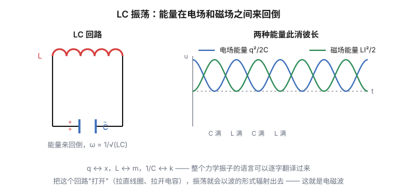
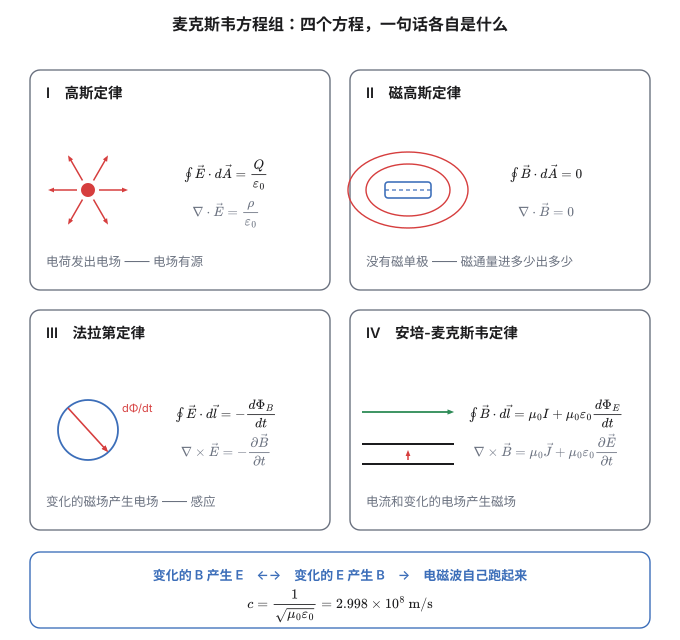

1831 年 8 月 29 日，法拉第（Michael Faraday）在他的实验笔记本上画了一张图。

他在一个铁环上绕了两组线圈。一组接电池，另一组接电流计。这个设计在当时是很自然的想法——既然电流能产生磁（奥斯特，1820），那磁是不是也能产生电流？

接通电池的一瞬间，电流计的指针**动了一下**。

然后回到零。

他断开电池的时候，指针又动了一下，方向相反。

**只有"变化"的时候才有电流。** 稳态的电流什么也不产生，稳态的磁场什么也不产生——指针稳稳地停在零上。法拉第花了十年找这个效应，而他找到的东西比他预想的更奇怪：**感应依赖的不是磁场，而是磁场的变化。**

这个发现后来长成了麦克斯韦方程组里最漂亮的一条，也最终把光和电磁学缝在了一起。

## 一、法拉第定律与那个负号

把上面的实验写成公式：

$$\boxed{\ \varepsilon = -\frac{d\Phi_B}{dt}\ }$$

（单匝线圈；$n$ 匝时乘 $n$。）

这里的 $\Phi_B$ 是**磁通量**——穿过线圈平面的"磁感线总条数"。匀强磁场垂直穿过时，它就是面积乘场强：$\Phi_B = B\,S$；磁场斜着穿，就乘上夹角的余弦。最一般的情形（磁场不均匀、或者曲面）下，要把面积切成一小块一小块 $d\vec A$ 分别算 $\vec B\cdot d\vec A$ 再加起来，写成积分 $\Phi_B = \int\vec B\cdot d\vec A$——还是那句话，积分只是"切碎再求和"的缩写。单位是韦伯，$\mathrm{Wb} = \mathrm{T\cdot m^2}$。

$\varepsilon$ 叫**感应电动势**。它是"每单位电荷能获得的能量"，单位是伏特——虽然它不是某个位置的电势差（这一点下一节会说清楚）。

**那个负号是楞次（Lenz）加的**，它的内容是一条"反抗"规则：

> 感应电流的方向，总是**反抗**引起它的那个磁通量变化。

**为什么必须反抗？** 因为能量守恒。

想一个反例：如果感应电流的方向是"帮助"变化的，那么——假设有一个微小的电流，它产生的磁通变化被自己放大，产生更大的电流，再放大……**电流会自己涨起来，不消耗任何能量。** 这就是永动机。

所以负号不是约定，它是**能量守恒在电磁感应里的样子**。

楞次定律在解题上有个很实用的价值：**判断方向时，先问"磁通量在怎么变"，再问"感应电流要产生什么样的磁场来反抗它"。** 这比记右手定则可靠得多，尤其是在线圈绕向复杂、或者多个磁通源叠加的时候。

## 二、两种电动势，一个本质

感应有两条看起来完全不同的路径。它们最后会合流。

### 动生：导体在动

导体棒长 $L$，在磁场 $\vec B$ 中以速度 $\vec v$ 平动，$\vec v\perp\vec B\perp$ 棒：

$$\boxed{\ \varepsilon = BLv\ }$$

（转动切割时是 $\varepsilon = \frac12 BL^2\omega$。）

**微观机制**：导体里的自由电子跟着导体一起运动，所以它们的速度是 $\vec v$，受到洛伦兹力 $\vec F = q\vec v\times\vec B$。这个力把电子推向棒的一端，另一端留下正电荷——直到积累的电荷产生的电场力刚好平衡洛伦兹力。

> [!warning] 这里有一个很容易搞错的细节
> **洛伦兹力本身不做功。**（上一篇说过：$\vec F\perp\vec v$。）
>
> 那电能是从哪来的？**是"推着导体棒前进的那个外力"做的功。**
>
> 完整的账是这样的：外力推棒前进，棒里的电荷被洛伦兹力推到一侧；电荷积累后产生的电场又反过来对电荷施加一个力，这个力的反作用（沿运动方向）**阻碍**棒的继续前进。所以你要维持棒匀速运动，就必须一直做功——**你做的功，正好等于电路里消耗的电能。**
>
> **洛伦兹力是"传力的中介"，不是"能量的来源"。** 想清楚这一点，这类题的能量守恒就不会写错。

### 感生：导体不动，磁场在变

线圈不动，磁场变化，照样有电动势。但**这次没有洛伦兹力可以用**——电荷是静止的，磁场对静止电荷不施力。

麦克斯韦的答案很激进：

> **变化的磁场会产生电场。**

这个电场叫**涡旋电场**（或感生电场）。它和静电场有一个致命的区别：

$$\oint\vec E\cdot d\vec l = -\frac{d\Phi_B}{dt}\neq 0$$

**它的环量不为零——也就是说，它不是保守场。**

**后果很严重：涡旋电场没有"电势"。** 因为它不保守，你没法定义一个标量函数 $\varphi$ 让 $\vec E = -\nabla\varphi$。

**这是这个系列里第一次，"电势"这个概念失效了。** 第二篇说过"静电场无旋 ⟺ 场能写成梯度"，现在把条件抽掉，整套语言就崩了——你不能再说"某点的电势是多少"，只能说"沿着这条闭合路径，电动势是多少"。

（有意思的是，"电势"在电路里变成了"电压"，而电压在感生情形下依赖于路径的选择——这是大学电磁学里一个著名的麻烦点。）

涡旋电场的存在有直接的实验证据：**电子感应加速器**（betatron）就是用它来加速电子的——没有导线，没有导体，只有真空室里一群电子被一个不断增大的磁场推着绕圈加速。变压器也是同一个原理：初级线圈里变化的电流产生变化的磁场，变化的磁场在次级线圈里感应出涡旋电场，推动电荷。

### 两条路，一条路

动生和感生的区别看起来是本质的：一个是"导体动"，一个是"磁场变"。但换个参考系，它们会互相转化——

- 在"磁场静止、导体运动"的参考系里，是**动生**（洛伦兹力）；
- 换到"导体静止、磁场运动"的参考系里，就变成了**感生**（涡旋电场）。

**所以它们是同一件事的两个视角**——这正好是上一篇"磁场是电场的相对论修正"的续集。**电和磁本来就是同一张纸的两面，你翻动纸的角度变了，"感应"的机制描述也就跟着变。**

## 三、自感、互感，以及 LC 振荡

### 自感

一个线圈通电时会产生磁通量，而磁通量正比于电流：

$$\Phi = LI$$

$L$ 叫**自感系数**（单位亨利，$\mathrm{H}$）。它和电容一样，**是一个几何量**——只取决于线圈的形状、匝数、以及有没有铁芯。

电流变化时，线圈会自己感应出一个反抗变化的电动势：

$$\varepsilon = -L\frac{di}{dt}$$

长直螺线管的自感有简洁的形式：

$$L = \mu_0 n^2 V$$

（$n$ 是单位长度的匝数，$V$ 是体积。）

储存的能量又是那个 ½：

$$W = \frac12 LI^2$$

**这个 ½ 的来源和电容完全一样**：电流从 0 涨到 $I$，磁通量线性增长，所以 $\int i\,d\Phi$ 给出 $\frac12$。

### RL 电路，以及为什么断电会打火花

一个电阻 $R$ 和一个电感 $L$ 串联，接通时电流按指数上升：

$$i(t) = \frac{\varepsilon}{R}\left(1-e^{-t/\tau}\right),\qquad \tau = \frac{L}{R}$$

**断电的时候才精彩。** 如果直接拉开开关，$di/dt$ 是巨大的负值，电感会产生一个巨大的反向电压（$\varepsilon = -L\,di/dt$）。这个电压会把空气击穿，形成**火花**。

日光灯的启动器、汽车点火线圈、以及你拔掉电风扇插头时看到的那一下火花，都是这个。

**这也是为什么电感上的电流不能突变**——突变意味着无穷大的电压。和"电容上的电压不能突变"（否则需要无穷大的电流）是一对镜像。

### LC 振荡

把电容和电感接成一个回路。电容放电，电流流过电感，电感把能量存进磁场；然后电感把能量推回来给电容充电……

$$L\frac{d^2q}{dt^2}+\frac{q}{C} = 0\quad\Longrightarrow\quad \omega = \frac{1}{\sqrt{LC}}$$

**能量在电场和磁场之间来回倒，形式是简谐振荡。** 这就是电路的"弹簧振子"（$m\leftrightarrow L$，$k\leftrightarrow 1/C$）。

这个振荡很有意思：电荷来回跑，电场和磁场交替出现——**它是电磁波的雏形**。如果把这个回路"打开"（把电容的两片板拉开、把线圈拉直），振荡就会以波的形式辐射出去。赫兹 1887 年就是这么做出电磁波的。

## 四、麦克斯韦的补丁：位移电流

现在到了整个系列的转折点。

把安培环路定理拿出来：

$$\oint\vec B\cdot d\vec l = \mu_0 I_{\text{内}}$$

问题来了：拿一个正在充电的电容器试一下。

选一条围着导线的闭合环路（比如围着电容器左侧那根导线）。现在问：穿过这条环路的电流是多少？

- **取一个穿过导线的曲面**：它被导线穿过一次，$I_{\text{内}} = I$；
- 取一个"鼓起来"、从电容器两板之间穿过的曲面：板间是绝缘的，没有电流，$I_{\text{内}} = 0$。

**同一个边界，两个曲面，两个答案。** 安培环路定理不自洽了。

麦克斯韦看到了这个矛盾，然后找到了补丁。注意电容器板间虽然**没有电流**，但有一件东西在变——**电场**。

板间的电场是 $E = \dfrac{\sigma}{\varepsilon_0} = \dfrac{Q}{\varepsilon_0 S}$。电荷在充电时增加，所以

$$\frac{dE}{dt} = \frac{1}{\varepsilon_0 S}\cdot\frac{dQ}{dt} = \frac{I}{\varepsilon_0 S}$$

两边乘上板面积 $S$：

$$\varepsilon_0\frac{d\Phi_E}{dt} = I$$

**右边正好等于导线里的电流。** 于是麦克斯韦定义

$$I_d \equiv \varepsilon_0\frac{d\Phi_E}{dt}$$

叫**位移电流**，并把它加到安培环路定理里：

$$\boxed{\ \oint\vec B\cdot d\vec l = \mu_0 I + \mu_0\varepsilon_0\frac{d\Phi_E}{dt}\ }$$

**矛盾消失了**：不管选哪个曲面，总"电流"（传导电流 + 位移电流）都一样。

> [!note] 位移电流"位移"了什么
> 这个名字起得很不好，容易让人以为有电荷在移动。**它不是一个真的电流**——板间没有电荷流动。
>
> 它的内容是：**变化的电场会产生磁场，就像电流一样。** "位移电流"只是给这个效应起的一个名字（"位移"指电介质里电荷的微小位移，是麦克斯韦当时的思路）。
>
> 但它是**真的**：位移电流产生的磁场可以被测量。而且没有它，电磁波就不存在。

### 对称性出现了

现在把两条"环路"方程并排：

$$\oint\vec E\cdot d\vec l = -\frac{d\Phi_B}{dt}\qquad\text{（变化的 }B\text{ 产生 }E\text{）}$$

$$\oint\vec B\cdot d\vec l = \mu_0I+\mu_0\varepsilon_0\frac{d\Phi_E}{dt}\qquad\text{（电流和变化的 }E\text{ 产生 }B\text{）}$$

**变化的磁场产生电场；变化的电场产生磁场。**

**两个"变化"互相喂养。** 于是电场产生磁场，磁场又产生电场，一层层传下去——

**这就是电磁波。** 它不需要任何介质，因为它是场自己在喂养自己。

## 五、四个方程

现在可以把整个电磁学写完了。前四篇其实已经把这四条都分别讲过了，这里只是把它们收到一张表里。

先别被左边那列"圆圈套积分"的符号吓到。 它们读作**环路积分**（$\oint\vec E\cdot d\vec l$：沿一条闭合回路把"场的切向分量 × 一小段长度"累加起来）和**闭合曲面积分**（$\oint\vec E\cdot d\vec A$：在一个闭合面上把"场的法向分量 × 一小块面积"累加起来）。你在前几篇已经见过它们的样子了——高斯定理 $\oint\vec E\cdot d\vec A = Q/\varepsilon_0$ 就是一个闭合曲面积分，法拉第定律 $\varepsilon = -d\Phi/dt$ 就藏着一个环路积分。表里的四条，每一条的**物理内容都是前面推导过的**，这里只是统一换上线积分/面积分的记号。

| # | 积分形式 | 微分形式 | 一句话 |
|---|---|---|---|
| Ⅰ | $\displaystyle\oint\vec E\cdot d\vec A = \frac{Q_{\text{内}}}{\varepsilon_0}$ | $\nabla\cdot\vec E = \dfrac{\rho}{\varepsilon_0}$ | **电荷发出电场** |
| Ⅱ | $\displaystyle\oint\vec B\cdot d\vec A = 0$ | $\nabla\cdot\vec B = 0$ | **没有磁单极** |
| Ⅲ | $\displaystyle\oint\vec E\cdot d\vec l = -\frac{d\Phi_B}{dt}$ | $\nabla\times\vec E = -\dfrac{\partial\vec B}{\partial t}$ | **变化的磁场产生电场** |
| Ⅳ | $\displaystyle\oint\vec B\cdot d\vec l = \mu_0I+\mu_0\varepsilon_0\frac{d\Phi_E}{dt}$ | $\nabla\times\vec B = \mu_0\vec J+\mu_0\varepsilon_0\dfrac{\partial\vec E}{\partial t}$ | **电流和变化的电场产生磁场** |

看这张表的结构，比背它有用得多。

**前两条是"通量"方程**——问的是"场从哪冒出来"。电场有源（电荷），磁场无源（没有磁荷）。这两条决定了场的"形状"。

**后两条是"环量"方程**——问的是"场怎么转起来"。电场可以被变化磁场转起来，磁场可以被电流和变化电场转起来。这两条决定了场怎么传播。

**四个方程里，只有第三条不带常数。** 因为法拉第定律里的比例系数被定义成了 1——这是单位制的人为选择，不是物理（回想第一篇：有量纲的常数不带信息）。

**只有第二条右边是零。** 这一个零就是"磁单极不存在"的全部内容。如果哪天找到了磁单极，只要在右边填一项，整个理论就对称了——**这种"缺一块"的对称性，正是理论物理学家一百年来一直在找磁单极的原因。**

> [!tip] 一个历史冷知识
> **麦克斯韦本人写的不是这四个方程。**
>
> 1865 年他发表《电磁场的动力学理论》时，用的是四元数，写了二十个方程。是赫维赛德（Heaviside）和吉布斯（Gibbs）在 1880 年代把它重写成了矢量形式，才成了今天的四条。
>
> 所以"麦克斯韦方程组"这个名字，其实是**后人替他整理的结果**。麦克斯韦的贡献在于**物理内容**——尤其是那条位移电流；至于方程长什么样，是矢量分析的语言决定的。

## 六、光：一个算出来的速度

现在做一件这个系列里最漂亮的事：**从四个方程里算出光速。**

取真空（$\rho=0$，$\vec J=0$），对第三条两边取旋度：

$$\nabla\times(\nabla\times\vec E) = -\frac{\partial}{\partial t}(\nabla\times\vec B)$$

左边用矢量恒等式 $\nabla\times(\nabla\times\vec E) = \nabla(\nabla\cdot\vec E)-\nabla^2\vec E$，而真空里 $\nabla\cdot\vec E = 0$，所以左边 $= -\nabla^2\vec E$。

右边把第四条（真空里只剩位移电流项）代进去：

$$-\frac{\partial}{\partial t}\left(\mu_0\varepsilon_0\frac{\partial\vec E}{\partial t}\right) = -\mu_0\varepsilon_0\frac{\partial^2\vec E}{\partial t^2}$$

两边合起来：

$$\boxed{\ \nabla^2\vec E = \mu_0\varepsilon_0\frac{\partial^2\vec E}{\partial t^2}\ }$$

对比标准的波动方程 $\nabla^2 f = \dfrac{1}{v^2}\dfrac{\partial^2 f}{\partial t^2}$，立刻读出波速：

$$\boxed{\ c = \frac{1}{\sqrt{\mu_0\varepsilon_0}}\ }$$

现在代数字进去。

$$\mu_0\varepsilon_0 = (4\pi\times10^{-7})\times(8.8541878128\times10^{-12}) = 1.11265\times10^{-17}\ \mathrm{s^2/m^2}$$

$$c = \frac{1}{\sqrt{1.11265\times10^{-17}}} = 2.9979\times 10^{8}\ \mathrm{m/s}$$

**这就是光速。**

而且注意它是怎么来的：$\mu_0$ 来自**磁学**实验（测两根导线之间的力），$\varepsilon_0$ 来自**静电学**实验（测电容或者库仑力）。**两个完全不相干的领域测出来的常数，组合起来给出了光的速度。**

麦克斯韦在 1865 年写下了这句话（大意）：

> 这个速度与光速如此接近，看来**光本身就是一种电磁扰动**。

**这是物理学史上最伟大的统一之一。** 它把光学——一个从古希腊就开始研究的、看起来完全独立的学科——整个吞并进了电磁学。你眼睛看到的一切颜色，都是 $\vec E$ 和 $\vec B$ 在 400–700 纳米尺度上的振荡。

（顺带一提，麦克斯韦并不是第一个注意到这件事的人。1856 年，韦伯和科尔劳施在测量"电荷的静电单位与电磁单位之比"时，得到了一个接近光速的数——这个数值上的巧合让麦克斯韦确信其中必有内容。）

### 电磁波长什么样

从方程里还能读出波的全部性质：

- **横波**：$\vec E$ 和 $\vec B$ 都垂直于传播方向；
- **互相垂直**：$\vec E\perp\vec B$；
- **同相位，且大小成固定比例**：$E = cB$；
- **能量对半分**：电场能量密度 $\frac12\varepsilon_0E^2$ 和磁场能量密度 $\frac{1}{2\mu_0}B^2$ 恰好相等（因为 $c^2 = 1/(\mu_0\varepsilon_0)$）；
- **能量流**由**坡印廷矢量**给出：

$$\vec S = \frac{1}{\mu_0}\vec E\times\vec B$$

它描述单位时间穿过单位面积的能量——太阳光照在你脸上的那点暖意，就是这个矢量。

**整个电磁波谱**——无线电、微波、红外、可见光、紫外、X 射线、γ 射线——**全都是同一个东西**，只是频率不同。它们由同一组方程描述，以同一个速度传播。

## 七、收束

回头看这个系列走过的路：

| 篇 | 起点 | 得到 |
|---|---|---|
| 一 | 摩擦琥珀 | 库仑定律、电荷的算术、以及"哪些常数是物理、哪些只是记账" |
| 二 | "隔空施力"的不安 | 场、势、$E=-\nabla\varphi$、高斯定理、带电球壳 |
| 三 | 莱顿瓶 | 电容、电场能量——**能量进了空间** |
| 四 | 奥斯特的指南针 | 磁、洛伦兹力、以及"磁是电的相对论修正" |
| 五 | 法拉第的指针一颤 | 感应、位移电流、四个方程、光 |

有一条线一直贯穿：**"电"和"磁"从来不是两件事。**

- 第四篇说：磁场是电场在另一个参考系里的样子；
- 第五篇说：变化的电场和变化的磁场互相产生，所以它们能脱离电荷、自己跑。

而这一切的最后产物是：

$$c = \frac{1}{\sqrt{\mu_0\varepsilon_0}} = 2.99792458\times10^{8}\ \mathrm{m/s}$$

**一个由电学和磁学常数决定的、纯粹的数字。** 它不依赖于任何参考系——你在任何地方测，得到的都是这个值。而正是这个"绝对性"，与伽利略相对性原理产生了冲突，逼出了狭义相对论。

**所以电磁学不仅统一了电与磁，还撬开了相对论的大门。** 爱因斯坦 1905 年那篇《论动体的电动力学》，开篇讨论的就是运动的导体和磁体之间的感应现象——那正是法拉第 1831 年那个实验留下的尾巴。

再往后呢？麦克斯韦方程组是**经典电动力学的全部**，但世界不止于此：

- 把它量子化，得到**量子电动力学**（QED），它的预言精度达到了小数点后十二位——人类最精确的物理理论；
- 把它和弱核力统一，得到**电弱理论**；
- 它不包含引力，也不包含强核力——这是今天物理学最大的未解问题之一。

**但"把两个看似无关的现象统一成一条原理"这件事，麦克斯韦方程组是第一次。** 从那以后，物理学的每一次大进步，几乎都是同一个动作：**找到更深的统一。**

## 相关阅读

- 上一篇：[《电与磁漫谈（四）：运动的侧脸》](post.html?id=magnetism)——安培力、洛伦兹力、回旋加速器，以及"磁是电的相对论修正"。
- 系列起点：[《电与磁漫谈（一）：电荷的算术》](post.html?id=charge-arithmetic)。
- [Maxwell's equations](https://en.wikipedia.org/wiki/Maxwell%27s_equations)（Wikipedia）：包括四元数形式的历史与赫维赛德的重写。
- [A Dynamical Theory of the Electromagnetic Field](https://en.wikipedia.org/wiki/A_Dynamical_Theory_of_the_Electromagnetic_Field)（Wikipedia）：麦克斯韦 1865 年那篇论文的背景。

> [!detail] 技术细节：推导与数值自检
> **1. 法拉第定律的符号约定。** 磁通量 $\Phi_B = \int\vec B\cdot d\vec A$ 的正方向由边界环路的方向按右手定则确定；$\varepsilon = \oint\vec E\cdot d\vec l$ 沿同一环路。$\varepsilon = -d\Phi_B/dt$ 里的负号在这个约定下自动给出楞次定律。**换约定就会换符号——所以"负号"是约定 + 物理共同的结果。**
>
> **2. 动生电动势的完整推导。** 设棒长 $L$、速度 $v$，棒内电荷 $q$ 受洛伦兹力 $qvB$（沿棒方向）。电荷重新分布直到电场力平衡：$qE = qvB \Rightarrow E = vB$。两端电势差 $U = EL = BLv$ ✓。与"$\varepsilon = -d\Phi/dt$"的一致性：棒在 $dt$ 内扫过面积 $Lv\,dt$，磁通变化 $d\Phi = BLv\,dt$，故 $\varepsilon = BLv$ ✓。
>
> **3. 转动切割。** 棒一端为轴、另一端以角速度 $\omega$ 转动：取距轴 $r$ 处的微元，速度 $v = \omega r$，$d\varepsilon = B(\omega r)dr$，积分得 $\varepsilon = \frac12 BL^2\omega$ ✓。
>
> **4. 螺线管自感。** $N$ 匝、长 $l$、截面 $A$：内部 $B = \mu_0 nI$（$n = N/l$），$\Phi = BA = \mu_0nIA$，每匝链通 $\Phi$，总磁链 $N\Phi = \mu_0n^2 lA\,I$，故 $L = \mu_0n^2(lA) = \mu_0n^2V$ ✓。
>
> **5. RL 电路的解。** $\varepsilon = iR + L\,di/dt$，解为 $i = \dfrac{\varepsilon}{R}(1-e^{-Rt/L})$，$\tau = L/R$ ✓。断电瞬间若强行切断，$di/dt\to-\infty$，感应电压 $L|di/dt|$ 可达数千伏——这就是火花。
>
> **6. 位移电流的数值自检。** 平行板电容 $S$，充电电流 $I$。板间 $E = \dfrac{Q}{\varepsilon_0S}$，$\dfrac{dE}{dt} = \dfrac{I}{\varepsilon_0S}$，故 $I_d = \varepsilon_0S\dfrac{dE}{dt} = I$ ✓——**与导线电流严格相等，与 $S$ 无关。**
>
> **7. 光速的数值计算。** $\mu_0\varepsilon_0 = 1.25663706212\times10^{-6}\times8.8541878128\times10^{-12} = 1.112650056\times10^{-17}$；$\sqrt{\cdot} = 3.33564095\times10^{-9}$；取倒数得 $2.99792458\times10^{8}\ \mathrm{m/s}$ ✓（与光速定义值一致，这个一致性本身就是 1983 年"米"的定义依据）。
>
> **8. 电磁波能量对半分的验证。** $u_E = \frac12\varepsilon_0E^2$；$u_B = \dfrac{B^2}{2\mu_0}$。由 $E = cB$ 与 $c^2 = \dfrac{1}{\mu_0\varepsilon_0}$：$u_B = \dfrac{E^2}{2\mu_0c^2} = \dfrac{\mu_0\varepsilon_0E^2}{2\mu_0} = \frac12\varepsilon_0E^2 = u_E$ ✓。
>
> **9. 坡印廷矢量的量纲。** $[\vec S] = \dfrac{[\vec E][\vec B]}{[\mu_0]} = \dfrac{(\mathrm{V/m})(\mathrm{T})}{\mathrm{H/m}}$。用 $\mathrm{T} = \mathrm{V\cdot s/m^2}$、$\mathrm{H} = \mathrm{V\cdot s/A}$：$[\vec S] = \dfrac{(\mathrm{V/m})(\mathrm{V\cdot s/m^2})}{\mathrm{V\cdot s/A}} = \dfrac{\mathrm{V\cdot A}}{\mathrm{m^2}} = \dfrac{\mathrm{W}}{\mathrm{m^2}}$ ✓。
>
> **10. LC 振荡的类比表。** $L\dfrac{d^2q}{dt^2}+\dfrac{q}{C}=0$ 与 $m\dfrac{d^2x}{dt^2}+kx=0$ 逐项对应：$q\leftrightarrow x$，$L\leftrightarrow m$，$1/C\leftrightarrow k$，$i\leftrightarrow v$，$\frac12LI^2\leftrightarrow\frac12mv^2$，$\frac{q^2}{2C}\leftrightarrow\frac12kx^2$。**整个力学振子的语言可以逐字翻译过来**，这是"数学结构相同"的又一个例子。
