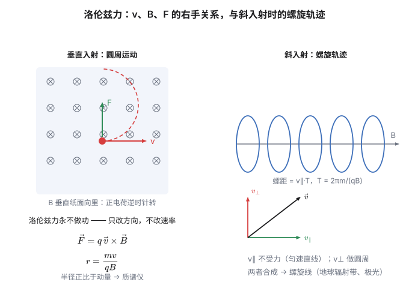
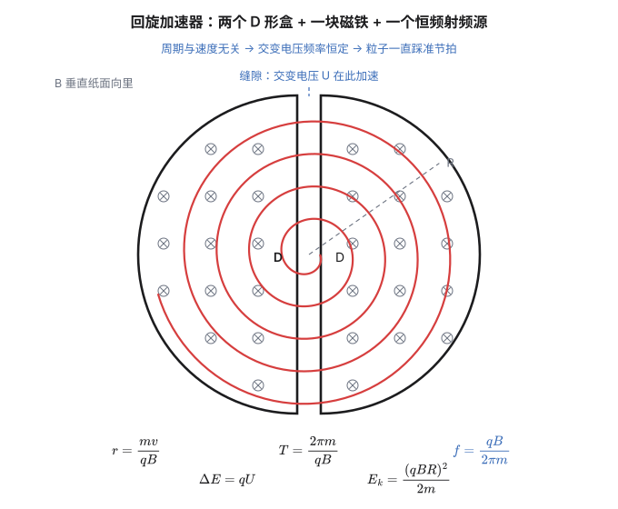

1820 年 4 月，哥本哈根。奥斯特（Hans Christian Ørsted）在给学生讲电磁学时，做了一件他以前做过、但这次换了做法的事：他把一根铂丝放在指南针的正上方，而且让导线**沿着南北方向**摆（以前都是东西方向，那样看不出来）。

接通电流的一瞬间，指南针猛地偏转了。

据说奥斯特当场愣住，随即宣布"这件事值得深究"。他花了三个月反复验证，在 7 月发表了结果。这个发现的冲击力是巨大的：**吉尔伯特在 1600 年断言"电与磁是两回事"，这个判断统治了两百二十年，现在塌了。**

奥斯特的实验很快传遍欧洲。安培（André-Marie Ampère）在一周之内就重复出来，然后开始建立数学理论；阿拉果（Arago）做了演示实验；这一年秋天，电磁学从零开始，长成了一门学科。

而奥斯特实验里最让人不安的，是那个**方向**：电流沿导线流，磁场却**绕着**导线转——垂直于电流。不是顺着，不是逆着，是侧着。

**这个"侧着"，是磁的全部秘密。**

## 一、磁是什么：先看它没有什么

磁石和指南针的历史很长。中国人用磁针导航，宋代沈括在《梦溪笔谈》里还记载了磁偏角——磁针并不精确指向正北。1600 年吉尔伯特写了《论磁》，提出地球本身就是一块大磁石。

但一直到 1820 年，没有人知道磁"是什么"。

奥斯特之后，安培提出了一个很聪明的假说：**磁的本质是电流。** 永磁体里每一小段都有"分子电流"在环流，所有分子电流的方向一致，就表现出宏观磁性。（今天我们知道，那个"分子电流"其实是电子的自旋和轨道运动，但安培的方向是对的。）

这个假说解释了一件关于磁的根本事实：

> **不存在单独的磁极。**

你可以把一块磁铁掰成两半，但你永远得不到"一个北极"。每掰一次，就得到两个各有南北极的小磁铁。因为磁的本质是**环流**——一个电流环在远处看像偶极子，但你没法从环流里切出"半圈"。

对比一下电：电有**单独的源**——电荷。一个电子就是一份孤立的负电荷，可以单独存在。

这个差别写进方程里，就是麦克斯韦方程组里唯一一条**没有源项**的方程：

$$\oint \vec B\cdot d\vec A = 0\quad\Longleftrightarrow\quad \nabla\cdot\vec B = 0$$

**磁通量永远是零**——进多少，出多少，没有"磁荷"往外发。

## 二、电流的磁场：一个叉积的来历

高中处理的都是"点电荷""直导线"这类最理想的模型。但真实电流是一整条弯曲的导线、一个线圈，怎么算它产生的磁场？

办法和学生时代处理连续分布电荷时一模一样：**把导线切成许多小段**。每一小段都短到可以看成一个"电流元"$I\,d\vec l$，它单独产生的微小磁场可以用一条简单公式算出来；把所有小段的贡献**加起来**（还是那个"切碎再求和"），就得到整条导线的磁场。

那条"算一小段贡献"的公式，就是**毕奥-萨伐尔定律**（Biot–Savart，1820）：

$$d\vec B = \frac{\mu_0}{4\pi}\,\frac{I\,d\vec l\times\hat r}{r^2}$$

（注意左边是 $d\vec B$ 而不是 $\vec B$：它只告诉你"这一小段贡献了多少"，要问整条导线的总磁场，得把所有的 $d\vec B$ 加起来——本节末尾那张表里的公式，都是这样加出来的。）

先看它和库仑定律有多像：都是 $1/r^2$，都是"源 ÷ 距离平方"。**但多了一个叉积。**

式子里 $I\,d\vec l$ 的方向沿电流，$\hat r$ 是从这一小段指向场点的单位矢量。叉积 $\times$ 意味着：

$$\vec B \perp I\,d\vec l,\qquad \vec B \perp \hat r$$

**磁场垂直于电流，也垂直于连线。** 这就是奥斯特看到的"侧着"。

库仑定律里没有叉积，因为电场是"顺着"连线的（正电荷的场向外）。**磁场的叉积，是它与电场最本质的区别。**

几个必须记住的结果（都由毕奥-萨伐尔积分得到）：

| 电流分布 | 磁场 |
|---|---|
| 无限长直导线，距 $r$ | $B = \dfrac{\mu_0 I}{2\pi r}$ |
| 半径 $R$ 的圆环，环心 | $B = \dfrac{\mu_0 I}{2R}$ |
| 单位长 $n$ 匝的螺线管内部 | $B = \mu_0 nI$ |

$\mu_0$ 是**真空磁导率**，$\mu_0 = 4\pi\times10^{-7}\ \mathrm{H/m}$（这是旧值；2019 年 SI 改革后它变成测量量，$1.25663706212(19)\times10^{-6}\ \mathrm{H/m}$，理由上一篇提过）。

### 安培环路定理，以及一个漂亮的对称

$$\oint \vec B\cdot d\vec l = \mu_0 I_{\text{内}}$$

把这条和静电场的高斯定理并排放，会看到一个很有意思的结构：

| | 通量 $\oint \vec X\cdot d\vec A$ | 环量 $\oint \vec X\cdot d\vec l$ |
|---|---|---|
| **电场** | $\dfrac{Q_{\text{内}}}{\varepsilon_0}$ —— **有源** | $0$ —— **无旋** |
| **磁场** | $0$ —— **无源** | $\mu_0 I_{\text{内}}$ —— **有旋** |

**两条"有"，两条"零"，位置刚好错开一格。**

- 电有源（电荷），无旋（保守场，所以有电势）；
- 磁无源（没有磁荷），有旋（非保守场，所以**没有"磁势"**）。

这张表就是麦克斯韦方程组的前身。**它同时告诉你为什么电势存在、而"磁势"不存在。** 一个非保守场不可能写成某个标量函数的梯度——这正是"静电场无旋"那个结论的镜像。

## 三、安培力：电流在磁场里受力

有了磁场，下一步是"磁场对电流做什么"。

$$d\vec F = I\,d\vec l\times\vec B$$

又是叉积。对一段长 $L$ 的直导线：

$$F = BIL\sin\theta$$

（$\theta$ 是导线与 $\vec B$ 的夹角；平行时不受力。）

**为什么是叉积？** 可以直接从洛伦兹力推出来。电流是电荷的流动：$dq = nqAv\,dt$（$n$ 是载流子数密度，$A$ 是截面积）。每个载流子受 $q\vec v\times\vec B$，加起来：

$$d\vec F = (nA\,dl)\,q\vec v\times\vec B = \underbrace{(nqAv)}_{I}\,d\vec l\times\vec B$$

**安培力不是新的一种力，它只是洛伦兹力的宏观版本。**

顺便说个历史趣事：**"安培"这个单位曾经是靠安培力定义的。** 旧 SI 的定义是"两根相距 1 米的无限长平行导线，每米长度受力 $2\times10^{-7}\ \mathrm{N}$ 时的电流"。这也解释了为什么 $\mu_0$ 在旧 SI 里是精确值 $4\pi\times10^{-7}$——它是被定义出来的。2019 年后，安培改由基本电荷 $e$ 定义，这条"力学定义"就退役了。

两个平行电流：同向相吸，反向相斥。这个结论直接来自叉积，值得自己动手验证一遍。

## 四、洛伦兹力：永远不做功的力

把单电荷受的力写全：

$$\boxed{\ \vec F = q\left(\vec E+\vec v\times\vec B\right)\ }$$

（电场那部分叫**电场力**，磁场那部分叫**洛伦兹力**；有时整个式子都叫洛伦兹力。）

洛伦兹力有三个"怪"性质：

**第一，它永远垂直于速度。** 因为叉积的性质：$\vec v\times\vec B\perp\vec v$。

**第二，所以它永远不做功。** 力垂直于位移，$W = \vec F\cdot d\vec l = 0$。

$$\text{磁场不改变粒子的速率，只改变方向。}$$

这句话值得反复咀嚼。**一个力，作用在物体上，却永远不改变它的动能。** 在力学里你几乎遇不到这种事（向心力也不做功，但那是"约束力"；磁场是"真的在施力"）。

**第三，速度为零的电荷不受磁力。** 静止的电荷在磁场里毫无感觉。

**圆周运动。** 如果 $\vec v\perp\vec B$，洛伦兹力提供向心力：

$$qvB = \frac{mv^2}{r}\quad\Longrightarrow\quad r = \frac{mv}{qB} = \frac{p}{qB}$$

半径正比于动量。**这是质谱仪的原理**——同样的加速电压下，不同质量的离子走不同半径，于是被分开。

**周期。**

$$T = \frac{2\pi r}{v} = \frac{2\pi m}{qB}$$

**看这个结果：$v$ 和 $r$ 都不见了。** 周期只由 $m$、$q$、$B$ 决定。

$$\boxed{\ T = \frac{2\pi m}{qB},\qquad \omega = \frac{qB}{m}\ }$$

$\omega$ 叫**回旋频率**。

**"跑得快的粒子转的圈更大，但转一圈的时间一样"**——这个结论反直觉，但它是下一节那个机器的全部依据。

**螺旋线。** 如果 $\vec v$ 与 $\vec B$ 成斜角，把它分解：平行分量 $v_\parallel$ 不受力（叉积为零），做匀速直线；垂直分量 $v_\perp$ 做圆周。两者合成 → **螺旋线**，螺距 $= v_\parallel T$。

地球磁场捕获太阳风粒子，就是靠这个：粒子沿磁力线螺旋前进，在两极之间来回弹跳（**磁镜**），在极区撞进大气层，激发极光。

## 五、磁是电的相对论修正

现在回答这一篇最核心的问题：**磁和电到底是什么关系？**

先做一个思想实验。

**参考系 A（导线静止）**：一根通有电流的直导线，旁边有一个正电荷 $q$，它以速度 $v$ 平行于导线运动（$v$ 远大于电子漂移速率）。

导线里有两种东西：静止的正离子，和漂移的电子。因为导线是电中性的，正负电荷的线密度**大小相等**，所以导线外**没有电场**。但电荷在动，所以它受到**磁力**。

**参考系 B（跟着电荷一起动）**：现在换个视角，我们以电荷的速度运动。在这个参考系里，电荷是**静止**的，导线在向后运动。

关键在于：**导线里的正离子和电子，在这个参考系里的速度不同。**

- 正离子在参考系 A 里静止，换到参考系 B 后，它以速率 $v$ **向后运动**；
- 电子在参考系 A 里以漂移速率 $u$ 向前运动，换到参考系 B 后，它向后运动的速率只有 $v-u$（因为 $v\gg u$）——**比正离子慢**。

**狭义相对论说：运动的长度会收缩，收缩因子是 $\sqrt{1-v^2/c^2}$。**

于是在参考系 B 里，正离子和电子的"线密度"不再相等了——

- 正离子动得快，它们的间距被压缩得更厉害，**正电荷线密度变大**；
- 电子动得慢，压缩得少，**负电荷线密度相对小**。

**导线带净正电了。**

**结论：在参考系 B 里，那个（现在静止的）电荷受到一个电场力。**

### 同一件事，两个说法

| | 参考系 A（导线静止） | 参考系 B（电荷静止） |
|---|---|---|
| 电荷状态 | 运动 | 静止 |
| 受到的力 | **磁力**（洛伦兹力） | **电场力**（库仑力） |
| 力的来源 | 电流产生的磁场 | 长度收缩造成的净电荷 |

**这两件事是同一件事。** 磁力只是电场力在另一个参考系里的化身。

（顺手核一下方向：在参考系 A 里，电荷的"电流"与导线电流反向，两个反向电流互相排斥；在参考系 B 里，导线带净正电，正电荷被排斥——**两个参考系给出同一种力，这才是自洽的**。严格的做法是直接做四维电流的洛伦兹变换：$(\rho c,\vec J)$ 在 A 里是 $(0,-\lambda_0 u)$，变换到 B 后电荷密度 $\rho' = \gamma\lambda_0 uv/c^2 > 0$，与上面的定性论证一致，而且不依赖 $v\gg u$ 这个近似。）

$$\boxed{\ \text{磁场不是独立的东西，它是电场的相对论修正。}\ }$$

**那为什么平时看不出来？** 因为修正的量级是 $v^2/c^2$。

算个数：铜导线里，1 A 电流的电子漂移速度大约是

$$v_d = \frac{I}{nqA} \approx 7\times 10^{-5}\ \mathrm{m/s}$$

**每秒 0.07 毫米。** 比蜗牛还慢得多。所以 $v^2/c^2 \sim 10^{-25}$——**磁力比"如果没有中和的话"那个电力小 25 个数量级。**

那它为什么还能显眼？因为**电力被完全中和掉了**。导线电中性，电场为零。于是那个"小得可怜"的磁力成了唯一剩下的力——**在只有它一个的时候，它就当家了。**

> [!tip] 一个统一的图景
> $E$ 和 $\vec B$ 不是两个独立的实体，而是**同一个对象在不同参考系下的两个面**。
>
> 就像时间和空间在洛伦兹变换下互相混合一样，$E$ 和 $B$ 也会互相混合：在一个参考系里纯粹是电场的东西，换到另一个参考系就变成了电场加磁场。
>
> 更严格地说：$E$ 和 $B$ 是同一个反对称张量 $F^{\mu\nu}$ 的分量。你换参考系，只是在同一个张量上换了一组坐标。**"电磁场"才是一个整体，$E$ 和 $B$ 只是它的两个投影。**
>
> 这也是为什么电磁学**天生就是相对论性的**——麦克斯韦方程组在洛伦兹变换下形式不变，而这件事比爱因斯坦提出狭义相对论早了四十年。实际上，正是为了调和电磁学和力学，洛伦兹才写出了那组变换。

## 六、回旋加速器：靠"周期与速度无关"吃饭

现在看那个反直觉的结论能造出什么。

**结构**：两个中空的半圆形金属盒（D 形盒），中间留一道窄缝。整个装置放在垂直的匀强磁场里，缝隙上接一个**交变电压源**。

**工作流程**：

1. **在 D 形盒内部**：金属壳把电场屏蔽了（静电屏蔽，第二篇讲过），所以粒子只受磁场作用，做**匀速圆周运动**，半径 $r = mv/(qB)$。
2. **穿过缝隙**：这里没有磁场屏蔽，电场在起作用，粒子被加速一次，获得动能 $qU$。
3. **加速后速度变大** → 半径变大 → 下一圈的半圆更大。

关键在于第 2 步和第 1 步之间的配合。 粒子每走半个圆就穿过一次缝隙，所以要"踩准点"——电压必须在粒子到达缝隙时正好是加速方向。

而这需要的是：**粒子走半圆的时间 $T/2 = \pi m/(qB)$ 必须恒定**。

**而它恰好恒定**——因为 $T$ 里没有 $v$。粒子跑得再快，转一圈的时间都一样。**只要交变电压的频率等于回旋频率**

$$f = \frac{qB}{2\pi m}$$

**就能一直加速下去，不管粒子跑多快。** 半径一圈圈变大，轨迹是"越来越大的半圆"串起来的螺旋。

算个数：质子在 $B = 1\ \mathrm{T}$ 的磁场里，

$$f = \frac{1.602\times10^{-19}\times 1}{2\pi\times 1.673\times10^{-27}} \approx 1.5\times 10^{7}\ \mathrm{Hz}$$

**约 15 MHz**，正好是射频波段。所以回旋加速器本质上就是一台"给粒子打节拍的射频源 + 一块大磁铁"。

**能加速到多高？** 设 D 形盒半径 $R$，粒子能跑的最大半径就是 $R$：

$$E_k = \frac12 mv^2 = \frac{(qBR)^2}{2m}$$

质子、$B = 1\ \mathrm{T}$、$R = 0.5\ \mathrm{m}$：

$$E_k = \frac{(1.602\times10^{-19}\times 0.5)^2}{2\times 1.673\times10^{-27}} \approx 1.9\times10^{-12}\ \mathrm{J} \approx 12\ \mathrm{MeV}$$

**而这就是它的天花板。** 原因很漂亮：**一旦速度足够大，相对论效应让质量变大（$m \to \gamma m$），周期 $T = 2\pi m/(qB)$ 就跟着变长，节拍踩不准了——粒子会逐渐"失步"。**

所以经典回旋加速器的能量上限大约在 **20–25 MeV**（质子）。想再往上，就得改设计：

- **同步回旋加速器**：让频率随时间**调低**，跟着粒子"越来越重"的节奏走；
- **同步加速器**：让**磁场随时间增大**，同时让粒子轨道半径保持不变（大型对撞机都是这个思路）；
- **等时性回旋加速器**：让磁场沿半径方向**增大**，用磁场的空间变化抵消质量的相对论增长。

**这是一个"物理决定工程边界"的绝佳例子**：一个经典力学的结论（$T$ 与 $v$ 无关）撑起了整台机器，而它的失效点精确地划出了这台机器的上限。

## 七、霍尔效应：把"侧向力"变成一个电压

最后讲一个又简单又实用的效应。

**设置**：一块厚 $d$ 的导体（或半导体）薄片，通上电流 $I$，再加一个垂直于片面的磁场 $B$。

载流子沿电流方向漂移，受到洛伦兹力 $\vec F = q\vec v\times\vec B$——**侧向的力**，把它们推向薄片的某一侧。

电荷在侧面积累，直到产生的横向电场 $E_H$ 的力刚好平衡洛伦兹力：

$$qE_H = qvB\quad\Longrightarrow\quad E_H = vB$$

于是两侧出现一个横向电压（**霍尔电压**）。注意它横跨的是薄片的**宽度** $w$ ——不是厚度 $d$，$d$ 是沿磁场方向的那个尺寸：

$$U_H = E_H w = vBw$$

把漂移速度用电流表示：垂直于电流的截面积是"厚 $d$ × 宽 $w$"，故 $I = nqv\cdot d\cdot w$，即 $v = \dfrac{I}{nq\,dw}$。代入上式，$w$ 正好约掉：

$$U_H = \frac{I}{nq\,dw}\,Bw = \frac{IB}{nq\,d}$$

（厚度 $d$ 出现在分母，宽度 $w$ 反而消失了——这一点常被弄错。）

**这个公式最妙的地方是：它带着载流子的电荷符号。**

- 如果载流子是电子（$q<0$），洛伦兹力把它们推向**一侧**；
- 如果载流子是空穴（$q>0$），同样方向的电流对应相反的漂移方向，洛伦兹力把空穴推向**另一侧**。

**结果：霍尔电压的极性相反。** 这是判定半导体是 n 型还是 p 型的标准方法——**你不需要知道里面是什么，只要看电压往哪边倒。**

另外，$\dfrac{1}{nq}$ 叫**霍尔系数** $R_H$，它直接给出载流子浓度。所以霍尔效应既是"洛伦兹力确实存在"的直接证据（把一个微小的侧向力放大成了一个可测的电压），也是工业上最常用的磁场传感器原理。

## 相关阅读

- 上一篇：[《电与磁漫谈（三）：把电荷装起来》](post.html?id=capacitance-and-energy)——电容、电场能量，以及能量为什么存在空间里。
- 下一篇：[《电与磁漫谈（五）：感应与统一》](post.html?id=induction-and-maxwell)——法拉第的"变化"如何逼出麦克斯韦的补丁，以及四个方程到底在说什么。
- [Lorentz force](https://en.wikipedia.org/wiki/Lorentz_force)（Wikipedia）：包括"磁力是相对论效应"的完整推导。
- [Cyclotron](https://en.wikipedia.org/wiki/Cyclotron)（Wikipedia）：从劳伦斯的 4 英寸原型机到同步加速器的演化。

> [!detail] 技术细节：推导与数值自检
> **1. 无限长直导线的磁场。** 由毕奥-萨伐尔对 $dl$ 积分：取导线为 $x$ 轴，场点到导线垂直距离 $r$。$dB = \dfrac{\mu_0 I}{4\pi}\dfrac{dl\sin\alpha}{R^2}$，其中 $R = \sqrt{r^2+x^2}$、$\sin\alpha = r/R$。积分 $\int_{-\infty}^{\infty}\dfrac{r\,dx}{(r^2+x^2)^{3/2}} = \dfrac{2}{r}$，故 $B = \dfrac{\mu_0I}{2\pi r}$ ✓。
>
> **2. 圆环中心的磁场。** 环上每段 $Idl$ 到中心距离都是 $R$，且 $dl\perp\hat r$，所以 $\sin\theta = 1$，方向全部相同：$B = \dfrac{\mu_0I}{4\pi R^2}\oint dl = \dfrac{\mu_0I}{4\pi R^2}\cdot 2\pi R = \dfrac{\mu_0I}{2R}$ ✓。
>
> **3. 螺线管内部。** 长螺线管取矩形安培环路，一边在内部（长 $L$、与 $B$ 平行）、一边在外部（$B\approx0$）、两侧边垂直于 $B$：$BL = \mu_0 nLI \Rightarrow B = \mu_0nI$ ✓。
>
> **4. 电子漂移速度。** 铜的载流子数密度 $n \approx 8.5\times10^{28}\ \mathrm{m^{-3}}$。取 $A = 1\ \mathrm{mm^2} = 10^{-6}\ \mathrm{m^2}$、$I = 1\ \mathrm{A}$：$v_d = \dfrac{1}{8.5\times10^{28}\times1.602\times10^{-19}\times10^{-6}} \approx 7.3\times10^{-5}\ \mathrm{m/s}$，即 **0.073 mm/s** ✓。故 $v_d^2/c^2 \approx 5.9\times10^{-26}$——磁力相对"未中和的电力"确实小了约 25 个数量级。
>
> **5. 质子的回旋频率与能量。** $f = \dfrac{qB}{2\pi m} = \dfrac{1.602\times10^{-19}}{2\pi\times1.673\times10^{-27}} = 1.52\times10^7\ \mathrm{Hz}$ ✓（$B=1\ \mathrm{T}$）。$R=0.5\ \mathrm{m}$ 时 $E_k = \dfrac{(qBR)^2}{2m} = \dfrac{(8.01\times10^{-20})^2}{3.346\times10^{-27}} = 1.92\times10^{-12}\ \mathrm{J} = 12.0\ \mathrm{MeV}$ ✓。
>
> **6. 相对论失步的临界点。** $T \propto \gamma$，当 $\gamma$ 明显大于 1 时（质子约 20 MeV 对应 $\gamma \approx 1.02$）累积的相位误差就足以让粒子偏离加速相位。这也是"经典回旋加速器约 20–25 MeV 封顶"的来源。
>
> **7. 霍尔效应的符号。** 金属中载流子是电子，$q<0$。用 $U_H = \dfrac{IB}{nqd}$ 时注意 $q$ 带符号，否则会得到相反的极性。半导体中若为空穴导电（$q>0$），漂移方向与电流同向，洛伦兹力方向与电子情形相反——**这就是 n/p 型判据的物理内容。**
>
> **8. 关于"磁力是相对论修正"的量级自检。** 两个以相同速度 $\vec v$ 平行运动的点电荷，磁力与电力之比恰为 $v^2/c^2$（可从两电荷间的完整洛伦兹变换或直接由毕奥-萨伐尔+洛伦兹力得到）。在导线中，电力因电中性为零，所以剩下的净力就是磁力——**它"相对小"，但它是唯一。**
